# API参考文档

<cite>
**本文档引用的文件**
- [src/lib/i18n.ts](file://src/lib/i18n.ts)
- [src/lib/storage.ts](file://src/lib/storage.ts)
- [src/lib/sync.ts](file://src/lib/sync.ts)
- [src/hooks/useStore.ts](file://src/hooks/useStore.ts)
- [src/background/index.ts](file://src/background/index.ts)
- [src/content/index.ts](file://src/content/index.ts)
- [src/config.ts](file://src/config.ts)
- [src/App.tsx](file://src/App.tsx)
- [manifest.config.ts](file://manifest.config.ts)
- [package.json](file://package.json)
</cite>

## 目录
1. [简介](#简介)
2. [项目结构](#项目结构)
3. [核心组件](#核心组件)
4. [架构概览](#架构概览)
5. [详细组件分析](#详细组件分析)
6. [依赖关系分析](#依赖关系分析)
7. [性能考虑](#性能考虑)
8. [故障排除指南](#故障排除指南)
9. [结论](#结论)
10. [附录](#附录)

## 简介
QKnot是一个基于Chrome扩展的轻量级任务管理器，采用离线优先的设计理念，具备云端同步能力。本API参考文档详细记录了扩展的所有公共接口、函数签名、参数说明以及最佳实践指南。

## 项目结构
QKnot扩展采用模块化架构设计，主要包含以下核心模块：

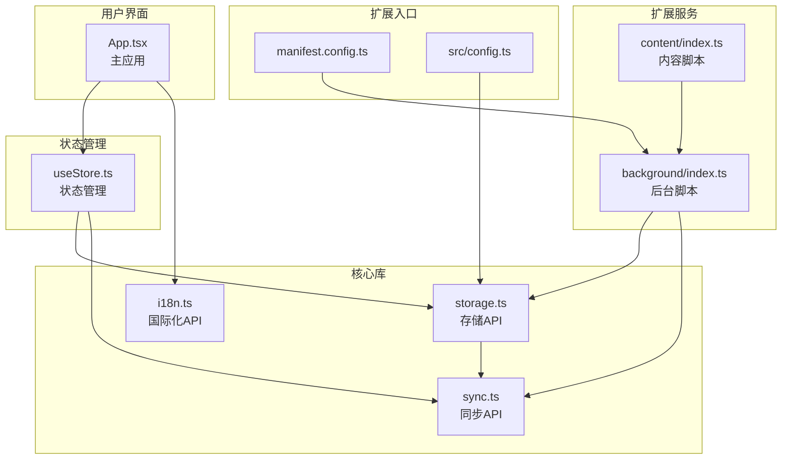

**图表来源**
- [manifest.config.ts](file://manifest.config.ts#L1-L40)
- [src/config.ts](file://src/config.ts#L1-L2)
- [src/lib/storage.ts](file://src/lib/storage.ts#L1-L272)
- [src/lib/sync.ts](file://src/lib/sync.ts#L1-L110)
- [src/hooks/useStore.ts](file://src/hooks/useStore.ts#L1-L193)

**章节来源**
- [manifest.config.ts](file://manifest.config.ts#L1-L40)
- [src/config.ts](file://src/config.ts#L1-L2)

## 核心组件

### 存储API (Storage API)
存储API提供了本地数据持久化的完整解决方案，包括任务管理、操作日志和同步状态管理。

#### 数据结构定义
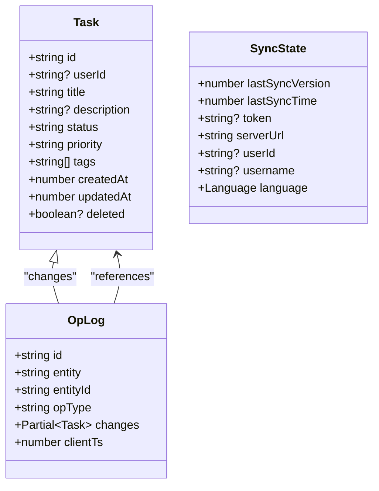

**图表来源**
- [src/lib/storage.ts](file://src/lib/storage.ts#L4-L34)

#### 主要操作方法

##### 任务管理方法
- `getTasks()`: 获取所有任务列表
- `saveTask(task)`: 保存任务并生成操作日志
- `deleteTask(id)`: 删除任务（软删除）
- `applySyncTask(id, changes, userId?)`: 应用服务器同步的任务变更

##### 同步状态管理
- `getSyncState()`: 获取当前同步状态
- `setSyncState(state)`: 更新同步状态
- `getOfflineTasksCount()`: 统计离线任务数量

##### 用户数据清理
- `assignTasksToUser(userId)`: 将离线任务分配给用户
- `discardOfflineTasks()`: 丢弃离线任务
- `clearUserData()`: 清理用户数据
- `handleLogoutCleanup()`: 注销清理

**章节来源**
- [src/lib/storage.ts](file://src/lib/storage.ts#L48-L272)

### 同步API (Sync API)
同步API实现了双向数据同步机制，支持增量同步和冲突解决。

#### 同步流程
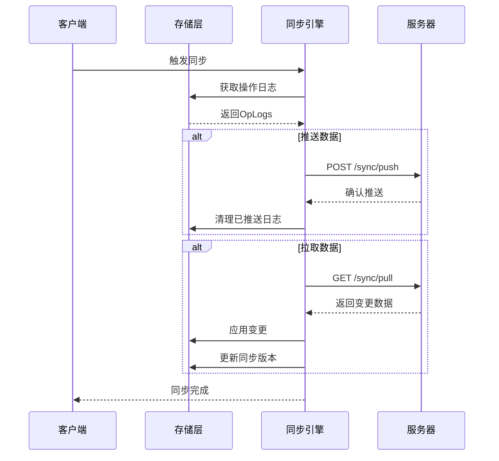

**图表来源**
- [src/lib/sync.ts](file://src/lib/sync.ts#L5-L109)

#### 核心方法
- `push()`: 推送本地变更到服务器
- `pull()`: 从服务器拉取最新数据
- `applyChanges(changes)`: 应用服务器返回的变更
- `getClientId()`: 获取客户端唯一标识

**章节来源**
- [src/lib/sync.ts](file://src/lib/sync.ts#L5-L110)

### 状态管理API (State Management API)
状态管理API基于Zustand实现，提供响应式的状态管理和UI绑定。

#### Store接口定义
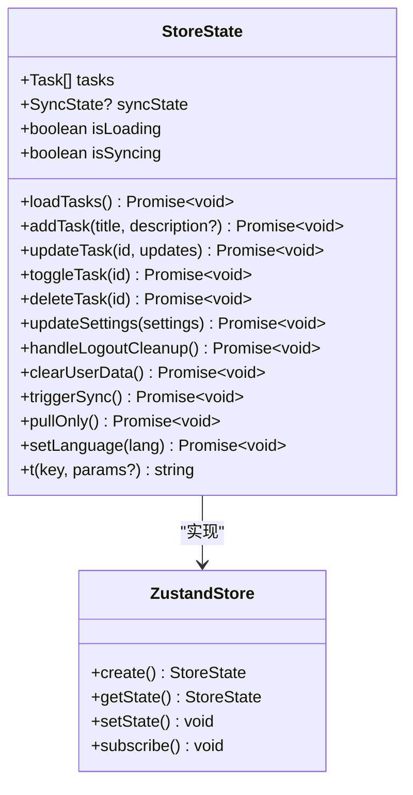

**图表来源**
- [src/hooks/useStore.ts](file://src/hooks/useStore.ts#L8-L26)

#### Action定义
- `loadTasks()`: 加载并过滤任务
- `addTask(title, description?)`: 添加新任务（乐观更新）
- `updateTask(id, updates)`: 更新任务属性
- `toggleTask(id)`: 切换任务完成状态
- `deleteTask(id)`: 删除任务（乐观更新）
- `updateSettings(settings)`: 更新同步设置
- `triggerSync()`: 手动触发完整同步
- `pullOnly()`: 仅拉取服务器数据
- `setLanguage(lang)`: 切换界面语言
- `t(key, params?)`: 国际化文本获取

**章节来源**
- [src/hooks/useStore.ts](file://src/hooks/useStore.ts#L28-L193)

### 国际化API (Internationalization API)
国际化API支持多语言切换和动态文本替换。

#### 语言配置
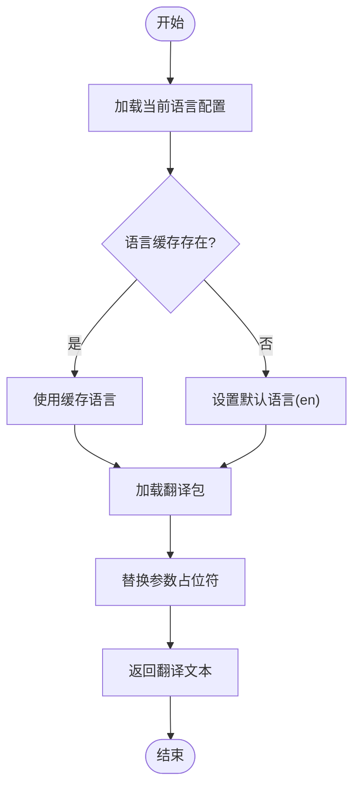

**图表来源**
- [src/lib/i18n.ts](file://src/lib/i18n.ts#L1-L146)

#### 支持的语言
- 英语 (en)
- 简体中文 (zh-CN)  
- 繁体中文 (zh-TW)

#### 文本键值规范
- `app.name`: 应用名称
- `status.*`: 状态相关文本
- `login.*` / `register.*`: 认证相关文本
- `merge.*`: 合并相关文本
- `settings.*`: 设置相关文本
- `about.*`: 关于页面文本
- `task.*`: 任务相关文本

**章节来源**
- [src/lib/i18n.ts](file://src/lib/i18n.ts#L1-L146)

## 架构概览

### 扩展架构图
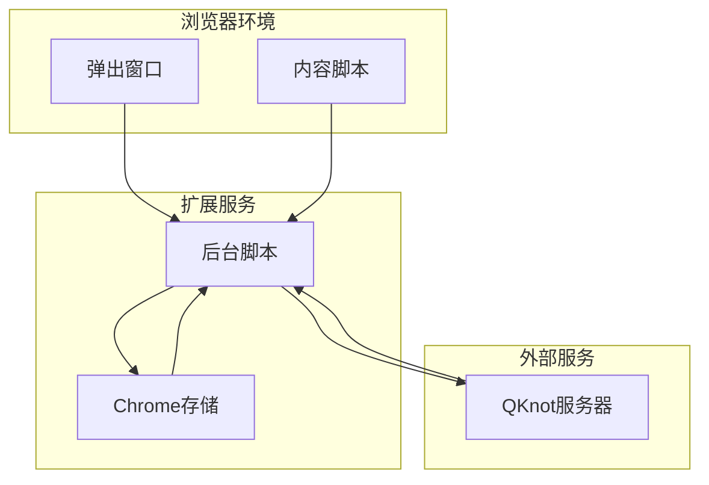

**图表来源**
- [manifest.config.ts](file://manifest.config.ts#L27-L38)
- [src/background/index.ts](file://src/background/index.ts#L1-L114)

### 数据流架构
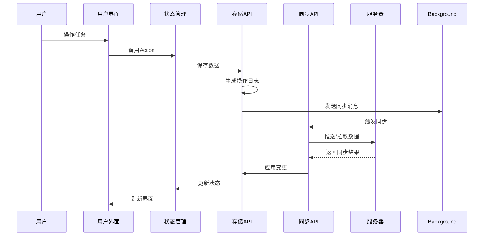

**图表来源**
- [src/App.tsx](file://src/App.tsx#L35-L46)
- [src/hooks/useStore.ts](file://src/hooks/useStore.ts#L167-L191)

## 详细组件分析

### 内容脚本 (Content Script)
内容脚本负责在网页中提供悬浮按钮功能，允许用户快速添加任务。

#### 功能特性
- 自动检测文本选择
- 悬浮按钮位置计算
- 标签提取功能
- 成功反馈动画

#### 交互流程
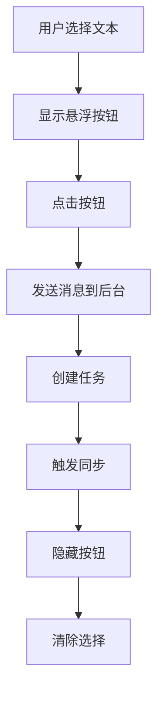

**图表来源**
- [src/content/index.ts](file://src/content/index.ts#L120-L234)

**章节来源**
- [src/content/index.ts](file://src/content/index.ts#L1-L239)

### 后台脚本 (Background Script)
后台脚本作为扩展的核心协调者，管理定时同步和上下文菜单。

#### 定时同步机制
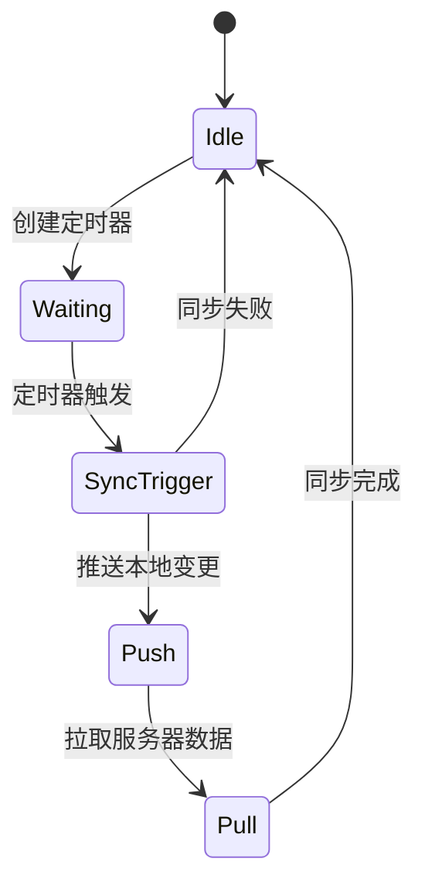

**图表来源**
- [src/background/index.ts](file://src/background/index.ts#L7-L15)

#### 上下文菜单功能
- "Add to QKnot": 添加选中文本为任务
- "Add page to QKnot": 添加当前页面为任务

**章节来源**
- [src/background/index.ts](file://src/background/index.ts#L1-L114)

### 主应用 (Main Application)
主应用提供完整的任务管理界面，集成所有API功能。

#### 主要功能
- 任务列表展示和管理
- 设置界面和认证功能
- 同步状态监控
- 国际化界面支持

#### 认证流程
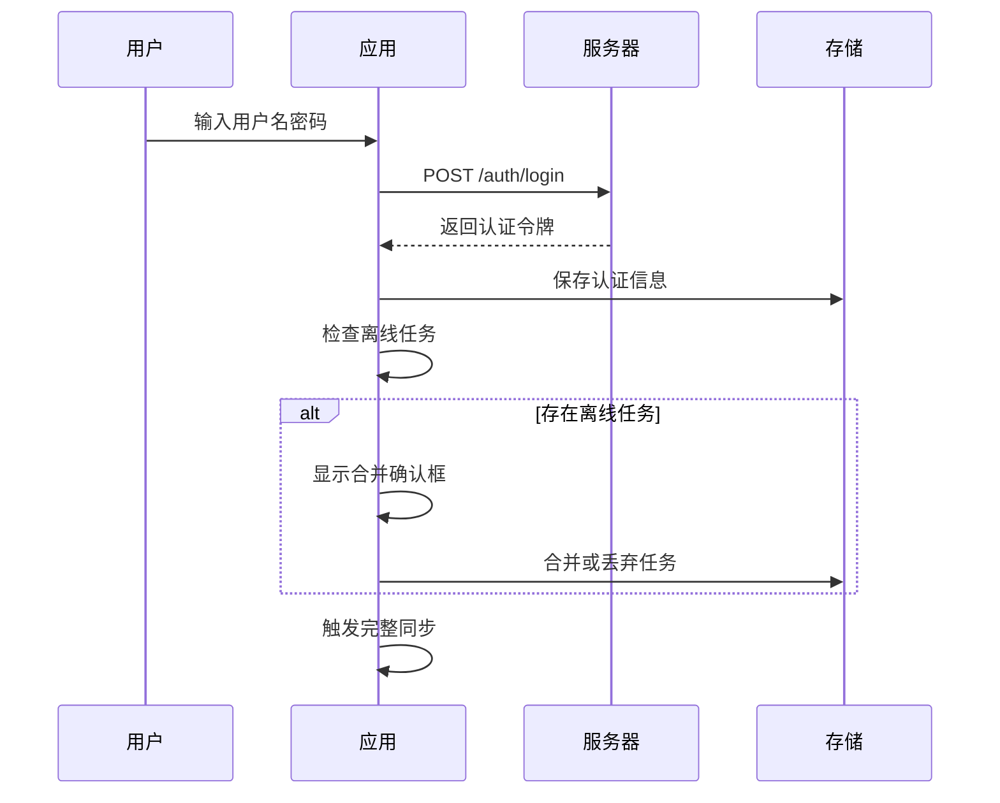

**图表来源**
- [src/App.tsx](file://src/App.tsx#L113-L200)

**章节来源**
- [src/App.tsx](file://src/App.tsx#L1-L860)

## 依赖关系分析

### 外部依赖
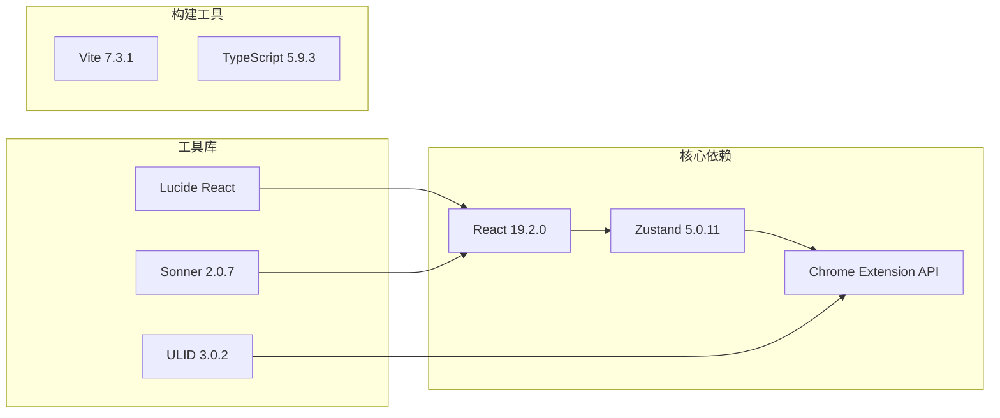

**图表来源**
- [package.json](file://package.json#L12-L40)

### 内部模块依赖
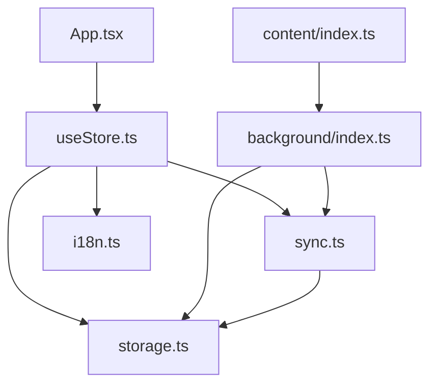

**图表来源**
- [src/App.tsx](file://src/App.tsx#L1-L10)
- [src/hooks/useStore.ts](file://src/hooks/useStore.ts#L1-L6)

**章节来源**
- [package.json](file://package.json#L12-L40)

## 性能考虑

### 存储优化策略
- **批量操作**: 使用数组操作减少多次存储访问
- **增量同步**: 通过操作日志实现高效增量同步
- **乐观更新**: UI立即响应用户操作，减少等待时间
- **内存管理**: 及时清理无用数据和事件监听器

### 网络优化
- **定时同步**: 5分钟间隔避免频繁网络请求
- **条件同步**: 仅在有认证令牌和网络连接时执行
- **错误重试**: 自动处理临时网络故障

### UI性能
- **虚拟滚动**: 大量任务时使用虚拟化技术
- **懒加载**: 按需加载资源和组件
- **防抖节流**: 避免频繁的UI更新

## 故障排除指南

### 常见问题及解决方案

#### 同步失败
**症状**: 同步按钮显示错误状态
**原因**: 网络连接问题或认证失效
**解决方案**: 
1. 检查网络连接状态
2. 重新登录获取新令牌
3. 手动触发同步操作

#### 任务丢失
**症状**: 任务在不同设备间不一致
**原因**: 离线模式下的数据冲突
**解决方案**:
1. 查看合并确认对话框
2. 选择保留云端或本地数据
3. 手动触发完整同步

#### 语言显示异常
**症状**: 界面文本显示为键名而非翻译
**原因**: 翻译包加载失败
**解决方案**:
1. 切换语言后刷新页面
2. 检查网络连接
3. 清除浏览器缓存

**章节来源**
- [src/lib/sync.ts](file://src/lib/sync.ts#L49-L52)
- [src/hooks/useStore.ts](file://src/hooks/useStore.ts#L167-L191)

## 结论
QKnot扩展提供了一个完整、可靠的Chrome扩展解决方案，具有以下特点：

- **模块化设计**: 清晰的职责分离和依赖管理
- **离线优先**: 强大的本地数据管理和同步机制
- **国际化支持**: 完整的多语言切换功能
- **用户体验**: 流畅的交互和及时的反馈
- **可维护性**: 清晰的代码结构和完善的错误处理

该API设计遵循现代前端开发最佳实践，为开发者提供了清晰的扩展点和良好的开发体验。

## 附录

### 版本兼容性
- **Chrome扩展版本**: Manifest V3
- **最低Chrome版本**: 114+
- **TypeScript版本**: 5.9.3
- **React版本**: 19.2.0

### 废弃策略
当前版本未发现废弃的API。所有现有API保持向后兼容性。

### 迁移指南
由于项目处于早期版本，暂无需要迁移的API变更。

### 最佳实践
1. **错误处理**:  st始终包含适当的错误处理逻辑
2. **性能优化**: 使用防抖节流避免频繁操作
3. **用户体验**: 提供清晰的加载状态和错误提示
4. **数据安全**: 保护敏感信息，避免在控制台输出
5. **测试覆盖**: 为关键功能编写单元测试