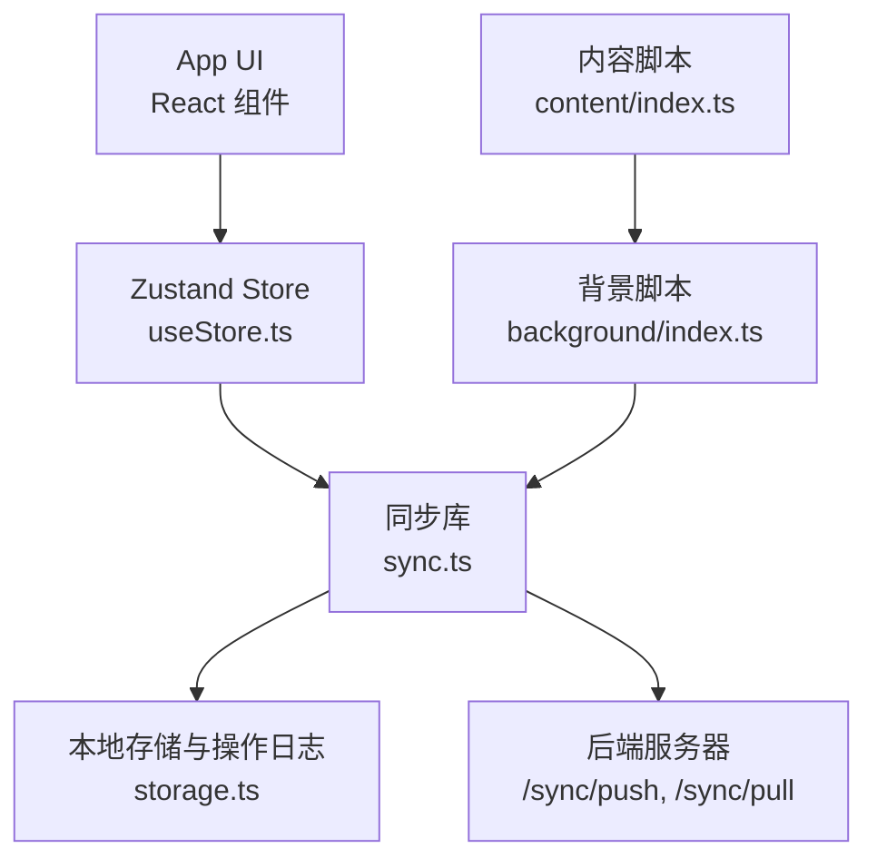
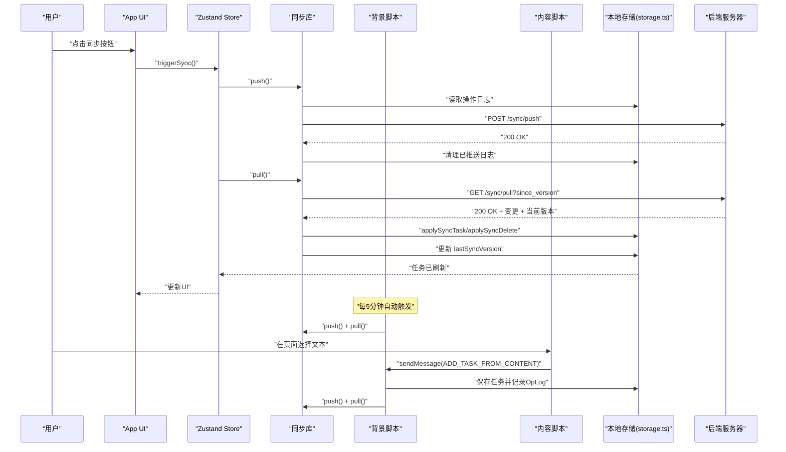
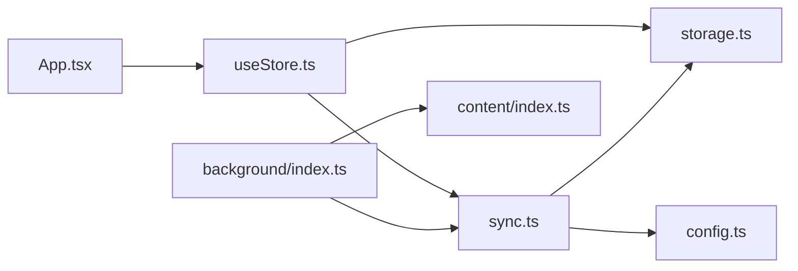

# 同步API

<cite>
**本文引用的文件**
- [src/lib/sync.ts](file://src/lib/sync.ts)
- [src/lib/storage.ts](file://src/lib/storage.ts)
- [src/background/index.ts](file://src/background/index.ts)
- [src/content/index.ts](file://src/content/index.ts)
- [src/hooks/useStore.ts](file://src/hooks/useStore.ts)
- [src/App.tsx](file://src/App.tsx)
- [src/config.ts](file://src/config.ts)
- [package.json](file://package.json)
</cite>

## 目录
1. [简介](#简介)
2. [项目结构](#项目结构)
3. [核心组件](#核心组件)
4. [架构总览](#架构总览)
5. [详细组件分析](#详细组件分析)
6. [依赖关系分析](#依赖关系分析)
7. [性能与带宽优化](#性能与带宽优化)
8. [故障排除与错误处理](#故障排除与错误处理)
9. [结论](#结论)
10. [附录：接口定义与数据模型](#附录接口定义与数据模型)

## 简介
本文件系统性梳理该浏览器扩展的云端同步能力，覆盖以下主题：
- 同步调用流程（push/pull）、HTTP 请求格式与响应处理
- 同步状态管理、版本控制与冲突解决策略
- 操作日志推送机制、批量同步与增量同步实现
- 触发方式（手动、自动、内容脚本）、后台同步与前台状态反馈
- 错误处理、重试与网络异常恢复
- applySyncTask、applySyncDelete 的实现原理与使用场景
- 性能优化、带宽节省与用户体验提升
- 完整错误码说明与故障排除指南

## 项目结构
该项目采用“前端UI + 背景服务 + 内容脚本 + 同步库”的分层设计：
- 前端UI：React 组件负责任务列表、设置、登录注册与同步状态展示
- 背景服务：Chrome 扩展后台脚本，定时触发同步、监听消息、上下文菜单
- 内容脚本：注入页面的浮动按钮，用于从选中文本或页面创建任务并触发同步
- 同步库：封装 push/pull、变更应用、客户端ID生成、操作日志记录与清理

图表来源
- [src/App.tsx](file://src/App.tsx#L1-L860)
- [src/hooks/useStore.ts](file://src/hooks/useStore.ts#L1-L193)
- [src/lib/sync.ts](file://src/lib/sync.ts#L1-L110)
- [src/lib/storage.ts](file://src/lib/storage.ts#L1-L272)
- [src/background/index.ts](file://src/background/index.ts#L1-L114)
- [src/content/index.ts](file://src/content/index.ts#L1-L239)

章节来源
- [src/App.tsx](file://src/App.tsx#L1-L860)
- [src/hooks/useStore.ts](file://src/hooks/useStore.ts#L1-L193)
- [src/lib/sync.ts](file://src/lib/sync.ts#L1-L110)
- [src/lib/storage.ts](file://src/lib/storage.ts#L1-L272)
- [src/background/index.ts](file://src/background/index.ts#L1-L114)
- [src/content/index.ts](file://src/content/index.ts#L1-L239)

## 核心组件
- 同步库（sync.ts）：封装 push/pull、变更应用、客户端ID生成
- 存储与操作日志（storage.ts）：任务持久化、操作日志记录与清理、applySyncTask/applySyncDelete
- 背景脚本（background/index.ts）：定时同步、消息处理、上下文菜单
- 内容脚本（content/index.ts）：悬浮按钮、消息发送到后台
- Zustand Store（useStore.ts）：状态管理、手动/仅拉取同步、加载任务
- 主界面（App.tsx）：登录/注册、合并/丢弃离线任务、手动同步按钮、状态栏

章节来源
- [src/lib/sync.ts](file://src/lib/sync.ts#L1-L110)
- [src/lib/storage.ts](file://src/lib/storage.ts#L1-L272)
- [src/background/index.ts](file://src/background/index.ts#L1-L114)
- [src/content/index.ts](file://src/content/index.ts#L1-L239)
- [src/hooks/useStore.ts](file://src/hooks/useStore.ts#L1-L193)
- [src/App.tsx](file://src/App.tsx#L1-L860)

## 架构总览
下图展示了从用户操作到云端同步的端到端流程，包括手动触发、自动触发与内容脚本触发三种路径。

图表来源
- [src/App.tsx](file://src/App.tsx#L62-L72)
- [src/hooks/useStore.ts](file://src/hooks/useStore.ts#L167-L179)
- [src/lib/sync.ts](file://src/lib/sync.ts#L6-L83)
- [src/lib/storage.ts](file://src/lib/storage.ts#L108-L138)
- [src/background/index.ts](file://src/background/index.ts#L7-L15)
- [src/content/index.ts](file://src/content/index.ts#L208-L234)

## 详细组件分析

### 同步库（sync.ts）
- push 流程
  - 读取同步状态（token、serverUrl），若缺失则直接返回
  - 读取操作日志（OpLogs），为空则返回
  - 发送 POST /sync/push，携带 client_id、changes（实体类型、实体ID、操作类型、变更字段、客户端时间戳）
  - 成功后清理已推送的日志
- pull 流程
  - 发送 GET /sync/pull?since_version，携带 Authorization
  - 解析响应中的 changes 与 current_version
  - 若有变更，调用 applyChanges 应用变更；最后更新本地 lastSyncVersion
- applyChanges
  - 针对 entity=task 的 create/update/delete 分支，分别调用 storage.applySyncTask 或 applySyncDelete
  - 支持从 OpLog 中透传 userId，确保服务端下发的任务归属正确
- getClientId
  - 使用 chrome.storage.local 保存/读取 client_id，不存在时生成 ULID

章节来源
- [src/lib/sync.ts](file://src/lib/sync.ts#L6-L109)

### 存储与操作日志（storage.ts）
- 数据模型
  - Task：任务实体，含 id、userId、title、status、priority、tags、时间戳等
  - OpLog：操作日志，含 id、entity、entityId、opType、changes、clientTs
  - SyncState：同步状态，含 lastSyncVersion、lastSyncTime、token、serverUrl、userId、username、language
- 操作日志记录（logOp）
  - 在保存/删除任务时写入 OpLog，并通过 runtime.sendMessage 触发同步
- 应用同步变更（applySyncTask/applySyncDelete）
  - applySyncTask：根据服务端下发的 changes 合并到本地任务；若 userId 缺失，优先使用传入的 userId，其次使用当前 SyncState.userId
  - applySyncDelete：标记任务为 deleted
- 版本与合并
  - getOfflineTasksCount：统计未归属用户的离线任务数量
  - assignTasksToUser/discardOfflineTasks：登录后对离线任务进行合并或丢弃
- 清理与安全
  - handleLogoutCleanup/clearUserData：登出时清理用户数据，保留 serverUrl 与语言配置

章节来源
- [src/lib/storage.ts](file://src/lib/storage.ts#L4-L34)
- [src/lib/storage.ts](file://src/lib/storage.ts#L108-L138)
- [src/lib/storage.ts](file://src/lib/storage.ts#L140-L194)
- [src/lib/storage.ts](file://src/lib/storage.ts#L206-L242)

### 背景脚本（background/index.ts）
- 自动同步
  - 创建周期性闹钟（每5分钟），触发 push() + pull()
- 手动同步
  - 监听来自内容脚本的消息 ADD_TASK_FROM_CONTENT，创建任务后触发 push() + pull()
  - 监听来自 UI 的 sync_trigger 消息，触发 push() + pull()
- 上下文菜单
  - 注册“添加到 QKnot”、“添加页面到 QKnot”，点击后创建任务并触发同步

章节来源
- [src/background/index.ts](file://src/background/index.ts#L7-L15)
- [src/background/index.ts](file://src/background/index.ts#L67-L81)
- [src/background/index.ts](file://src/background/index.ts#L83-L113)

### 内容脚本（content/index.ts）
- 功能
  - 在页面中显示悬浮按钮，支持从选中文本或页面标题创建任务
  - 通过 chrome.runtime.sendMessage 将任务文本发送给后台
  - 成功后展示成功动画并清空选择

章节来源
- [src/content/index.ts](file://src/content/index.ts#L1-L239)

### Zustand Store（useStore.ts）
- 提供 loadTasks/addTask/updateTask/toggleTask/deleteTask 等 CRUD 方法
- 提供 triggerSync/pullOnly：手动同步与仅拉取
- 同步期间设置 isSyncing 状态，避免重复触发
- 同步完成后重新加载任务并过滤已删除项

章节来源
- [src/hooks/useStore.ts](file://src/hooks/useStore.ts#L1-L193)

### 主界面（App.tsx）
- 登录/注册：调用后端 /auth/login 与 /auth/register，解析 token 并提取 userId
- 合并/丢弃离线任务：根据离线任务数量与是否检测到“他人的任务”决定策略
- 自动同步：首次打开时静默触发一次同步
- 手动同步：点击状态栏图标触发同步，使用 toast 展示结果

章节来源
- [src/App.tsx](file://src/App.tsx#L35-L46)
- [src/App.tsx](file://src/App.tsx#L62-L72)
- [src/App.tsx](file://src/App.tsx#L113-L200)
- [src/App.tsx](file://src/App.tsx#L210-L225)
- [src/App.tsx](file://src/App.tsx#L826-L854)

## 依赖关系分析
- 同步库依赖本地存储模块以读取/清理 OpLogs，并通过 fetch 与后端交互
- 背景脚本依赖同步库执行 push/pull，并通过 runtime 与内容脚本通信
- UI 通过 Zustand Store 调用同步库，Store 再次调用 storage 更新本地状态
- 配置模块提供默认服务器地址

图表来源
- [src/lib/sync.ts](file://src/lib/sync.ts#L1-L110)
- [src/lib/storage.ts](file://src/lib/storage.ts#L1-L272)
- [src/background/index.ts](file://src/background/index.ts#L1-L114)
- [src/content/index.ts](file://src/content/index.ts#L1-L239)
- [src/hooks/useStore.ts](file://src/hooks/useStore.ts#L1-L193)
- [src/App.tsx](file://src/App.tsx#L1-L860)
- [src/config.ts](file://src/config.ts#L1-L2)

章节来源
- [src/lib/sync.ts](file://src/lib/sync.ts#L1-L110)
- [src/lib/storage.ts](file://src/lib/storage.ts#L1-L272)
- [src/background/index.ts](file://src/background/index.ts#L1-L114)
- [src/content/index.ts](file://src/content/index.ts#L1-L239)
- [src/hooks/useStore.ts](file://src/hooks/useStore.ts#L1-L193)
- [src/App.tsx](file://src/App.tsx#L1-L860)
- [src/config.ts](file://src/config.ts#L1-L2)

## 性能与带宽优化
- 增量同步
  - 通过 lastSyncVersion 参数实现增量拉取，减少传输与处理开销
- 操作日志批处理
  - push 时一次性上传所有未推送的 OpLogs，避免频繁小包
- 变更字段最小化
  - 更新时仅发送必要字段（如 title/status/description/priority/tags/updatedAt），降低带宽占用
- 本地排序与过滤
  - UI 层仅展示未删除任务，减少渲染与内存压力
- 自动同步频率
  - 默认每5分钟一次，可在后台脚本中调整周期
- 用户体验
  - 同步状态指示器（旋转图标）、Toast 提示、禁用输入防止并发操作

章节来源
- [src/lib/sync.ts](file://src/lib/sync.ts#L60-L77)
- [src/lib/storage.ts](file://src/lib/storage.ts#L74-L83)
- [src/background/index.ts](file://src/background/index.ts#L7-L15)
- [src/App.tsx](file://src/App.tsx#L826-L854)

## 故障排除与错误处理
- 同步失败
  - push/pull 抛出错误时会打印日志并向上抛出，UI 通过 toast 显示“同步失败”
  - 建议在网络异常时重试，或等待下次自动同步
- 认证失败
  - 登录/注册失败时提示错误信息，检查用户名密码或服务器可达性
- 冲突与离线任务
  - 登录后若检测到“他人的任务”，将强制清理以避免数据泄露
  - 若存在离线任务，弹窗询问是否合并或丢弃；合并后需再次全量同步
- 通知与提示
  - 内容脚本成功创建任务后展示成功动画并清空选择
  - UI 状态栏显示在线/离线状态与待办数量

章节来源
- [src/lib/sync.ts](file://src/lib/sync.ts#L49-L52)
- [src/App.tsx](file://src/App.tsx#L95-L111)
- [src/App.tsx](file://src/App.tsx#L149-L159)
- [src/App.tsx](file://src/App.tsx#L210-L225)
- [src/content/index.ts](file://src/content/index.ts#L218-L230)

## 结论
该扩展实现了基于操作日志的增量同步机制，结合本地状态管理与后台自动同步，提供了较为完整的云端同步能力。通过 OpLog 记录与 applySyncTask/applySyncDelete 的应用，系统能够处理创建、更新、删除等多类变更，并在登录后对离线任务进行合并或丢弃。建议后续增强：
- 完善 OpLog 的生成与清理逻辑，确保幂等与一致性
- 引入指数退避与重试策略，提升网络异常下的稳定性
- 增加同步进度与错误详情的可视化反馈
- 对大体量任务进行分页或分批处理，避免单次请求过大

[无章节来源]

## 附录：接口定义与数据模型

### HTTP 接口
- POST /sync/push
  - 请求头：Authorization: Bearer <token>, Content-Type: application/json
  - 请求体：
    - client_id: 字符串
    - changes: 数组，元素为对象，包含 entity、entity_id、op_type、changes、client_ts
  - 响应：200 OK 表示成功，否则抛错
- GET /sync/pull?since_version=<number>
  - 请求头：Authorization: Bearer <token>
  - 响应体：{ changes: OpLog[], current_version: number }

章节来源
- [src/lib/sync.ts](file://src/lib/sync.ts#L24-L41)
- [src/lib/sync.ts](file://src/lib/sync.ts#L59-L77)

### 数据模型
- Task
  - 字段：id、userId、title、description、status、priority、tags、createdAt、updatedAt、deleted
- OpLog
  - 字段：id、entity、entityId、opType、changes、clientTs
- SyncState
  - 字段：lastSyncVersion、lastSyncTime、token、serverUrl、userId、username、language

章节来源
- [src/lib/storage.ts](file://src/lib/storage.ts#L4-L34)

### 同步应用方法
- applySyncTask(entityId, changes, userId?)
  - 场景：服务端下发 create/update 时，将 changes 合并到本地任务；若 userId 缺失，优先使用传入 userId，其次使用当前 SyncState.userId
- applySyncDelete(entityId)
  - 场景：服务端下发 delete 时，标记本地任务为 deleted

章节来源
- [src/lib/storage.ts](file://src/lib/storage.ts#L140-L194)
- [src/lib/sync.ts](file://src/lib/sync.ts#L85-L99)

### 同步触发方式
- 手动触发
  - UI 点击同步按钮：App.tsx -> useStore.triggerSync -> sync.push + sync.pull
- 自动触发
  - 背景脚本每5分钟触发：chrome.alarms -> sync.push + sync.pull
- 内容脚本触发
  - 页面悬浮按钮 -> background 接收消息 -> 保存任务并触发同步

章节来源
- [src/App.tsx](file://src/App.tsx#L62-L72)
- [src/background/index.ts](file://src/background/index.ts#L7-L15)
- [src/content/index.ts](file://src/content/index.ts#L208-L234)

### 版本控制与冲突解决
- 版本控制
  - lastSyncVersion 作为增量拉取的起点；每次成功拉取后更新为 current_version
- 冲突解决
  - applySyncTask 支持从 OpLog 透传 userId，保证服务端下发的任务归属正确
  - 登录后对离线任务进行合并或丢弃，避免“他人的任务”残留

章节来源
- [src/lib/sync.ts](file://src/lib/sync.ts#L77-L78)
- [src/lib/storage.ts](file://src/lib/storage.ts#L168-L175)
- [src/App.tsx](file://src/App.tsx#L149-L159)