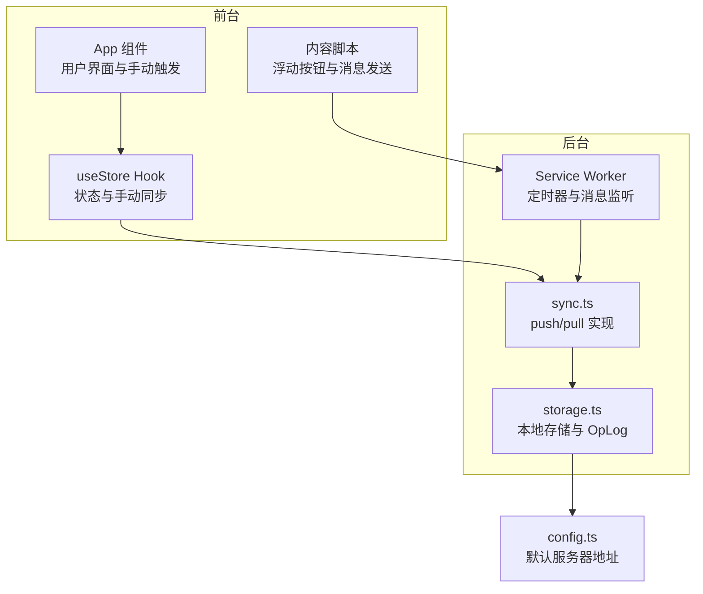
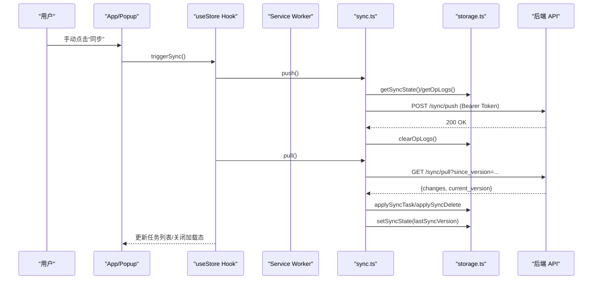
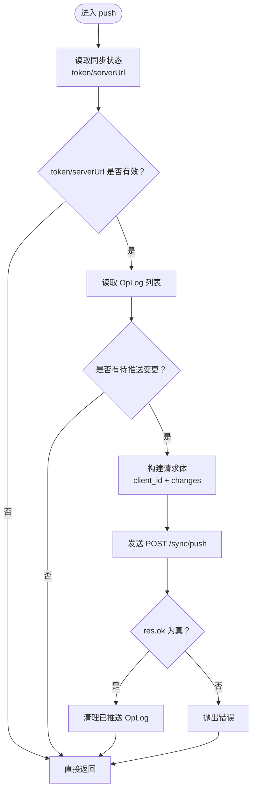
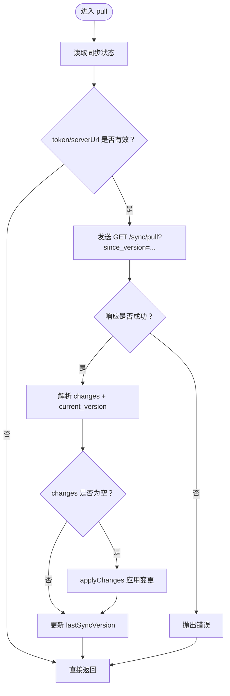
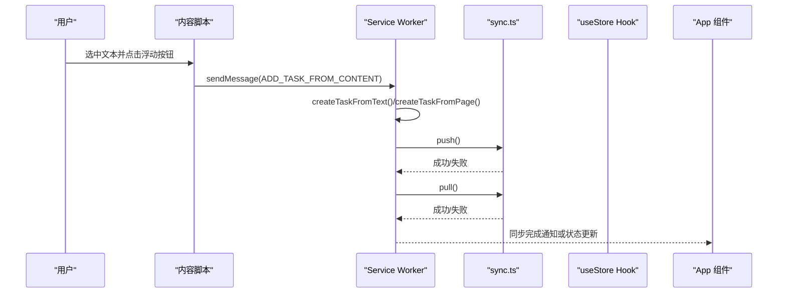
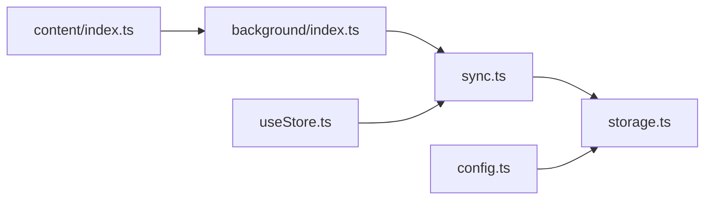

# 同步机制

<cite>
**本文引用的文件**
- [src/lib/sync.ts](file://src/lib/sync.ts)
- [src/lib/storage.ts](file://src/lib/storage.ts)
- [src/background/index.ts](file://src/background/index.ts)
- [src/hooks/useStore.ts](file://src/hooks/useStore.ts)
- [src/content/index.ts](file://src/content/index.ts)
- [src/App.tsx](file://src/App.tsx)
- [src/config.ts](file://src/config.ts)
- [manifest.config.ts](file://manifest.config.ts)
</cite>

## 目录
1. [简介](#简介)
2. [项目结构](#项目结构)
3. [核心组件](#核心组件)
4. [架构总览](#架构总览)
5. [详细组件分析](#详细组件分析)
6. [依赖关系分析](#依赖关系分析)
7. [性能考虑](#性能考虑)
8. [故障排查指南](#故障排查指南)
9. [结论](#结论)
10. [附录：API调用示例与调试指南](#附录api调用示例与调试指南)

## 简介
本文件系统性梳理浏览器扩展的同步机制，重点覆盖以下方面：
- push 和 pull 方法的实现原理：HTTP 请求构建、认证机制、响应处理
- 客户端 ID 生成策略（基于本地存储）
- 操作日志（OpLog）推送流程与增量同步思路
- 同步触发条件、后台执行机制与前台状态反馈
- 错误处理、重试策略与网络异常恢复
- 性能优化建议、带宽节省策略与用户体验改进
- 完整的 API 调用示例与调试指南

## 项目结构
该扩展采用模块化设计，同步逻辑分布在多个文件中：
- 同步核心：src/lib/sync.ts
- 存储与 OpLog：src/lib/storage.ts
- 后台定时任务与消息处理：src/background/index.ts
- 前台状态与手动触发：src/hooks/useStore.ts、src/App.tsx
- 内容脚本：src/content/index.ts
- 配置与清单：src/config.ts、manifest.config.ts

图表来源
- [src/App.tsx](file://src/App.tsx#L1-L200)
- [src/hooks/useStore.ts](file://src/hooks/useStore.ts#L1-L193)
- [src/content/index.ts](file://src/content/index.ts#L1-L239)
- [src/background/index.ts](file://src/background/index.ts#L1-L114)
- [src/lib/sync.ts](file://src/lib/sync.ts#L1-L110)
- [src/lib/storage.ts](file://src/lib/storage.ts#L1-L272)
- [src/config.ts](file://src/config.ts#L1-L2)

章节来源
- [src/lib/sync.ts](file://src/lib/sync.ts#L1-L110)
- [src/lib/storage.ts](file://src/lib/storage.ts#L1-L272)
- [src/background/index.ts](file://src/background/index.ts#L1-L114)
- [src/hooks/useStore.ts](file://src/hooks/useStore.ts#L1-L193)
- [src/content/index.ts](file://src/content/index.ts#L1-L239)
- [src/App.tsx](file://src/App.tsx#L1-L200)
- [src/config.ts](file://src/config.ts#L1-L2)
- [manifest.config.ts](file://manifest.config.ts#L1-L40)

## 核心组件
- 同步器（sync.ts）
  - push：从本地 OpLog 读取变更，构造请求体，携带 Bearer Token 发送到后端 /sync/push；成功后清理已推送的 OpLog
  - pull：携带 lastSyncVersion 查询 /sync/pull；解析返回的 changes 并应用到本地，更新 lastSyncVersion
  - applyChanges：根据 entity/opType 分发到 storage.applySyncTask/applySyncDelete
  - getClientId：首次使用时生成 ULID 并持久化到本地存储
- 存储层（storage.ts）
  - Task/OpLog/SyncState 数据模型定义
  - saveTask/deleteTask 自动记录 OpLog，并通过 sendMessage 触发后台同步
  - getOpLogs/clearOpLogs 管理待推送的变更
  - applySyncTask/applySyncDelete 应用服务端下发的变更
  - getSyncState/setSyncState 管理 token、serverUrl、lastSyncVersion 等同步状态
- 后台（background/index.ts）
  - 创建周期性 alarm（每 5 分钟），自动触发 push/pull
  - 监听来自内容脚本的消息，创建任务并触发 push/pull
  - 监听来自 popup 的手动同步消息，触发 push/pull
- 前台（hooks/useStore.ts、App.tsx）
  - 提供 triggerSync/pullOnly/isSyncing 状态，UI 层在同步期间显示加载态
  - 首次打开时若存在 token 则自动触发一次同步
- 内容脚本（content/index.ts）
  - 浮动按钮插入页面，选中文本后点击发送消息给后台创建任务并触发同步

章节来源
- [src/lib/sync.ts](file://src/lib/sync.ts#L5-L109)
- [src/lib/storage.ts](file://src/lib/storage.ts#L4-L272)
- [src/background/index.ts](file://src/background/index.ts#L1-L114)
- [src/hooks/useStore.ts](file://src/hooks/useStore.ts#L1-L193)
- [src/App.tsx](file://src/App.tsx#L1-L200)
- [src/content/index.ts](file://src/content/index.ts#L1-L239)

## 架构总览
下图展示从用户操作到服务端同步的完整链路，以及后台自动同步与前台手动触发的关系。

图表来源
- [src/App.tsx](file://src/App.tsx#L62-L72)
- [src/hooks/useStore.ts](file://src/hooks/useStore.ts#L167-L179)
- [src/lib/sync.ts](file://src/lib/sync.ts#L6-L83)
- [src/lib/storage.ts](file://src/lib/storage.ts#L108-L138)

## 详细组件分析

### push 方法实现原理
- 请求构建
  - 目标：POST /sync/push
  - 头部：Content-Type: application/json，Authorization: Bearer <token>
  - Body：包含 client_id（客户端标识）与 changes 数组（每个元素映射 OpLog 字段）
- 认证机制
  - 使用 storage.getSyncState() 获取 token 与 serverUrl，未配置则直接返回
- 响应处理
  - res.ok 为真时，调用 storage.clearOpLogs 清理已推送的 OpLog
  - 其他情况抛出错误，由上层捕获并记录
- 错误处理
  - 捕获 fetch 异常与非 2xx 响应，统一记录并向上抛出

图表来源
- [src/lib/sync.ts](file://src/lib/sync.ts#L6-L53)

章节来源
- [src/lib/sync.ts](file://src/lib/sync.ts#L6-L53)

### pull 方法实现原理
- 请求构建
  - 目标：GET /sync/pull
  - 查询参数：since_version=lastSyncVersion
  - 头部：Authorization: Bearer <token>
- 响应处理
  - 解析返回的 changes 与 current_version
  - 若 changes 非空，调用 applyChanges 应用变更
  - 更新 storage.setSyncState(lastSyncVersion=current_version)
- 错误处理
  - 非 2xx 响应或解析失败时抛错，由上层捕获

图表来源
- [src/lib/sync.ts](file://src/lib/sync.ts#L55-L83)

章节来源
- [src/lib/sync.ts](file://src/lib/sync.ts#L55-L83)

### 客户端 ID 生成策略
- 生成时机：首次使用时生成 ULID
- 存储位置：chrome.storage.local 中的 client_id
- 用途：区分不同客户端实例，避免冲突与重复推送
- 生命周期：随扩展安装而存在，除非被清除

章节来源
- [src/lib/sync.ts](file://src/lib/sync.ts#L101-L108)
- [src/lib/storage.ts](file://src/lib/storage.ts#L108-L127)

### 操作日志推送流程与增量同步
- OpLog 记录
  - saveTask/saveTask/deleteTask 在变更时写入 OpLog
  - logOp 将变更封装为 OpLog 并写入本地存储
- 推送流程
  - push 读取所有 OpLog，发送至服务端；成功后清理已推送的 OpLog
- 增量同步思路
  - pull 使用 since_version 进行增量拉取
  - applyChanges 根据 entity/opType 分发到 storage.applySyncTask/applySyncDelete
- 当前实现要点
  - push 以 OpLog 为单位进行批量推送
  - pull 以版本号为依据进行增量拉取

章节来源
- [src/lib/storage.ts](file://src/lib/storage.ts#L55-L106)
- [src/lib/storage.ts](file://src/lib/storage.ts#L108-L138)
- [src/lib/storage.ts](file://src/lib/storage.ts#L141-L194)
- [src/lib/sync.ts](file://src/lib/sync.ts#L21-L53)
- [src/lib/sync.ts](file://src/lib/sync.ts#L55-L83)
- [src/lib/sync.ts](file://src/lib/sync.ts#L85-L99)

### 同步触发条件、后台执行机制与前台状态反馈
- 触发条件
  - 用户手动点击“同步”按钮（App.tsx 中 handleSync）
  - 内容脚本插入浮动按钮，点击后发送消息给后台创建任务并触发 push/pull
  - Service Worker 设置周期性 alarm（每 5 分钟），自动触发 push/pull
  - 首次打开页面且存在 token 时，自动触发一次同步
- 后台执行机制
  - background/index.ts 监听 alarm 与消息，调用 sync.push().then(sync.pull())
- 前台状态反馈
  - useStore 中 isSyncing 控制 UI 加载态
  - App.tsx 中 toast.promise 包裹 triggerSync，提供“同步中/成功/失败”的提示

图表来源
- [src/content/index.ts](file://src/content/index.ts#L208-L234)
- [src/background/index.ts](file://src/background/index.ts#L10-L15)
- [src/background/index.ts](file://src/background/index.ts#L67-L81)

章节来源
- [src/App.tsx](file://src/App.tsx#L35-L46)
- [src/App.tsx](file://src/App.tsx#L62-L72)
- [src/content/index.ts](file://src/content/index.ts#L208-L234)
- [src/background/index.ts](file://src/background/index.ts#L7-L15)
- [src/hooks/useStore.ts](file://src/hooks/useStore.ts#L167-L179)

### 错误处理、重试策略与网络异常恢复
- 现状
  - push/pull 对非 2xx 响应抛出错误，由调用方捕获
  - 前台通过 toast.promise 提示错误
- 建议的重试策略
  - 指数退避重试：首次延迟 1s，随后按 2^n 增长，上限 60s
  - 最大重试次数：3 次
  - 条件判断：仅在网络错误或 5xx 响应时重试，4xx 不重试
- 网络异常恢复
  - 保持本地 OpLog 不丢失，等待网络恢复后继续推送
  - 增量拉取确保断点续传，避免重复数据

章节来源
- [src/lib/sync.ts](file://src/lib/sync.ts#L49-L52)
- [src/lib/sync.ts](file://src/lib/sync.ts#L79-L82)
- [src/App.tsx](file://src/App.tsx#L67-L71)

## 依赖关系分析
- 模块耦合
  - sync.ts 依赖 storage.ts（读取/写入 OpLog、同步状态）
  - background/index.ts 依赖 sync.ts（自动触发 push/pull）
  - hooks/useStore.ts 依赖 sync.ts（手动触发 push/pull）
  - content/index.ts 通过 runtime.sendMessage 触发后台任务
- 外部依赖
  - chrome.storage.local：本地持久化
  - chrome.alarms：后台定时任务
  - chrome.runtime：消息通信
  - ulid：客户端 ID 生成

图表来源
- [src/lib/sync.ts](file://src/lib/sync.ts#L1-L109)
- [src/lib/storage.ts](file://src/lib/storage.ts#L1-L272)
- [src/background/index.ts](file://src/background/index.ts#L1-L114)
- [src/hooks/useStore.ts](file://src/hooks/useStore.ts#L1-L193)
- [src/content/index.ts](file://src/content/index.ts#L1-L239)
- [src/config.ts](file://src/config.ts#L1-L2)

章节来源
- [src/lib/sync.ts](file://src/lib/sync.ts#L1-L109)
- [src/lib/storage.ts](file://src/lib/storage.ts#L1-L272)
- [src/background/index.ts](file://src/background/index.ts#L1-L114)
- [src/hooks/useStore.ts](file://src/hooks/useStore.ts#L1-L193)
- [src/content/index.ts](file://src/content/index.ts#L1-L239)
- [src/config.ts](file://src/config.ts#L1-L2)

## 性能考虑
- 带宽优化
  - 仅推送 OpLog 变更，避免全量传输
  - pull 使用 since_version 实现增量拉取
  - 仅在有变更时发起 push，减少无效请求
- 存储与序列化
  - 使用 chrome.storage.local，注意单次写入大小限制
  - OpLog 采用最小必要字段，避免冗余
- 前台体验
  - isSyncing 控制 UI 加载态，避免重复触发
  - 自动同步间隔（5 分钟）平衡实时性与资源消耗
- 后台稳定性
  - alarm 周期性触发，避免频繁唤醒
  - 消息通道异步处理，不阻塞主线程

## 故障排查指南
- 常见问题定位
  - 无 token 或 serverUrl：push/pull 直接返回，检查登录状态与设置
  - OpLog 为空：确认本地是否有变更或是否被清理
  - 网络错误：查看控制台错误信息，确认网络连通性
  - 401/403：检查 token 是否过期或权限不足
- 调试步骤
  - 打开 DevTools，切换到 Background Page 查看 Service Worker 日志
  - 在 Console 中执行 storage.getSyncState() 查看当前同步状态
  - 在 Console 中执行 storage.getOpLogs() 查看待推送变更
  - 在 Console 中执行 storage.getTasks() 查看本地任务列表
- 建议的日志输出
  - push/pull 开始与结束
  - 请求 URL 与响应状态码
  - OpLog 数量与清理结果
  - applyChanges 的实体类型与数量

章节来源
- [src/lib/sync.ts](file://src/lib/sync.ts#L49-L52)
- [src/lib/sync.ts](file://src/lib/sync.ts#L79-L82)
- [src/lib/storage.ts](file://src/lib/storage.ts#L196-L204)

## 结论
该扩展实现了基于 OpLog 的增量同步机制，结合后台定时任务与前台手动触发，提供了较为完善的离线-在线数据一致性保障。当前实现以 OpLog 为载体进行推送与拉取，配合 since_version 实现增量同步。为进一步提升可靠性与用户体验，建议引入指数退避重试、网络异常恢复与更细粒度的错误分类处理。

## 附录：API调用示例与调试指南

### API 调用示例
- 推送变更（POST /sync/push）
  - 请求头：Authorization: Bearer <token>, Content-Type: application/json
  - 请求体：包含 client_id 与 changes 数组（每个元素包含 entity、entity_id、op_type、changes、client_ts）
  - 成功：清理已推送的 OpLog
- 拉取变更（GET /sync/pull?since_version=<版本号>）
  - 请求头：Authorization: Bearer <token>
  - 成功：返回 changes 与 current_version，应用变更并更新版本号

章节来源
- [src/lib/sync.ts](file://src/lib/sync.ts#L24-L53)
- [src/lib/sync.ts](file://src/lib/sync.ts#L59-L83)

### 调试指南
- 快速检查
  - 登录后确认 storage.getSyncState() 返回 token 与 serverUrl
  - 新增/编辑/删除任务后确认 storage.getOpLogs() 有新增 OpLog
  - 手动触发同步后确认 OpLog 被清理且任务列表更新
- 关键命令（在 DevTools Console 中执行）
  - storage.getSyncState()
  - storage.getOpLogs()
  - storage.getTasks()
  - storage.setSyncState({ lastSyncVersion: N })（用于测试增量拉取）

章节来源
- [src/lib/storage.ts](file://src/lib/storage.ts#L196-L204)
- [src/lib/storage.ts](file://src/lib/storage.ts#L108-L138)
- [src/lib/storage.ts](file://src/lib/storage.ts#L50-L95)