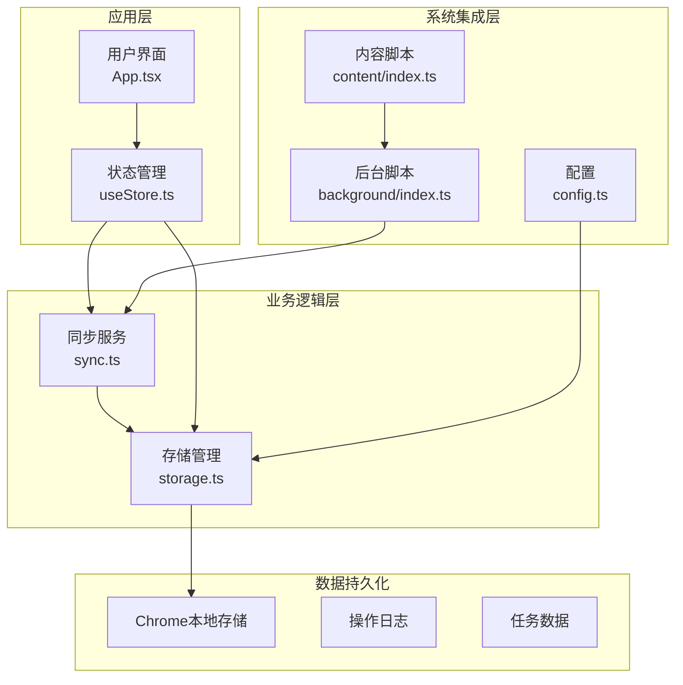
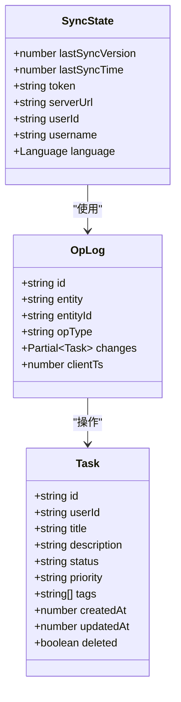
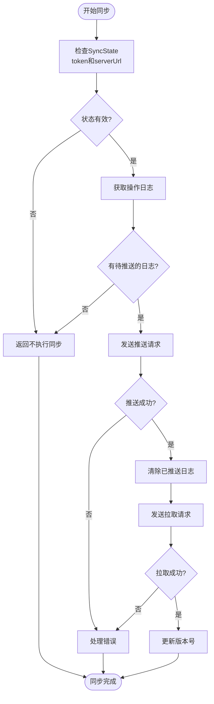
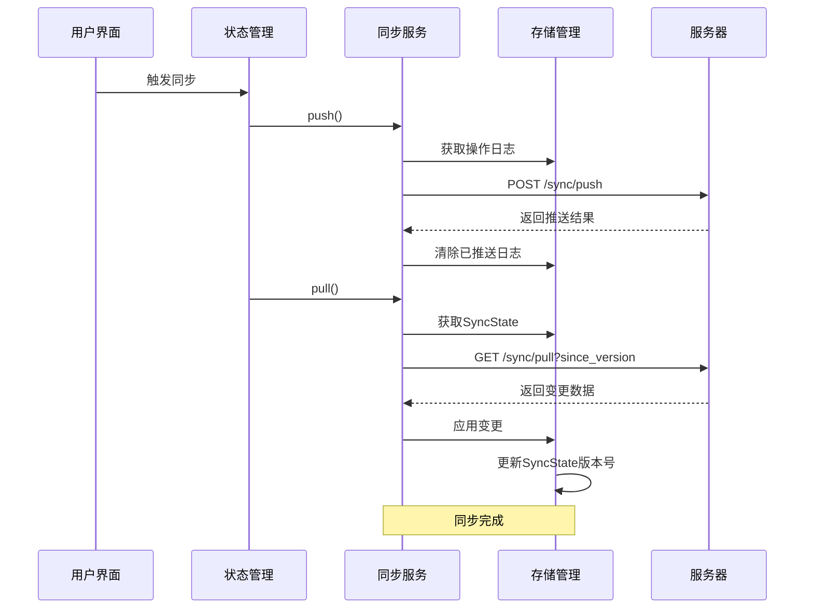
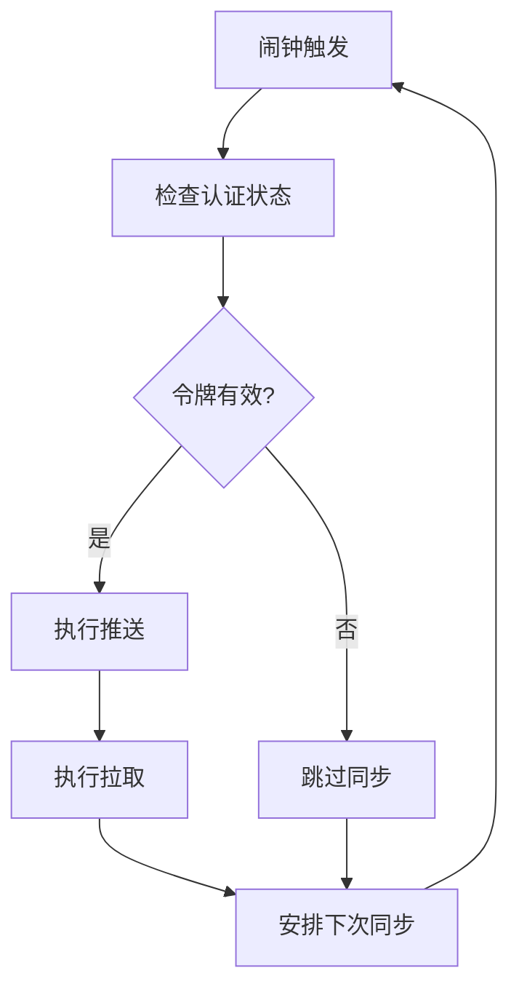
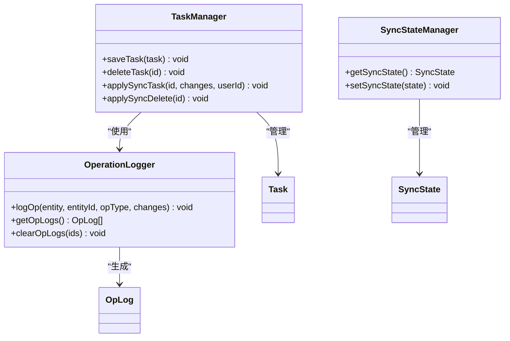
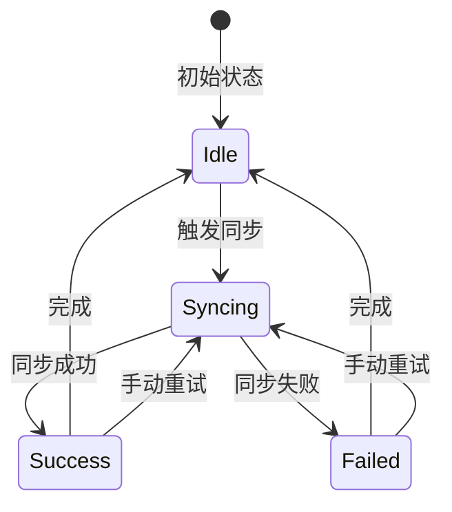
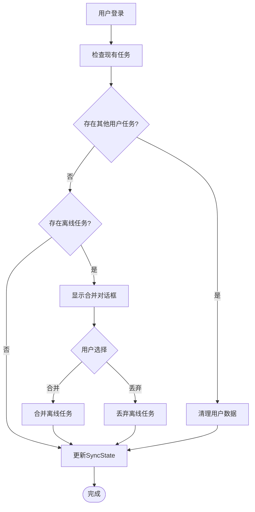
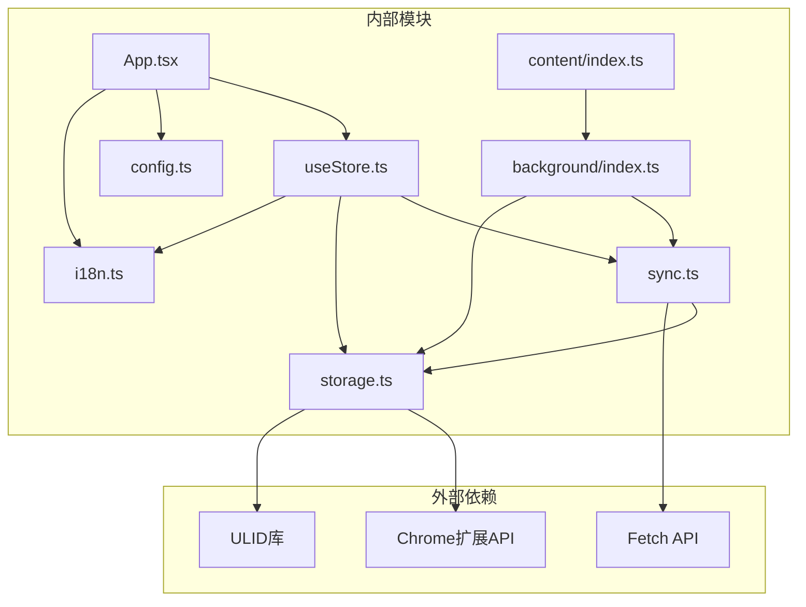
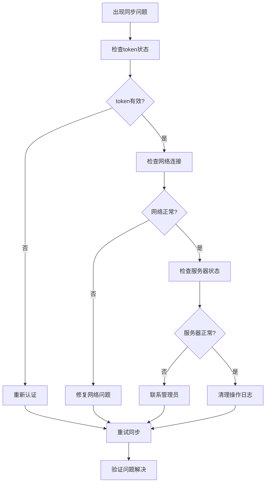

# 同步状态管理

<cite>
**本文档引用的文件**
- [src/lib/sync.ts](file://src/lib/sync.ts)
- [src/lib/storage.ts](file://src/lib/storage.ts)
- [src/hooks/useStore.ts](file://src/hooks/useStore.ts)
- [src/background/index.ts](file://src/background/index.ts)
- [src/content/index.ts](file://src/content/index.ts)
- [src/App.tsx](file://src/App.tsx)
- [src/config.ts](file://src/config.ts)
- [src/lib/i18n.ts](file://src/lib/i18n.ts)
</cite>

## 目录
1. [简介](#简介)
2. [项目结构](#项目结构)
3. [核心组件](#核心组件)
4. [架构概览](#架构概览)
5. [详细组件分析](#详细组件分析)
6. [依赖关系分析](#依赖关系分析)
7. [性能考虑](#性能考虑)
8. [故障排除指南](#故障排除指南)
9. [结论](#结论)
10. [附录](#附录)

## 简介
本文件详细说明了QKnot扩展程序中的同步状态管理系统。该系统实现了基于Chrome扩展的离线优先任务管理器的云端同步功能，包括SyncState数据结构、版本控制机制、令牌管理和持久化存储策略。

## 项目结构
该项目采用模块化架构，主要分为以下几个核心模块：



**图表来源**
- [src/App.tsx](file://src/App.tsx#L1-L50)
- [src/hooks/useStore.ts](file://src/hooks/useStore.ts#L1-L30)
- [src/lib/sync.ts](file://src/lib/sync.ts#L1-L20)
- [src/lib/storage.ts](file://src/lib/storage.ts#L1-L30)

**章节来源**
- [src/App.tsx](file://src/App.tsx#L1-L50)
- [src/hooks/useStore.ts](file://src/hooks/useStore.ts#L1-L30)
- [src/lib/sync.ts](file://src/lib/sync.ts#L1-L20)
- [src/lib/storage.ts](file://src/lib/storage.ts#L1-L30)

## 核心组件

### SyncState 数据结构
SyncState是同步系统的核心数据结构，定义了客户端同步状态的所有必要信息：



**图表来源**
- [src/lib/storage.ts](file://src/lib/storage.ts#L26-L34)
- [src/lib/storage.ts](file://src/lib/storage.ts#L17-L24)
- [src/lib/storage.ts](file://src/lib/storage.ts#L4-L15)

SyncState包含以下关键字段：
- `lastSyncVersion`: 最后一次同步的版本号，用于增量同步
- `lastSyncTime`: 上次同步的时间戳
- `token`: 用户认证令牌
- `serverUrl`: 服务器地址
- `userId`: 当前用户的唯一标识
- `username`: 用户名
- `language`: 应用语言设置

**章节来源**
- [src/lib/storage.ts](file://src/lib/storage.ts#L26-L46)

### 同步状态持久化
系统使用Chrome扩展的本地存储API进行数据持久化：



**图表来源**
- [src/lib/sync.ts](file://src/lib/sync.ts#L6-L53)
- [src/lib/sync.ts](file://src/lib/sync.ts#L55-L83)

**章节来源**
- [src/lib/sync.ts](file://src/lib/sync.ts#L6-L83)
- [src/lib/storage.ts](file://src/lib/storage.ts#L196-L204)

## 架构概览

### 同步工作流
系统实现了完整的双向同步机制，支持自动同步和手动同步：



**图表来源**
- [src/hooks/useStore.ts](file://src/hooks/useStore.ts#L167-L179)
- [src/lib/sync.ts](file://src/lib/sync.ts#L6-L83)
- [src/lib/storage.ts](file://src/lib/storage.ts#L196-L204)

### 自动同步机制
系统通过Chrome闹钟API实现定时同步：



**图表来源**
- [src/background/index.ts](file://src/background/index.ts#L7-L15)

**章节来源**
- [src/background/index.ts](file://src/background/index.ts#L7-L15)

## 详细组件分析

### 同步服务 (sync.ts)
同步服务负责协调推送和拉取操作，处理网络通信和错误处理：

#### 推送操作流程
推送操作会检查操作日志并发送到服务器：

```mermaid
flowchart TD
PushStart([push()开始]) --> GetState["获取SyncState"]
GetState --> ValidateState{"token和serverUrl有效?"}
ValidateState --> |否| PushReturn["返回"]
ValidateState --> |是| GetLogs["获取操作日志"]
GetLogs --> HasLogs{"有日志?"}
HasLogs --> |否| PushReturn
HasLogs --> |是| SendRequest["发送HTTP请求"]
SendRequest --> Response{"响应成功?"}
Response --> |否| ThrowError["抛出错误"]
Response --> |是| ClearLogs["清除已推送日志"]
ClearLogs --> PushComplete([推送完成])
ThrowError --> PushComplete
PushReturn --> PushComplete
```

**图表来源**
- [src/lib/sync.ts](file://src/lib/sync.ts#L6-L53)

#### 拉取操作流程
拉取操作基于版本号进行增量同步：

```mermaid
flowchart TD
PullStart([pull()开始]) --> GetState["获取SyncState"]
GetState --> ValidateState{"token和serverUrl有效?"}
ValidateState --> |否| PullReturn["返回"]
ValidateState --> |是| SendRequest["发送HTTP请求"]
SendRequest --> Response{"响应成功?"}
Response --> |否| ThrowError["抛出错误"]
Response --> |是| ParseData["解析响应数据"]
ParseData --> HasChanges{"有变更?"}
HasChanges --> |是| ApplyChanges["应用变更"]
HasChanges --> |否| UpdateVersion["更新版本号"]
ApplyChanges --> UpdateVersion
UpdateVersion --> PullComplete([拉取完成])
ThrowError --> PullComplete
PullReturn --> PullComplete
```

**图表来源**
- [src/lib/sync.ts](file://src/lib/sync.ts#L55-L83)

**章节来源**
- [src/lib/sync.ts](file://src/lib/sync.ts#L6-L109)

### 存储管理 (storage.ts)
存储管理模块提供了完整的数据持久化和同步状态管理功能：

#### 操作日志系统
系统使用操作日志来跟踪所有数据变更：



**图表来源**
- [src/lib/storage.ts](file://src/lib/storage.ts#L109-L138)
- [src/lib/storage.ts](file://src/lib/storage.ts#L141-L194)
- [src/lib/storage.ts](file://src/lib/storage.ts#L196-L204)

#### 数据一致性保证
存储管理确保了数据的一致性和完整性：

**章节来源**
- [src/lib/storage.ts](file://src/lib/storage.ts#L109-L272)

### 状态管理 (useStore.ts)
状态管理使用Zustand实现全局状态管理，包含同步状态：

#### 同步状态更新机制


**图表来源**
- [src/hooks/useStore.ts](file://src/hooks/useStore.ts#L167-L191)

**章节来源**
- [src/hooks/useStore.ts](file://src/hooks/useStore.ts#L28-L193)

### 登录和用户切换场景
系统支持用户登录和切换，处理离线任务合并：



**图表来源**
- [src/App.tsx](file://src/App.tsx#L140-L225)

**章节来源**
- [src/App.tsx](file://src/App.tsx#L140-L225)

## 依赖关系分析

### 组件依赖图


**图表来源**
- [src/App.tsx](file://src/App.tsx#L1-L10)
- [src/hooks/useStore.ts](file://src/hooks/useStore.ts#L1-L6)
- [src/lib/sync.ts](file://src/lib/sync.ts#L1-L3)

### 关键依赖关系
- **App.tsx** 依赖于 **useStore.ts** 和 **config.ts**
- **useStore.ts** 依赖于 **storage.ts** 和 **sync.ts**
- **sync.ts** 依赖于 **storage.ts** 和 **config.ts**
- **storage.ts** 依赖于 **Chrome本地存储API**
- **background/index.ts** 依赖于 **sync.ts** 和 **storage.ts**

**章节来源**
- [src/App.tsx](file://src/App.tsx#L1-L10)
- [src/hooks/useStore.ts](file://src/hooks/useStore.ts#L1-L6)
- [src/lib/sync.ts](file://src/lib/sync.ts#L1-L3)
- [src/lib/storage.ts](file://src/lib/storage.ts#L1-L3)

## 性能考虑

### 同步优化策略
1. **增量同步**: 使用 `lastSyncVersion` 实现增量同步，减少网络传输
2. **批量推送**: 将多个操作日志合并为单次推送请求
3. **乐观更新**: 在UI层面先更新本地状态，提升用户体验
4. **定时同步**: 使用Chrome闹钟API实现定时同步，避免频繁网络请求

### 内存管理
- 操作日志在推送成功后立即清理，避免内存泄漏
- 任务列表在加载时过滤已删除的任务
- 同步状态只在需要时更新

### 网络优化
- 使用 `lastSyncTime` 字段跟踪上次同步时间
- 实现重试机制处理网络异常
- 支持手动同步以覆盖自动同步

## 故障排除指南

### 常见同步问题及解决方案

#### 同步失败排查
1. **检查网络连接**: 确保能够访问 `serverUrl`
2. **验证认证令牌**: 确认 `token` 未过期
3. **检查服务器状态**: 验证同步端点可用性
4. **查看操作日志**: 分析 `opLogs` 的内容和数量

#### 状态异常诊断


#### 状态恢复策略
1. **强制同步**: 使用手动同步按钮强制执行同步
2. **清理缓存**: 清除操作日志后重新同步
3. **重新认证**: 清除旧令牌并重新登录
4. **重置状态**: 清空所有同步状态并重新初始化

**章节来源**
- [src/lib/sync.ts](file://src/lib/sync.ts#L49-L52)
- [src/lib/storage.ts](file://src/lib/storage.ts#L244-L272)

### 调试工具和监控
- **浏览器开发者工具**: 查看网络请求和响应
- **Chrome扩展页面**: 检查扩展状态和权限
- **控制台日志**: 监控同步过程中的错误信息
- **状态检查**: 通过 `storage.getSyncState()` 检查当前状态

## 结论
QKnot的同步状态管理系统实现了完整的离线优先架构，具有以下特点：

1. **可靠的持久化**: 使用Chrome本地存储确保数据安全
2. **高效的同步**: 增量同步和批量操作优化性能
3. **灵活的用户管理**: 支持多用户切换和离线任务合并
4. **完善的错误处理**: 提供重试机制和状态恢复策略
5. **良好的用户体验**: 乐观更新和自动同步提升交互体验

该系统为Chrome扩展的离线任务管理提供了坚实的技术基础，支持复杂的数据同步场景和用户需求。

## 附录

### 最佳实践建议
1. **状态设计**: 使用清晰的数据结构和明确的字段含义
2. **错误处理**: 实现全面的错误捕获和用户友好的错误提示
3. **性能优化**: 合理使用缓存和批量操作减少网络请求
4. **安全性**: 保护敏感数据，实现适当的访问控制
5. **可维护性**: 保持代码模块化，提供清晰的接口和文档

### 常见问题解答
- **Q: 如何处理同步冲突?**
  A: 系统通过版本号和操作日志实现冲突检测，支持服务器端合并策略
  
- **Q: 离线任务如何处理?**
  A: 离线任务保存在本地，登录后通过合并对话框让用户决定保留或丢弃
  
- **Q: 如何调试同步问题?**
  A: 使用浏览器开发者工具查看网络请求，检查控制台日志，验证状态数据