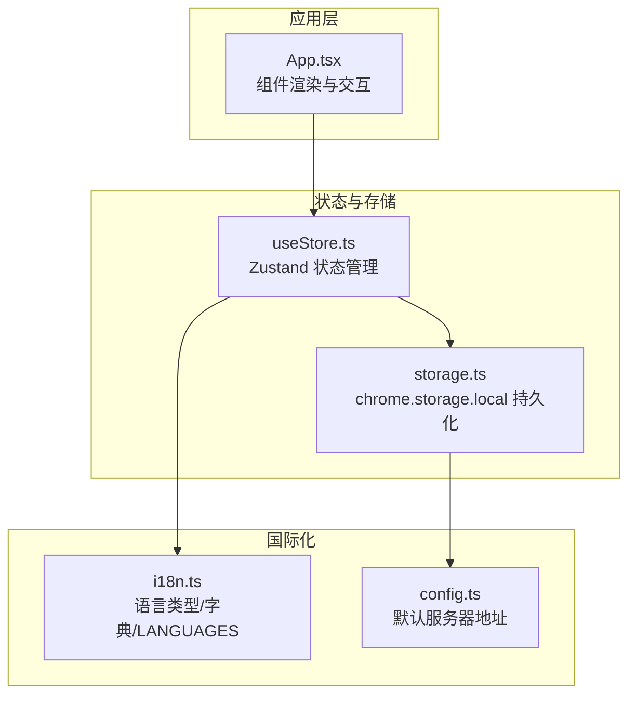
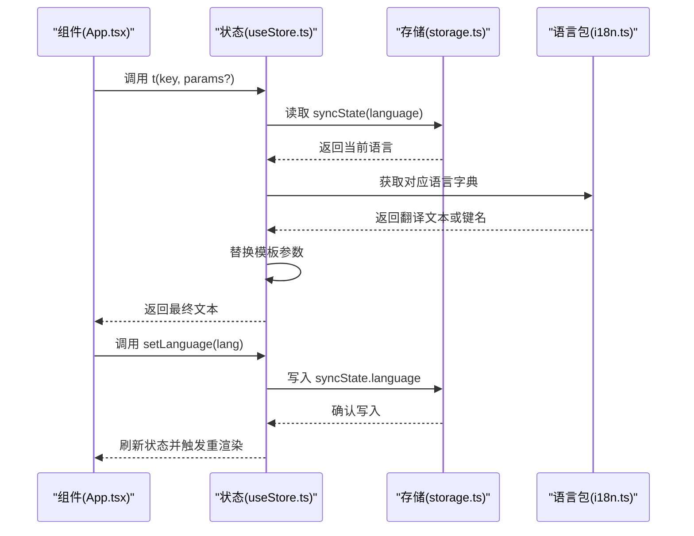
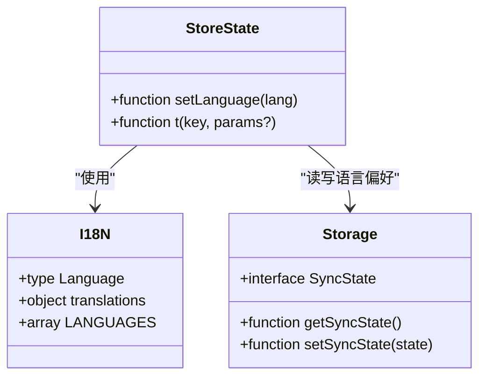
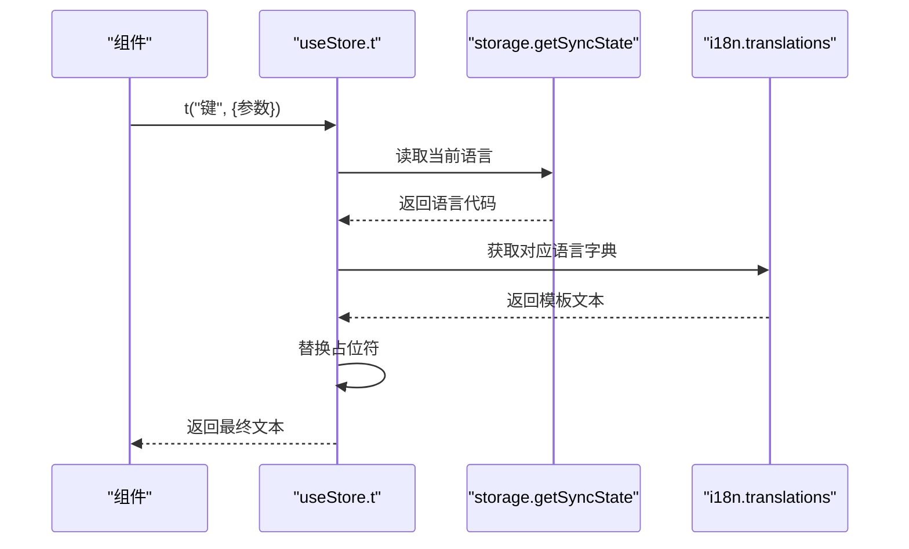
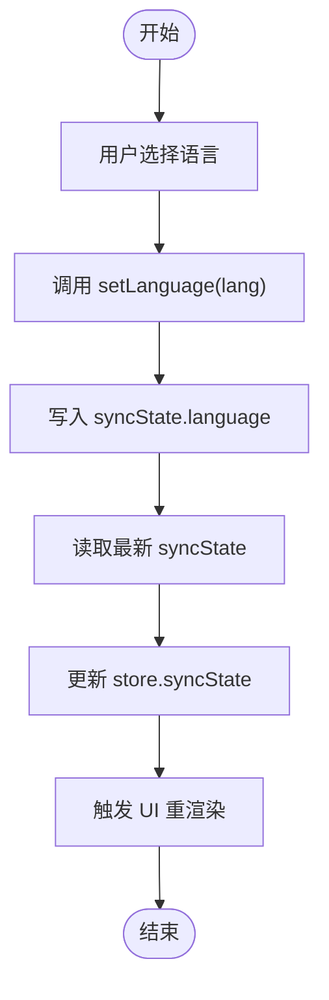
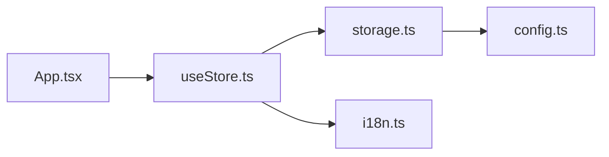

# 国际化API

<cite>
**本文引用的文件**
- [src/lib/i18n.ts](file://src/lib/i18n.ts)
- [src/hooks/useStore.ts](file://src/hooks/useStore.ts)
- [src/lib/storage.ts](file://src/lib/storage.ts)
- [src/App.tsx](file://src/App.tsx)
- [src/config.ts](file://src/config.ts)
</cite>

## 目录
1. [简介](#简介)
2. [项目结构](#项目结构)
3. [核心组件](#核心组件)
4. [架构总览](#架构总览)
5. [详细组件分析](#详细组件分析)
6. [依赖关系分析](#依赖关系分析)
7. [性能考量](#性能考量)
8. [故障排查指南](#故障排查指南)
9. [结论](#结论)
10. [附录](#附录)

## 简介
本文件系统性梳理了该扩展的国际化（i18n）API与实现，覆盖以下主题：
- 多语言支持的架构设计与语言切换机制
- 文本获取方法与动态文本替换
- 可用语言选项、翻译键值对与默认语言设置
- 语言配置的存储位置与用户偏好保存机制
- 完整的国际化函数 API（t 函数）使用方法、参数与返回值
- 文本格式化、复数形式处理与上下文相关翻译
- 新语言添加流程、翻译键值管理策略与本地化测试方法
- 组件内使用示例与国际化性能优化建议及最佳实践

## 项目结构
国际化能力由三部分协同实现：
- 翻译字典与语言枚举：集中于语言包模块
- 存储与状态：通过状态与存储模块持久化语言偏好
- 应用层调用：在组件中以 t 函数与 setLanguage 实现语言切换与文本渲染

图表来源
- [src/App.tsx](file://src/App.tsx#L1-L12)
- [src/hooks/useStore.ts](file://src/hooks/useStore.ts#L1-L26)
- [src/lib/storage.ts](file://src/lib/storage.ts#L196-L204)
- [src/lib/i18n.ts](file://src/lib/i18n.ts#L1-L146)
- [src/config.ts](file://src/config.ts#L1-L2)

章节来源
- [src/lib/i18n.ts](file://src/lib/i18n.ts#L1-L146)
- [src/hooks/useStore.ts](file://src/hooks/useStore.ts#L1-L26)
- [src/lib/storage.ts](file://src/lib/storage.ts#L196-L204)
- [src/App.tsx](file://src/App.tsx#L1-L12)
- [src/config.ts](file://src/config.ts#L1-L2)

## 核心组件
- 语言类型与翻译字典
  - 语言类型限定为英文与两种中文（简体与繁体）
  - 翻译字典按语言分组，键为语义化字符串，值为对应语言的文本或带占位符的模板
  - 提供可选语言列表，用于界面选择与校验

- 状态与存储
  - 同步状态包含语言字段，作为用户偏好的持久化载体
  - 语言设置通过状态写入存储，读取时从存储恢复

- 国际化函数 API
  - t 函数负责根据当前语言与键获取翻译，并进行动态参数替换
  - setLanguage 负责更新语言偏好并刷新状态

章节来源
- [src/lib/i18n.ts](file://src/lib/i18n.ts#L1-L146)
- [src/hooks/useStore.ts](file://src/hooks/useStore.ts#L24-L51)
- [src/lib/storage.ts](file://src/lib/storage.ts#L26-L34)

## 架构总览
下图展示了从组件到状态、存储再到语言包的数据流与控制流。

图表来源
- [src/App.tsx](file://src/App.tsx#L12-L12)
- [src/hooks/useStore.ts](file://src/hooks/useStore.ts#L24-L51)
- [src/lib/storage.ts](file://src/lib/storage.ts#L196-L204)
- [src/lib/i18n.ts](file://src/lib/i18n.ts#L3-L139)

## 详细组件分析

### 语言与翻译字典（i18n.ts）
- 语言类型
  - 限定为英文与两种中文（简体与繁体），确保类型安全与运行期校验
- 翻译字典
  - 按语言分组，键为语义化标识，值为模板文本（支持双花括号占位符）
  - 部分键包含 HTML 片段，用于富文本显示
- 可选语言列表
  - 提供代码与标签，便于 UI 展示与选择

章节来源
- [src/lib/i18n.ts](file://src/lib/i18n.ts#L1-L146)

### 状态与存储（useStore.ts 与 storage.ts）
- 状态接口
  - 包含 t 与 setLanguage 方法，分别用于文本获取与语言切换
- t 函数实现要点
  - 读取当前语言；若不存在则回退到英文
  - 若键不存在，回退到键名本身，便于开发调试
  - 支持对象参数进行占位符替换
- setLanguage 实现要点
  - 更新存储中的语言字段
  - 读取最新状态并刷新 store，驱动 UI 重渲染

章节来源
- [src/hooks/useStore.ts](file://src/hooks/useStore.ts#L24-L51)
- [src/lib/storage.ts](file://src/lib/storage.ts#L196-L204)

### 应用层集成（App.tsx）
- 在设置页的语言选项卡中，使用可选语言列表渲染单选框
- 使用 t 函数渲染静态文案与动态文案（如计数、日期等）
- 在工具栏与状态提示中使用 t 函数展示不同状态下的文本

章节来源
- [src/App.tsx](file://src/App.tsx#L360-L398)
- [src/App.tsx](file://src/App.tsx#L480-L640)
- [src/App.tsx](file://src/App.tsx#L830-L860)

### 类关系图（代码级）

图表来源
- [src/lib/i18n.ts](file://src/lib/i18n.ts#L1-L146)
- [src/hooks/useStore.ts](file://src/hooks/useStore.ts#L8-L26)
- [src/lib/storage.ts](file://src/lib/storage.ts#L26-L34)

### 调用序列图（t 函数工作流）

图表来源
- [src/hooks/useStore.ts](file://src/hooks/useStore.ts#L40-L51)
- [src/lib/storage.ts](file://src/lib/storage.ts#L196-L204)
- [src/lib/i18n.ts](file://src/lib/i18n.ts#L3-L139)

### 流程图（语言切换流程）

图表来源
- [src/hooks/useStore.ts](file://src/hooks/useStore.ts#L34-L38)
- [src/lib/storage.ts](file://src/lib/storage.ts#L196-L204)

## 依赖关系分析
- 组件依赖状态层：组件通过 useStore 获取 t 与 setLanguage
- 状态层依赖存储层：状态层通过 storage 读写语言偏好
- 状态层依赖语言包：状态层通过 i18n 获取翻译字典
- 存储层依赖配置：存储层使用默认服务器地址常量

图表来源
- [src/App.tsx](file://src/App.tsx#L1-L12)
- [src/hooks/useStore.ts](file://src/hooks/useStore.ts#L1-L6)
- [src/lib/storage.ts](file://src/lib/storage.ts#L36-L46)
- [src/lib/i18n.ts](file://src/lib/i18n.ts#L1-L1)
- [src/config.ts](file://src/config.ts#L1-L2)

章节来源
- [src/App.tsx](file://src/App.tsx#L1-L12)
- [src/hooks/useStore.ts](file://src/hooks/useStore.ts#L1-L6)
- [src/lib/storage.ts](file://src/lib/storage.ts#L36-L46)
- [src/lib/i18n.ts](file://src/lib/i18n.ts#L1-L1)
- [src/config.ts](file://src/config.ts#L1-L2)

## 性能考量
- 占位符替换复杂度
  - 当前实现对每个参数执行一次字符串替换，整体为 O(K·M)，其中 K 为参数数量，M 为文本长度
  - 对于高频调用场景，可考虑预编译模板或缓存替换结果
- 字典查找复杂度
  - 语言字典为对象访问，平均 O(1)
- 渲染优化
  - 将 t 调用结果缓存至局部状态，避免重复计算
  - 对动态参数（如计数、日期）仅在变化时更新
- 存储访问
  - 语言偏好读写频率较低，影响有限；可通过批量更新减少消息通信次数

## 故障排查指南
- 键缺失
  - 现象：显示为键名本身
  - 排查：确认键是否存在于目标语言字典；检查大小写与拼写
- 参数未生效
  - 现象：模板占位符未被替换
  - 排查：确认传入参数对象的键名与模板一致；检查参数类型（数字、日期需转换为字符串）
- 语言未切换
  - 现象：界面文案未变
  - 排查：确认 setLanguage 已调用并写入存储；检查存储读取逻辑；确认组件已重新渲染
- HTML 内容被转义
  - 现象：富文本显示为纯文本
  - 排查：确认使用允许 HTML 的渲染方式；避免直接 innerText 或类似 API

章节来源
- [src/hooks/useStore.ts](file://src/hooks/useStore.ts#L40-L51)
- [src/lib/storage.ts](file://src/lib/storage.ts#L196-L204)

## 结论
该国际化方案采用“语言包 + 状态存储 + 组件调用”的简洁架构，具备以下特点：
- 易于维护：翻译键集中管理，便于统一更新
- 类型安全：语言类型与可选语言列表提供编译期保障
- 扩展性强：新增语言只需补充字典与可选语言列表
- 运行高效：对象访问与简单替换，满足扩展程序的性能要求

## 附录

### 可用语言与默认语言
- 可用语言
  - 英文（en）、简体中文（zh-CN）、繁体中文（zh-TW）
- 默认语言
  - 存储层默认语言为英文；当语言不存在或读取失败时，t 函数回退到英文

章节来源
- [src/lib/i18n.ts](file://src/lib/i18n.ts#L141-L145)
- [src/lib/storage.ts](file://src/lib/storage.ts#L38-L46)
- [src/hooks/useStore.ts](file://src/hooks/useStore.ts#L40-L43)

### 翻译键值对概览（节选）
- 应用与状态
  - app.name、status.syncing、status.sync_complete、status.sync_failed、status.offline、status.sync_active、status.tasks_pending
- 登录与注册
  - login.success、login.failed、register.success、register.failed
- 合并与设置
  - merge.title、merge.message、merge.discard、merge.confirm、merge.success、merge.discarded、settings.title、settings.language、settings.username、settings.password、settings.login、settings.register、settings.logout、settings.logged_in_as、settings.switch_to_register、settings.switch_to_login、settings.menu.account、settings.menu.language、settings.menu.about
- 关于与任务
  - about.description、about.version、about.author、about.github、task.add_placeholder、task.empty_state、link.text、task.edit_title、task.created、task.updated、task.add_tag、task.tag_placeholder、task.remove_tag

章节来源
- [src/lib/i18n.ts](file://src/lib/i18n.ts#L3-L139)

### t 函数 API 规范
- 函数签名
  - t(key: string, params?: Record<string, any>): string
- 参数
  - key：翻译键
  - params：可选的键值对参数，用于替换模板中的占位符
- 返回值
  - 返回对应语言的翻译文本；若键不存在，返回键名本身
- 典型用法
  - 静态文案：t('settings.language')
  - 动态文案：t('status.tasks_pending', { count })
  - 时间类：t('task.created', { date })

章节来源
- [src/hooks/useStore.ts](file://src/hooks/useStore.ts#L25-L51)

### 语言切换 API 规范
- 函数签名
  - setLanguage(lang: Language): Promise<void>
- 行为
  - 更新存储中的语言偏好
  - 读取最新状态并刷新 store，触发 UI 重渲染

章节来源
- [src/hooks/useStore.ts](file://src/hooks/useStore.ts#L24-L38)
- [src/lib/storage.ts](file://src/lib/storage.ts#L196-L204)

### 动态文本替换与格式化
- 占位符语法
  - 使用双花括号包裹的键名（如 {{count}}、{{date}}、{{username}}）
- 替换策略
  - 逐键遍历并替换，支持任意类型参数（内部会进行字符串化）
- 复数形式
  - 当前实现未内置复数规则；可在键设计中体现（如 status.tasks_pending），并在调用侧传入计数值
- 上下文相关翻译
  - 通过键的设计区分上下文（如 settings.menu.account 与 task.edit_title）

章节来源
- [src/hooks/useStore.ts](file://src/hooks/useStore.ts#L45-L49)
- [src/lib/i18n.ts](file://src/lib/i18n.ts#L11-L17)
- [src/App.tsx](file://src/App.tsx#L844-L844)

### 新语言添加流程
- 步骤
  - 在语言包中新增语言键与翻译条目
  - 在可选语言列表中添加新语言项
  - 在组件中更新语言选择 UI（如需要）
- 注意事项
  - 确保键集合尽量一致，避免运行时报错回退
  - 如涉及 HTML 内容，注意渲染方式与安全性

章节来源
- [src/lib/i18n.ts](file://src/lib/i18n.ts#L3-L139)
- [src/lib/i18n.ts](file://src/lib/i18n.ts#L141-L145)
- [src/App.tsx](file://src/App.tsx#L364-L395)

### 翻译键值管理策略
- 键命名规范
  - 使用点分层级命名（如 settings.menu.account），便于分类与查找
- 键完整性
  - 新增页面或功能时，同步补齐各语言的翻译
- 模板化
  - 将动态内容放入占位符，避免硬编码拼接
- 版本化
  - 在版本升级时，对缺失或变更的键进行扫描与补全

章节来源
- [src/lib/i18n.ts](file://src/lib/i18n.ts#L3-L139)

### 本地化测试方法
- 自动化
  - 编写单元测试，验证 t 函数在不同语言与参数下的返回值
- 手动验证
  - 在设置页切换语言，观察界面文案变化
  - 输入动态参数，验证占位符替换效果
- 边界测试
  - 传入空参数、空键、不存在的键，验证回退行为
  - 验证 HTML 内容的正确渲染

章节来源
- [src/App.tsx](file://src/App.tsx#L360-L398)
- [src/hooks/useStore.ts](file://src/hooks/useStore.ts#L40-L51)

### 组件使用示例（路径指引）
- 设置页语言选项卡
  - 语言列表渲染与选择：[路径](file://src/App.tsx#L360-L398)
  - 切换语言事件：[路径](file://src/App.tsx#L390-L392)
- 静态与动态文案
  - 设置标题与菜单项：[路径](file://src/App.tsx#L237-L282)
  - 登录/注册按钮文案：[路径](file://src/App.tsx#L340-L354)
  - 关于描述：[路径](file://src/App.tsx#L411-L413)
  - 任务编辑标题与占位符：[路径](file://src/App.tsx#L494-L515)
  - 标签操作文案：[路径](file://src/App.tsx#L586-L626)
  - 状态提示与计数：[路径](file://src/App.tsx#L838-L852)

章节来源
- [src/App.tsx](file://src/App.tsx#L237-L282)
- [src/App.tsx](file://src/App.tsx#L340-L354)
- [src/App.tsx](file://src/App.tsx#L411-L413)
- [src/App.tsx](file://src/App.tsx#L494-L515)
- [src/App.tsx](file://src/App.tsx#L586-L626)
- [src/App.tsx](file://src/App.tsx#L838-L852)

### 最佳实践
- 键设计
  - 保持键的稳定与语义化，避免频繁重构
- 参数传递
  - 统一参数命名，避免大小写不一致
- 渲染策略
  - 对高频文本进行缓存；对动态参数仅在变化时更新
- 错误处理
  - 开发阶段启用键存在性检查；生产环境保留回退行为
- 性能优化
  - 避免在渲染过程中进行大量字符串替换；必要时进行预处理或缓存