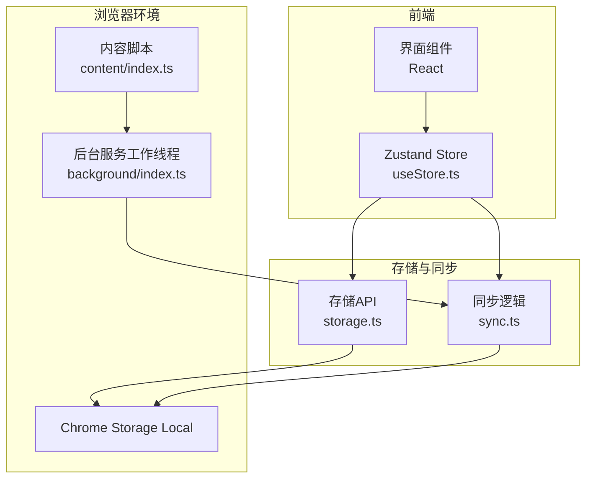
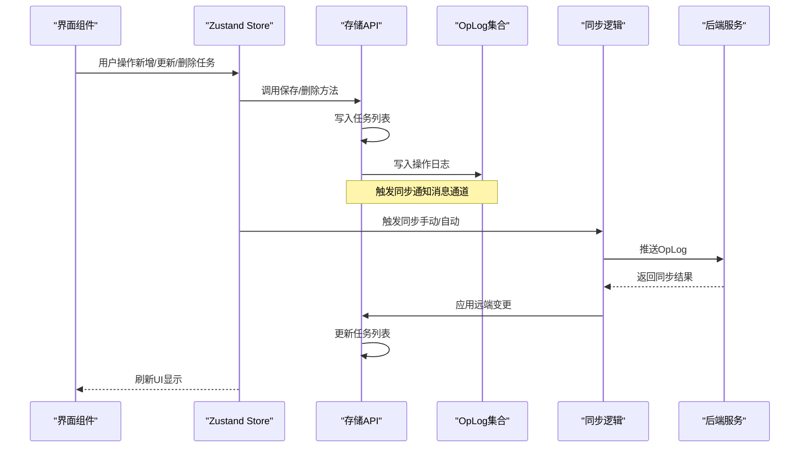
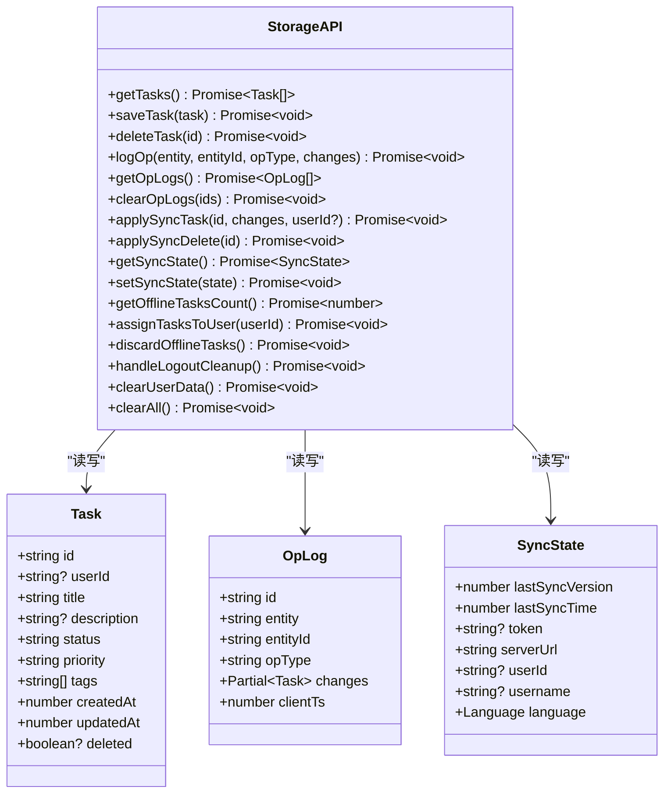
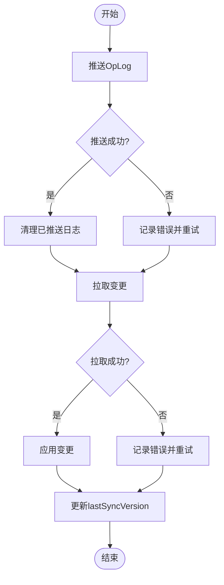
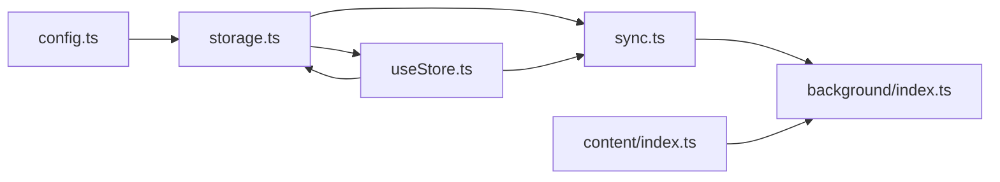

# 存储API

<cite>
**本文引用的文件**
- [storage.ts](file://src/lib/storage.ts)
- [useStore.ts](file://src/hooks/useStore.ts)
- [sync.ts](file://src/lib/sync.ts)
- [config.ts](file://src/config.ts)
- [i18n.ts](file://src/lib/i18n.ts)
- [index.ts](file://src/background/index.ts)
- [manifest.config.ts](file://src/manifest.config.ts)
- [index.ts](file://src/content/index.ts)
</cite>

## 目录
1. [简介](#简介)
2. [项目结构](#项目结构)
3. [核心组件](#核心组件)
4. [架构总览](#架构总览)
5. [详细组件分析](#详细组件分析)
6. [依赖关系分析](#依赖关系分析)
7. [性能考虑](#性能考虑)
8. [故障排除指南](#故障排除指南)
9. [结论](#结论)
10. [附录](#附录)

## 简介
本文件系统性地梳理了扩展的存储API，涵盖以下内容：
- Task接口的数据结构、字段定义与约束
- OpLog操作日志的数据模型、操作类型与变更记录格式
- SyncState同步状态的数据结构、字段含义与默认值
- 完整的存储操作方法文档（getTasks、saveTask、deleteTask、logOp等）
- 数据持久化机制、Chrome Storage API封装与异步操作模式
- 错误处理策略、数据验证规则与性能优化建议
- 实际使用示例（以路径形式给出，避免直接粘贴代码）

## 项目结构
该扩展采用模块化设计，存储逻辑集中在独立模块中，并通过Zustand状态管理与后台服务工作线程协同工作：
- 存储层：封装Chrome Storage API，提供任务与同步状态的读写
- 同步层：负责推送/拉取变更，应用远端变更到本地
- 状态层：Zustand Store统一管理UI状态与调用存储API
- 背景工作线程：定时触发同步、响应消息事件
- 内容脚本：在网页中提供“从选中文本创建任务”的交互入口

图表来源
- [storage.ts](file://src/lib/storage.ts#L48-L271)
- [sync.ts](file://src/lib/sync.ts#L5-L109)
- [useStore.ts](file://src/hooks/useStore.ts#L28-L192)
- [index.ts](file://src/background/index.ts#L1-L45)
- [index.ts](file://src/content/index.ts#L1-L239)

章节来源
- [storage.ts](file://src/lib/storage.ts#L1-L272)
- [sync.ts](file://src/lib/sync.ts#L1-L110)
- [useStore.ts](file://src/hooks/useStore.ts#L1-L193)
- [index.ts](file://src/background/index.ts#L1-L45)
- [index.ts](file://src/content/index.ts#L1-L239)

## 核心组件
本节对存储API的核心数据结构与方法进行深入解析。

- Task接口
  - 字段定义与约束
    - id: 字符串，唯一标识
    - userId?: 字符串或null，用于数据归属校验
    - title: 非空字符串
    - description?: 可选描述
    - status: 枚举值 'todo' | 'done' | 'archived'
    - priority: 枚举值 'none' | 'low' | 'medium' | 'high'
    - tags: 字符串数组
    - createdAt: 数字（时间戳）
    - updatedAt: 数字（时间戳）
    - deleted?: 布尔标记，用于软删除
  - 约束与默认行为
    - 未显式赋值时，优先从SyncState继承用户信息
    - 更新时仅记录关键字段变更，减少带宽占用

- OpLog操作日志
  - 字段定义
    - id: 字符串，日志唯一标识
    - entity: 固定为 'task'
    - entityId: 关联实体ID
    - opType: 操作类型 'create' | 'update' | 'delete'
    - changes: 变更记录（Partial<Task>）
    - clientTs: 客户端时间戳
  - 用途
    - 记录本地变更，供同步推送使用

- SyncState同步状态
  - 字段定义
    - lastSyncVersion: 数字，上次同步版本号
    - lastSyncTime: 数字，上次同步时间戳
    - token: 字符串或null，认证令牌
    - serverUrl: 字符串，服务器地址
    - userId: 字符串或null，当前登录用户ID
    - username: 字符串或null，当前登录用户名
    - language: 语言枚举 'en' | 'zh-CN' | 'zh-TW'
  - 默认值
    - lastSyncVersion: 0
    - lastSyncTime: 0
    - token: null
    - serverUrl: 来自配置的默认地址
    - userId: null
    - username: null
    - language: 'en'

- 存储API方法概览
  - getTasks(): Promise<Task[]>
  - saveTask(task: Task): Promise<void>
  - deleteTask(id: string): Promise<void>
  - logOp(entity: 'task', entityId: string, opType: OpLog['opType'], changes: Partial<Task>): Promise<void>
  - getOpLogs(): Promise<OpLog[]>
  - clearOpLogs(ids: string[]): Promise<void>
  - applySyncTask(id: string, changes: Partial<Task>, userId?: string): Promise<void>
  - applySyncDelete(id: string): Promise<void>
  - getSyncState(): Promise<SyncState>
  - setSyncState(state: Partial<SyncState>): Promise<void>
  - getOfflineTasksCount(): Promise<number>
  - assignTasksToUser(userId: string): Promise<void>
  - discardOfflineTasks(): Promise<void>
  - handleLogoutCleanup(): Promise<void>
  - clearUserData(): Promise<void>
  - clearAll(): Promise<void>

章节来源
- [storage.ts](file://src/lib/storage.ts#L4-L34)
- [storage.ts](file://src/lib/storage.ts#L48-L271)
- [config.ts](file://src/config.ts#L1-L2)

## 架构总览
存储API围绕Chrome Storage Local构建，提供任务与同步状态的持久化能力；同步层通过OpLog驱动增量推送与拉取；Zustand Store负责UI状态与业务流程编排；后台工作线程负责定时同步与消息响应。

图表来源
- [useStore.ts](file://src/hooks/useStore.ts#L53-L191)
- [storage.ts](file://src/lib/storage.ts#L55-L127)
- [sync.ts](file://src/lib/sync.ts#L6-L82)

## 详细组件分析

### 存储API类图

图表来源
- [storage.ts](file://src/lib/storage.ts#L4-L34)
- [storage.ts](file://src/lib/storage.ts#L48-L271)

章节来源
- [storage.ts](file://src/lib/storage.ts#L1-L272)

### 异步操作与Chrome Storage封装
- 封装方式
  - 使用chrome.storage.local作为键值存储，键包括 'tasks'、'opLogs'、'syncState' 等
  - 所有读写均返回Promise，确保异步一致性
- 异步模式
  - 读取：chrome.storage.local.get(key) -> Promise
  - 写入：chrome.storage.local.set({ key: value }) -> Promise
  - 清空：chrome.storage.local.clear() -> Promise
  - 移除：chrome.storage.local.remove(['keys']) -> Promise
- 通知机制
  - 写入OpLog后通过chrome.runtime.sendMessage触发后台同步

章节来源
- [storage.ts](file://src/lib/storage.ts#L50-L127)
- [index.ts](file://src/background/index.ts#L10-L15)

### 数据持久化与同步流程
- 本地持久化
  - 任务列表按createdAt降序排序，保证最新任务在前
  - 软删除通过deleted标记实现，UI侧过滤掉已删除项
- 同步流程
  - 推送：读取OpLog集合，发送至后端，成功后清理已推送日志
  - 拉取：根据lastSyncVersion请求变更，应用后更新版本号
  - 应用：根据entity与opType执行create/update/delete分支

图表来源
- [sync.ts](file://src/lib/sync.ts#L6-L82)
- [storage.ts](file://src/lib/storage.ts#L129-L138)

章节来源
- [sync.ts](file://src/lib/sync.ts#L1-L110)
- [storage.ts](file://src/lib/storage.ts#L129-L138)

### 错误处理策略
- 同步错误
  - 推送失败：抛出错误并记录日志，上层可捕获并提示用户
  - 拉取失败：抛出错误并记录日志，上层可捕获并提示用户
- 运行时错误
  - 发送runtime消息失败时忽略（不影响主流程）
- 数据清理
  - 登出清理：完全清除用户数据，保留serverUrl与language
  - 用户数据清理：清除tasks、opLogs、syncState，恢复默认状态

章节来源
- [sync.ts](file://src/lib/sync.ts#L46-L52)
- [sync.ts](file://src/lib/sync.ts#L79-L82)
- [storage.ts](file://src/lib/storage.ts#L244-L265)

### 数据验证规则
- Task字段约束
  - 必填：id、title、status、priority、tags、createdAt、updatedAt
  - 枚举：status ∈ {'todo','done','archived'}；priority ∈ {'none','low','medium','high'}
  - 可选：description、userId、deleted
- OpLog字段约束
  - 必填：id、entity、entityId、opType、changes、clientTs
  - 枚举：opType ∈ {'create','update','delete'}
- SyncState字段约束
  - 必填：serverUrl、language
  - 可选：token、userId、username、lastSyncVersion、lastSyncTime

章节来源
- [storage.ts](file://src/lib/storage.ts#L4-L34)

### 性能优化建议
- 减少带宽
  - 更新时仅记录关键字段变更（title、status、description、priority、tags、updatedAt）
- 降低IO开销
  - 一次性批量写入（如更新任务列表后写入一次）
- UI体验
  - 乐观更新：在写入存储前先更新UI，提升响应速度
- 同步频率
  - 后台定时器每5分钟触发一次同步，避免频繁网络请求

章节来源
- [storage.ts](file://src/lib/storage.ts#L74-L83)
- [useStore.ts](file://src/hooks/useStore.ts#L96-L99)
- [index.ts](file://src/background/index.ts#L8-L15)

## 依赖关系分析
- 组件耦合
  - storage.ts与config.ts耦合于默认服务器地址
  - useStore.ts依赖storage.ts与sync.ts，负责UI状态与业务流程
  - sync.ts依赖storage.ts进行本地数据读写
  - background/index.ts依赖sync.ts与storage.ts，负责定时同步
- 外部依赖
  - Chrome Storage API
  - Chrome Alarms API
  - Chrome Runtime Messaging API
  - Fetch API（HTTP请求）

图表来源
- [config.ts](file://src/config.ts#L1-L2)
- [storage.ts](file://src/lib/storage.ts#L36-L36)
- [useStore.ts](file://src/hooks/useStore.ts#L1-L7)
- [sync.ts](file://src/lib/sync.ts#L1-L3)
- [index.ts](file://src/background/index.ts#L1-L3)

章节来源
- [manifest.config.ts](file://src/manifest.config.ts#L31-L32)

## 性能考虑
- IO优化
  - 批量读写：读取任务列表后一次性写回，避免多次IO
  - OpLog聚合：集中推送，减少网络往返
- 内存与渲染
  - UI层使用乐观更新，减少等待时间
  - 仅显示未删除任务，降低渲染负担
- 网络与并发
  - 后台定时同步，避免前台频繁触发
  - 同步过程设置isSyncing状态，防止重复触发

## 故障排除指南
- 同步失败
  - 检查token与serverUrl是否有效
  - 查看控制台错误日志，确认网络连通性
- 任务未显示
  - 若已登录，UI会过滤掉未归属当前用户的任务
  - 确认deleted标记未被误设
- 数据丢失
  - 使用clearUserData或handleLogoutCleanup清理用户数据
  - 使用clearAll进行调试（生产环境谨慎使用）

章节来源
- [sync.ts](file://src/lib/sync.ts#L46-L52)
- [useStore.ts](file://src/hooks/useStore.ts#L68-L72)
- [storage.ts](file://src/lib/storage.ts#L250-L265)
- [storage.ts](file://src/lib/storage.ts#L268-L270)

## 结论
该存储API以清晰的数据模型与完善的同步机制为基础，结合Chrome Storage Local与Zustand状态管理，实现了可靠的离线优先任务管理方案。通过OpLog驱动的增量同步、乐观更新与后台定时同步，兼顾了用户体验与数据一致性。

## 附录

### 方法签名与使用示例（路径）
- 获取任务列表
  - 路径：[storage.ts](file://src/lib/storage.ts#L50-L53)
  - 示例：在Store中调用加载任务
    - 路径：[useStore.ts](file://src/hooks/useStore.ts#L53-L75)

- 保存任务
  - 路径：[storage.ts](file://src/lib/storage.ts#L55-L95)
  - 示例：新增任务
    - 路径：[useStore.ts](file://src/hooks/useStore.ts#L77-L100)
  - 示例：更新任务
    - 路径：[useStore.ts](file://src/hooks/useStore.ts#L102-L122)
  - 示例：切换任务状态
    - 路径：[useStore.ts](file://src/hooks/useStore.ts#L124-L140)

- 删除任务
  - 路径：[storage.ts](file://src/lib/storage.ts#L97-L106)
  - 示例：乐观删除
    - 路径：[useStore.ts](file://src/hooks/useStore.ts#L142-L146)

- 记录操作日志
  - 路径：[storage.ts](file://src/lib/storage.ts#L109-L127)

- 获取/清理操作日志
  - 路径：[storage.ts](file://src/lib/storage.ts#L129-L138)

- 应用同步变更
  - 路径：[storage.ts](file://src/lib/storage.ts#L141-L194)

- 同步状态管理
  - 路径：[storage.ts](file://src/lib/storage.ts#L196-L204)
  - 示例：设置语言
    - 路径：[useStore.ts](file://src/hooks/useStore.ts#L34-L38)

- 离线任务与用户关联
  - 路径：[storage.ts](file://src/lib/storage.ts#L206-L228)

- 用户数据清理
  - 路径：[storage.ts](file://src/lib/storage.ts#L244-L265)

- 同步触发与后台集成
  - 路径：[sync.ts](file://src/lib/sync.ts#L6-L82)
  - 路径：[index.ts](file://src/background/index.ts#L8-L15)

- 内容脚本集成
  - 路径：[index.ts](file://src/content/index.ts#L208-L234)