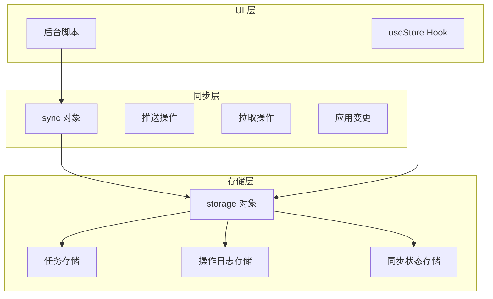
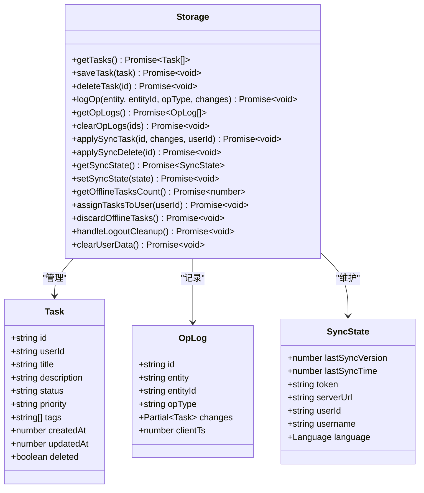
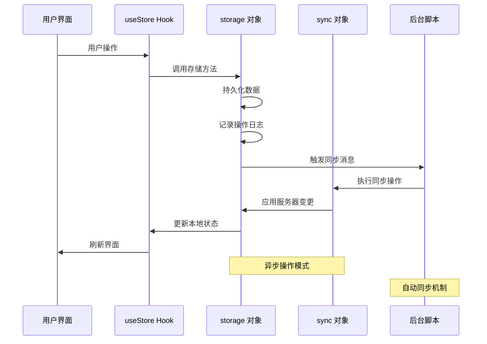
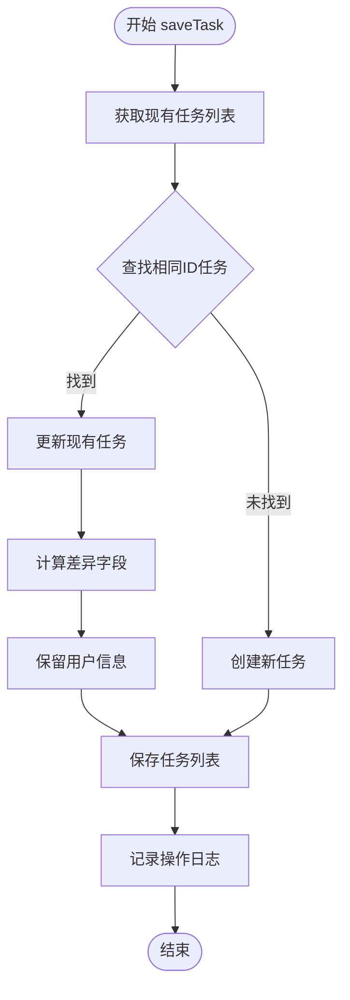
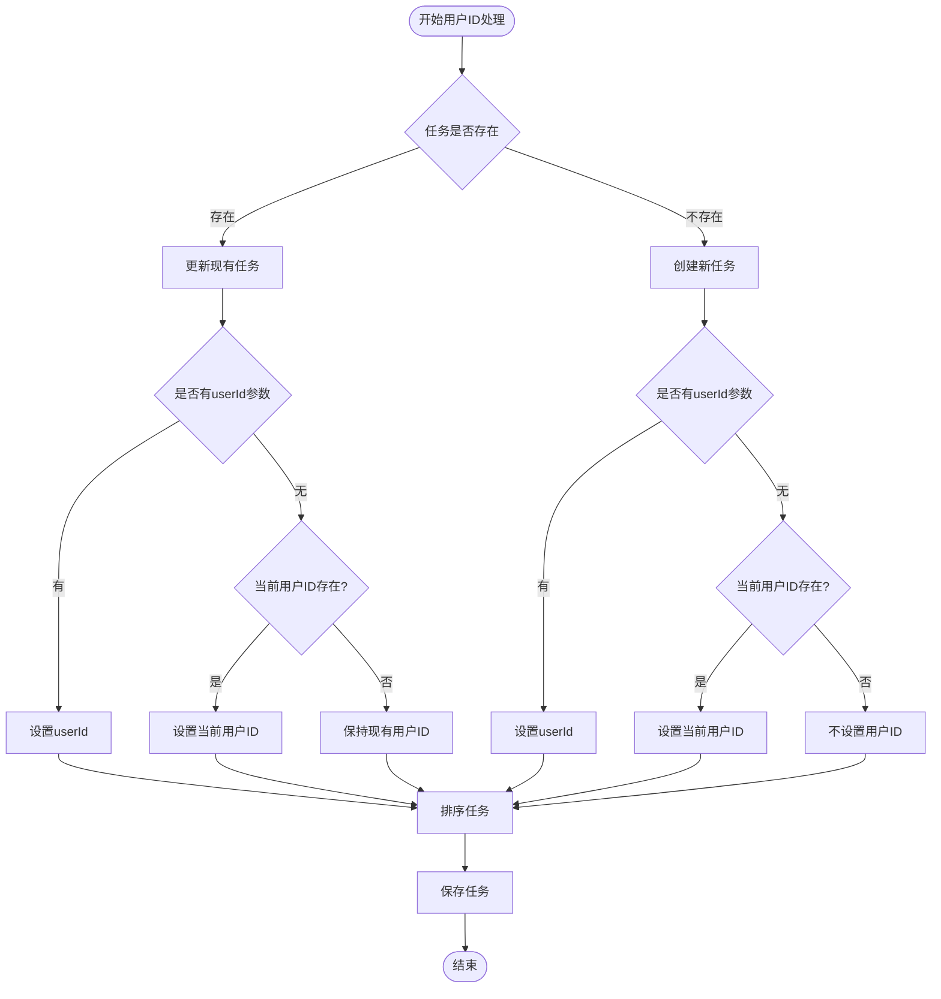
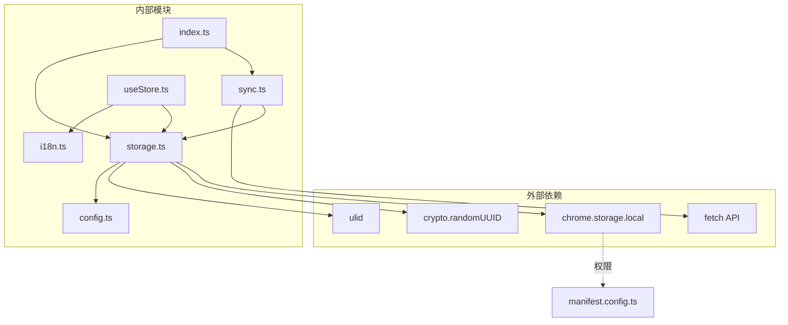

# 存储操作方法

<cite>
**本文档引用的文件**
- [storage.ts](file://src/lib/storage.ts)
- [sync.ts](file://src/lib/sync.ts)
- [useStore.ts](file://src/hooks/useStore.ts)
- [index.ts](file://src/background/index.ts)
- [config.ts](file://src/config.ts)
- [i18n.ts](file://src/lib/i18n.ts)
</cite>

## 目录
1. [简介](#简介)
2. [项目结构](#项目结构)
3. [核心组件](#核心组件)
4. [架构概览](#架构概览)
5. [详细组件分析](#详细组件分析)
6. [依赖关系分析](#依赖关系分析)
7. [性能考虑](#性能考虑)
8. [故障排除指南](#故障排除指南)
9. [结论](#结论)

## 简介

本文档详细记录了存储系统中的所有公共方法，包括任务管理、操作日志、同步状态管理等功能。该存储系统基于 Chrome Extension 的 `chrome.storage.local` API 构建，提供了完整的离线优先任务管理解决方案，支持云端同步、操作日志追踪和用户数据清理等功能。

## 项目结构

存储系统位于 `src/lib/storage.ts` 文件中，采用模块化设计，提供统一的存储接口。系统主要包含以下核心组件：

**图表来源**
- [storage.ts](file://src/lib/storage.ts#L49-L271)
- [sync.ts](file://src/lib/sync.ts#L5-L109)
- [useStore.ts](file://src/hooks/useStore.ts#L28-L192)

**章节来源**
- [storage.ts](file://src/lib/storage.ts#L1-L272)
- [sync.ts](file://src/lib/sync.ts#L1-L110)
- [useStore.ts](file://src/hooks/useStore.ts#L1-L193)

## 核心组件

存储系统的核心是 `storage` 对象，它封装了所有数据持久化操作。系统定义了三个核心数据模型：

### 数据模型

**图表来源**
- [storage.ts](file://src/lib/storage.ts#L4-L34)
- [storage.ts](file://src/lib/storage.ts#L49-L271)

### 主要方法分类

存储系统的方法可以分为以下几类：

1. **任务管理方法**：`getTasks`、`saveTask`、`deleteTask`
2. **操作日志方法**：`logOp`、`getOpLogs`、`clearOpLogs`
3. **同步操作方法**：`applySyncTask`、`applySyncDelete`、`getSyncState`、`setSyncState`
4. **用户数据管理方法**：`getOfflineTasksCount`、`assignTasksToUser`、`discardOfflineTasks`、`handleLogoutCleanup`、`clearUserData`

**章节来源**
- [storage.ts](file://src/lib/storage.ts#L4-L34)
- [storage.ts](file://src/lib/storage.ts#L49-L271)

## 架构概览

存储系统采用分层架构设计，确保数据的一致性和可靠性：

**图表来源**
- [useStore.ts](file://src/hooks/useStore.ts#L53-L191)
- [storage.ts](file://src/lib/storage.ts#L109-L127)
- [index.ts](file://src/background/index.ts#L10-L15)

## 详细组件分析

### 任务管理方法

#### getTasks 方法

**函数签名**: `async getTasks(): Promise<Task[]>`

**功能描述**: 获取所有任务数据

**参数**: 无

**返回值**: `Promise<Task[]>` - 返回任务数组

**异步操作模式**: 完全异步，使用 `chrome.storage.local.get()` 进行数据读取

**业务逻辑**:
1. 从本地存储中获取 `tasks` 键值
2. 如果不存在则返回空数组
3. 确保返回类型为 `Task[]`

**错误处理**: 使用类型断言确保返回值类型安全

**代码示例路径**: 
- [getTasks 实现](file://src/lib/storage.ts#L50-L53)

#### saveTask 方法

**函数签名**: `async saveTask(task: Task): Promise<void>`

**功能描述**: 保存任务数据并生成操作日志

**参数**:
- `task: Task` - 要保存的任务对象

**返回值**: `Promise<void>`

**异步操作模式**: 完全异步，包含多个异步操作

**业务逻辑**:
1. 获取现有任务列表
2. 查找是否存在相同ID的任务
3. 如果存在则标记为更新操作，否则为创建操作
4. 为更新操作计算差异字段
5. 更新任务列表
6. 调用 `logOp` 方法记录操作日志

**数据处理流程**:

**图表来源**
- [saveTask 实现](file://src/lib/storage.ts#L55-L95)

**错误处理**: 包含用户ID自动分配逻辑

**代码示例路径**:
- [saveTask 实现](file://src/lib/storage.ts#L55-L95)

#### deleteTask 方法

**函数签名**: `async deleteTask(id: string): Promise<void>`

**功能描述**: 删除指定ID的任务

**参数**:
- `id: string` - 任务ID

**返回值**: `Promise<void>`

**异步操作模式**: 完全异步

**业务逻辑**:
1. 获取任务列表
2. 查找目标任务
3. 设置删除标志和更新时间
4. 保存更新后的任务列表
5. 记录删除操作日志

**错误处理**: 如果任务不存在则直接返回

**代码示例路径**:
- [deleteTask 实现](file://src/lib/storage.ts#L97-L106)

### 操作日志方法

#### logOp 方法

**函数签名**: `async logOp(entity: 'task', entityId: string, opType: OpLog['opType'], changes: Partial<Task>): Promise<void>`

**功能描述**: 记录操作日志用于同步

**参数**:
- `entity: 'task'` - 实体类型
- `entityId: string` - 实体ID
- `opType: OpLog['opType']` - 操作类型（create/update/delete）
- `changes: Partial<Task>` - 变更内容

**返回值**: `Promise<void>`

**异步操作模式**: 完全异步

**业务逻辑**:
1. 获取现有操作日志
2. 创建新的操作日志条目
3. 添加唯一ID和客户端时间戳
4. 保存到本地存储
5. 发送同步触发消息给后台脚本

**错误处理**: 使用 `crypto.randomUUID()` 生成唯一ID

**代码示例路径**:
- [logOp 实现](file://src/lib/storage.ts#L109-L127)

#### getOpLogs 方法

**函数签名**: `async getOpLogs(): Promise<OpLog[]>`

**功能描述**: 获取所有操作日志

**参数**: 无

**返回值**: `Promise<OpLog[]>`

**异步操作模式**: 完全异步

**业务逻辑**: 从本地存储获取操作日志数据

**代码示例路径**:
- [getOpLogs 实现](file://src/lib/storage.ts#L129-L132)

#### clearOpLogs 方法

**函数签名**: `async clearOpLogs(ids: string[]): Promise<void>`

**功能描述**: 清除指定ID的操作日志

**参数**:
- `ids: string[]` - 要清除的日志ID数组

**返回值**: `Promise<void>`

**异步操作模式**: 完全异步

**业务逻辑**:
1. 获取现有操作日志
2. 过滤掉指定ID的日志
3. 保存剩余的日志

**代码示例路径**:
- [clearOpLogs 实现](file://src/lib/storage.ts#L134-L138)

### 同步操作方法

#### applySyncTask 方法

**函数签名**: `async applySyncTask(id: string, changes: Partial<Task>, userId?: string): Promise<void>`

**功能描述**: 应用服务器推送的任务变更

**参数**:
- `id: string` - 任务ID
- `changes: Partial<Task>` - 变更内容
- `userId?: string` - 用户ID（可选）

**返回值**: `Promise<void>`

**异步操作模式**: 完全异步

**业务逻辑**:
1. 获取现有任务列表
2. 查找目标任务
3. 如果存在则更新，否则创建新任务
4. 处理用户ID分配逻辑
5. 排序并保存任务

**用户ID处理策略**:

**图表来源**
- [applySyncTask 实现](file://src/lib/storage.ts#L141-L185)

**代码示例路径**:
- [applySyncTask 实现](file://src/lib/storage.ts#L141-L185)

#### applySyncDelete 方法

**函数签名**: `async applySyncDelete(id: string): Promise<void>`

**功能描述**: 应用服务器推送的删除操作

**参数**:
- `id: string` - 要删除的任务ID

**返回值**: `Promise<void>`

**异步操作模式**: 完全异步

**业务逻辑**: 查找并标记指定任务为删除状态

**代码示例路径**:
- [applySyncDelete 实现](file://src/lib/storage.ts#L187-L194)

#### getSyncState 方法

**函数签名**: `async getSyncState(): Promise<SyncState>`

**功能描述**: 获取同步状态

**参数**: 无

**返回值**: `Promise<SyncState>`

**异步操作模式**: 完全异步

**业务逻辑**: 合并默认同步状态和存储中的状态

**代码示例路径**:
- [getSyncState 实现](file://src/lib/storage.ts#L196-L199)

#### setSyncState 方法

**函数签名**: `async setSyncState(state: Partial<SyncState>): Promise<void>`

**功能描述**: 设置同步状态

**参数**:
- `state: Partial<SyncState>` - 部分同步状态

**返回值**: `Promise<void>`

**异步操作模式**: 完全异步

**业务逻辑**: 合并当前状态和新状态并保存

**代码示例路径**:
- [setSyncState 实现](file://src/lib/storage.ts#L201-L204)

### 用户数据管理方法

#### getOfflineTasksCount 方法

**函数签名**: `async getOfflineTasksCount(): Promise<number>`

**功能描述**: 获取离线任务数量

**参数**: 无

**返回值**: `Promise<number>`

**异步操作模式**: 完全异步

**业务逻辑**: 统计没有用户ID的任务数量

**代码示例路径**:
- [getOfflineTasksCount 实现](file://src/lib/storage.ts#L206-L210)

#### assignTasksToUser 方法

**函数签名**: `async assignTasksToUser(userId: string): Promise<void>`

**功能描述**: 将离线任务分配给用户

**参数**:
- `userId: string` - 用户ID

**返回值**: `Promise<void>`

**异步操作模式**: 完全异步

**业务逻辑**:
1. 获取所有任务
2. 为没有用户ID的任务设置用户ID
3. 保存更新后的任务列表

**代码示例路径**:
- [assignTasksToUser 实现](file://src/lib/storage.ts#L212-L228)

#### discardOfflineTasks 方法

**函数签名**: `async discardOfflineTasks(): Promise<void>`

**功能描述**: 丢弃离线任务

**参数**: 无

**返回值**: `Promise<void>`

**异步操作模式**: 完全异步

**业务逻辑**:
1. 保留有用户ID的任务
2. 清除操作日志
3. 保存结果

**代码示例路径**:
- [discardOfflineTasks 实现](file://src/lib/storage.ts#L230-L242)

#### handleLogoutCleanup 方法

**函数签名**: `async handleLogoutCleanup(): Promise<void>`

**功能描述**: 处理用户登出清理

**参数**: 无

**返回值**: `Promise<void>`

**异步操作模式**: 完全异步

**业务逻辑**: 调用 `clearUserData` 方法执行完全清理

**代码示例路径**:
- [handleLogoutCleanup 实现](file://src/lib/storage.ts#L244-L248)

#### clearUserData 方法

**函数签名**: `async clearUserData(): Promise<void>`

**功能描述**: 清除用户数据

**参数**: 无

**返回值**: `Promise<void>`

**异步操作模式**: 完全异步

**业务逻辑**:
1. 保存服务器URL和语言设置
2. 清除任务、操作日志和同步状态
3. 恢复服务器URL和语言设置

**代码示例路径**:
- [clearUserData 实现](file://src/lib/storage.ts#L250-L265)

## 依赖关系分析

存储系统与其他组件的依赖关系如下：

**图表来源**
- [storage.ts](file://src/lib/storage.ts#L1-L272)
- [sync.ts](file://src/lib/sync.ts#L1-L110)
- [useStore.ts](file://src/hooks/useStore.ts#L1-L193)
- [index.ts](file://src/background/index.ts#L1-L114)
- [config.ts](file://src/config.ts#L1-L2)
- [i18n.ts](file://src/lib/i18n.ts#L1-L146)

**章节来源**
- [storage.ts](file://src/lib/storage.ts#L1-L272)
- [sync.ts](file://src/lib/sync.ts#L1-L110)
- [useStore.ts](file://src/hooks/useStore.ts#L1-L193)
- [index.ts](file://src/background/index.ts#L1-L114)

## 性能考虑

### 存储优化策略

1. **批量操作**: 所有方法都使用异步操作，避免阻塞主线程
2. **增量更新**: `saveTask` 方法只记录必要的变更字段
3. **内存管理**: 使用 `chrome.storage.local` 进行高效的数据存储
4. **缓存策略**: UI 层使用 Zustand 状态管理，减少不必要的重新渲染

### 同步优化

1. **定时同步**: 后台脚本每5分钟自动触发同步
2. **手动触发**: 支持用户手动触发同步操作
3. **条件同步**: 只在有令牌和服务器URL时执行同步

### 最佳实践建议

1. **错误处理**: 所有异步操作都应该包含适当的错误处理
2. **数据一致性**: 使用操作日志确保数据同步的一致性
3. **性能监控**: 监控存储操作的性能指标
4. **内存使用**: 定期清理不需要的数据以控制内存使用

## 故障排除指南

### 常见问题及解决方案

#### 同步失败

**症状**: 同步操作抛出异常

**原因**: 网络连接问题或服务器响应错误

**解决方案**: 
1. 检查网络连接状态
2. 验证服务器URL配置
3. 确认认证令牌有效性

#### 数据丢失

**症状**: 任务数据不一致或丢失

**原因**: 操作日志未正确记录或同步中断

**解决方案**:
1. 检查 `logOp` 方法的执行情况
2. 验证操作日志的完整性
3. 手动触发同步操作

#### 用户数据清理问题

**症状**: 登出后仍有数据残留

**原因**: `clearUserData` 方法执行不完整

**解决方案**:
1. 确认 `clearUserData` 方法的执行
2. 检查存储权限设置
3. 验证清理逻辑的完整性

**章节来源**
- [sync.ts](file://src/lib/sync.ts#L49-L82)
- [storage.ts](file://src/lib/storage.ts#L250-L265)

## 结论

存储系统提供了完整的任务管理解决方案，具有以下特点：

1. **完整的功能覆盖**: 包含任务管理、操作日志、同步状态管理等核心功能
2. **可靠的异步操作**: 所有操作都是异步的，确保用户体验
3. **数据一致性保证**: 通过操作日志和同步机制确保数据一致性
4. **用户友好**: 提供清晰的API接口和错误处理机制
5. **扩展性强**: 模块化设计便于功能扩展和维护

该系统为 Chrome Extension 提供了强大的离线优先任务管理能力，支持云端同步和多用户场景，是构建可靠任务管理应用的理想选择。