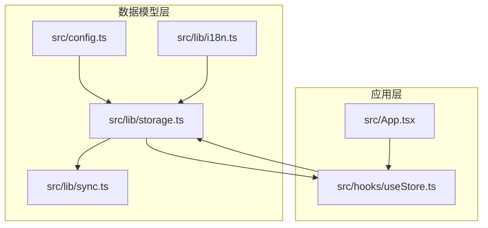
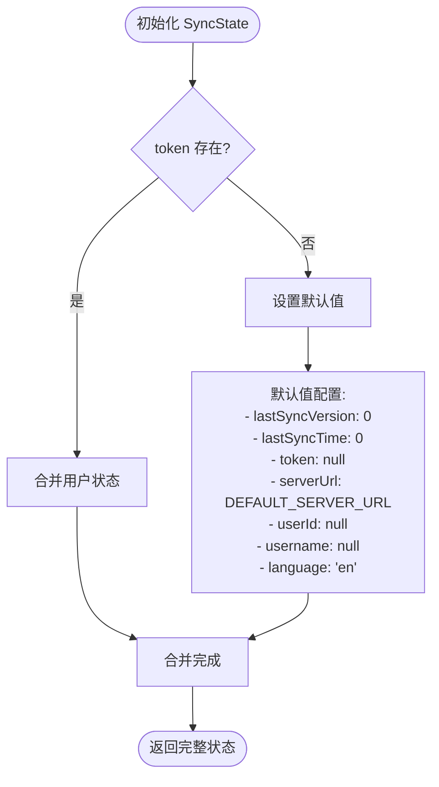
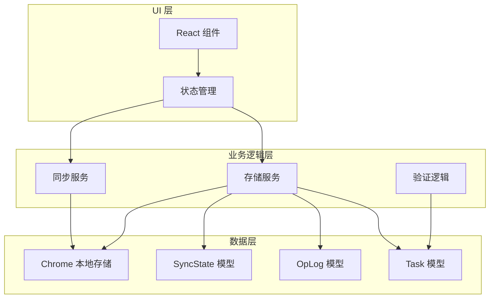
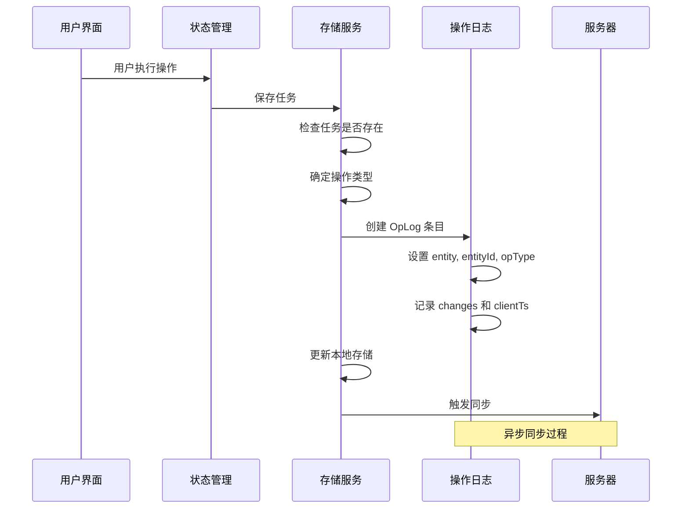
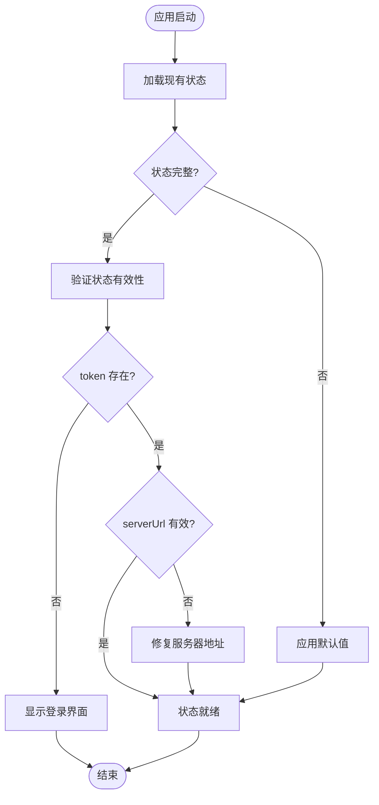
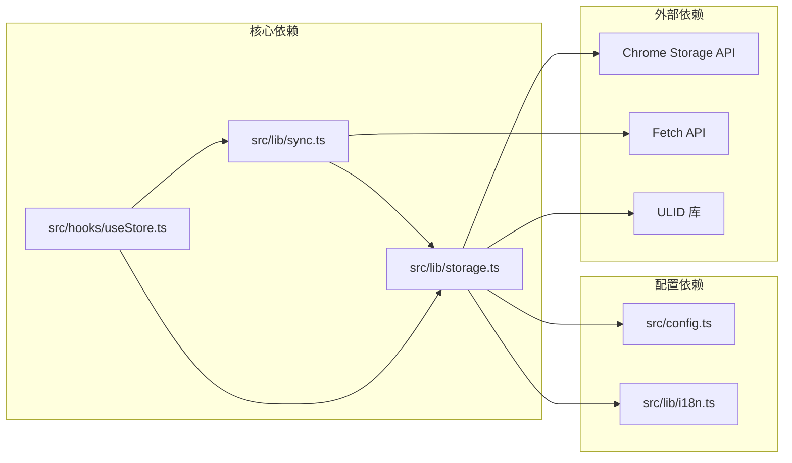

# 数据模型定义

<cite>
**本文档引用的文件**
- [storage.ts](file://src/lib/storage.ts)
- [sync.ts](file://src/lib/sync.ts)
- [useStore.ts](file://src/hooks/useStore.ts)
- [config.ts](file://src/config.ts)
- [i18n.ts](file://src/lib/i18n.ts)
</cite>

## 目录
1. [简介](#简介)
2. [项目结构](#项目结构)
3. [核心数据模型](#核心数据模型)
4. [架构概览](#架构概览)
5. [详细组件分析](#详细组件分析)
6. [依赖关系分析](#依赖关系分析)
7. [性能考虑](#性能考虑)
8. [故障排除指南](#故障排除指南)
9. [结论](#结论)

## 简介

本文件详细说明了 QKnot 扩展程序中的数据模型定义，包括 Task 接口、OpLog 操作日志和 SyncState 同步状态的数据结构。这些数据模型构成了应用程序的核心数据层，支持离线优先的设计模式和云端同步功能。

## 项目结构

数据模型主要位于 `src/lib/storage.ts` 文件中，该文件定义了三个核心接口以及相关的存储和同步逻辑：



**图表来源**
- [storage.ts](file://src/lib/storage.ts#L1-L50)
- [sync.ts](file://src/lib/sync.ts#L1-L20)
- [useStore.ts](file://src/hooks/useStore.ts#L1-L30)

**章节来源**
- [storage.ts](file://src/lib/storage.ts#L1-L50)
- [config.ts](file://src/config.ts#L1-L2)
- [i18n.ts](file://src/lib/i18n.ts#L1-L10)

## 核心数据模型

### Task 接口定义

Task 接口是应用程序中最核心的数据模型，用于表示用户任务信息。

#### 字段定义

| 字段名 | 类型 | 必填 | 默认值 | 描述 |
|--------|------|------|--------|------|
| id | string | 是 | - | 任务唯一标识符，使用 ULID 生成 |
| userId | string \| null | 否 | null | 用户标识符，用于数据所有权验证 |
| title | string | 是 | - | 任务标题，必填字段 |
| description | string | 否 | undefined | 任务描述内容 |
| status | 'todo' \| 'done' \| 'archived' | 是 | 'todo' | 任务状态枚举值 |
| priority | 'none' \| 'low' \| 'medium' \| 'high' | 是 | 'none' | 任务优先级枚举值 |
| tags | string[] | 是 | [] | 任务标签数组 |
| createdAt | number | 是 | Date.now() | 创建时间戳（毫秒） |
| updatedAt | number | 是 | Date.now() | 最后更新时间戳（毫秒） |
| deleted | boolean | 否 | undefined | 删除标记，用于软删除 |

#### 状态枚举值说明

**状态枚举值**：
- `todo`: 待处理状态，任务尚未开始或未完成
- `done`: 已完成状态，任务已完成
- `archived`: 已归档状态，任务被归档但不删除

**使用场景**：
- `todo`: 新创建的任务，默认状态
- `done`: 用户完成任务时的状态
- `archived`: 需要长期保存但不再活跃的任务

#### 优先级枚举值说明

**优先级枚举值**：
- `none`: 无优先级，普通任务
- `low`: 低优先级，不紧急的任务
- `medium`: 中等优先级，一般重要程度的任务
- `high`: 高优先级，紧急且重要的任务

**使用场景**：
- `none`: 日常常规任务
- `low`: 可随时处理的小任务
- `medium`: 需要在合理时间内完成的任务
- `high`: 紧急截止日期的重要任务

#### 字段验证规则

1. **必需字段验证**：
   - `id`: 必须存在且唯一
   - `title`: 必须为非空字符串
   - `status`: 必须为预定义枚举值之一
   - `priority`: 必须为预定义枚举值之一
   - `tags`: 必须为字符串数组

2. **时间戳验证**：
   - `createdAt` 和 `updatedAt`: 必须为正数时间戳
   - `createdAt` 应早于或等于 `updatedAt`

3. **数据完整性验证**：
   - `userId`: 如果存在，必须与当前用户匹配
   - `tags`: 数组元素必须为非空字符串

**章节来源**
- [storage.ts](file://src/lib/storage.ts#L4-L15)
- [useStore.ts](file://src/hooks/useStore.ts#L85-L94)

### OpLog 操作日志模型

OpLog 接口用于记录所有数据变更操作，支持离线同步和冲突解决。

#### 字段定义

| 字段名 | 类型 | 必填 | 默认值 | 描述 |
|--------|------|------|--------|------|
| id | string | 是 | - | 日志唯一标识符，使用 UUID 生成 |
| entity | 'task' | 是 | 'task' | 操作影响的实体类型 |
| entityId | string | 是 | - | 被操作实体的 ID |
| opType | 'create' \| 'update' \| 'delete' | 是 | - | 操作类型枚举值 |
| changes | Partial<Task> | 是 | {} | 实际变更的数据内容 |
| clientTs | number | 是 | Date.now() | 客户端时间戳（毫秒） |

#### 操作类型说明

**操作类型枚举值**：
- `create`: 创建新实体的操作
- `update`: 更新现有实体的操作
- `delete`: 删除实体的操作

**章节来源**
- [storage.ts](file://src/lib/storage.ts#L17-L24)

### SyncState 同步状态模型

SyncState 接口用于跟踪同步状态和用户配置信息。

#### 字段定义

| 字段名 | 类型 | 必填 | 默认值 | 描述 |
|--------|------|------|--------|------|
| lastSyncVersion | number | 是 | 0 | 上次同步的版本号 |
| lastSyncTime | number | 是 | 0 | 上次同步的时间戳 |
| token | string \| null | 是 | null | 认证令牌 |
| serverUrl | string | 是 | DEFAULT_SERVER_URL | 服务器地址 |
| userId | string \| null | 是 | null | 当前用户 ID |
| username | string \| null | 是 | null | 当前用户名 |
| language | Language | 是 | 'en' | 应用语言设置 |

#### 默认值设置

系统提供了完整的默认值配置：



**图表来源**
- [storage.ts](file://src/lib/storage.ts#L38-L46)

**章节来源**
- [storage.ts](file://src/lib/storage.ts#L26-L34)
- [storage.ts](file://src/lib/storage.ts#L38-L46)
- [config.ts](file://src/config.ts#L1-L2)
- [i18n.ts](file://src/lib/i18n.ts#L1-L1)

## 架构概览

数据模型在整个应用程序中的架构位置如下：



**图表来源**
- [storage.ts](file://src/lib/storage.ts#L49-L138)
- [sync.ts](file://src/lib/sync.ts#L5-L79)
- [useStore.ts](file://src/hooks/useStore.ts#L28-L192)

## 详细组件分析

### Task 数据模型类图

```mermaid
classDiagram
class Task {
+string id
+string userId
+string title
+string description
+string status
+string priority
+string[] tags
+number createdAt
+number updatedAt
+boolean deleted
}
class StatusEnum {
<<enumeration>>
"todo"
"done"
"archived"
}
class PriorityEnum {
<<enumeration>>
"none"
"low"
"medium"
"high"
}
class TaskValidator {
+validateTask(task : Task) boolean
+validateStatus(status : string) boolean
+validatePriority(priority : string) boolean
+validateTimestamps(task : Task) boolean
}
Task --> StatusEnum : "使用"
Task --> PriorityEnum : "使用"
TaskValidator --> Task : "验证"
TaskValidator --> StatusEnum : "验证"
TaskValidator --> PriorityEnum : "验证"
```

**图表来源**
- [storage.ts](file://src/lib/storage.ts#L4-L15)
- [useStore.ts](file://src/hooks/useStore.ts#L85-L94)

### OpLog 数据模型序列图



**图表来源**
- [storage.ts](file://src/lib/storage.ts#L55-L95)
- [storage.ts](file://src/lib/storage.ts#L109-L127)

### SyncState 数据模型流程图



**图表来源**
- [storage.ts](file://src/lib/storage.ts#L196-L204)
- [storage.ts](file://src/lib/storage.ts#L38-L46)

**章节来源**
- [storage.ts](file://src/lib/storage.ts#L196-L204)
- [storage.ts](file://src/lib/storage.ts#L38-L46)

## 依赖关系分析

数据模型之间的依赖关系如下：



**图表来源**
- [storage.ts](file://src/lib/storage.ts#L1-L2)
- [sync.ts](file://src/lib/sync.ts#L1-L3)
- [useStore.ts](file://src/hooks/useStore.ts#L1-L6)

**章节来源**
- [storage.ts](file://src/lib/storage.ts#L1-L2)
- [sync.ts](file://src/lib/sync.ts#L1-L3)
- [useStore.ts](file://src/hooks/useStore.ts#L1-L6)

## 性能考虑

### 存储优化策略

1. **增量同步**：通过 OpLog 实现增量同步，避免全量数据传输
2. **本地缓存**：使用 Chrome 本地存储减少网络请求
3. **批量操作**：支持批量任务操作提高效率
4. **懒加载**：按需加载任务数据，减少内存占用

### 同步性能优化

1. **背压控制**：限制同时进行的同步操作数量
2. **冲突检测**：通过时间戳和版本号检测数据冲突
3. **增量更新**：只传输变更的数据而非完整对象
4. **重试机制**：网络失败时自动重试同步操作

## 故障排除指南

### 常见问题及解决方案

**问题 1：任务状态异常**
- 症状：任务状态显示错误或无法切换
- 解决方案：检查状态枚举值是否正确，确认状态转换逻辑

**问题 2：同步失败**
- 症状：数据不同步或同步中断
- 解决方案：检查网络连接、认证令牌和服务器地址配置

**问题 3：数据丢失**
- 症状：任务数据意外消失
- 解决方案：检查本地存储权限和清理策略

**问题 4：性能问题**
- 症状：应用响应缓慢或内存占用过高
- 解决方案：优化查询条件、实现分页加载和清理无用数据

**章节来源**
- [storage.ts](file://src/lib/storage.ts#L244-L271)
- [sync.ts](file://src/lib/sync.ts#L49-L52)

## 结论

本文档详细介绍了 QKnot 扩展程序中的三个核心数据模型：Task、OpLog 和 SyncState。这些模型共同构成了应用程序的数据层基础，支持离线优先的设计理念和云端同步功能。

关键特性包括：
- **类型安全**：使用 TypeScript 枚举确保数据完整性
- **离线支持**：通过 OpLog 实现完整的离线操作记录
- **同步机制**：支持双向同步和冲突解决
- **扩展性**：模块化设计便于功能扩展

建议在实际使用中：
1. 严格遵循字段验证规则
2. 正确处理状态枚举值
3. 及时清理过期数据
4. 监控同步状态和性能指标