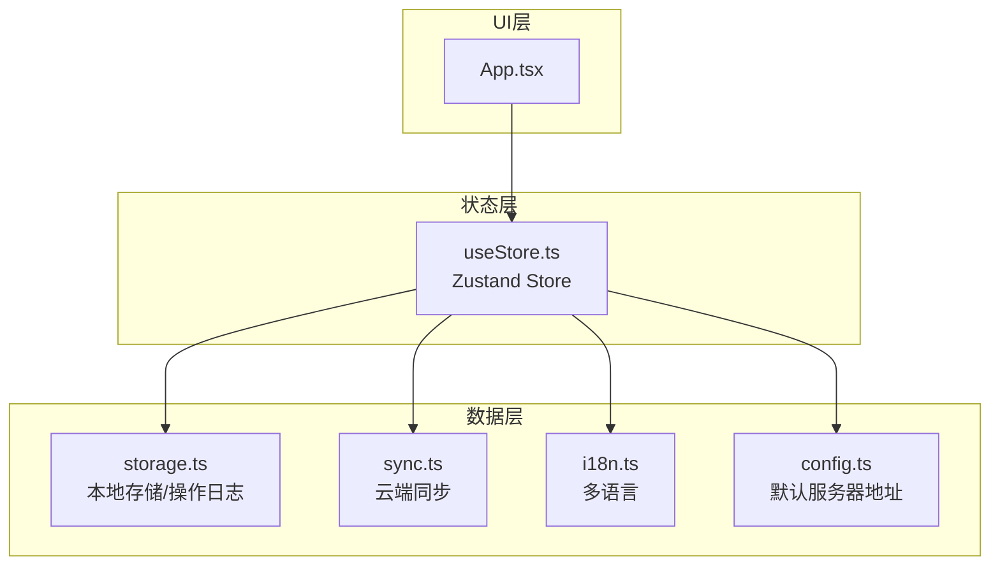
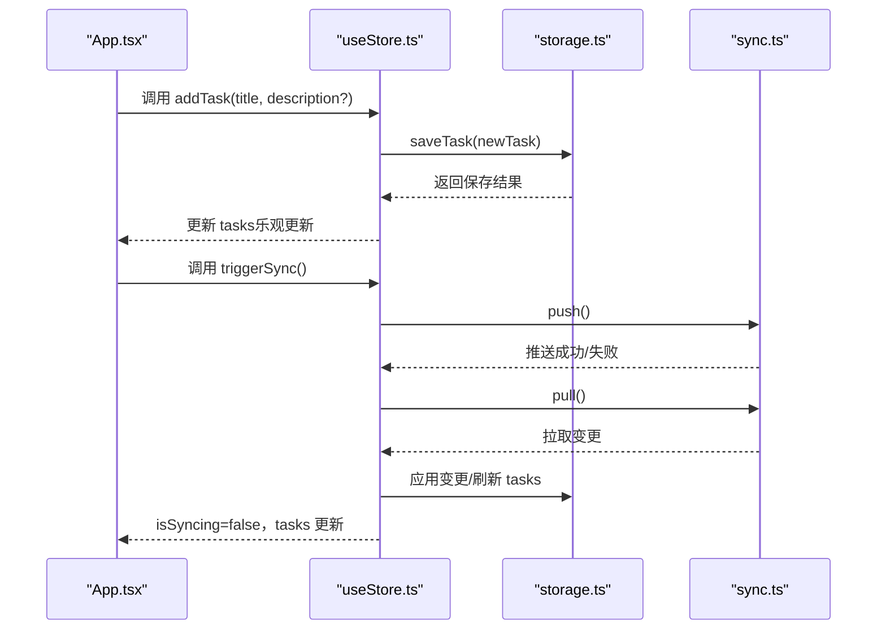
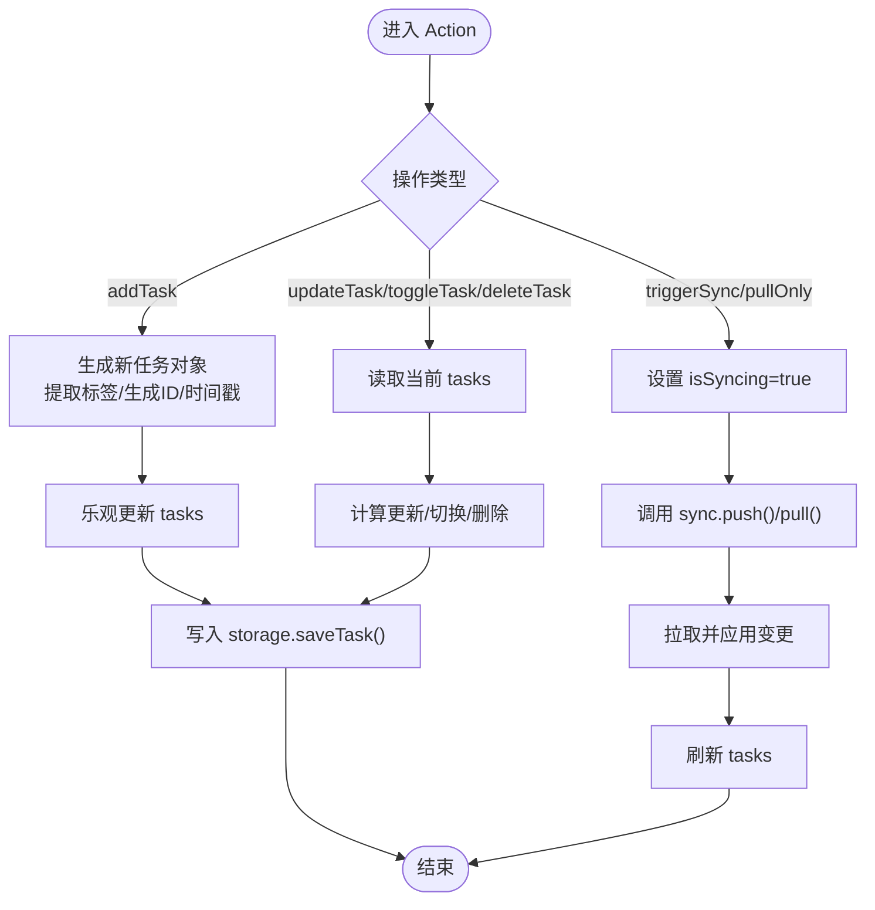
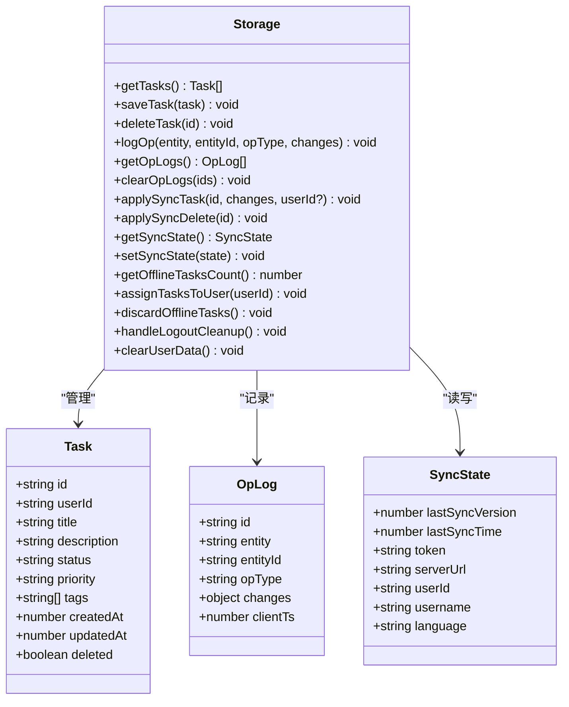
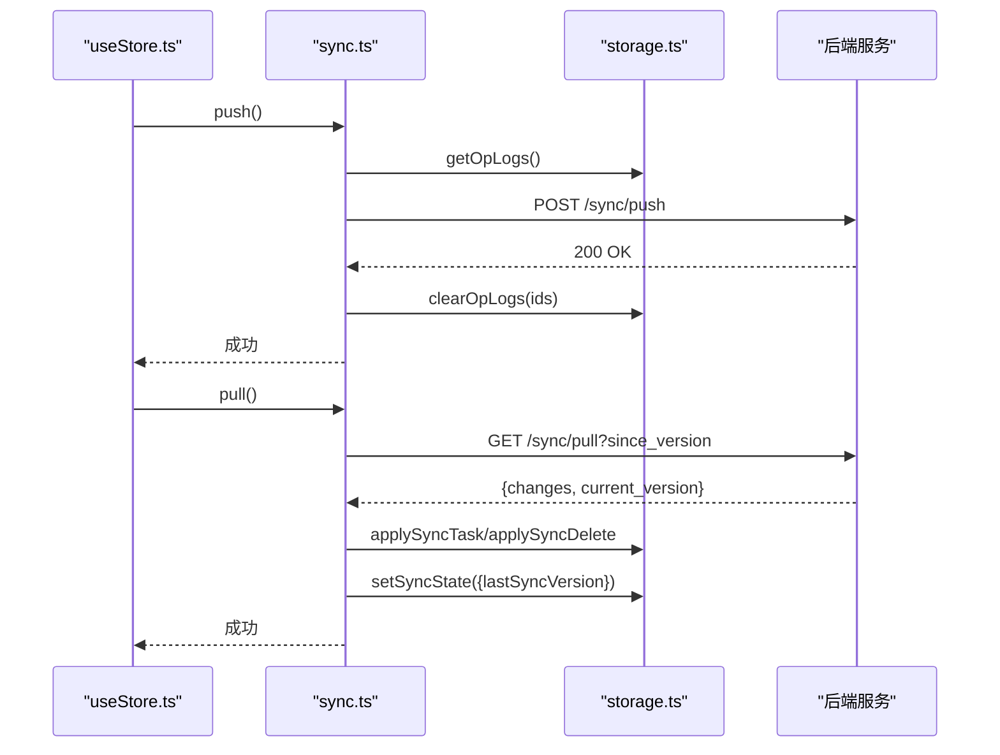
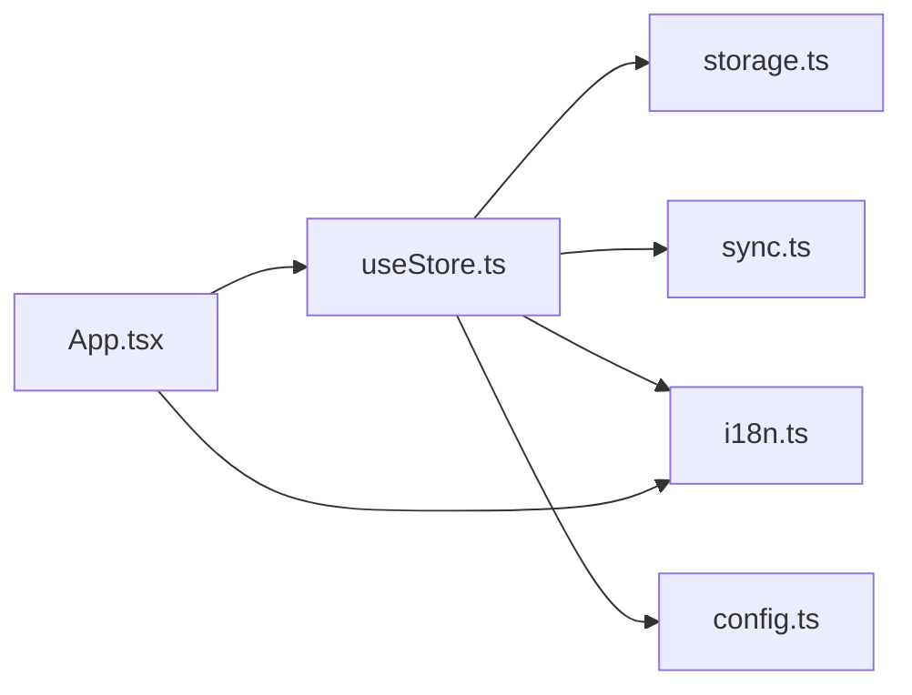

# 状态管理API

<cite>
**本文引用的文件**
- [useStore.ts](file://src/hooks/useStore.ts)
- [storage.ts](file://src/lib/storage.ts)
- [sync.ts](file://src/lib/sync.ts)
- [i18n.ts](file://src/lib/i18n.ts)
- [config.ts](file://src/config.ts)
- [App.tsx](file://src/App.tsx)
- [main.tsx](file://src/main.tsx)
- [package.json](file://package.json)
</cite>

## 目录
1. [简介](#简介)
2. [项目结构](#项目结构)
3. [核心组件](#核心组件)
4. [架构总览](#架构总览)
5. [详细组件分析](#详细组件分析)
6. [依赖分析](#依赖分析)
7. [性能考虑](#性能考虑)
8. [故障排查指南](#故障排查指南)
9. [结论](#结论)
10. [附录](#附录)

## 简介
本文件系统性梳理了基于 Zustand 的状态管理API设计与实现，涵盖 Store 状态定义、Action 操作方法、Selector 使用方式、状态订阅与组件重渲染优化、状态持久化策略、跨组件状态共享以及异步状态更新处理。文档同时提供最佳实践、性能优化技巧与调试方法，并通过实际使用示例展示如何在 React 组件中正确调用这些 API。

## 项目结构
本项目采用“按职责分层”的组织方式：
- hooks 层：集中定义 Zustand Store（useStore）
- lib 层：封装存储(storage)、同步(sync)、国际化(i18n)与配置(config)
- ui 层：App.tsx 作为根组件，负责状态消费与交互
- 构建入口：main.tsx 渲染应用

图表来源
- [useStore.ts](file://src/hooks/useStore.ts#L1-L193)
- [storage.ts](file://src/lib/storage.ts#L1-L272)
- [sync.ts](file://src/lib/sync.ts#L1-L110)
- [i18n.ts](file://src/lib/i18n.ts#L1-L146)
- [config.ts](file://src/config.ts#L1-L2)
- [App.tsx](file://src/App.tsx#L1-L860)

章节来源
- [useStore.ts](file://src/hooks/useStore.ts#L1-L193)
- [storage.ts](file://src/lib/storage.ts#L1-L272)
- [sync.ts](file://src/lib/sync.ts#L1-L110)
- [i18n.ts](file://src/lib/i18n.ts#L1-L146)
- [config.ts](file://src/config.ts#L1-L2)
- [App.tsx](file://src/App.tsx#L1-L860)
- [main.tsx](file://src/main.tsx#L1-L11)

## 核心组件
本节聚焦于 Zustand Store 的状态结构与 Action 定义，明确每个状态域与操作方法的作用范围与副作用。

- 状态域
  - tasks：任务列表，过滤掉已删除项；登录后仅显示当前用户任务
  - syncState：同步状态，包含 token、serverUrl、userId、username、language 等
  - isLoading：初始加载状态
  - isSyncing：手动/自动同步进行中的状态
- Action 方法
  - 任务 CRUD：loadTasks、addTask、updateTask、toggleTask、deleteTask
  - 同步控制：triggerSync、pullOnly
  - 设置与清理：updateSettings、handleLogoutCleanup、clearUserData
  - 国际化：setLanguage、t（翻译函数）

章节来源
- [useStore.ts](file://src/hooks/useStore.ts#L8-L26)
- [useStore.ts](file://src/hooks/useStore.ts#L28-L192)

## 架构总览
Zustand Store 通过 create 创建，内部组合 storage 与 sync 以实现本地持久化与云端同步。App.tsx 作为消费者，直接从 Store 中解构所需状态与 Action，实现最小化订阅与高效渲染。

图表来源
- [useStore.ts](file://src/hooks/useStore.ts#L77-L100)
- [useStore.ts](file://src/hooks/useStore.ts#L167-L179)
- [storage.ts](file://src/lib/storage.ts#L55-L95)
- [sync.ts](file://src/lib/sync.ts#L6-L53)

## 详细组件分析

### Zustand Store（useStore.ts）
- 设计原则
  - 单一职责：集中管理任务、同步状态与国际化
  - 乐观更新：UI 立即响应，异步写入存储，避免等待
  - 异步 Action：所有写入均返回 Promise，便于 UI 层统一处理
  - 过滤可见任务：根据登录态与用户归属过滤显示
- 关键实现要点
  - 任务增删改查：基于内存数组映射与存储写入
  - 同步流程：push 与 pull 双向同步，最终刷新本地任务
  - 语言切换：更新 syncState 并即时生效
  - 翻译函数：根据当前语言包动态替换占位符

图表来源
- [useStore.ts](file://src/hooks/useStore.ts#L77-L100)
- [useStore.ts](file://src/hooks/useStore.ts#L102-L140)
- [useStore.ts](file://src/hooks/useStore.ts#L142-L146)
- [useStore.ts](file://src/hooks/useStore.ts#L167-L179)
- [useStore.ts](file://src/hooks/useStore.ts#L181-L191)

章节来源
- [useStore.ts](file://src/hooks/useStore.ts#L28-L192)

### 存储模块（storage.ts）
- 数据模型
  - Task：任务实体，含 id、userId、title、description、status、priority、tags、createdAt、updatedAt、deleted
  - OpLog：操作日志，记录实体、变更类型与变更内容
  - SyncState：同步状态，包含 token、serverUrl、userId、username、language
- 核心能力
  - 任务持久化：保存/删除任务并记录 OpLog
  - 同步应用：applySyncTask/applySyncDelete 将服务端变更落库
  - 用户数据清理：clearUserData 保留 serverUrl 与 language，其余清空
  - 登出清理：handleLogoutCleanup 清理用户数据
  - 离线任务处理：assignTasksToUser、discardOfflineTasks
- 默认值与常量
  - DEFAULT_SYNC_STATE：初始化默认同步状态
  - DEFAULT_SERVER_URL：来自 config.ts 的默认服务器地址

图表来源
- [storage.ts](file://src/lib/storage.ts#L4-L15)
- [storage.ts](file://src/lib/storage.ts#L17-L24)
- [storage.ts](file://src/lib/storage.ts#L26-L34)
- [storage.ts](file://src/lib/storage.ts#L49-L271)

章节来源
- [storage.ts](file://src/lib/storage.ts#L1-L272)
- [config.ts](file://src/config.ts#L1-L2)

### 同步模块（sync.ts）
- 功能概述
  - push：上传 OpLog 列表至服务端，成功后清理已推送日志
  - pull：从服务端拉取变更与当前版本号，应用变更并更新 lastSyncVersion
  - applyChanges：根据 OpLog 类型调用 storage.applySyncTask 或 applySyncDelete
  - getClientId：为客户端生成唯一标识
- 错误处理
  - 对网络请求失败进行捕获与抛出，供上层 UI 处理

图表来源
- [sync.ts](file://src/lib/sync.ts#L6-L53)
- [sync.ts](file://src/lib/sync.ts#L55-L83)
- [sync.ts](file://src/lib/sync.ts#L85-L99)

章节来源
- [sync.ts](file://src/lib/sync.ts#L1-L110)

### 国际化模块（i18n.ts）
- 支持语言：英语(en)、简体中文(zh-CN)、繁体中文(zh-TW)
- 翻译函数 t：根据当前语言包查找键值，支持参数插值
- 语言选择：通过 setLanguage 更新 syncState.language 并立即生效

章节来源
- [i18n.ts](file://src/lib/i18n.ts#L1-L146)
- [useStore.ts](file://src/hooks/useStore.ts#L34-L51)

### UI 使用示例（App.tsx）
- 初始化加载：首次渲染时调用 loadTasks，并在存在 token 时触发自动同步
- 任务操作：通过 addTask、updateTask、toggleTask、deleteTask 更新状态
- 同步控制：triggerSync 手动触发双向同步，pullOnly 仅拉取
- 设置与清理：updateSettings、handleLogoutCleanup、clearUserData
- 语言切换：setLanguage 切换语言并持久化

章节来源
- [App.tsx](file://src/App.tsx#L35-L46)
- [App.tsx](file://src/App.tsx#L11-L12)
- [App.tsx](file://src/App.tsx#L62-L72)

## 依赖分析
- 外部依赖
  - zustand：状态管理核心
  - ulid：生成任务唯一 ID
  - sonner：通知提示
  - lucide-react：图标库
- 内部依赖
  - useStore.ts 依赖 storage.ts、sync.ts、i18n.ts、config.ts
  - App.tsx 依赖 useStore.ts 与 i18n.ts

图表来源
- [useStore.ts](file://src/hooks/useStore.ts#L1-L7)
- [App.tsx](file://src/App.tsx#L1-L10)
- [package.json](file://package.json#L12-L24)

章节来源
- [package.json](file://package.json#L12-L24)
- [useStore.ts](file://src/hooks/useStore.ts#L1-L7)
- [App.tsx](file://src/App.tsx#L1-L10)

## 性能考虑
- 乐观更新
  - 在写入存储前先更新 UI，减少感知延迟
  - 若存储写入失败，可通过回滚或重试策略恢复一致性
- 最小化订阅
  - 仅从 Store 解构需要的状态与 Action，避免不必要的重渲染
  - 避免在组件内直接访问全局 Store 实例，优先使用解构
- 任务过滤
  - loadTasks 中对 deleted 任务与非当前用户任务进行过滤，降低渲染负担
- 同步节流
  - isSyncing 标志用于防止并发同步与重复触发
- 本地存储
  - 使用 chrome.storage.local 进行持久化，注意批量写入与日志清理

章节来源
- [useStore.ts](file://src/hooks/useStore.ts#L53-L75)
- [useStore.ts](file://src/hooks/useStore.ts#L77-L100)
- [useStore.ts](file://src/hooks/useStore.ts#L167-L179)

## 故障排查指南
- 同步失败
  - 检查 token 与 serverUrl 是否有效
  - 查看 push/pull 请求返回状态，确认服务端可达
  - 清理 OpLog 并重试
- 任务未显示
  - 确认是否处于登录态，登录后仅显示当前用户任务
  - 检查 deleted 字段与过滤逻辑
- 语言不生效
  - setLanguage 会更新 syncState.language 并立即生效
  - 确认翻译键是否存在，必要时回退到英文键名
- 登出数据残留
  - 使用 handleLogoutCleanup 或 clearUserData 确保清理
  - 注意保留 serverUrl 与 language

章节来源
- [useStore.ts](file://src/hooks/useStore.ts#L148-L165)
- [storage.ts](file://src/lib/storage.ts#L244-L265)
- [i18n.ts](file://src/lib/i18n.ts#L3-L139)

## 结论
本项目以 Zustand 为核心构建了清晰、可维护的状态管理方案：Store 聚合任务、同步与国际化；storage 提供本地持久化与操作日志；sync 实现云端双向同步；App 作为消费者以最小订阅实现高效渲染。通过乐观更新、过滤可见任务、同步节流与完善的清理策略，系统在保证用户体验的同时兼顾了性能与可靠性。

## 附录

### 状态结构说明
- tasks
  - 类型：Task[]
  - 用途：存储任务列表，过滤 deleted 与非当前用户任务
  - 可见性：登录后仅显示当前用户任务
- syncState
  - 类型：SyncState
  - 用途：记录登录态与语言等同步信息
  - 关键字段：token、serverUrl、userId、username、language
- isLoading
  - 类型：boolean
  - 用途：初始加载状态指示
- isSyncing
  - 类型：boolean
  - 用途：同步进行中状态指示

章节来源
- [useStore.ts](file://src/hooks/useStore.ts#L8-L12)
- [storage.ts](file://src/lib/storage.ts#L26-L34)

### Action 函数一览
- 任务相关
  - loadTasks：加载并过滤任务
  - addTask：新增任务（乐观更新）
  - updateTask：更新任务（乐观更新）
  - toggleTask：切换任务完成状态（乐观更新）
  - deleteTask：删除任务（乐观更新）
- 同步相关
  - triggerSync：手动双向同步
  - pullOnly：仅拉取云端变更
- 设置与清理
  - updateSettings：更新同步设置
  - handleLogoutCleanup：登出清理
  - clearUserData：清除用户数据
- 国际化
  - setLanguage：切换语言
  - t：翻译函数

章节来源
- [useStore.ts](file://src/hooks/useStore.ts#L14-L25)

### Selector 使用方式与组件重渲染优化
- 仅解构所需字段，避免订阅无关状态
- 避免在组件内直接调用全局 Store 实例，优先使用解构
- 对于复杂计算，可在组件外缓存或使用 useMemo 优化

章节来源
- [App.tsx](file://src/App.tsx#L11-L12)

### 状态持久化策略
- 本地存储：chrome.storage.local
- 操作日志：OpLog 记录变更，支持 push/pull
- 用户数据清理：保留 serverUrl 与 language，其余清空

章节来源
- [storage.ts](file://src/lib/storage.ts#L49-L95)
- [storage.ts](file://src/lib/storage.ts#L109-L127)
- [storage.ts](file://src/lib/storage.ts#L250-L265)

### 跨组件状态共享与异步更新处理
- 全局 Store：任意组件均可通过 useStore 解构状态与 Action
- 异步更新：所有写入 Action 返回 Promise，UI 层统一处理 loading 与错误
- 通知提示：使用 sonner 提供用户反馈

章节来源
- [App.tsx](file://src/App.tsx#L62-L72)
- [package.json](file://package.json#L20-L20)

### 最佳实践
- 乐观更新：先更新 UI，再写入存储
- 过滤可见任务：登录后仅显示当前用户任务
- 同步节流：isSyncing 防止重复触发
- 清理策略：登出与切换用户时彻底清理用户数据
- 国际化：键名统一，参数插值，回退英文键名

章节来源
- [useStore.ts](file://src/hooks/useStore.ts#L53-L75)
- [useStore.ts](file://src/hooks/useStore.ts#L167-L179)
- [storage.ts](file://src/lib/storage.ts#L244-L265)
- [i18n.ts](file://src/lib/i18n.ts#L3-L139)

### 调试方法
- 控制台日志：在关键路径打印状态变化
- 通知提示：使用 toast 显示同步状态
- 本地存储检查：通过 chrome.storage.local inspect 检查 tasks、opLogs、syncState

章节来源
- [App.tsx](file://src/App.tsx#L62-L72)
- [storage.ts](file://src/lib/storage.ts#L109-L127)