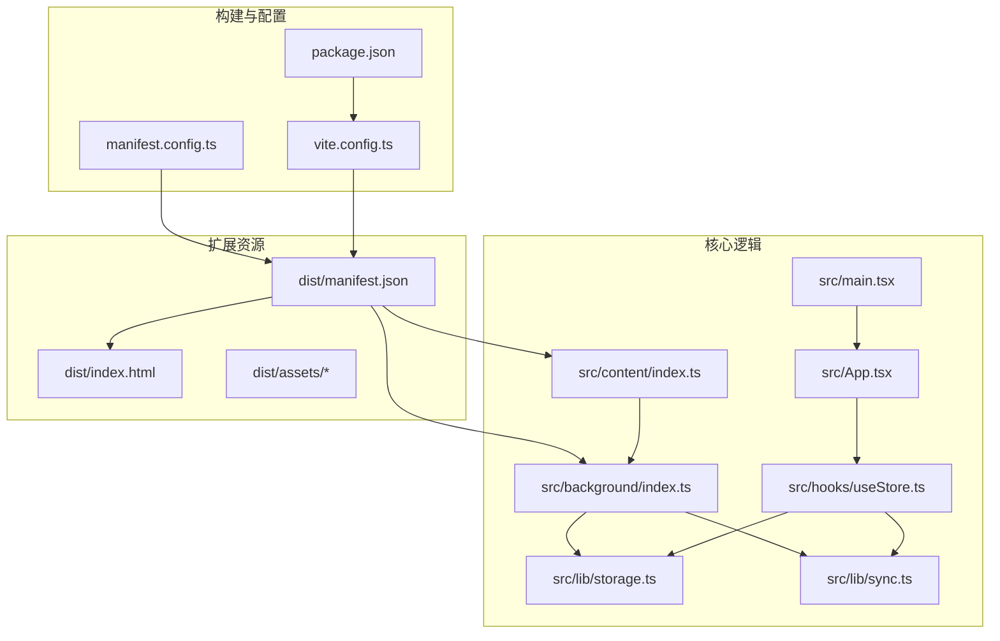
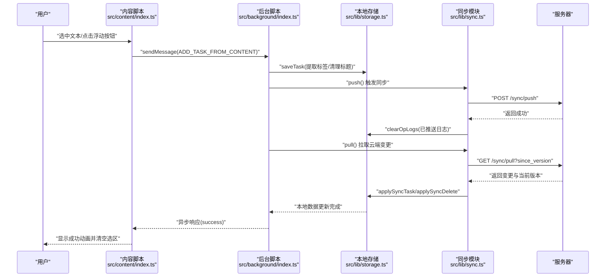
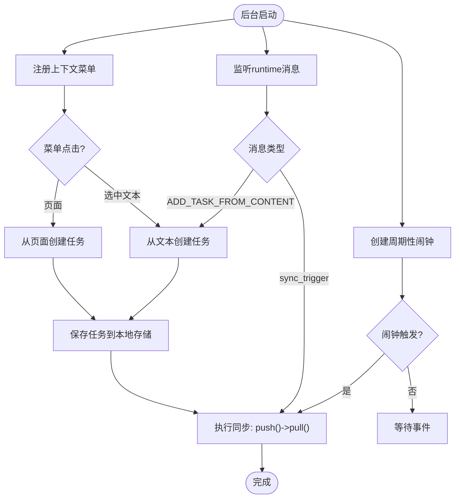
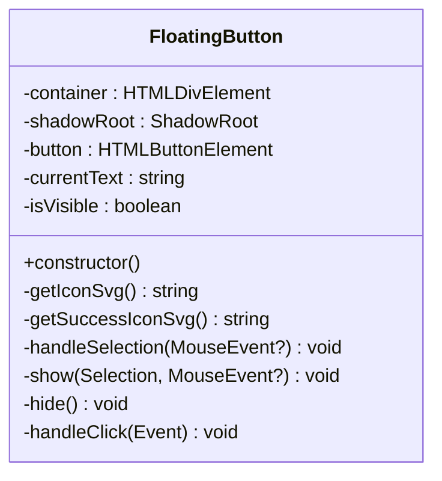
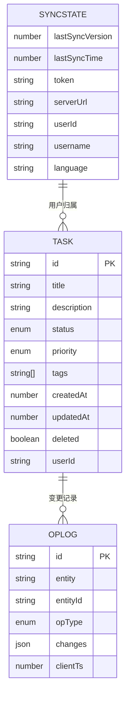
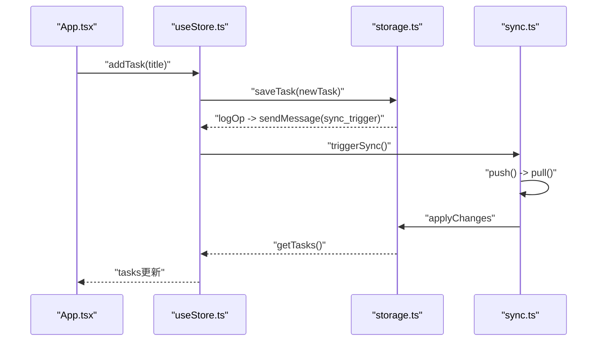
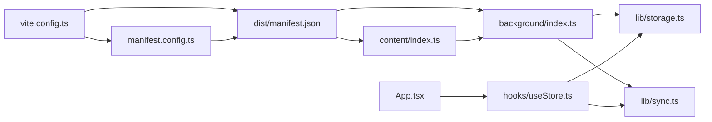

# Chrome扩展架构

<cite>
**本文档引用的文件**
- [manifest.config.ts](file://manifest.config.ts)
- [dist/manifest.json](file://dist/manifest.json)
- [src/background/index.ts](file://src/background/index.ts)
- [src/content/index.ts](file://src/content/index.ts)
- [src/lib/storage.ts](file://src/lib/storage.ts)
- [src/lib/sync.ts](file://src/lib/sync.ts)
- [src/hooks/useStore.ts](file://src/hooks/useStore.ts)
- [src/App.tsx](file://src/App.tsx)
- [src/main.tsx](file://src/main.tsx)
- [vite.config.ts](file://vite.config.ts)
- [package.json](file://package.json)
- [src/config.ts](file://src/config.ts)
</cite>

## 目录
1. [简介](#简介)
2. [项目结构](#项目结构)
3. [核心组件](#核心组件)
4. [架构总览](#架构总览)
5. [详细组件分析](#详细组件分析)
6. [依赖关系分析](#依赖关系分析)
7. [性能考虑](#性能考虑)
8. [故障排除指南](#故障排除指南)
9. [结论](#结论)
10. [附录](#附录)

## 简介
本文件为QKnot Chrome扩展的架构文档，面向开发者与产品人员，系统性阐述扩展的Manifest V3配置、三核心组件（popup界面、后台脚本、内容脚本）的职责与交互、生命周期与消息传递机制、权限模型与安全边界、调试与性能优化实践，以及打包、发布与更新流程。文档基于仓库实际代码进行分析，并提供可视化图示帮助理解。

## 项目结构
QKnot扩展采用React + TypeScript + Vite构建，使用CRXJS插件生成Chrome扩展清单，核心目录组织如下：
- 配置与构建：manifest.config.ts、vite.config.ts、package.json
- 扩展入口与资源：dist/（构建产物）、public/（图标）
- 核心逻辑：src/background/（后台服务）、src/content/（内容脚本）、src/lib/（存储与同步）、src/hooks/（状态管理）、src/App.tsx（UI）、src/main.tsx（入口）

图表来源
- [manifest.config.ts](file://manifest.config.ts#L1-L40)
- [vite.config.ts](file://vite.config.ts#L1-L21)
- [dist/manifest.json](file://dist/manifest.json#L1-L54)
- [src/background/index.ts](file://src/background/index.ts#L1-L114)
- [src/content/index.ts](file://src/content/index.ts#L1-L239)
- [src/lib/storage.ts](file://src/lib/storage.ts#L1-L272)
- [src/lib/sync.ts](file://src/lib/sync.ts#L1-L110)
- [src/hooks/useStore.ts](file://src/hooks/useStore.ts#L1-L193)
- [src/App.tsx](file://src/App.tsx#L1-L860)
- [src/main.tsx](file://src/main.tsx#L1-L11)

章节来源
- [manifest.config.ts](file://manifest.config.ts#L1-L40)
- [vite.config.ts](file://vite.config.ts#L1-L21)
- [package.json](file://package.json#L1-L42)

## 核心组件
QKnot扩展由以下三大核心组件构成：
- 后台脚本（Service Worker）：负责定时同步、上下文菜单、消息处理与任务创建
- 内容脚本：在目标页面注入浮动按钮，捕获选中文本并发送到后台
- popup界面（React应用）：提供任务列表、设置、登录注册与同步控制

章节来源
- [src/background/index.ts](file://src/background/index.ts#L1-L114)
- [src/content/index.ts](file://src/content/index.ts#L1-L239)
- [src/App.tsx](file://src/App.tsx#L1-L860)

## 架构总览
下图展示扩展从用户操作到数据持久化与云端同步的端到端流程。

图表来源
- [src/content/index.ts](file://src/content/index.ts#L202-L234)
- [src/background/index.ts](file://src/background/index.ts#L67-L81)
- [src/lib/storage.ts](file://src/lib/storage.ts#L55-L95)
- [src/lib/sync.ts](file://src/lib/sync.ts#L6-L53)

## 详细组件分析

### Manifest V3配置与权限模型
- 清单版本与元信息：使用Manifest V3，定义名称、版本、图标与默认弹窗
- 行为与背景：action.default_popup指向index.html；background.type为module，service_worker指向构建后的加载器
- 权限声明：storage、alarms、contextMenus三项扩展权限
- 主机权限：允许所有http/https站点访问
- 内容脚本：匹配所有URL，注入TS入口
- 动态资源暴露：通过web_accessible_resources暴露构建产物，供内容脚本按需加载

章节来源
- [manifest.config.ts](file://manifest.config.ts#L9-L39)
- [dist/manifest.json](file://dist/manifest.json#L1-L54)

### 后台脚本（Service Worker）
职责与实现要点：
- 定时同步：创建周期性闹钟，定期触发push/pull
- 上下文菜单：安装时创建“添加到QKnot”和“添加页面到QKnot”，点击后解析标题/URL与标签，创建任务并触发同步
- 消息处理：监听来自内容脚本的消息类型，执行任务创建与手动同步触发
- 任务创建：从文本或页面标题中提取标签，清理多余字符，生成唯一ID并保存至本地存储，随后触发同步

图表来源
- [src/background/index.ts](file://src/background/index.ts#L7-L15)
- [src/background/index.ts](file://src/background/index.ts#L67-L81)
- [src/background/index.ts](file://src/background/index.ts#L83-L113)

章节来源
- [src/background/index.ts](file://src/background/index.ts#L1-L114)

### 内容脚本
职责与实现要点：
- 浮动按钮：在页面上动态创建Shadow DOM容器，渲染带动画的悬浮按钮，支持键盘与鼠标选择位置
- 选区检测：监听mouseup/keyup事件，计算选区边界并定位按钮，确保不越界
- 消息通信：点击按钮后向后台发送消息，接收响应后展示成功动画并清空选区
- 交互细节：按钮透明背景、阴影滤镜、悬停/按下缩放动画，成功态切换图标样式

图表来源
- [src/content/index.ts](file://src/content/index.ts#L3-L235)

章节来源
- [src/content/index.ts](file://src/content/index.ts#L1-L239)

### 存储与同步模块
职责与实现要点：
- 数据模型：Task、OpLog、SyncState接口定义，支持状态、优先级、标签、时间戳等字段
- 本地存储：封装chrome.storage.local，提供任务增删改查、操作日志记录、离线任务计数、用户数据清理等
- 同步策略：push()收集操作日志并上传，pull()拉取变更并应用，维护lastSyncVersion
- 用户场景：登录时检查离线任务与用户归属，提供合并或丢弃决策，logout时严格清理用户数据

图表来源
- [src/lib/storage.ts](file://src/lib/storage.ts#L4-L34)

章节来源
- [src/lib/storage.ts](file://src/lib/storage.ts#L1-L272)
- [src/lib/sync.ts](file://src/lib/sync.ts#L1-L110)

### 状态管理与UI（Zustand + React）
职责与实现要点：
- Zustand Store：集中管理任务列表、同步状态、加载与同步状态，提供增删改查、登录/登出、语言切换、手动同步等方法
- UI组件：App.tsx提供任务列表、详情页、设置页、登录/注册表单、语言选择、关于信息与全局合并提示模态框
- 交互流程：输入回车快速添加任务，点击任务进入详情页编辑标题/链接/标签，右上角设置入口切换账户/语言/关于

图表来源
- [src/hooks/useStore.ts](file://src/hooks/useStore.ts#L77-L100)
- [src/lib/storage.ts](file://src/lib/storage.ts#L109-L127)
- [src/lib/sync.ts](file://src/lib/sync.ts#L6-L83)
- [src/App.tsx](file://src/App.tsx#L62-L72)

章节来源
- [src/hooks/useStore.ts](file://src/hooks/useStore.ts#L1-L193)
- [src/App.tsx](file://src/App.tsx#L1-L860)

## 依赖关系分析
- 构建链路：Vite + CRXJS插件读取manifest.config.ts生成最终manifest.json，自动注入图标与资源路径
- 运行时依赖：React生态、TailwindCSS、Zustand状态管理、ulid生成ID、lucide-react图标库
- 扩展API：chrome.alarms、chrome.contextMenus、chrome.runtime、chrome.storage、chrome.tabs

图表来源
- [vite.config.ts](file://vite.config.ts#L1-L21)
- [manifest.config.ts](file://manifest.config.ts#L1-L40)
- [dist/manifest.json](file://dist/manifest.json#L1-L54)
- [src/background/index.ts](file://src/background/index.ts#L1-L114)
- [src/content/index.ts](file://src/content/index.ts#L1-L239)
- [src/lib/storage.ts](file://src/lib/storage.ts#L1-L272)
- [src/lib/sync.ts](file://src/lib/sync.ts#L1-L110)
- [src/hooks/useStore.ts](file://src/hooks/useStore.ts#L1-L193)
- [src/App.tsx](file://src/App.tsx#L1-L860)

章节来源
- [vite.config.ts](file://vite.config.ts#L1-L21)
- [package.json](file://package.json#L1-L42)

## 性能考虑
- 内容脚本轻量化：仅注入必要DOM与事件监听，避免阻塞页面渲染；按钮使用Shadow DOM隔离样式
- 后台脚本常驻但低开销：使用周期性闹钟触发同步，避免频繁网络请求；消息通道异步处理
- 本地存储批处理：批量写入与增量更新，减少I/O次数；操作日志用于高效增量同步
- UI渲染优化：React组件按需渲染，Zustand状态分片管理，避免全量重绘
- 资源加载：通过web_accessible_resources暴露构建产物，减少跨域与重复下载

## 故障排除指南
常见问题与排查步骤：
- 同步失败
  - 检查token与serverUrl是否正确设置
  - 查看后台脚本控制台错误输出
  - 确认网络可达性与服务器端点可用
- 无法接收消息
  - 确认内容脚本已注入且未被页面拦截
  - 检查后台脚本runtime.onMessage监听是否注册
- 任务未显示
  - 登录状态下仅显示当前用户任务，确认已登录并完成一次拉取
  - 清理本地缓存后重新登录
- 合并冲突
  - 登录后出现离线任务合并提示，选择合并或丢弃
  - 合并后触发完整同步以保证数据一致性

章节来源
- [src/background/index.ts](file://src/background/index.ts#L67-L81)
- [src/content/index.ts](file://src/content/index.ts#L202-L234)
- [src/App.tsx](file://src/App.tsx#L140-L200)
- [src/lib/storage.ts](file://src/lib/storage.ts#L244-L265)

## 结论
QKnot扩展以清晰的职责分离与模块化设计实现了从页面采集到云端同步的完整闭环。通过Manifest V3权限模型与严格的本地存储策略，兼顾了功能完整性与安全性。建议在后续迭代中完善操作日志与错误上报、增强离线模式下的数据一致性校验，并持续优化UI交互与性能指标。

## 附录

### 权限模型与安全边界
- 权限声明
  - storage：本地持久化任务与同步状态
  - alarms：定时触发同步
  - contextMenus：上下文菜单集成
- 主机权限
  - 允许访问所有http/https站点，便于内容脚本注入与消息传递
- 安全边界
  - 登出时严格清理用户数据，确保无数据泄露
  - 合并场景下对非当前用户任务强制清除，防止跨用户数据污染

章节来源
- [manifest.config.ts](file://manifest.config.ts#L31-L32)
- [src/lib/storage.ts](file://src/lib/storage.ts#L244-L265)

### 生命周期与事件监听
- 安装与菜单初始化：onInstalled回调中注册上下文菜单
- 闹钟驱动：onAlarm监听周期性同步
- 消息驱动：onMessage监听内容脚本与手动触发
- 页面加载：内容脚本随页面加载注入，监听选区变化

章节来源
- [src/background/index.ts](file://src/background/index.ts#L83-L113)

### 调试技巧与性能监控
- 控制台日志：后台脚本与内容脚本均输出关键事件日志
- 网络面板：观察push/pull请求与响应状态
- 存储检查：chrome.storage查看tasks、opLogs、syncState
- 性能指标：测量内容脚本事件绑定数量、后台脚本内存占用与同步耗时

### 打包、发布与更新流程
- 开发与预览
  - 使用Vite开发服务器进行本地调试
  - 构建命令生成dist目录，包含最终清单与资源
- 加载扩展
  - 在Chrome扩展管理页启用开发者模式，加载dist目录
- 发布准备
  - 更新版本号与版本名，确保manifest.version与version_name一致
  - 生成生产构建并验证各页面与功能
- 发布与更新
  - 将构建产物提交至发布渠道（如Chrome Web Store）
  - 通过版本号递增实现自动更新，后台脚本的周期性同步保障数据一致性

章节来源
- [package.json](file://package.json#L6-L11)
- [manifest.config.ts](file://manifest.config.ts#L10-L13)
- [dist/manifest.json](file://dist/manifest.json#L2-L5)