# Manifest V3配置详解

<cite>
**本文档引用的文件**
- [manifest.config.ts](file://manifest.config.ts)
- [package.json](file://package.json)
- [dist/manifest.json](file://dist/manifest.json)
- [vite.config.ts](file://vite.config.ts)
- [src/background/index.ts](file://src/background/index.ts)
- [src/content/index.ts](file://src/content/index.ts)
- [src/lib/storage.ts](file://src/lib/storage.ts)
- [src/lib/sync.ts](file://src/lib/sync.ts)
- [src/config.ts](file://src/config.ts)
</cite>

## 目录
1. [简介](#简介)
2. [项目结构](#项目结构)
3. [核心组件](#核心组件)
4. [架构概览](#架构概览)
5. [详细组件分析](#详细组件分析)
6. [依赖关系分析](#依赖关系分析)
7. [性能考虑](#性能考虑)
8. [故障排除指南](#故障排除指南)
9. [结论](#结论)

## 简介

QKnot扩展基于Chrome Extension Manifest V3规范构建，采用现代前端技术栈（React + TypeScript + Vite）开发。本文件详细解析了Manifest V3配置的各项参数、CRXJS插件的使用方法以及相关的构建优化策略。

## 项目结构

QKnot扩展的项目结构遵循现代化的前端工程化标准：

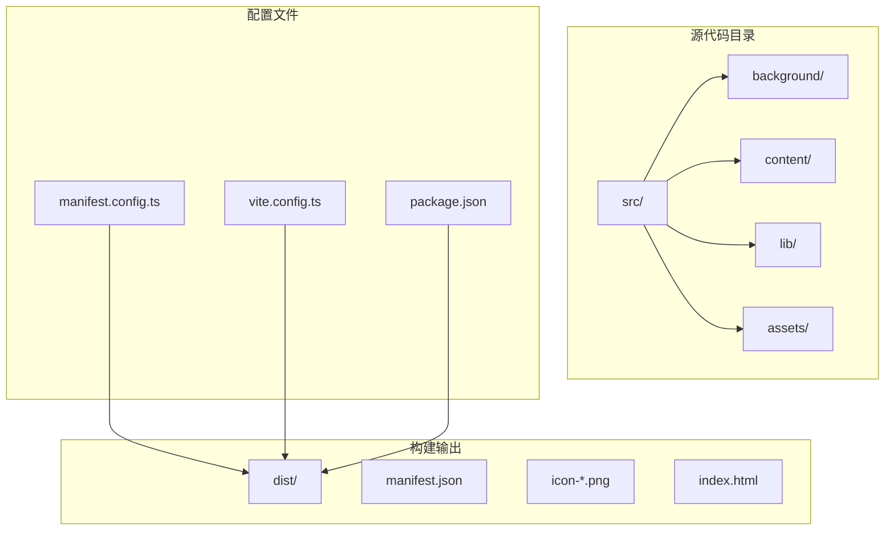

**图表来源**
- [manifest.config.ts](file://manifest.config.ts#L1-L40)
- [vite.config.ts](file://vite.config.ts#L1-L21)
- [package.json](file://package.json#L1-L42)

**章节来源**
- [manifest.config.ts](file://manifest.config.ts#L1-L40)
- [vite.config.ts](file://vite.config.ts#L1-L21)
- [package.json](file://package.json#L1-L42)

## 核心组件

### Manifest V3配置核心要素

QKnot扩展的Manifest V3配置包含了以下关键组件：

#### 基础信息配置
- **manifest_version**: 指定使用Manifest V3规范
- **name**: 扩展名称，支持staging模式下的特殊标识
- **version**: 主版本号，格式为"主.次.修订"
- **version_name**: 完整版本字符串，保留原始语义化版本

#### 资源文件配置
- **icons**: 扩展图标集合，支持16x16、48x48、128x128像素
- **action**: 扩展按钮配置，包括弹出页面和默认图标
- **default_popup**: 主界面HTML文件路径

#### 权限声明
- **permissions**: 内部权限列表
  - storage: 本地存储访问权限
  - alarms: 定时器功能权限
  - contextMenus: 上下文菜单权限
- **host_permissions**: 主机权限列表
  - 支持所有HTTP和HTTPS协议
  - 允许访问所有网站

#### 脚本配置
- **background**: 后台服务工作线程
  - service_worker: TypeScript源文件路径
  - type: 模块类型为ES6模块
- **content_scripts**: 内容脚本配置
  - 匹配所有URL模式
  - 加载主内容脚本

**章节来源**
- [manifest.config.ts](file://manifest.config.ts#L9-L39)
- [dist/manifest.json](file://dist/manifest.json#L1-L54)

## 架构概览

QKnot扩展采用分层架构设计，各组件职责明确：

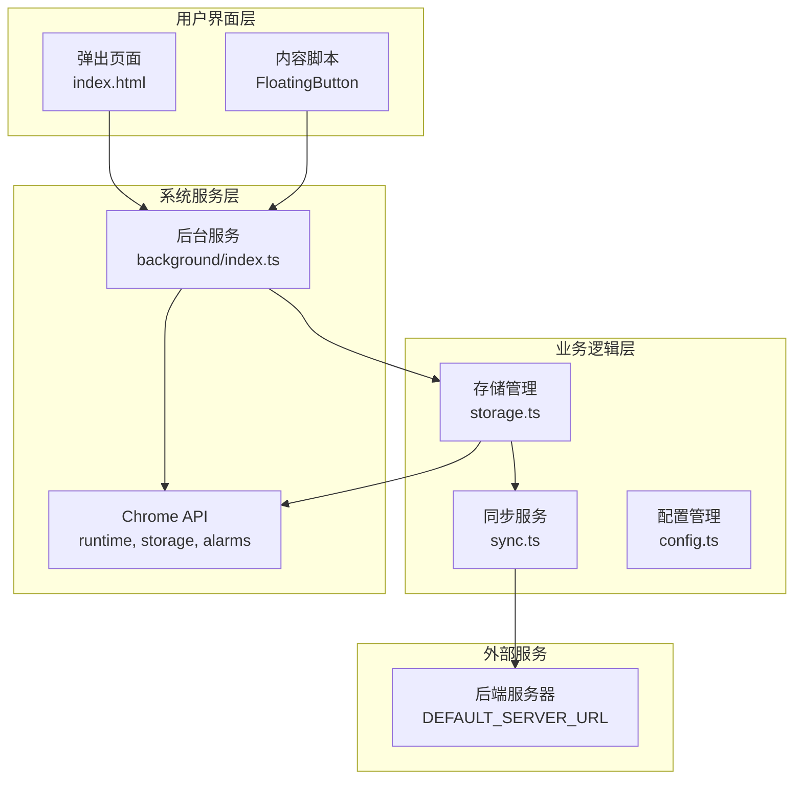

**图表来源**
- [src/background/index.ts](file://src/background/index.ts#L1-L114)
- [src/content/index.ts](file://src/content/index.ts#L1-L239)
- [src/lib/storage.ts](file://src/lib/storage.ts#L1-L272)
- [src/lib/sync.ts](file://src/lib/sync.ts#L1-L110)
- [src/config.ts](file://src/config.ts#L1-L2)

## 详细组件分析

### CRXJS插件集成

CRXJS是QKnot扩展的核心构建工具，提供了Manifest V3的完整支持：

#### 插件配置流程

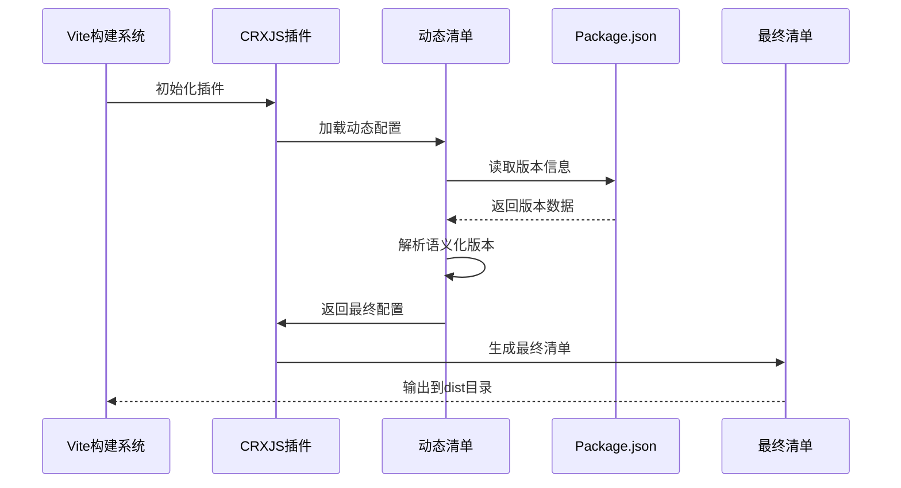

**图表来源**
- [vite.config.ts](file://vite.config.ts#L3-L12)
- [manifest.config.ts](file://manifest.config.ts#L1-L40)
- [package.json](file://package.json#L4-L4)

#### 版本号处理逻辑

CRXJS插件实现了智能的版本号转换机制：

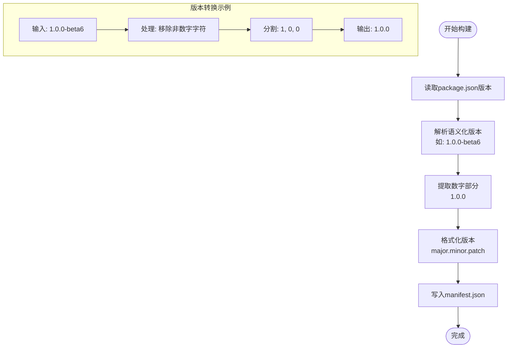

**图表来源**
- [manifest.config.ts](file://manifest.config.ts#L6-L12)

**章节来源**
- [vite.config.ts](file://vite.config.ts#L3-L12)
- [manifest.config.ts](file://manifest.config.ts#L1-L40)
- [package.json](file://package.json#L4-L4)

### 后台服务架构

后台服务负责扩展的核心业务逻辑：

#### 服务工作线程功能

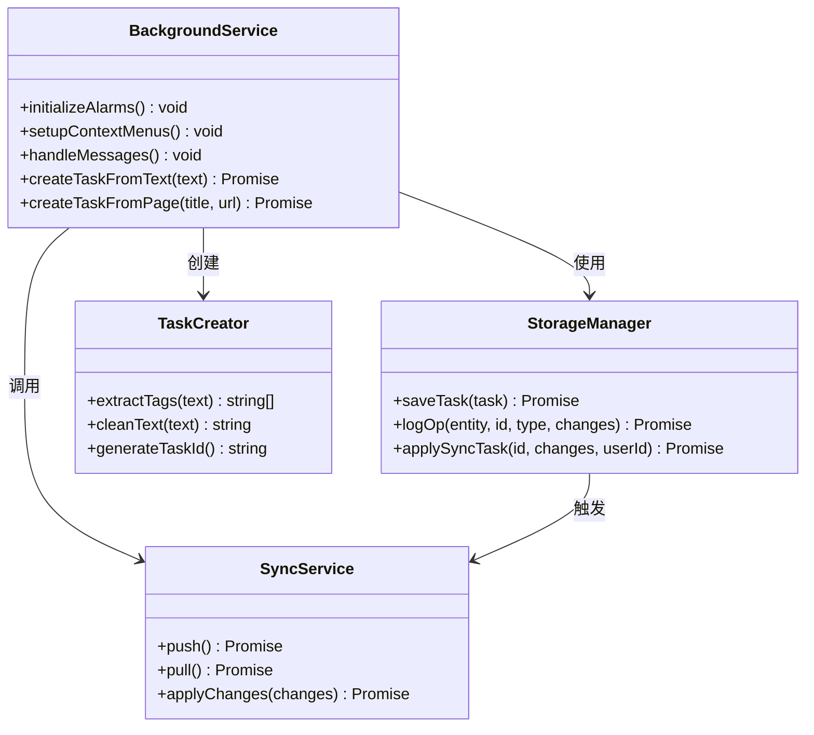

**图表来源**
- [src/background/index.ts](file://src/background/index.ts#L1-L114)
- [src/lib/storage.ts](file://src/lib/storage.ts#L49-L127)
- [src/lib/sync.ts](file://src/lib/sync.ts#L5-L53)

#### 定时同步机制

后台服务实现了自动同步功能：

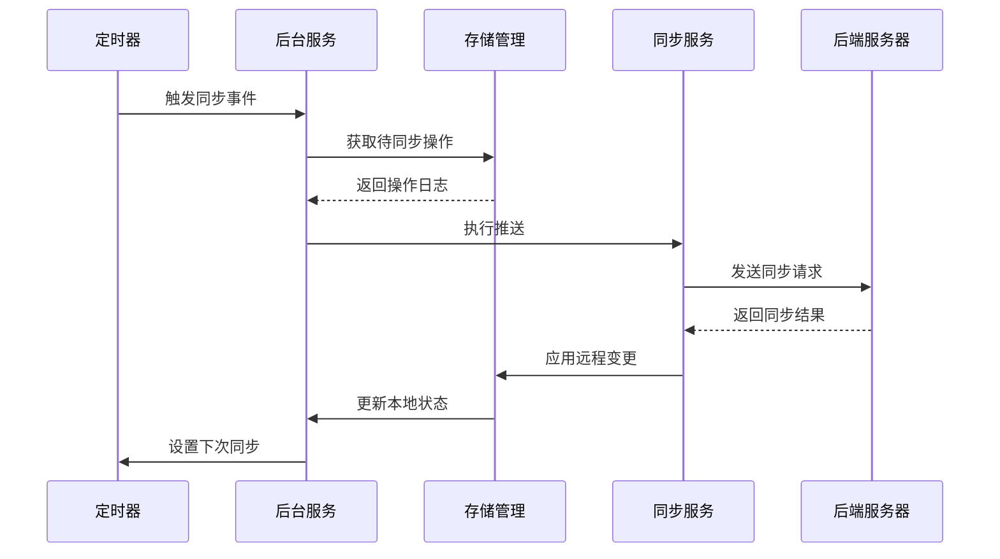

**图表来源**
- [src/background/index.ts](file://src/background/index.ts#L7-L15)
- [src/lib/sync.ts](file://src/lib/sync.ts#L6-L53)

**章节来源**
- [src/background/index.ts](file://src/background/index.ts#L1-L114)
- [src/lib/storage.ts](file://src/lib/storage.ts#L108-L127)
- [src/lib/sync.ts](file://src/lib/sync.ts#L1-L110)

### 内容脚本实现

内容脚本负责在目标网页中注入交互功能：

#### 浮动按钮系统

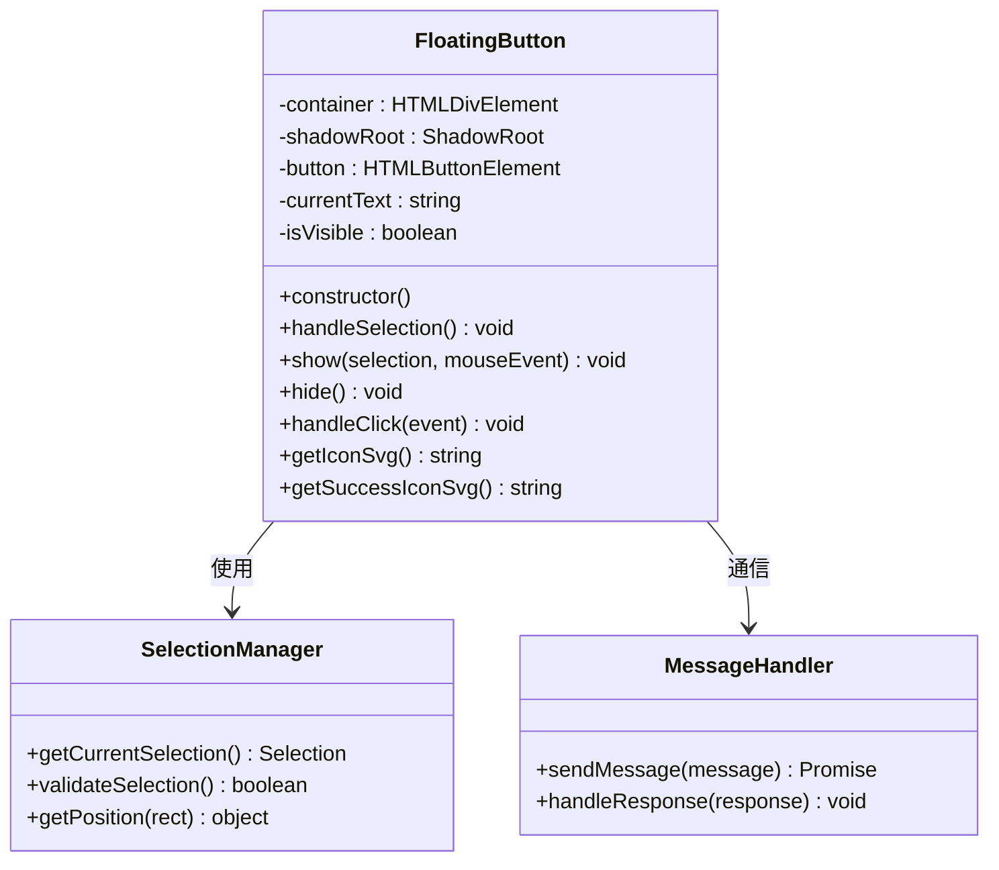

**图表来源**
- [src/content/index.ts](file://src/content/index.ts#L3-L235)

#### 用户交互流程

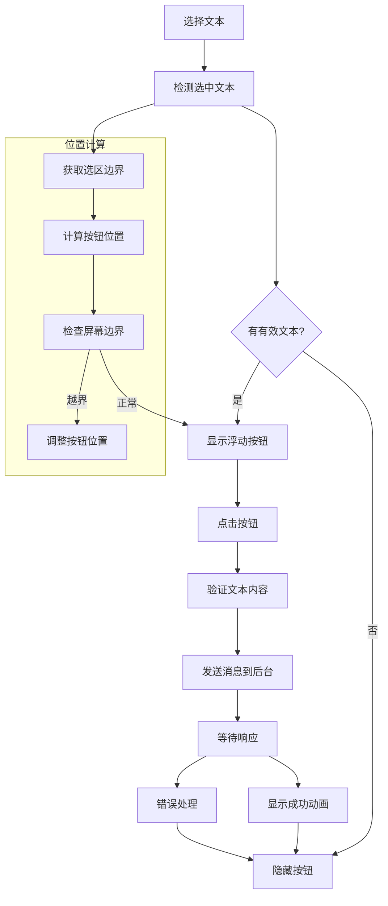

**图表来源**
- [src/content/index.ts](file://src/content/index.ts#L120-L186)

**章节来源**
- [src/content/index.ts](file://src/content/index.ts#L1-L239)

## 依赖关系分析

### 构建系统依赖

QKnot扩展的构建系统采用了现代化的工具链：

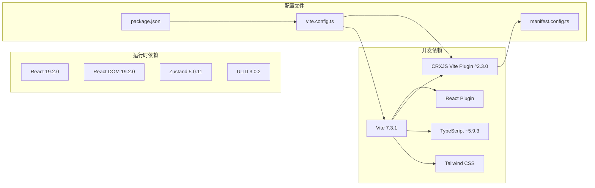

**图表来源**
- [package.json](file://package.json#L12-L25)
- [vite.config.ts](file://vite.config.ts#L1-L21)
- [manifest.config.ts](file://manifest.config.ts#L1-L2)

### 运行时依赖关系

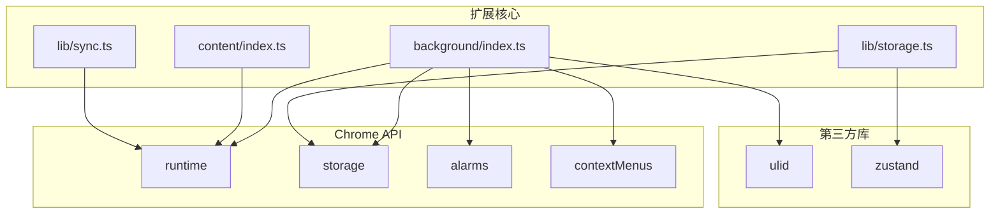

**图表来源**
- [src/background/index.ts](file://src/background/index.ts#L1-L114)
- [src/content/index.ts](file://src/content/index.ts#L1-L239)
- [src/lib/storage.ts](file://src/lib/storage.ts#L1-L272)
- [src/lib/sync.ts](file://src/lib/sync.ts#L1-L110)

**章节来源**
- [package.json](file://package.json#L12-L25)
- [vite.config.ts](file://vite.config.ts#L1-L21)

## 性能考虑

### 构建优化策略

QKnot扩展在构建过程中采用了多项优化措施：

#### 资源优化
- **按需加载**: 内容脚本仅在需要时加载
- **图标优化**: 提供多分辨率图标以适应不同显示密度
- **代码分割**: 将大型组件拆分为独立模块

#### 运行时优化
- **内存管理**: 及时清理DOM元素和事件监听器
- **网络优化**: 实现增量同步减少数据传输
- **定时器管理**: 合理设置同步间隔避免频繁网络请求

### 缓存策略

扩展采用了多层次的缓存机制：

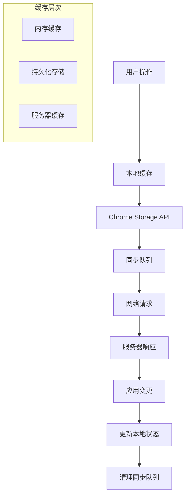

## 故障排除指南

### 常见问题及解决方案

#### Manifest配置问题
- **问题**: Manifest V3兼容性错误
- **原因**: 权限声明不正确或路径配置错误
- **解决**: 检查permissions和host_permissions配置，确保文件路径正确

#### 构建失败问题
- **问题**: CRXJS插件构建失败
- **原因**: 版本号格式不正确或依赖缺失
- **解决**: 验证package.json中的版本格式，确保所有依赖已安装

#### 运行时错误
- **问题**: 后台服务无法启动
- **原因**: Service Worker注册失败或权限不足
- **解决**: 检查background.service_worker路径，确认所需权限已声明

#### 同步问题
- **问题**: 数据同步失败
- **原因**: 网络连接问题或服务器认证失败
- **解决**: 验证服务器URL配置，检查网络连接状态

### 调试技巧

#### 开发模式调试
- 使用浏览器开发者工具检查扩展页面
- 监控网络请求和响应
- 查看控制台错误信息

#### 生产环境监控
- 实现错误日志记录
- 监控扩展性能指标
- 定期检查权限使用情况

**章节来源**
- [manifest.config.ts](file://manifest.config.ts#L1-L40)
- [src/background/index.ts](file://src/background/index.ts#L1-L114)
- [src/lib/sync.ts](file://src/lib/sync.ts#L1-L110)

## 结论

QKnot扩展的Manifest V3配置展现了现代Chrome扩展开发的最佳实践。通过CRXJS插件的动态配置能力、合理的权限设计和高效的构建流程，该扩展实现了功能完整性与性能优化的平衡。

关键优势包括：
- **安全性**: 严格遵循权限最小化原则
- **可维护性**: 清晰的代码结构和模块化设计
- **可扩展性**: 灵活的配置系统和插件架构
- **用户体验**: 流畅的交互设计和及时的反馈机制

建议在后续开发中继续关注Chrome扩展生态系统的最新发展，适时更新依赖库和配置选项，以保持扩展的先进性和兼容性。