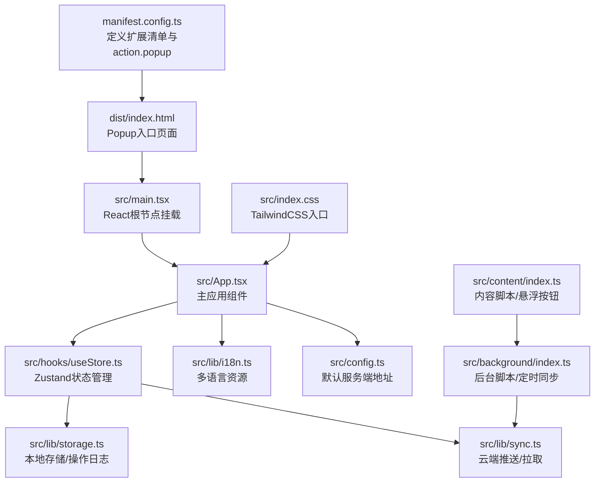
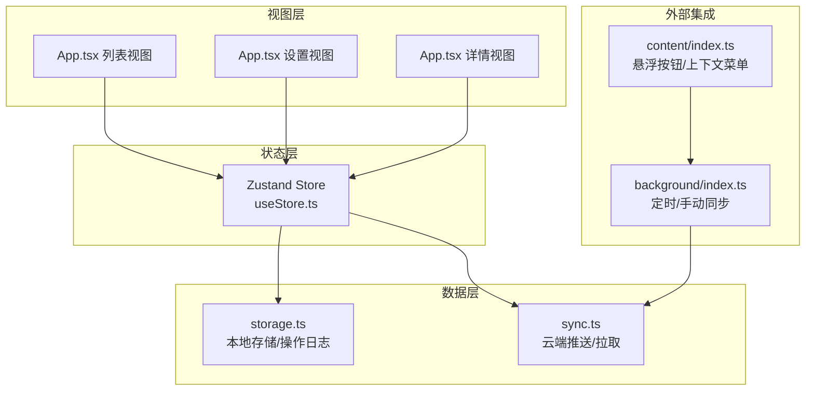
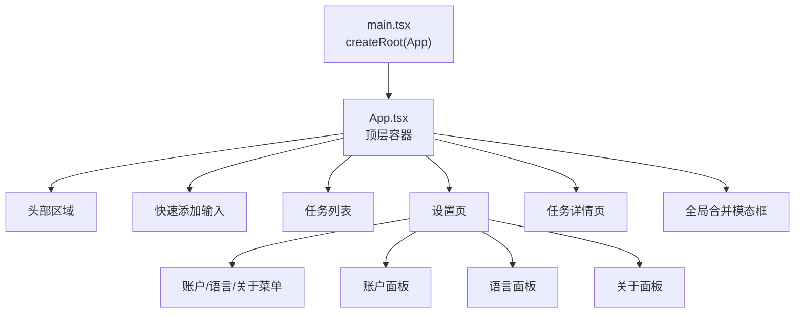
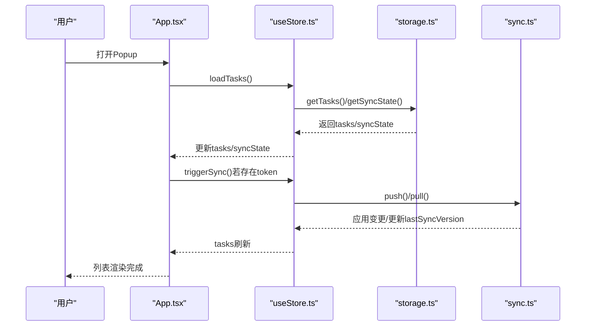
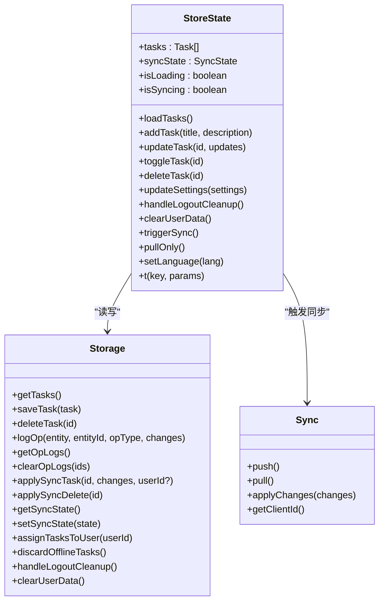
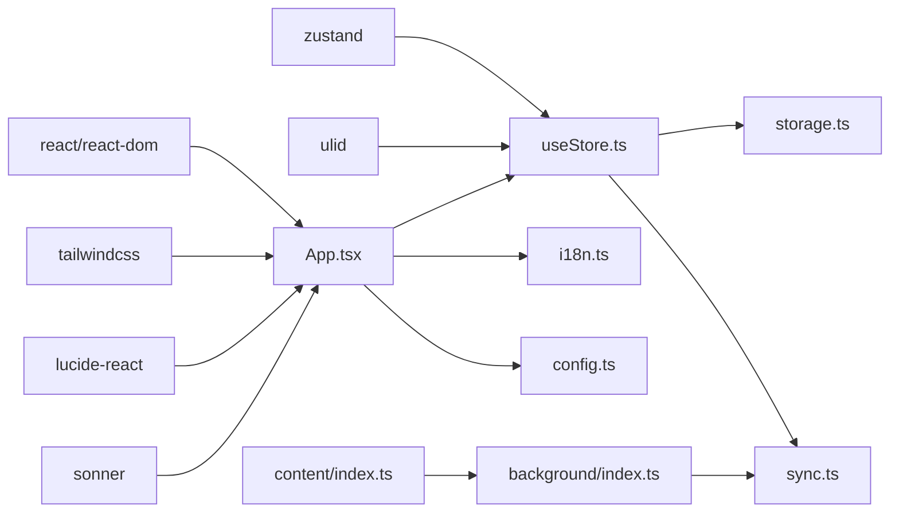
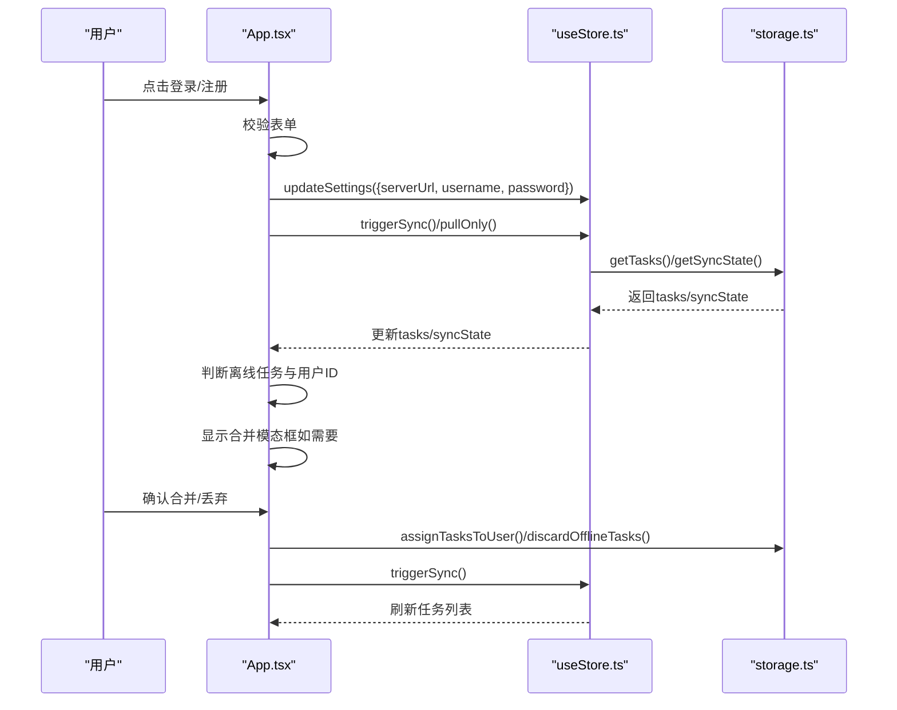

# Popup界面设计

<cite>
**本文引用的文件**
- [src/main.tsx](file://src/main.tsx)
- [src/App.tsx](file://src/App.tsx)
- [src/hooks/useStore.ts](file://src/hooks/useStore.ts)
- [src/lib/storage.ts](file://src/lib/storage.ts)
- [src/lib/sync.ts](file://src/lib/sync.ts)
- [src/lib/i18n.ts](file://src/lib/i18n.ts)
- [src/config.ts](file://src/config.ts)
- [src/index.css](file://src/index.css)
- [manifest.config.ts](file://manifest.config.ts)
- [src/background/index.ts](file://src/background/index.ts)
- [src/content/index.ts](file://src/content/index.ts)
- [vite.config.ts](file://vite.config.ts)
- [package.json](file://package.json)
</cite>

## 目录
1. [简介](#简介)
2. [项目结构](#项目结构)
3. [核心组件](#核心组件)
4. [架构总览](#架构总览)
5. [组件详细分析](#组件详细分析)
6. [依赖关系分析](#依赖关系分析)
7. [性能考量](#性能考量)
8. [故障排查指南](#故障排查指南)
9. [结论](#结论)
10. [附录](#附录)

## 简介
本文件面向QKnot浏览器扩展的Popup界面设计，系统化阐述React应用初始化流程、组件树结构、主应用组件职责与状态管理集成、UI设计原则与响应式布局、与Zustand的状态管理集成方式、数据绑定与事件处理机制、组件复用策略、样式与主题定制、无障碍访问支持、键盘导航与屏幕阅读器兼容性，以及性能优化与内存泄漏防护等实践建议。文档以仓库实际代码为依据，配合可视化图示帮助不同技术背景的读者快速理解与落地。

## 项目结构
该扩展采用Vite + React + Zustand + TailwindCSS的现代前端栈，并通过CRX插件打包为Chrome扩展。Popup入口由manifest配置指向index.html，React应用在src/main.tsx中挂载至DOM节点，主应用组件位于src/App.tsx，状态管理通过src/hooks/useStore.ts中的Zustand store集中管理，数据持久化与同步逻辑分别封装在src/lib/storage.ts与src/lib/sync.ts中，国际化资源位于src/lib/i18n.ts，全局样式通过src/index.css引入TailwindCSS。

图表来源
- [manifest.config.ts](file://manifest.config.ts#L14-L21)
- [src/main.tsx](file://src/main.tsx#L1-L11)
- [src/App.tsx](file://src/App.tsx#L1-L10)
- [src/hooks/useStore.ts](file://src/hooks/useStore.ts#L1-L26)
- [src/lib/storage.ts](file://src/lib/storage.ts#L48-L272)
- [src/lib/sync.ts](file://src/lib/sync.ts#L5-L110)
- [src/lib/i18n.ts](file://src/lib/i18n.ts#L1-L146)
- [src/config.ts](file://src/config.ts#L1-L2)
- [src/index.css](file://src/index.css#L1-L1)
- [src/background/index.ts](file://src/background/index.ts#L1-L114)
- [src/content/index.ts](file://src/content/index.ts#L1-L239)

章节来源
- [manifest.config.ts](file://manifest.config.ts#L1-L40)
- [src/main.tsx](file://src/main.tsx#L1-L11)
- [src/index.css](file://src/index.css#L1-L1)
- [vite.config.ts](file://vite.config.ts#L1-L21)

## 核心组件
- React初始化与入口
  - 在src/main.tsx中，使用createRoot将App组件渲染到id为“root”的DOM节点，启用React.StrictMode。
- 主应用组件App
  - 负责视图切换（列表/设置/详情）、用户交互（添加任务、编辑任务、标签管理、登录/注册/注销）、Toast通知、全局合并确认模态框、自动同步触发与错误提示。
  - 使用useStore钩子从Zustand store读取任务列表、同步状态、加载/同步状态，并调用store提供的动作函数进行增删改查与设置更新。
- Zustand状态管理
  - 定义任务、同步状态、加载/同步标志，以及loadTasks、addTask、updateTask、toggleTask、deleteTask、updateSettings、handleLogoutCleanup、clearUserData、triggerSync、pullOnly、setLanguage、t等方法。
  - 通过storage.ts读写本地数据，通过sync.ts与后端进行推送/拉取同步。
- 国际化与主题
  - i18n.ts提供英文与中英繁三种语言的键值映射；App组件通过t函数进行文本翻译；TailwindCSS提供基础样式与响应式断点。
- 扩展清单与构建
  - manifest.config.ts定义action.default_popup为index.html；vite.config.ts集成react、crx与tailwindcss插件；package.json声明依赖与脚本。

章节来源
- [src/main.tsx](file://src/main.tsx#L1-L11)
- [src/App.tsx](file://src/App.tsx#L11-L860)
- [src/hooks/useStore.ts](file://src/hooks/useStore.ts#L8-L26)
- [src/lib/i18n.ts](file://src/lib/i18n.ts#L1-L146)
- [src/index.css](file://src/index.css#L1-L1)
- [manifest.config.ts](file://manifest.config.ts#L14-L21)
- [vite.config.ts](file://vite.config.ts#L10-L14)
- [package.json](file://package.json#L12-L25)

## 架构总览
Popup应用采用“组件驱动 + 状态集中”的架构模式：
- 视图层：App.tsx根据view状态渲染列表、设置、详情三类视图，内部再细分子视图（如设置页的账户/语言/关于）。
- 状态层：Zustand store统一管理tasks、syncState、isLoading、isSyncing，并提供数据持久化与云端同步接口。
- 数据层：storage.ts负责Chrome本地存储、操作日志记录与清理；sync.ts负责与后端的push/pull协议。
- 外部集成：background脚本定时触发同步；content脚本提供悬浮按钮，向background发送消息创建任务。

图表来源
- [src/App.tsx](file://src/App.tsx#L11-L860)
- [src/hooks/useStore.ts](file://src/hooks/useStore.ts#L28-L192)
- [src/lib/storage.ts](file://src/lib/storage.ts#L48-L272)
- [src/lib/sync.ts](file://src/lib/sync.ts#L5-L110)
- [src/background/index.ts](file://src/background/index.ts#L7-L15)
- [src/content/index.ts](file://src/content/index.ts#L100-L114)

## 组件详细分析

### React应用初始化与组件树
- 初始化流程
  - main.tsx创建根节点并渲染App，StrictMode确保潜在问题早暴露。
  - App.tsx作为顶层容器，持有全局状态与视图切换逻辑。
- 组件树结构
  - App.tsx内部分为Header、Quick Add、Task List、Settings、Detail、全局合并模态框等区域。
  - Settings页进一步拆分为侧边菜单与内容区，内容区按tab切换账户/语言/关于。
  - Detail页包含标题编辑、链接展示、标签管理与创建/更新时间信息。

图表来源
- [src/main.tsx](file://src/main.tsx#L6-L10)
- [src/App.tsx](file://src/App.tsx#L227-L433)
- [src/App.tsx](file://src/App.tsx#L435-L640)
- [src/App.tsx](file://src/App.tsx#L642-L860)

章节来源
- [src/main.tsx](file://src/main.tsx#L1-L11)
- [src/App.tsx](file://src/App.tsx#L11-L860)

### 主应用组件职责与状态管理集成
- 职责划分
  - 视图控制：view与selectedTaskId驱动列表/设置/详情切换；settingsTab控制设置页内tab。
  - 用户交互：键盘事件监听、点击事件处理、表单输入与校验、Toast提示。
  - 同步协调：首次打开自动触发同步；登录/注销/合并后触发同步；pullOnly用于仅拉取云端数据。
  - 数据过滤：根据syncState.userId过滤任务，保证登录后不显示离线任务。
- 状态集成
  - 通过useStore读取tasks、loadTasks、addTask、toggleTask、deleteTask、updateTask、triggerSync、pullOnly、isSyncing、syncState、updateSettings、clearUserData、handleLogoutCleanup、setLanguage、t。
  - 在effect中处理自动同步、设置表单初始值、合并模态框触发时机。

图表来源
- [src/App.tsx](file://src/App.tsx#L35-L46)
- [src/App.tsx](file://src/App.tsx#L62-L72)
- [src/hooks/useStore.ts](file://src/hooks/useStore.ts#L53-L75)
- [src/hooks/useStore.ts](file://src/hooks/useStore.ts#L167-L179)
- [src/lib/sync.ts](file://src/lib/sync.ts#L24-L53)
- [src/lib/sync.ts](file://src/lib/sync.ts#L55-L83)

章节来源
- [src/App.tsx](file://src/App.tsx#L11-L860)
- [src/hooks/useStore.ts](file://src/hooks/useStore.ts#L28-L192)

### UI组件设计原则与响应式布局
- 设计原则
  - 卡片化布局：任务项、设置面板、模态框均采用圆角卡片与阴影，提升层级感。
  - 颜色体系：使用indigo为主色调，强调状态（完成/选中/错误）与辅助色（灰阶）。
  - 可访问性：按钮具备title与aria-label；焦点顺序合理；禁用态明确。
- 响应式布局
  - 固定尺寸容器（宽度350px，高度500px），适配浏览器Popup窗口；内部使用flex与grid实现自适应内容排列。
  - 滚动条定制：使用Tailwind的scrollbar类，保持一致的滚动体验。
- 用户体验优化
  - 快速添加：回车即提交；禁用态避免误触；输入框自动聚焦。
  - 任务排序：已完成任务置后或降权显示；点击进入详情。
  - 标签管理：支持新增、编辑、删除；空格分隔与去重；最大长度限制。
  - 链接展示：识别URL并在详情页以链接形式呈现，支持一键移除。

章节来源
- [src/App.tsx](file://src/App.tsx#L227-L433)
- [src/App.tsx](file://src/App.tsx#L435-L640)
- [src/App.tsx](file://src/App.tsx#L642-L860)

### 与Zustand状态管理的集成
- Store接口
  - 读取：tasks、syncState、isLoading、isSyncing、t。
  - 写入：loadTasks、addTask、updateTask、toggleTask、deleteTask、updateSettings、handleLogoutCleanup、clearUserData、triggerSync、pullOnly、setLanguage。
- 数据绑定与事件处理
  - 输入绑定：useState维护本地表单与输入状态；useStore返回的动作函数负责持久化与同步。
  - 事件处理：键盘事件、点击事件、表单提交、模态框确认/取消。
- 优化策略
  - 乐观更新：addTask/deleteTask在本地立即反映，随后异步写入存储。
  - 过滤可见任务：登录后仅显示属于当前用户的任务，隐藏离线任务。

图表来源
- [src/hooks/useStore.ts](file://src/hooks/useStore.ts#L8-L26)
- [src/hooks/useStore.ts](file://src/hooks/useStore.ts#L53-L192)
- [src/lib/storage.ts](file://src/lib/storage.ts#L48-L272)
- [src/lib/sync.ts](file://src/lib/sync.ts#L5-L110)

章节来源
- [src/hooks/useStore.ts](file://src/hooks/useStore.ts#L28-L192)
- [src/lib/storage.ts](file://src/lib/storage.ts#L48-L272)
- [src/lib/sync.ts](file://src/lib/sync.ts#L5-L110)

### 数据绑定与事件处理机制
- 表单与输入
  - 登录/注册：受控组件，useState维护username/password，useEffect初始化serverUrl与username。
  - 快速添加：输入框受控，回车触发addTask，清空输入。
  - 标签管理：新增/编辑标签时切换输入框，失焦或回车保存，Esc取消。
- 事件流
  - App.tsx中事件冒泡控制：任务项点击进入详情，按钮点击阻止冒泡以避免误触发。
  - Toast：使用sonner在同步开始/成功/失败时提供即时反馈。
- 错误处理
  - 登录/注册失败时设置authError；同步失败时捕获异常并提示。

章节来源
- [src/App.tsx](file://src/App.tsx#L227-L433)
- [src/App.tsx](file://src/App.tsx#L435-L640)
- [src/App.tsx](file://src/App.tsx#L642-L860)

### 组件复用策略、样式管理与主题定制
- 复用策略
  - 通用图标：使用lucide-react图标库，统一视觉风格与尺寸。
  - 样式工具：使用clsx动态组合类名，减少条件分支复杂度。
  - 模态框：全局合并模态框通过状态控制显示/隐藏，避免重复实现。
- 样式管理
  - TailwindCSS：通过原子类实现布局与主题；scrollbar类定制滚动条。
  - 全局样式：index.css导入Tailwind，确保样式生效。
- 主题定制
  - 主色调：indigo；状态色：green（成功）、red（危险）、gray（中性）。
  - 字体与排版：使用无衬线字体，语义化标题与正文字号。

章节来源
- [src/App.tsx](file://src/App.tsx#L1-L10)
- [src/index.css](file://src/index.css#L1-L1)
- [package.json](file://package.json#L17-L24)

### 无障碍访问支持、键盘导航与屏幕阅读器兼容性
- 无障碍支持
  - 按钮与图标提供title属性；悬浮按钮设置aria-label。
  - 焦点管理：输入框自动聚焦；编辑任务时选择文本末尾。
  - 禁用态：模态框开启时禁用输入与交互，避免键盘误触。
- 键盘导航
  - 回车添加任务；编辑标签时回车保存，Esc取消。
  - 列表项可点击进入详情；任务勾选阻止事件冒泡。
- 屏幕阅读器
  - 文本使用语义化标签；重要状态通过Toast提示，便于读屏软件播报。

章节来源
- [src/App.tsx](file://src/App.tsx#L55-L60)
- [src/App.tsx](file://src/App.tsx#L510-L521)
- [src/App.tsx](file://src/App.tsx#L559-L565)
- [src/content/index.ts](file://src/content/index.ts#L82-L83)

### 性能优化技巧与内存泄漏防护
- 性能优化
  - 乐观更新：本地立即渲染，减少等待时间。
  - 任务排序：列表渲染前复制数组并排序，避免直接修改原数组。
  - 条件渲染：空状态占位图，减少DOM节点数量。
  - 滚动优化：使用Tailwind的scrollbar类，避免自定义滚动条带来的性能开销。
- 内存泄漏防护
  - 清理副作用：useEffect返回清理函数，避免重复订阅；模态框关闭时恢复交互。
  - 异步安全：同步过程中设置isSyncing，防止并发触发；登录后清理密码字段。
  - 存储清理：注销时clearUserData仅保留serverUrl与language，避免残留数据。

章节来源
- [src/hooks/useStore.ts](file://src/hooks/useStore.ts#L96-L98)
- [src/hooks/useStore.ts](file://src/hooks/useStore.ts#L143-L146)
- [src/App.tsx](file://src/App.tsx#L724-L725)
- [src/App.tsx](file://src/App.tsx#L202-L208)
- [src/lib/storage.ts](file://src/lib/storage.ts#L250-L265)

## 依赖关系分析
- 外部依赖
  - React与ReactDOM：应用框架与DOM渲染。
  - Zustand：轻量状态管理，替代Redux。
  - TailwindCSS：原子类样式框架。
  - lucide-react：图标库。
  - sonner：Toast通知。
  - ulid：生成唯一ID。
- 内部模块
  - App.tsx依赖useStore、storage、sync、i18n、config。
  - useStore依赖storage、sync、i18n。
  - background与content脚本通过chrome.runtime与storage/sync协作。

图表来源
- [package.json](file://package.json#L12-L24)
- [src/App.tsx](file://src/App.tsx#L1-L10)
- [src/hooks/useStore.ts](file://src/hooks/useStore.ts#L1-L7)
- [src/lib/storage.ts](file://src/lib/storage.ts#L1-L7)
- [src/lib/sync.ts](file://src/lib/sync.ts#L1-L4)
- [src/lib/i18n.ts](file://src/lib/i18n.ts#L1-L1)
- [src/config.ts](file://src/config.ts#L1-L2)
- [src/background/index.ts](file://src/background/index.ts#L1-L4)
- [src/content/index.ts](file://src/content/index.ts#L1-L4)

章节来源
- [package.json](file://package.json#L12-L24)
- [src/App.tsx](file://src/App.tsx#L1-L10)
- [src/hooks/useStore.ts](file://src/hooks/useStore.ts#L1-L7)

## 性能考量
- 渲染性能
  - 列表渲染前复制数组并排序，避免不必要的重排。
  - 使用条件渲染与骨架屏思路（空状态占位图）降低首屏压力。
- 状态更新
  - 乐观更新减少网络往返延迟；批量更新通过setState合并。
- 网络与存储
  - 同步时设置isSyncing，避免重复触发；仅在必要时触发pullOnly。
  - 操作日志（OpLog）减少推送体积，提高同步效率。
- 构建与打包
  - Vite开发与生产构建；CRX插件打包扩展；Tailwind按需生成样式。

[本节为通用性能指导，无需特定文件引用]

## 故障排查指南
- 登录/注册失败
  - 检查serverUrl与网络连通性；查看authError提示；确认用户名未被占用。
- 同步失败
  - 查看isSyncing状态；确认token有效；检查后端返回状态码。
- 任务未显示
  - 确认是否已登录；登录后会过滤掉离线任务；检查loadTasks是否执行。
- 模态框无法关闭
  - 确认showMergeModal状态；检查视图切换逻辑；确保effect正确触发。
- 注销后仍有数据
  - 确认handleLogoutCleanup与clearUserData调用；检查storage清理逻辑。

章节来源
- [src/App.tsx](file://src/App.tsx#L84-L111)
- [src/App.tsx](file://src/App.tsx#L113-L200)
- [src/hooks/useStore.ts](file://src/hooks/useStore.ts#L167-L179)
- [src/lib/storage.ts](file://src/lib/storage.ts#L244-L265)

## 结论
本Popup界面以清晰的组件树、集中的Zustand状态管理、完善的本地/云端同步与国际化支持为基础，结合TailwindCSS的原子类样式与lucide-react图标库，实现了简洁、易用、可扩展的浏览器扩展界面。通过乐观更新、条件渲染与无障碍设计，兼顾了性能与用户体验。后续可在以下方面持续优化：完善单元测试覆盖、增强错误边界与日志上报、细化权限与隐私策略、探索更细粒度的组件拆分与懒加载。

[本节为总结性内容，无需特定文件引用]

## 附录
- 关键流程图：登录/注册与合并确认的交互序列

图表来源
- [src/App.tsx](file://src/App.tsx#L84-L225)
- [src/hooks/useStore.ts](file://src/hooks/useStore.ts#L167-L179)
- [src/lib/storage.ts](file://src/lib/storage.ts#L212-L242)