# 内容脚本集成

<cite>
**本文档引用的文件**
- [src/content/index.ts](file://src/content/index.ts)
- [src/background/index.ts](file://src/background/index.ts)
- [manifest.config.ts](file://manifest.config.ts)
- [dist/manifest.json](file://dist/manifest.json)
- [src/lib/storage.ts](file://src/lib/storage.ts)
- [src/lib/sync.ts](file://src/lib/sync.ts)
- [src/App.tsx](file://src/App.tsx)
- [src/hooks/useStore.ts](file://src/hooks/useStore.ts)
- [src/config.ts](file://src/config.ts)
- [package.json](file://package.json)
</cite>

## 目录
1. [简介](#简介)
2. [项目结构](#项目结构)
3. [核心组件](#核心组件)
4. [架构概览](#架构概览)
5. [详细组件分析](#详细组件分析)
6. [依赖关系分析](#依赖关系分析)
7. [性能考虑](#性能考虑)
8. [故障排除指南](#故障排除指南)
9. [结论](#结论)

## 简介

QKnot扩展是一个基于Chrome扩展框架的任务管理工具，专注于在网页浏览过程中提供便捷的任务创建功能。本文档深入解析了内容脚本的注入机制、执行上下文以及与后台脚本的消息传递机制。

该扩展的核心功能包括：
- 浮动按钮的智能显示和定位
- 网页文本选择检测和处理
- 与后台服务的实时同步
- 跨域通信和CSP兼容性
- 多页面适配和动态内容处理

## 项目结构

QKnot扩展采用模块化架构设计，主要分为以下几个核心部分：

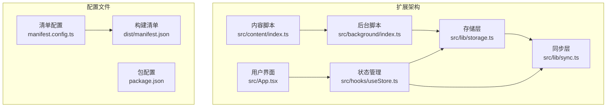

**图表来源**
- [manifest.config.ts](file://manifest.config.ts#L9-L39)
- [src/content/index.ts](file://src/content/index.ts#L1-L239)
- [src/background/index.ts](file://src/background/index.ts#L1-L114)

**章节来源**
- [manifest.config.ts](file://manifest.config.ts#L1-L40)
- [package.json](file://package.json#L1-L42)

## 核心组件

### 内容脚本系统

内容脚本是扩展与网页交互的核心接口，负责直接操作DOM元素和处理用户交互。

#### 浮动按钮组件架构

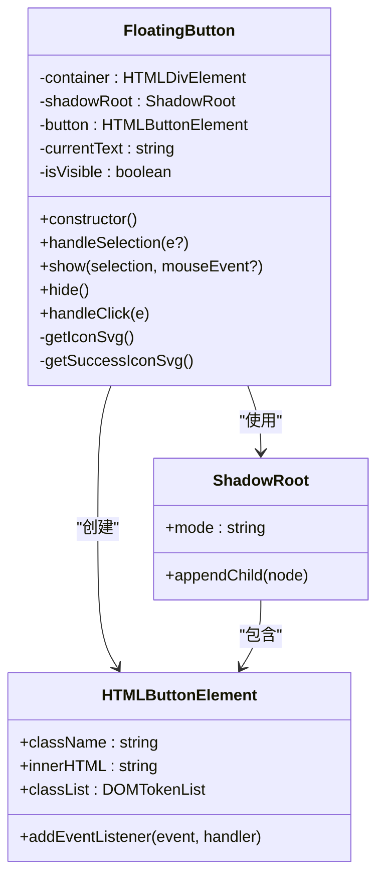

**图表来源**
- [src/content/index.ts](file://src/content/index.ts#L3-L235)

#### 事件监听器体系

内容脚本通过多种事件监听器实现智能交互：

| 事件类型 | 监听目标 | 功能描述 | 性质 |
|---------|---------|----------|------|
| `mouseup` | 文档 | 检测文本选择结束 | 主要触发源 |
| `keyup` | 文档 | 处理键盘选择 | 辅助触发源 |
| `scroll` | 窗口 | 隐藏按钮避免遮挡 | 被动监听 |
| `resize` | 窗口 | 重新计算按钮位置 | 被动监听 |
| `mousedown` | 按钮 | 阻止选择清除 | 交互保护 |

**章节来源**
- [src/content/index.ts](file://src/content/index.ts#L96-L101)

### 后台脚本系统

后台脚本作为扩展的中央控制器，负责任务创建、数据同步和权限管理。

#### 消息处理架构

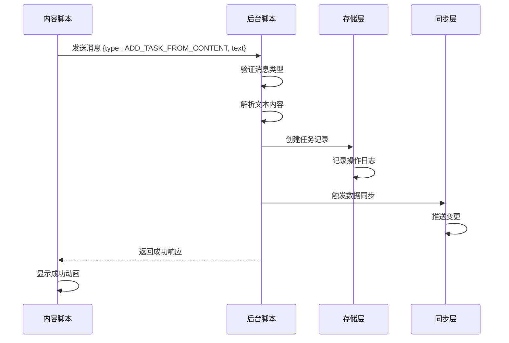

**图表来源**
- [src/content/index.ts](file://src/content/index.ts#L208-L234)
- [src/background/index.ts](file://src/background/index.ts#L68-L81)

**章节来源**
- [src/background/index.ts](file://src/background/index.ts#L67-L81)

## 架构概览

### 整体系统架构

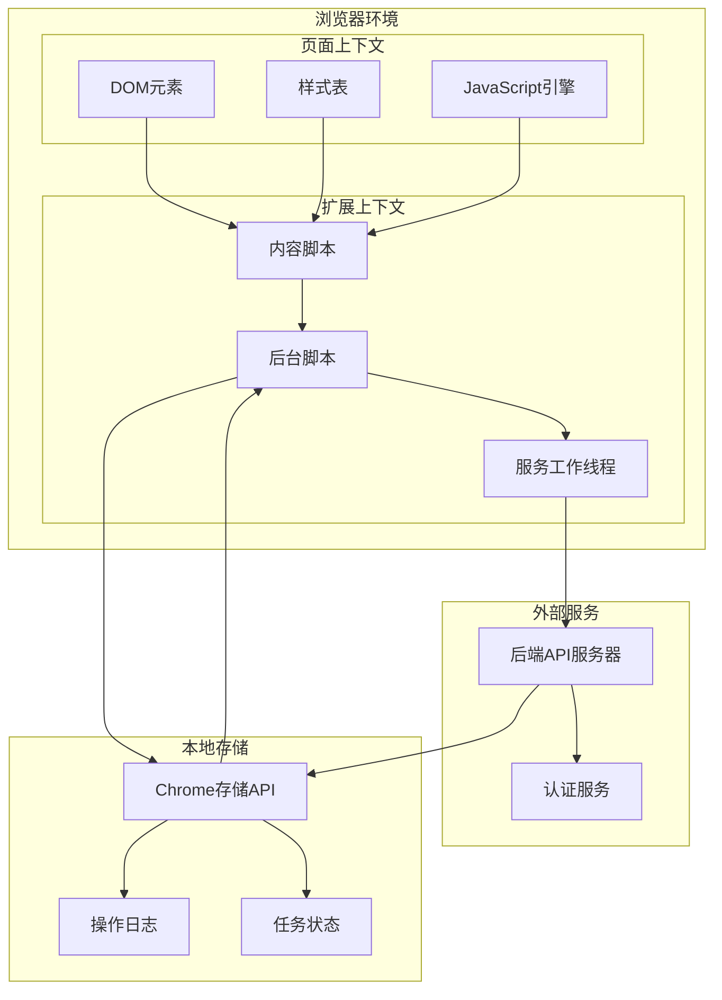

**图表来源**
- [manifest.config.ts](file://manifest.config.ts#L27-L38)
- [src/background/index.ts](file://src/background/index.ts#L1-L15)

### 数据流架构

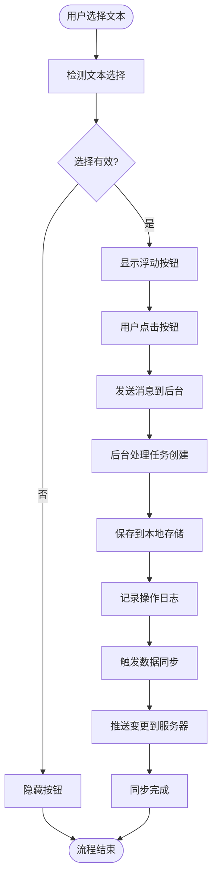

**图表来源**
- [src/content/index.ts](file://src/content/index.ts#L120-L133)
- [src/background/index.ts](file://src/background/index.ts#L18-L40)

## 详细组件分析

### 内容脚本组件分析

#### 浮动按钮实现

浮动按钮是内容脚本的核心UI组件，采用Shadow DOM技术确保样式隔离和跨页面兼容性。

##### 样式系统设计

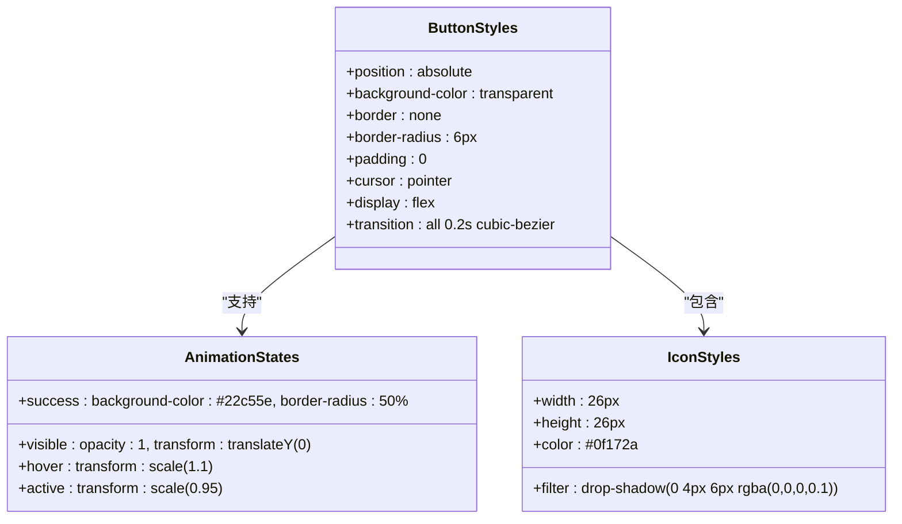

**图表来源**
- [src/content/index.ts](file://src/content/index.ts#L26-L76)

##### 位置计算算法

按钮的位置计算考虑了多种边界情况和用户体验因素：

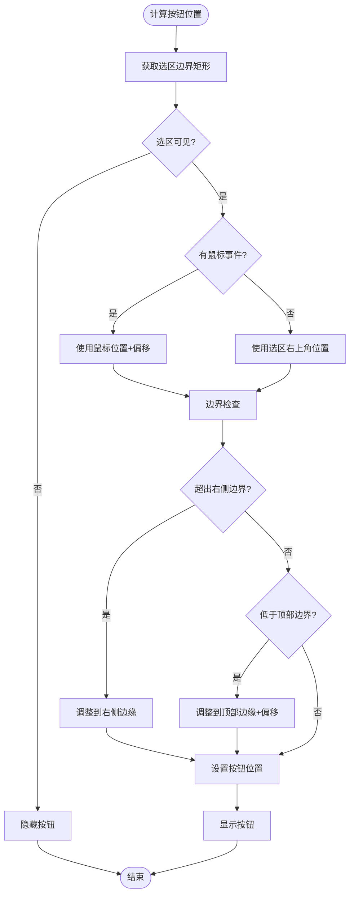

**图表来源**
- [src/content/index.ts](file://src/content/index.ts#L150-L186)

**章节来源**
- [src/content/index.ts](file://src/content/index.ts#L135-L186)

#### 选择检测机制

内容脚本实现了多层次的选择检测机制，确保在各种用户交互场景下都能正确识别可选文本。

##### 选择检测流程

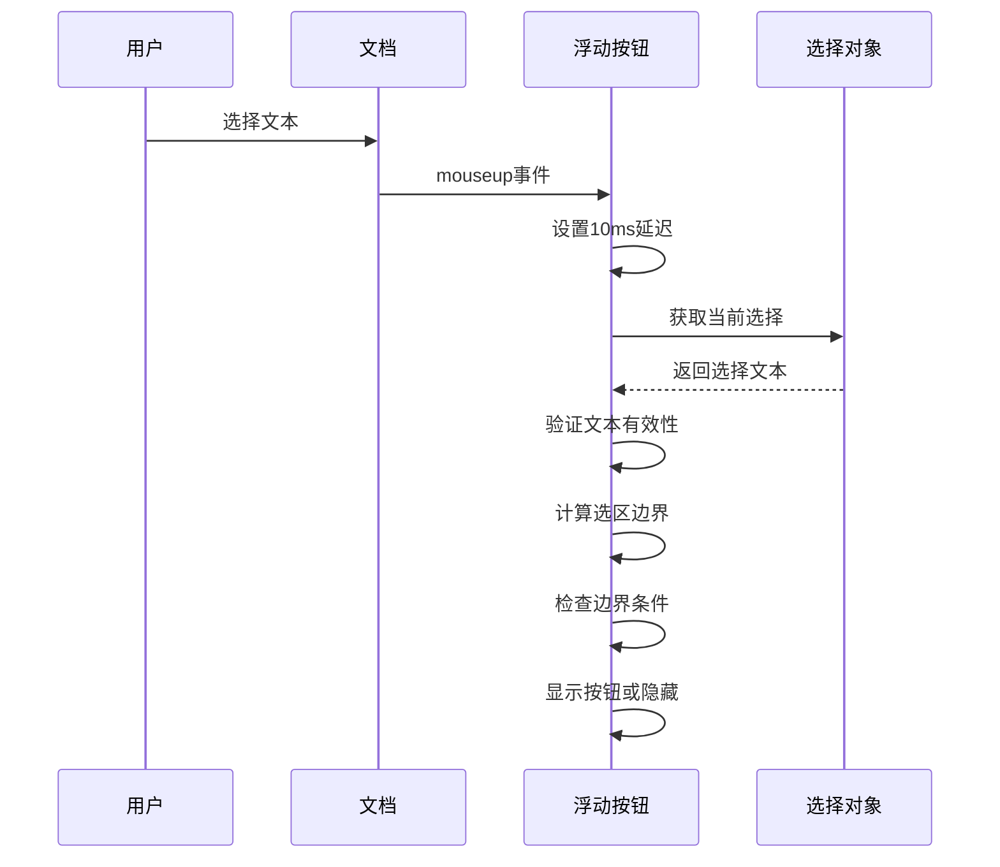

**图表来源**
- [src/content/index.ts](file://src/content/index.ts#L120-L133)

**章节来源**
- [src/content/index.ts](file://src/content/index.ts#L120-L133)

### 后台脚本组件分析

#### 任务创建流程

后台脚本负责处理来自内容脚本的任务创建请求，并进行必要的数据预处理。

##### 文本预处理算法

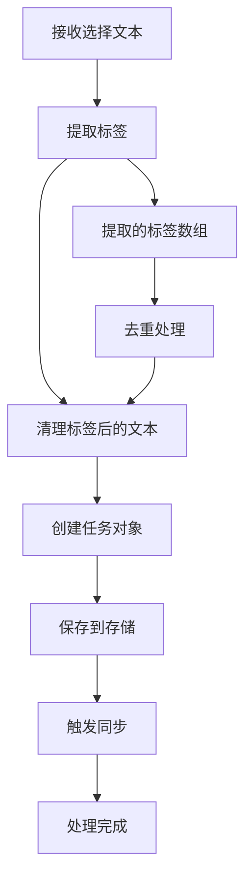

**图表来源**
- [src/background/index.ts](file://src/background/index.ts#L18-L40)

**章节来源**
- [src/background/index.ts](file://src/background/index.ts#L18-L40)

#### 同步机制

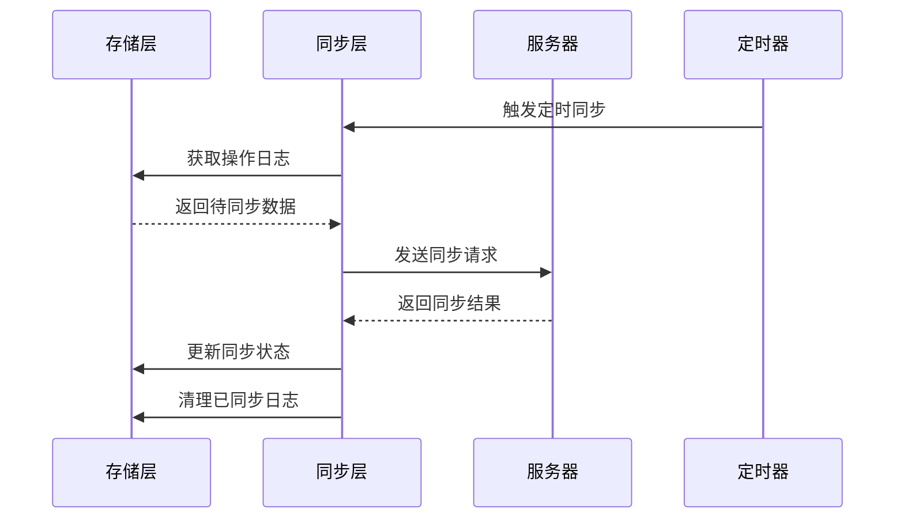

**图表来源**
- [src/lib/sync.ts](file://src/lib/sync.ts#L6-L53)
- [src/lib/storage.ts](file://src/lib/storage.ts#L109-L127)

**章节来源**
- [src/lib/sync.ts](file://src/lib/sync.ts#L6-L53)
- [src/lib/storage.ts](file://src/lib/storage.ts#L109-L127)

### 用户界面组件分析

#### React应用架构

前端应用采用React + Zustand的状态管理模式，提供直观的任务管理界面。

##### 状态管理架构

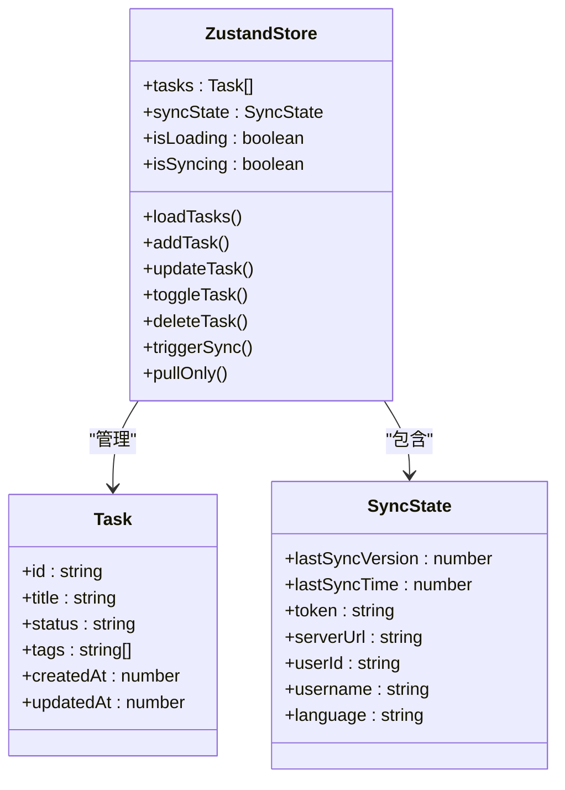

**图表来源**
- [src/hooks/useStore.ts](file://src/hooks/useStore.ts#L8-L26)

**章节来源**
- [src/hooks/useStore.ts](file://src/hooks/useStore.ts#L28-L192)

## 依赖关系分析

### 模块依赖图

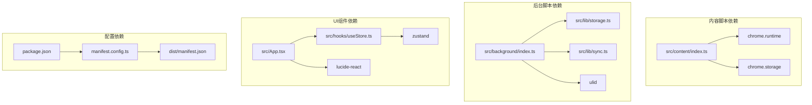

**图表来源**
- [src/content/index.ts](file://src/content/index.ts#L1-L239)
- [src/background/index.ts](file://src/background/index.ts#L1-L114)
- [manifest.config.ts](file://manifest.config.ts#L1-L40)

### 外部依赖分析

| 依赖包 | 版本 | 用途 | 安全性 |
|--------|------|------|--------|
| @crxjs/vite-plugin | ^2.3.0 | Chrome扩展打包 | ✅ 受信任 |
| react | ^19.2.0 | UI框架 | ✅ 受信任 |
| react-dom | ^19.2.0 | DOM渲染 | ✅ 受信任 |
| zustand | ^5.0.11 | 状态管理 | ✅ 受信任 |
| ulid | ^3.0.2 | 唯一ID生成 | ✅ 受信任 |
| lucide-react | ^0.575.0 | 图标库 | ✅ 受信任 |

**章节来源**
- [package.json](file://package.json#L12-L24)

## 性能考虑

### 内存管理策略

内容脚本采用轻量级设计，避免内存泄漏和性能问题：

1. **事件监听器管理**：使用被动监听器减少重绘开销
2. **DOM操作最小化**：仅在必要时创建和修改DOM元素
3. **阴影DOM隔离**：防止样式冲突和额外的DOM树遍历
4. **延迟处理**：选择检测使用10ms延迟避免重复计算

### 同步性能优化

后台脚本实现了高效的同步机制：

1. **增量同步**：仅同步变更的操作日志
2. **批量处理**：合并多个操作到单个请求中
3. **定时同步**：使用Chrome闹钟API定期触发同步
4. **错误恢复**：自动重试失败的同步操作

### 跨域通信优化

扩展通过以下方式优化跨域通信：

1. **CSP兼容**：使用受信任的资源路径
2. **权限最小化**：仅请求必要的host权限
3. **消息队列**：处理异步消息的顺序和去重
4. **超时控制**：为网络请求设置合理的超时时间

## 故障排除指南

### 常见问题诊断

#### 内容脚本不显示按钮

**可能原因**：
1. 页面阻止了扩展脚本注入
2. 选择检测逻辑未触发
3. 样式被页面覆盖

**解决步骤**：
1. 检查扩展是否启用
2. 验证内容脚本是否正确加载
3. 使用开发者工具检查按钮元素是否存在
4. 确认没有CSS规则隐藏按钮

#### 同步失败问题

**可能原因**：
1. 网络连接问题
2. 服务器认证失败
3. 操作日志格式错误

**解决步骤**：
1. 检查网络连接状态
2. 验证服务器URL配置
3. 查看后台脚本控制台错误
4. 清除操作日志并重试

#### 选择检测失效

**可能原因**：
1. 事件监听器未正确绑定
2. 页面使用了自定义选择机制
3. Shadow DOM兼容性问题

**解决步骤**：
1. 确认事件监听器已绑定
2. 检查页面是否有自定义选择处理
3. 验证Shadow DOM支持情况
4. 尝试不同的选择检测方法

### 调试技巧

#### 开发者工具使用

1. **扩展页面**：查看内容脚本的加载状态
2. **控制台**：监控消息传递和错误信息
3. **网络面板**：跟踪同步请求和响应
4. **存储面板**：验证数据持久化状态

#### 日志记录策略

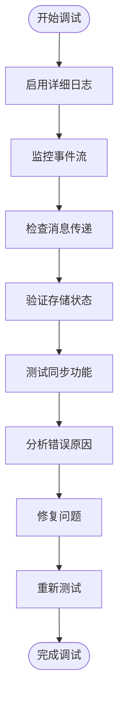

**图表来源**
- [src/content/index.ts](file://src/content/index.ts#L214-L233)
- [src/background/index.ts](file://src/background/index.ts#L214-L233)

## 结论

QKnot扩展的内容脚本集成为Chrome扩展开发提供了优秀的实践案例。通过精心设计的架构和实现，该扩展实现了：

1. **无缝的用户交互体验**：智能的浮动按钮和即时反馈
2. **可靠的跨域通信**：基于Chrome扩展API的安全消息传递
3. **高效的同步机制**：增量同步和错误恢复策略
4. **良好的性能表现**：内存管理和优化的事件处理

该实现展示了现代Web扩展开发的最佳实践，包括Shadow DOM的使用、事件驱动的架构设计、以及完善的错误处理机制。对于开发者而言，这是一个值得参考的技术实现方案。