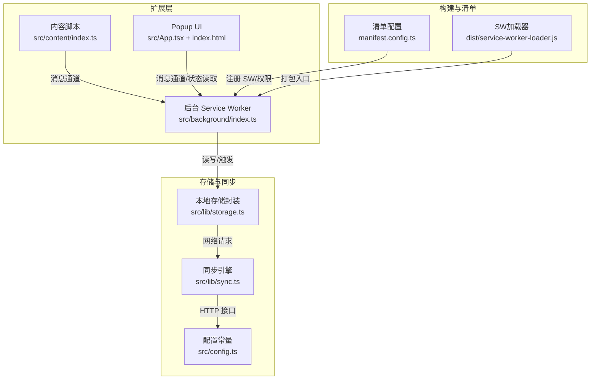
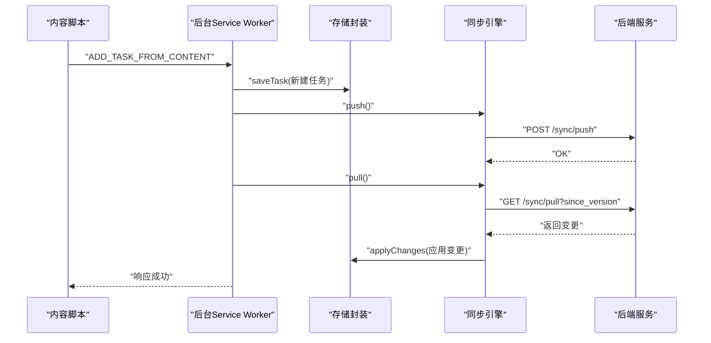
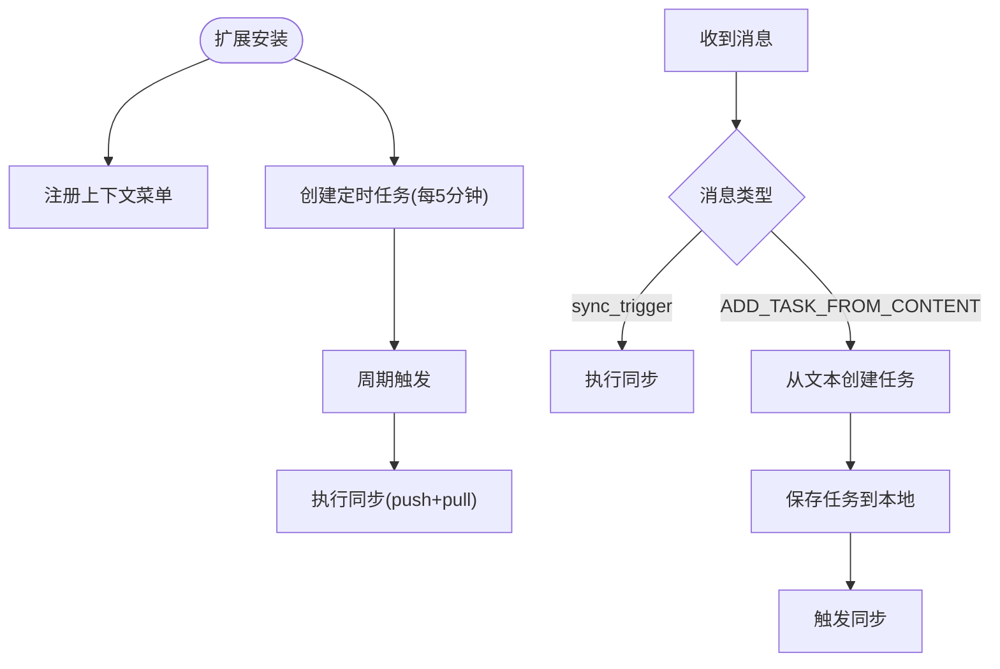
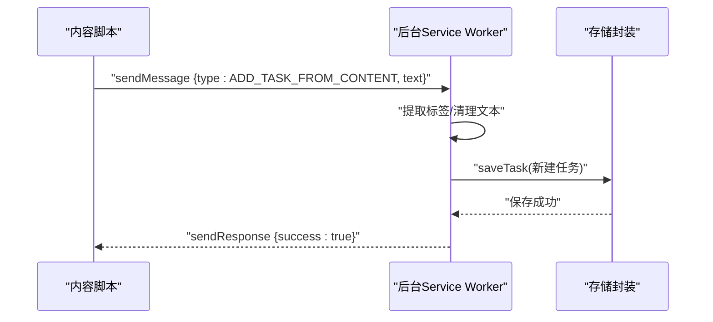
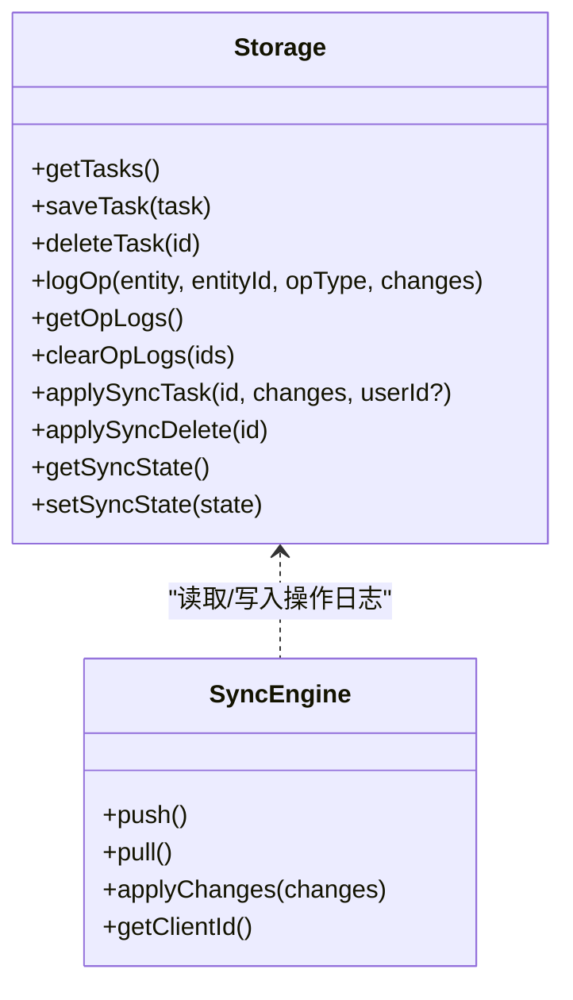
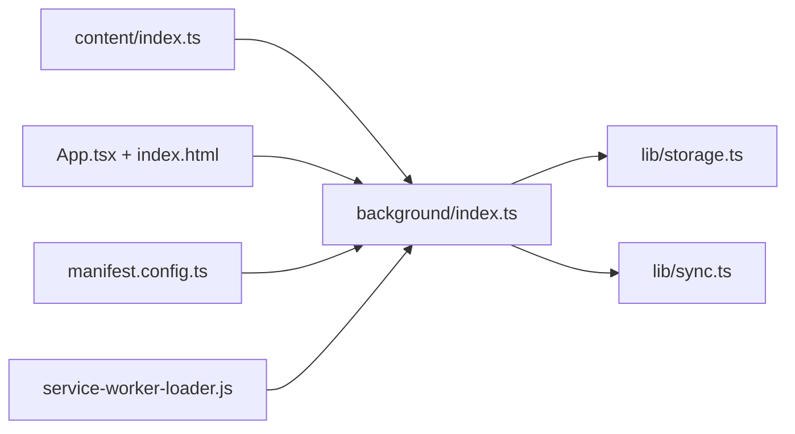

# 后台服务脚本

<cite>
**本文引用的文件**
- [src/background/index.ts](file://src/background/index.ts)
- [src/content/index.ts](file://src/content/index.ts)
- [src/lib/storage.ts](file://src/lib/storage.ts)
- [src/lib/sync.ts](file://src/lib/sync.ts)
- [src/config.ts](file://src/config.ts)
- [manifest.config.ts](file://manifest.config.ts)
- [dist/service-worker-loader.js](file://dist/service-worker-loader.js)
- [index.html](file://index.html)
- [src/main.tsx](file://src/main.tsx)
- [src/App.tsx](file://src/App.tsx)
- [package.json](file://package.json)
</cite>

## 目录
1. [简介](#简介)
2. [项目结构](#项目结构)
3. [核心组件](#核心组件)
4. [架构总览](#架构总览)
5. [详细组件分析](#详细组件分析)
6. [依赖关系分析](#依赖关系分析)
7. [性能考虑](#性能考虑)
8. [故障排查指南](#故障排查指南)
9. [结论](#结论)
10. [附录](#附录)

## 简介
本文件面向QKnot扩展的后台服务脚本，系统性阐述Service Worker的工作原理与生命周期管理、事件监听机制（启动、消息、定时任务、权限变更）、与popup界面及内容脚本的消息传递协议、异步操作处理与错误捕获/重试策略，并提供性能优化、内存管理与调试技巧，以及扩展更新、卸载与重新安装时的状态处理方案。目标是帮助开发者在不直接阅读源码的情况下也能快速理解后台逻辑与最佳实践。

## 项目结构
QKnot采用Chrome Extension Manifest V3，后台以模块化Service Worker形式运行，内容脚本注入到页面中，UI通过popup呈现，数据持久化使用chrome.storage.local，同步逻辑通过独立的storage与sync模块完成。

图表来源
- [src/background/index.ts](file://src/background/index.ts#L1-L114)
- [src/content/index.ts](file://src/content/index.ts#L1-L239)
- [src/lib/storage.ts](file://src/lib/storage.ts#L1-L272)
- [src/lib/sync.ts](file://src/lib/sync.ts#L1-L110)
- [src/config.ts](file://src/config.ts#L1-L2)
- [manifest.config.ts](file://manifest.config.ts#L1-L40)
- [dist/service-worker-loader.js](file://dist/service-worker-loader.js#L1-L2)
- [index.html](file://index.html#L1-L14)
- [src/main.tsx](file://src/main.tsx#L1-L11)
- [src/App.tsx](file://src/App.tsx#L1-L860)

章节来源
- [manifest.config.ts](file://manifest.config.ts#L1-L40)
- [dist/service-worker-loader.js](file://dist/service-worker-loader.js#L1-L2)

## 核心组件
- 后台Service Worker：负责定时任务、消息监听、上下文菜单、任务创建与触发同步。
- 内容脚本：在页面中提供悬浮按钮，选择文本后向后台发送消息创建任务。
- 存储封装：抽象chrome.storage.local，提供任务、操作日志、同步状态等方法。
- 同步引擎：基于操作日志推送/拉取，应用变更并维护lastSyncVersion。
- 配置常量：默认服务器地址。
- 清单配置：声明后台脚本、权限、内容脚本与action popup。

章节来源
- [src/background/index.ts](file://src/background/index.ts#L1-L114)
- [src/content/index.ts](file://src/content/index.ts#L1-L239)
- [src/lib/storage.ts](file://src/lib/storage.ts#L1-L272)
- [src/lib/sync.ts](file://src/lib/sync.ts#L1-L110)
- [src/config.ts](file://src/config.ts#L1-L2)
- [manifest.config.ts](file://manifest.config.ts#L1-L40)

## 架构总览
后台Service Worker作为中枢，统一调度以下流程：
- 定时任务：每5分钟触发一次自动同步（push+pull）。
- 消息通道：接收来自内容脚本与popup的消息，执行相应动作。
- 上下文菜单：支持“添加选中文本”和“添加当前页面”两种入口。
- 存储与同步：通过storage记录任务与操作日志，由sync模块进行网络同步。

图表来源
- [src/content/index.ts](file://src/content/index.ts#L208-L234)
- [src/background/index.ts](file://src/background/index.ts#L68-L81)
- [src/lib/storage.ts](file://src/lib/storage.ts#L55-L95)
- [src/lib/sync.ts](file://src/lib/sync.ts#L24-L52)
- [src/lib/sync.ts](file://src/lib/sync.ts#L59-L82)

## 详细组件分析

### Service Worker 生命周期与事件监听
- 启动事件：扩展安装完成后注册上下文菜单；同时创建周期性定时任务（每5分钟）。
- 消息监听：监听来自内容脚本与popup的消息类型，分别执行手动同步或创建任务。
- 定时任务：通过chrome.alarms.onAlarm监听周期性触发，执行push+pull。
- 权限变化：通过清单permissions声明storage、alarms、contextMenus，运行时按需使用。

图表来源
- [src/background/index.ts](file://src/background/index.ts#L84-L98)
- [src/background/index.ts](file://src/background/index.ts#L10-L15)
- [src/background/index.ts](file://src/background/index.ts#L68-L81)
- [src/background/index.ts](file://src/background/index.ts#L18-L65)

章节来源
- [src/background/index.ts](file://src/background/index.ts#L1-L114)
- [manifest.config.ts](file://manifest.config.ts#L31-L32)

### 任务创建与消息协议
- 内容脚本通过chrome.runtime.sendMessage发送“ADD_TASK_FROM_CONTENT”，携带选中文本。
- 后台解析文本中的标签（#开头），去除标签后生成任务对象，调用storage保存并触发同步。
- 任务创建函数同时支持“从页面标题+URL”创建带链接的任务。

图表来源
- [src/content/index.ts](file://src/content/index.ts#L208-L234)
- [src/background/index.ts](file://src/background/index.ts#L68-L81)
- [src/background/index.ts](file://src/background/index.ts#L18-L40)

章节来源
- [src/content/index.ts](file://src/content/index.ts#L1-L239)
- [src/background/index.ts](file://src/background/index.ts#L18-L65)

### 同步机制与操作日志
- 存储封装提供任务增删改查、操作日志记录、同步状态管理。
- 每次任务变更都会记录操作日志（OpLog），用于后续push。
- 同步引擎根据OpLog批量推送，拉取远端变更并应用，更新lastSyncVersion。
- 当用户登录后，会先拉取云端任务，再决定是否合并离线任务。

图表来源
- [src/lib/storage.ts](file://src/lib/storage.ts#L48-L272)
- [src/lib/sync.ts](file://src/lib/sync.ts#L5-L110)

章节来源
- [src/lib/storage.ts](file://src/lib/storage.ts#L1-L272)
- [src/lib/sync.ts](file://src/lib/sync.ts#L1-L110)

### 异步操作、错误捕获与重试
- 所有I/O操作均使用Promise/async-await，避免阻塞主线程。
- push/pull失败时抛出异常，供上层toast提示或静默处理。
- 自动同步采用周期性触发，若某次失败不影响下次触发。
- 内容脚本发送消息后检查chrome.runtime.lastError，确保错误可见。

章节来源
- [src/lib/sync.ts](file://src/lib/sync.ts#L24-L52)
- [src/lib/sync.ts](file://src/lib/sync.ts#L59-L82)
- [src/content/index.ts](file://src/content/index.ts#L208-L234)

### 与Popup界面的消息传递
- Popup在首次打开时可触发同步（triggerSync），并在登录后自动拉取云端数据。
- Popup通过store与后台交互，后台通过sendMessage通知触发同步。
- 同步状态（token、serverUrl、userId等）由storage维护，供同步引擎使用。

章节来源
- [src/App.tsx](file://src/App.tsx#L35-L46)
- [src/App.tsx](file://src/App.tsx#L62-L72)
- [src/lib/storage.ts](file://src/lib/storage.ts#L196-L204)

## 依赖关系分析
- 后台Service Worker依赖storage与sync模块，二者通过chrome.storage.local进行数据持久化与网络同步。
- 内容脚本仅依赖chrome.runtime消息API，不直接访问存储。
- 清单配置声明后台脚本路径、权限与内容脚本匹配规则。
- 构建产物dist/service-worker-loader.js指向打包后的入口。

图表来源
- [src/background/index.ts](file://src/background/index.ts#L1-L3)
- [src/content/index.ts](file://src/content/index.ts#L1-L239)
- [src/lib/storage.ts](file://src/lib/storage.ts#L1-L272)
- [src/lib/sync.ts](file://src/lib/sync.ts#L1-L110)
- [manifest.config.ts](file://manifest.config.ts#L27-L38)
- [dist/service-worker-loader.js](file://dist/service-worker-loader.js#L1-L2)

章节来源
- [manifest.config.ts](file://manifest.config.ts#L1-L40)
- [dist/service-worker-loader.js](file://dist/service-worker-loader.js#L1-L2)

## 性能考虑
- 使用chrome.alarms定期触发同步，避免频繁轮询带来的CPU占用。
- 任务创建与存储采用批量写入，减少多次I/O。
- 同步引擎基于操作日志增量推送，降低网络负载。
- 内容脚本悬浮按钮仅在有效选区出现，减少DOM操作与样式计算。
- 建议：在高并发场景下，对push/pull增加去抖/节流，避免短时间内重复触发。

[本节为通用性能建议，无需特定文件引用]

## 故障排查指南
- 同步失败
  - 检查token与serverUrl是否正确设置（storage.getSyncState）。
  - 查看push/pull的网络请求状态与错误信息。
  - 确认后端接口可用且版本号递增。
- 消息通道问题
  - 内容脚本发送消息后检查chrome.runtime.lastError。
  - 确保后台onMessage监听已注册且返回true以保持通道开放。
- 定时任务未触发
  - 检查chrome.alarms.create是否成功，onAlarm监听是否生效。
- 数据不一致
  - 检查OpLog是否正确记录与清理。
  - 登录后先pull再决定是否合并离线任务。

章节来源
- [src/lib/sync.ts](file://src/lib/sync.ts#L24-L52)
- [src/lib/sync.ts](file://src/lib/sync.ts#L59-L82)
- [src/content/index.ts](file://src/content/index.ts#L208-L234)
- [src/background/index.ts](file://src/background/index.ts#L10-L15)
- [src/lib/storage.ts](file://src/lib/storage.ts#L108-L127)

## 结论
QKnot的后台Service Worker通过清晰的事件驱动模型与模块化设计，实现了稳定的任务创建、自动同步与状态管理。结合操作日志与增量同步策略，能够在保证数据一致性的同时兼顾性能与用户体验。建议在生产环境中进一步完善错误重试、幂等处理与可观测性指标，以提升稳定性与可维护性。

[本节为总结性内容，无需特定文件引用]

## 附录

### 扩展更新、卸载与重新安装的状态处理
- 更新：Manifest V3下后台脚本热更新，建议保留storage键名不变，避免破坏用户数据。
- 卸载：chrome.runtime.onSuspended不会被调用；如需清理，可在onStartup或首次安装时做迁移。
- 重新安装：storage数据仍保留；若需要强制清空，可在onInstalled中执行清理逻辑（例如清空tasks/opLogs/syncState）。

章节来源
- [src/background/index.ts](file://src/background/index.ts#L84-L98)
- [src/lib/storage.ts](file://src/lib/storage.ts#L244-L265)

### 关键配置与入口
- 后台脚本入口：src/background/index.ts
- 清单配置：manifest.config.ts（声明后台、权限、内容脚本）
- 构建加载器：dist/service-worker-loader.js
- Popup入口：index.html + src/main.tsx + src/App.tsx

章节来源
- [manifest.config.ts](file://manifest.config.ts#L27-L38)
- [dist/service-worker-loader.js](file://dist/service-worker-loader.js#L1-L2)
- [index.html](file://index.html#L1-L14)
- [src/main.tsx](file://src/main.tsx#L1-L11)
- [src/App.tsx](file://src/App.tsx#L1-L860)