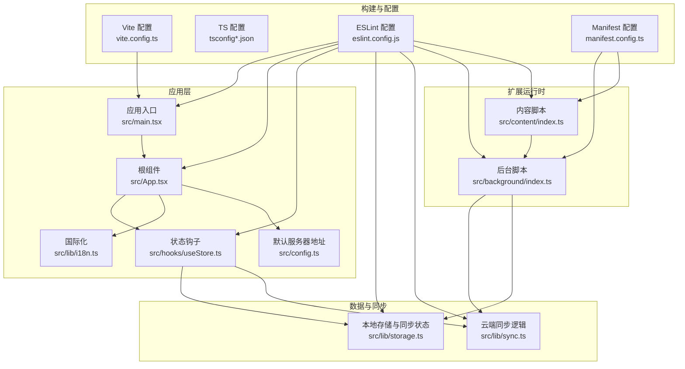
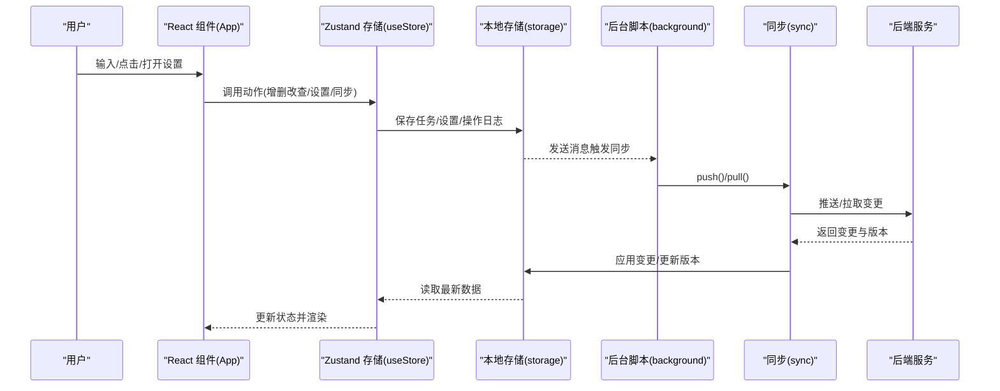
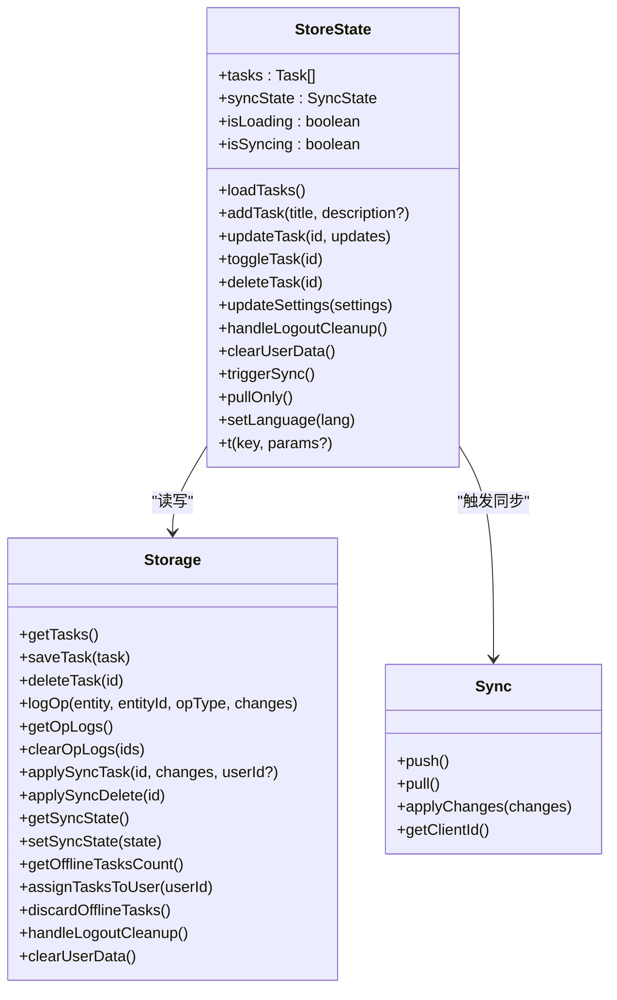
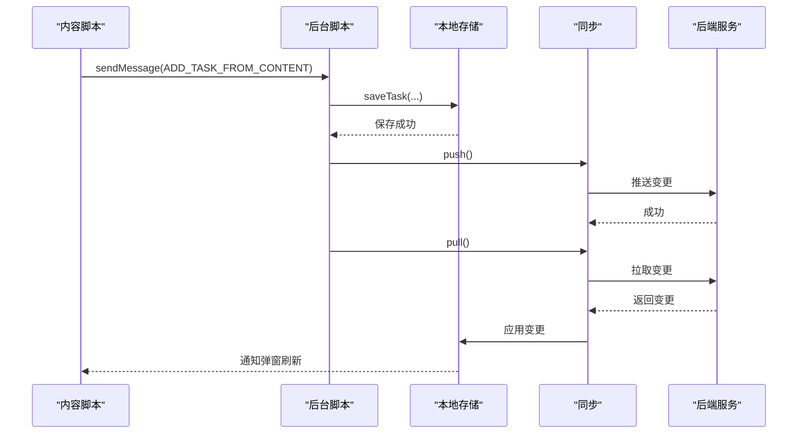
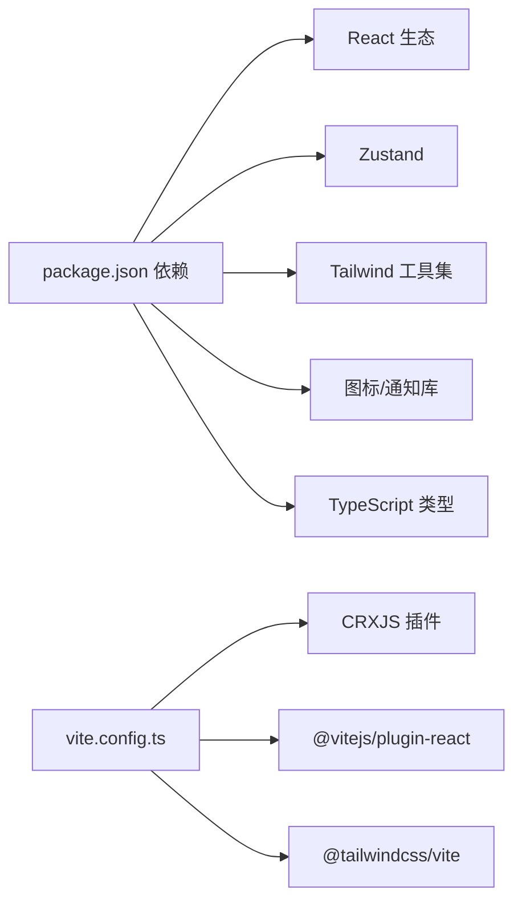

# 代码规范与风格

<cite>
**本文引用的文件**
- [eslint.config.js](file://eslint.config.js)
- [package.json](file://package.json)
- [tsconfig.json](file://tsconfig.json)
- [tsconfig.app.json](file://tsconfig.app.json)
- [vite.config.ts](file://vite.config.ts)
- [manifest.config.ts](file://manifest.config.ts)
- [src/main.tsx](file://src/main.tsx)
- [src/App.tsx](file://src/App.tsx)
- [src/hooks/useStore.ts](file://src/hooks/useStore.ts)
- [src/lib/storage.ts](file://src/lib/storage.ts)
- [src/lib/sync.ts](file://src/lib/sync.ts)
- [src/lib/i18n.ts](file://src/lib/i18n.ts)
- [src/config.ts](file://src/config.ts)
- [src/background/index.ts](file://src/background/index.ts)
- [src/content/index.ts](file://src/content/index.ts)
</cite>

## 目录
1. [简介](#简介)
2. [项目结构](#项目结构)
3. [核心组件](#核心组件)
4. [架构总览](#架构总览)
5. [详细组件分析](#详细组件分析)
6. [依赖关系分析](#依赖关系分析)
7. [性能考量](#性能考量)
8. [故障排查指南](#故障排查指南)
9. [结论](#结论)
10. [附录](#附录)

## 简介
本指南面向 QKnot Chrome 扩展的开发者，提供一套统一的代码规范与风格标准，覆盖 ESLint 规则、TypeScript 类型定义、React 组件编码、命名约定、文件组织与导入导出、代码格式化、注释与文档字符串模板、Zustand 状态管理最佳实践、Chrome 扩展特定模式以及异步编程规范，并配套开发工具配置与自动化检查流程建议。

## 项目结构
QKnot 采用 Vite + React + TypeScript 构建，使用 CRXJS 插件生成 Chrome Manifest V3 扩展包；核心源码位于 src 目录，按职责划分为应用入口、UI 组件、状态管理、存储与同步、国际化、后台脚本与内容脚本等模块。

图表来源
- [vite.config.ts](file://vite.config.ts#L1-L21)
- [tsconfig.json](file://tsconfig.json#L1-L8)
- [tsconfig.app.json](file://tsconfig.app.json#L1-L29)
- [eslint.config.js](file://eslint.config.js#L1-L24)
- [manifest.config.ts](file://manifest.config.ts#L1-L40)
- [src/main.tsx](file://src/main.tsx#L1-L11)
- [src/App.tsx](file://src/App.tsx#L1-L860)
- [src/hooks/useStore.ts](file://src/hooks/useStore.ts#L1-L193)
- [src/lib/storage.ts](file://src/lib/storage.ts#L1-L272)
- [src/lib/sync.ts](file://src/lib/sync.ts#L1-L110)
- [src/lib/i18n.ts](file://src/lib/i18n.ts#L1-L146)
- [src/config.ts](file://src/config.ts#L1-L2)
- [src/background/index.ts](file://src/background/index.ts#L1-L114)
- [src/content/index.ts](file://src/content/index.ts#L1-L239)

章节来源
- [vite.config.ts](file://vite.config.ts#L1-L21)
- [tsconfig.json](file://tsconfig.json#L1-L8)
- [tsconfig.app.json](file://tsconfig.app.json#L1-L29)
- [eslint.config.js](file://eslint.config.js#L1-L24)
- [manifest.config.ts](file://manifest.config.ts#L1-L40)

## 核心组件
- 应用入口与根组件：负责初始化样式、挂载根组件、承载全局 UI 与视图切换。
- Zustand 状态管理：集中管理任务列表、同步状态、加载与同步状态、国际化翻译与语言设置。
- 存储与同步：封装 chrome.storage.local 的读写、操作日志记录、云端推送拉取与变更应用。
- 国际化：多语言文案与语言选择。
- 背景脚本与内容脚本：实现定时自动同步、上下文菜单与页面浮动按钮注入，触发任务创建与手动同步。

章节来源
- [src/main.tsx](file://src/main.tsx#L1-L11)
- [src/App.tsx](file://src/App.tsx#L1-L860)
- [src/hooks/useStore.ts](file://src/hooks/useStore.ts#L1-L193)
- [src/lib/storage.ts](file://src/lib/storage.ts#L1-L272)
- [src/lib/sync.ts](file://src/lib/sync.ts#L1-L110)
- [src/lib/i18n.ts](file://src/lib/i18n.ts#L1-L146)
- [src/background/index.ts](file://src/background/index.ts#L1-L114)
- [src/content/index.ts](file://src/content/index.ts#L1-L239)

## 架构总览
下图展示从用户交互到云端同步的端到端流程，包括 UI、状态、存储与后台服务的协作。

图表来源
- [src/App.tsx](file://src/App.tsx#L1-L860)
- [src/hooks/useStore.ts](file://src/hooks/useStore.ts#L1-L193)
- [src/lib/storage.ts](file://src/lib/storage.ts#L1-L272)
- [src/lib/sync.ts](file://src/lib/sync.ts#L1-L110)
- [src/background/index.ts](file://src/background/index.ts#L1-L114)

## 详细组件分析

### ESLint 配置与规则
- 文件范围：仅对 TypeScript/TSX 文件启用，推荐使用 flat 配置形式，便于与现代工具链集成。
- 推荐规则族：
  - 基础推荐：@eslint/js 的 recommended
  - TypeScript：typescript-eslint 的 recommended
  - React Hooks：eslint-plugin-react-hooks 的推荐规则
  - React 刷新：eslint-plugin-react-refresh 的 Vite 集成
  - 全局环境：浏览器 globals
- 建议补充：
  - 禁止未使用的变量与参数（可结合 tsconfig 的严格模式）
  - 禁止 switch fallthrough
  - 禁止 unchecked side effects 的导入
  - 自动修复命令：npm 脚本 lint 支持 --fix
  - 忽略 dist 输出目录

章节来源
- [eslint.config.js](file://eslint.config.js#L1-L24)
- [package.json](file://package.json#L6-L11)

### TypeScript 类型定义规范
- 严格模式：开启 strict，关闭 noUnusedLocals/noUnusedParameters 以平衡团队习惯。
- 模块解析：bundler 模式，避免隐式 any。
- JSX：使用 react-jsx，确保 React 类型正确推断。
- Chrome 扩展类型：在 types 中声明 chrome，确保 runtime/storage 等 API 类型安全。
- 接口与类型：
  - Task：包含 id、userId、title、description、status、priority、tags、时间戳与删除标记。
  - OpLog：实体、实体ID、操作类型、变更内容、客户端时间戳。
  - SyncState：最后同步版本、时间、token、服务器地址、用户信息、语言。
- 命名建议：接口以大驼峰开头，枚举值全大写，常量全大写+下划线。

章节来源
- [tsconfig.app.json](file://tsconfig.app.json#L1-L29)
- [src/lib/storage.ts](file://src/lib/storage.ts#L4-L34)

### React 组件编码标准
- 函数组件优先：使用函数组件与 Hooks，避免类组件。
- 状态最小化：将非 UI 状态放入 Zustand，组件内仅保留局部 UI 状态。
- 异步处理：所有网络请求与存储操作均应使用 async/await，错误捕获与提示。
- 事件与副作用：useEffect 使用明确依赖数组，避免闭包陷阱；必要时通过 store.getState 获取最新状态。
- 可访问性：为按钮提供 aria-label，确保键盘可达。
- 样式：使用 TailwindCSS 类名，避免内联样式；组件间共享样式使用工具类组合。
- 图标与通知：统一使用 lucide-react 图标库，使用 sonner 进行 toast 提示。

章节来源
- [src/App.tsx](file://src/App.tsx#L1-L860)
- [src/main.tsx](file://src/main.tsx#L1-L11)

### 命名约定
- 变量与函数：小驼峰，语义明确，避免缩写。
- 组件：帕斯卡命名，如 App、FloatingButton。
- 接口与类型：帕斯卡命名，如 Task、SyncState。
- 常量：全大写+下划线，如 DEFAULT_SERVER_URL。
- 文件：功能或组件名，如 useStore.ts、storage.ts、sync.ts。
- 导入别名：统一 @ 别名指向 src，提升可读性。

章节来源
- [src/config.ts](file://src/config.ts#L1-L2)
- [vite.config.ts](file://vite.config.ts#L15-L19)

### 文件组织与导入导出
- 按职责分层：src 下按 hooks、lib、background、content、assets 组织。
- 导入路径：统一使用相对路径或 @ 别名，避免深层 ../..。
- 导出策略：每个模块导出单一职责的函数或对象，避免默认导出滥用。
- 类型与实现分离：类型定义尽量独立文件，便于复用。

章节来源
- [vite.config.ts](file://vite.config.ts#L15-L19)
- [src/hooks/useStore.ts](file://src/hooks/useStore.ts#L1-L193)
- [src/lib/storage.ts](file://src/lib/storage.ts#L1-L272)

### 代码格式化与注释标准
- 格式化：推荐配合 Prettier 或 IDE 格式化插件，保持一致缩进与换行。
- 注释：
  - 函数/方法：说明用途、参数、返回值与异常。
  - 复杂逻辑：分步骤注释，解释业务背景与边界条件。
  - TODO/NOTE：使用明确标记，便于后续清理。
- 文档字符串模板：函数/类首行简述，空行后详细说明，参数与返回值分节列出。

### Zustand 状态管理最佳实践
- 单一 Store：将任务、同步状态、加载与同步状态集中在一个 store 中，避免分散状态。
- 动作函数：每个动作函数负责一个原子操作，内部进行乐观更新与持久化。
- 异步动作：在动作中统一处理异步，避免在组件中直接调用异步逻辑。
- 语言与翻译：store 内部维护 t(key, params) 与 setLanguage，保证 UI 与状态解耦。
- 同步控制：暴露 triggerSync 与 pullOnly，分别用于完整同步与仅拉取，避免重复推送。

图表来源
- [src/hooks/useStore.ts](file://src/hooks/useStore.ts#L8-L26)
- [src/lib/storage.ts](file://src/lib/storage.ts#L49-L271)
- [src/lib/sync.ts](file://src/lib/sync.ts#L5-L110)

章节来源
- [src/hooks/useStore.ts](file://src/hooks/useStore.ts#L1-L193)
- [src/lib/storage.ts](file://src/lib/storage.ts#L1-L272)
- [src/lib/sync.ts](file://src/lib/sync.ts#L1-L110)

### Chrome 扩展特定代码模式
- 后台脚本：
  - 定时器：使用 chrome.alarms 创建周期性同步任务。
  - 上下文菜单：动态创建与监听，支持选中文本与页面链接。
  - 消息通信：与内容脚本与弹出页通过 chrome.runtime.sendMessage 通信。
- 内容脚本：
  - 浮动按钮：Shadow DOM 注入，响应选择变化，发送消息到后台。
  - 交互反馈：成功态动画与选区清理。
- 清单配置：
  - M3：service_worker、permissions、host_permissions、content_scripts。
  - 动态版本号：从 package.json 版本解析主次补丁。

图表来源
- [src/content/index.ts](file://src/content/index.ts#L208-L234)
- [src/background/index.ts](file://src/background/index.ts#L68-L81)
- [src/lib/storage.ts](file://src/lib/storage.ts#L55-L95)
- [src/lib/sync.ts](file://src/lib/sync.ts#L24-L53)

章节来源
- [src/background/index.ts](file://src/background/index.ts#L1-L114)
- [src/content/index.ts](file://src/content/index.ts#L1-L239)
- [manifest.config.ts](file://manifest.config.ts#L1-L40)

### 异步编程规范
- 统一使用 async/await，避免 Promise 链过深。
- 错误处理：try/catch 包裹网络与存储操作，必要时向用户提示。
- 并发控制：避免在同一时间段多次触发同步，使用 isSyncing 状态防抖。
- 乐观更新：在写入前先更新本地状态，失败时回滚或提示。
- 超时与重试：根据需要引入超时与有限重试策略（建议在 sync 层扩展）。

章节来源
- [src/App.tsx](file://src/App.tsx#L62-L72)
- [src/hooks/useStore.ts](file://src/hooks/useStore.ts#L167-L179)
- [src/lib/sync.ts](file://src/lib/sync.ts#L24-L53)

## 依赖关系分析
- 开发工具链：Vite + React + TypeScript + CRXJS + TailwindCSS。
- 运行时依赖：React 生态、Zustand、Tailwind 工具集、图标与通知库。
- 类型依赖：@types/react、@types/react-dom、@types/chrome、globals。
- 构建与打包：Vite 负责开发与生产构建，CRXJS 生成扩展包。

图表来源
- [package.json](file://package.json#L12-L40)
- [vite.config.ts](file://vite.config.ts#L1-L21)

章节来源
- [package.json](file://package.json#L1-L42)
- [vite.config.ts](file://vite.config.ts#L1-L21)

## 性能考量
- 渲染优化：组件按需渲染，避免不必要的重渲染；使用 useMemo/useCallback 缓存计算结果。
- 状态粒度：将高频更新与低频更新拆分，减少无关状态导致的重渲染。
- 存储与同步：批量写入与操作日志，避免频繁 I/O；合理使用 push/pull 分离策略。
- UI 动画：内容脚本浮动按钮使用 CSS 动画，避免 JS 驱动的复杂动画。
- 构建体积：Tree-shaking 与按需引入，避免引入未使用模块。

## 故障排查指南
- 同步失败：
  - 检查 token 与 serverUrl 是否存在。
  - 查看后台脚本日志与网络面板错误。
  - 确认 push/pull 返回状态与版本号更新。
- 登录/注册问题：
  - 校验用户名/密码格式与后端返回错误。
  - 检查本地存储中的 token 与用户信息。
- 任务丢失或重复：
  - 核对 OpLog 与 applySync 的应用逻辑。
  - 确保 userId 在用户登录后正确赋值。
- 内容脚本无响应：
  - 检查上下文菜单权限与消息通道。
  - 确认 Shadow DOM 注入与事件绑定。

章节来源
- [src/lib/sync.ts](file://src/lib/sync.ts#L24-L53)
- [src/lib/storage.ts](file://src/lib/storage.ts#L108-L127)
- [src/background/index.ts](file://src/background/index.ts#L68-L81)
- [src/content/index.ts](file://src/content/index.ts#L208-L234)

## 结论
本规范围绕 QKnot 扩展的实际代码结构制定，强调 TypeScript 严格性、React 组件简洁性、Zustand 状态一致性、Chrome 扩展运行时稳定性与异步编程可靠性。遵循上述规范可显著提升代码质量、可维护性与团队协作效率。

## 附录

### 开发工具与自动化检查流程
- 本地开发：npm run dev 启动 Vite 开发服务器。
- 构建产物：npm run build 顺序执行 tsc 与 vite build。
- 代码检查：npm run lint 执行 ESLint，建议配合 --fix。
- 预览：npm run preview 本地预览生产构建。
- 类型检查：确保 tsconfig 的严格模式与 bundler 解析生效。

章节来源
- [package.json](file://package.json#L6-L11)
- [tsconfig.app.json](file://tsconfig.app.json#L20-L25)