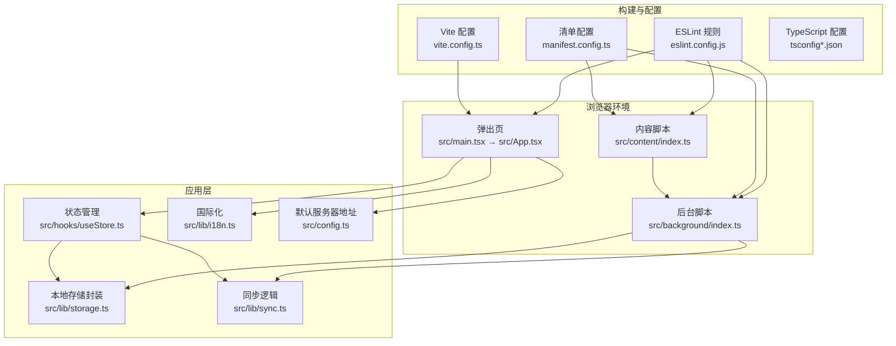
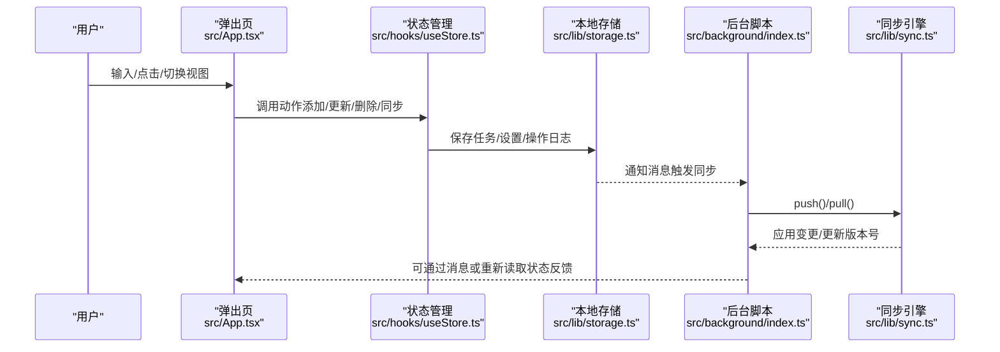
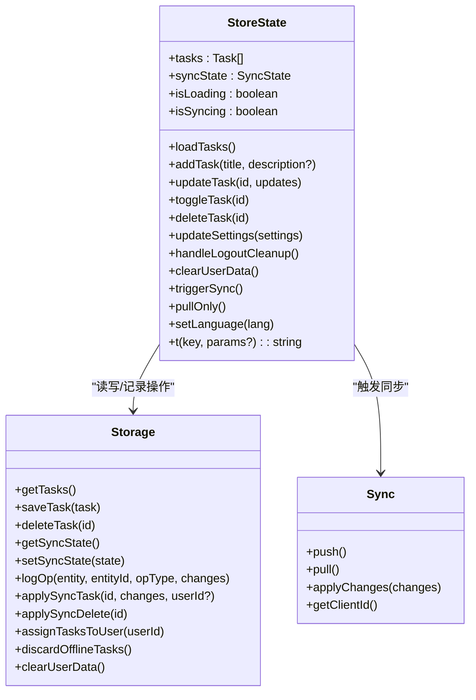
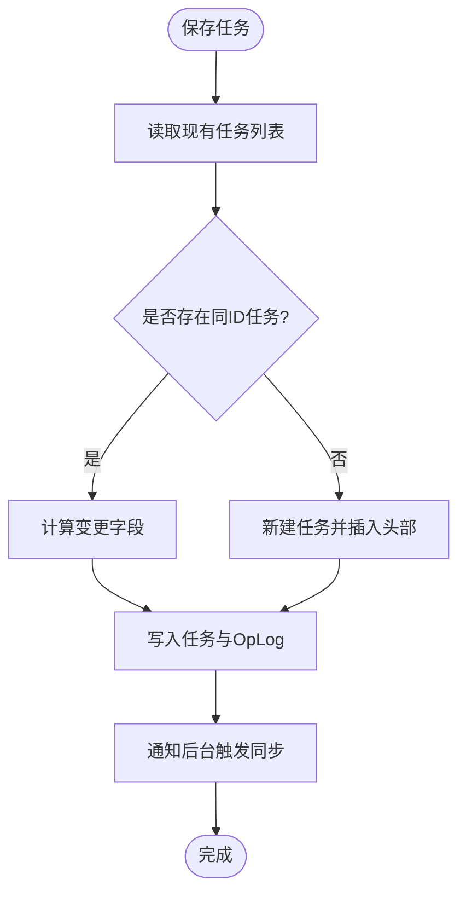
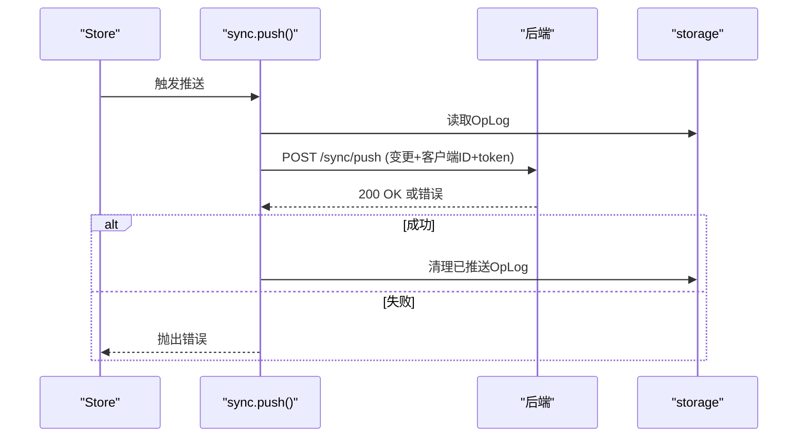
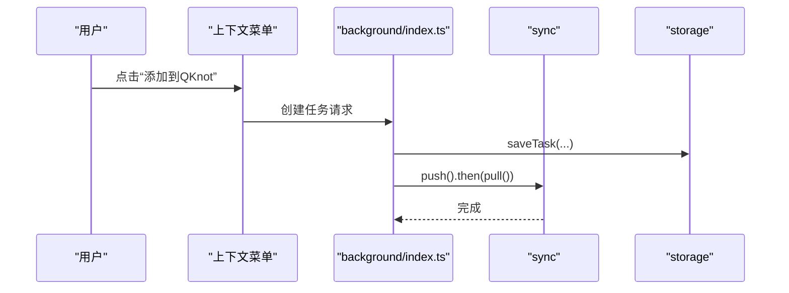
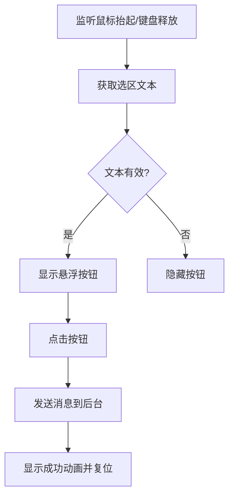
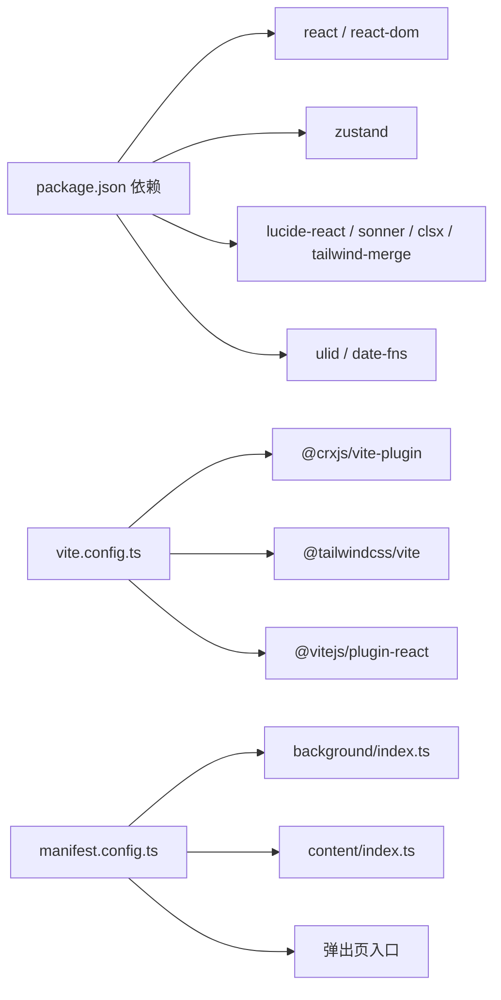

# 开发指南

<cite>
**本文引用的文件**
- [package.json](file://package.json)
- [manifest.config.ts](file://manifest.config.ts)
- [vite.config.ts](file://vite.config.ts)
- [tsconfig.json](file://tsconfig.json)
- [tsconfig.app.json](file://tsconfig.app.json)
- [tsconfig.node.json](file://tsconfig.node.json)
- [eslint.config.js](file://eslint.config.js)
- [src/main.tsx](file://src/main.tsx)
- [src/App.tsx](file://src/App.tsx)
- [src/hooks/useStore.ts](file://src/hooks/useStore.ts)
- [src/lib/storage.ts](file://src/lib/storage.ts)
- [src/lib/sync.ts](file://src/lib/sync.ts)
- [src/lib/i18n.ts](file://src/lib/i18n.ts)
- [src/config.ts](file://src/config.ts)
- [src/background/index.ts](file://src/background/index.ts)
- [src/content/index.ts](file://src/content/index.ts)
</cite>

## 目录
1. [简介](#简介)
2. [项目结构](#项目结构)
3. [核心组件](#核心组件)
4. [架构总览](#架构总览)
5. [组件详解](#组件详解)
6. [依赖关系分析](#依赖关系分析)
7. [性能与优化](#性能与优化)
8. [测试与质量保障](#测试与质量保障)
9. [调试与排障](#调试与排障)
10. [结论](#结论)
11. [附录](#附录)

## 简介
本指南面向QKnot Chrome扩展的开发者，提供从代码规范、命名约定、架构原则到前端状态管理、异步处理、错误管理、测试策略与调试技巧的系统化文档。内容覆盖TypeScript类型设计、Zustand状态管理模式、Chrome扩展特有模块（后台脚本、内容脚本、清单配置）以及构建与开发工具链。

## 项目结构
QKnot采用React + TypeScript + Vite + CRXJS的现代前端技术栈，结合Zustand进行状态管理，并通过Chrome Extension Manifest V3实现后台服务、内容脚本与弹出页交互。

**图表来源**
- [vite.config.ts](file://vite.config.ts#L1-L21)
- [manifest.config.ts](file://manifest.config.ts#L1-L40)
- [src/main.tsx](file://src/main.tsx#L1-L11)
- [src/App.tsx](file://src/App.tsx#L1-L860)
- [src/hooks/useStore.ts](file://src/hooks/useStore.ts#L1-L193)
- [src/lib/storage.ts](file://src/lib/storage.ts#L1-L272)
- [src/lib/sync.ts](file://src/lib/sync.ts#L1-L110)
- [src/lib/i18n.ts](file://src/lib/i18n.ts#L1-L146)
- [src/config.ts](file://src/config.ts#L1-L2)
- [src/background/index.ts](file://src/background/index.ts#L1-L114)
- [src/content/index.ts](file://src/content/index.ts#L1-L239)

**章节来源**
- [vite.config.ts](file://vite.config.ts#L1-L21)
- [manifest.config.ts](file://manifest.config.ts#L1-L40)
- [tsconfig.json](file://tsconfig.json#L1-L8)
- [tsconfig.app.json](file://tsconfig.app.json#L1-L29)
- [tsconfig.node.json](file://tsconfig.node.json#L1-L27)
- [eslint.config.js](file://eslint.config.js#L1-L24)

## 核心组件
- 弹出页与UI：负责用户交互、任务列表、设置面板、国际化文案与Toast提示。
- Zustand状态管理：集中管理任务、同步状态、加载与同步状态标志，提供增删改查、登录/登出清理、手动/拉取同步等动作。
- 本地存储与操作日志：基于chrome.storage.local封装任务、同步状态、操作日志（OpLog），支持离线任务识别与合并。
- 同步引擎：基于OpLog推送/拉取变更，维护客户端ID，处理云端变更应用与版本号。
- 背景脚本：定时触发同步、响应上下文菜单与消息、从页面/选区创建任务。
- 内容脚本：在页面上渲染悬浮按钮，监听选区变化，向背景脚本发送消息创建任务。
- 国际化：多语言文案与语言切换。
- 构建与清单：Vite + CRXJS打包，Manifest V3声明权限与入口。

**章节来源**
- [src/App.tsx](file://src/App.tsx#L1-L860)
- [src/hooks/useStore.ts](file://src/hooks/useStore.ts#L1-L193)
- [src/lib/storage.ts](file://src/lib/storage.ts#L1-L272)
- [src/lib/sync.ts](file://src/lib/sync.ts#L1-L110)
- [src/background/index.ts](file://src/background/index.ts#L1-L114)
- [src/content/index.ts](file://src/content/index.ts#L1-L239)
- [src/lib/i18n.ts](file://src/lib/i18n.ts#L1-L146)
- [src/config.ts](file://src/config.ts#L1-L2)

## 架构总览
下图展示从用户操作到数据持久化与云端同步的关键流程。

**图表来源**
- [src/App.tsx](file://src/App.tsx#L1-L860)
- [src/hooks/useStore.ts](file://src/hooks/useStore.ts#L1-L193)
- [src/lib/storage.ts](file://src/lib/storage.ts#L1-L272)
- [src/background/index.ts](file://src/background/index.ts#L1-L114)
- [src/lib/sync.ts](file://src/lib/sync.ts#L1-L110)

## 组件详解

### Zustand 状态管理（useStore）
- 设计要点
  - 将“动作”与“状态”收敛在一个store中，便于追踪副作用与可预测性。
  - 使用乐观更新提升交互流畅度（如添加/删除任务）。
  - 明确区分“手动同步”与“仅拉取”，避免重复推送。
- 关键接口
  - 任务：loadTasks、addTask、updateTask、toggleTask、deleteTask
  - 设置：updateSettings、handleLogoutCleanup、clearUserData、setLanguage
  - 同步：triggerSync、pullOnly
  - 国际化：t(key, params)
- 性能建议
  - 将计算量小的纯函数放在store内部，避免在UI层重复计算。
  - 对批量更新使用局部替换策略，减少重渲染范围。

**图表来源**
- [src/hooks/useStore.ts](file://src/hooks/useStore.ts#L1-L193)
- [src/lib/storage.ts](file://src/lib/storage.ts#L1-L272)
- [src/lib/sync.ts](file://src/lib/sync.ts#L1-L110)

**章节来源**
- [src/hooks/useStore.ts](file://src/hooks/useStore.ts#L1-L193)

### 本地存储与操作日志（storage）
- 数据模型
  - Task：任务实体，含id、userId、标题、描述、状态、优先级、标签、时间戳等。
  - OpLog：操作日志，记录实体、变更类型、变更内容与客户端时间。
  - SyncState：同步状态，包含token、serverUrl、userId、username、language、版本号等。
- 关键能力
  - 任务增删改：自动注入userId（若存在）、记录OpLog、触发后台同步。
  - 离线任务识别：通过userId为空判断；支持合并或丢弃。
  - 登出清理：清空用户数据但保留语言与服务器配置。
- 错误与边界
  - 删除采用软删除标记，UI过滤deleted项。
  - 操作日志用于精确推送，避免全量同步。

**图表来源**
- [src/lib/storage.ts](file://src/lib/storage.ts#L1-L272)

**章节来源**
- [src/lib/storage.ts](file://src/lib/storage.ts#L1-L272)

### 同步引擎（sync）
- 推送（push）
  - 读取OpLog，构造变更数组，携带客户端ID，附带token进行鉴权。
  - 成功后清理已推送日志。
- 拉取（pull）
  - 以lastSyncVersion作为起点，接收云端变更与新版本号。
  - 应用变更至本地存储，必要时透传userId。
- 客户端ID
  - 首次生成ULID并缓存，保证跨会话一致性。

**图表来源**
- [src/lib/sync.ts](file://src/lib/sync.ts#L1-L110)
- [src/lib/storage.ts](file://src/lib/storage.ts#L1-L272)

**章节来源**
- [src/lib/sync.ts](file://src/lib/sync.ts#L1-L110)

### 背景脚本（background）
- 定时同步：每5分钟触发一次push/pull。
- 上下文菜单：支持“从选区添加任务”和“从页面添加任务”，自动提取标签与URL。
- 消息通道：响应来自内容脚本的消息，触发同步与任务创建。
- 任务创建：从文本或页面标题/URL生成任务，写入本地并触发同步。

**图表来源**
- [src/background/index.ts](file://src/background/index.ts#L1-L114)
- [src/lib/sync.ts](file://src/lib/sync.ts#L1-L110)
- [src/lib/storage.ts](file://src/lib/storage.ts#L1-L272)

**章节来源**
- [src/background/index.ts](file://src/background/index.ts#L1-L114)

### 内容脚本（content）
- 浮动按钮：监听选区变化，在可视区域内显示悬浮按钮，支持点击发送消息到后台。
- 成功反馈：点击后短暂显示对勾动画并清除选区。
- 事件处理：避免影响页面选择行为，确保指针事件正确传递给按钮。

**图表来源**
- [src/content/index.ts](file://src/content/index.ts#L1-L239)

**章节来源**
- [src/content/index.ts](file://src/content/index.ts#L1-L239)

### 国际化与配置
- 国际化：提供英文与简/繁中文文案，支持动态语言切换与占位符替换。
- 默认服务器：集中管理默认服务端地址，便于开发与部署切换。

**章节来源**
- [src/lib/i18n.ts](file://src/lib/i18n.ts#L1-L146)
- [src/config.ts](file://src/config.ts#L1-L2)

## 依赖关系分析
- 构建与打包
  - Vite + @crxjs/vite-plugin 用于CRX打包与热更新。
  - TailwindCSS按需样式。
- 运行时依赖
  - React 19、Zustand 5、lucide-react、sonner、clsx、tailwind-merge、ulid、date-fns。
- 类型与校验
  - TypeScript + typescript-eslint + ESLint + globals。
  - tsconfig分应用与Node两套配置，分别约束浏览器与构建脚本类型。
- 清单与权限
  - Manifest V3：声明action、icons、background、permissions、host_permissions、content_scripts。

**图表来源**
- [package.json](file://package.json#L1-L42)
- [vite.config.ts](file://vite.config.ts#L1-L21)
- [manifest.config.ts](file://manifest.config.ts#L1-L40)

**章节来源**
- [package.json](file://package.json#L1-L42)
- [vite.config.ts](file://vite.config.ts#L1-L21)
- [manifest.config.ts](file://manifest.config.ts#L1-L40)

## 性能与优化
- 状态与渲染
  - 使用Zustand细粒度状态，避免不必要的全局重渲染。
  - 在UI层对列表排序与过滤尽量在渲染前完成，减少重复计算。
- 异步与并发
  - 同步流程串行化（push→pull），避免竞态；在store中设置isSyncing防止重复触发。
  - 后台脚本定时器周期适中，避免频繁网络请求。
- 存储与IO
  - 任务列表按createdAt倒序，减少UI排序成本。
  - OpLog最小化传输，仅携带必要字段。
- 样式与体积
  - Tailwind按需引入，避免未使用类导致体积膨胀。
  - 图标与组件库按需加载，避免全量引入。

[本节为通用指导，无需特定文件来源]

## 测试与质量保障
- 单元测试
  - 对纯函数（如字符串解析、文案替换、排序逻辑）编写断言。
  - 对Zustand动作进行mock存储与同步，验证状态变更与副作用。
- 集成测试
  - 使用真实chrome.storage.local环境或内存替身，验证OpLog推送/拉取流程。
  - 覆盖登录/登出、离线任务合并/丢弃、上下文菜单与内容脚本消息通道。
- 自动化
  - 在CI中执行ESLint与类型检查，确保提交质量。
  - 构建产物校验（manifest有效性、资源完整性）。
- 代码审查
  - 关注点：副作用隔离（store内）、错误处理（try/catch/finally）、竞态条件（isSyncing）、可测试性（纯函数优先）。

[本节为通用指导，无需特定文件来源]

## 调试与排障
- 常见问题
  - 同步不生效：检查token与serverUrl是否正确，确认OpLog是否生成与清理。
  - 登录后任务未显示：确认store在userId存在时仅展示对应任务，UI需重新加载。
  - 内容脚本按钮不出现：检查选区有效性、滚动与边界计算。
- 调试技巧
  - 在background与content中打印关键路径日志，定位消息通道问题。
  - 使用浏览器开发者工具的“Background Pages”和“扩展”面板查看运行状态。
  - 利用storage.clearAll()进行极端场景复位（仅限开发）。
- 错误管理
  - UI层统一使用toast提示，避免静默失败。
  - store中对同步过程设置isSyncing，防止重复触发。
  - fetch失败时捕获并抛出，由调用方决定UI反馈。

**章节来源**
- [src/App.tsx](file://src/App.tsx#L1-L860)
- [src/hooks/useStore.ts](file://src/hooks/useStore.ts#L1-L193)
- [src/lib/storage.ts](file://src/lib/storage.ts#L1-L272)
- [src/background/index.ts](file://src/background/index.ts#L1-L114)
- [src/content/index.ts](file://src/content/index.ts#L1-L239)

## 结论
QKnot通过清晰的职责分离与Zustand状态管理，实现了从内容脚本采集、弹出页交互到后台同步的完整闭环。遵循本文的代码规范、类型设计与调试策略，可在保证用户体验的同时提升可维护性与稳定性。

[本节为总结，无需特定文件来源]

## 附录

### 代码规范与命名约定
- 文件与目录
  - 页面组件：src/App.tsx、src/main.tsx
  - Hook：src/hooks/useStore.ts
  - 工具与库：src/lib/storage.ts、src/lib/sync.ts、src/lib/i18n.ts
  - 扩展模块：src/background/index.ts、src/content/index.ts
- 命名
  - 动作函数：动词短语（如loadTasks、updateTask、triggerSync）
  - 状态字段：名词短语（如isLoading、isSyncing、tasks）
  - 类型别名：首字母大写（如Task、SyncState、OpLog）
- 导入别名：使用@指向src根目录，提升可读性与迁移便利性。

**章节来源**
- [vite.config.ts](file://vite.config.ts#L15-L19)
- [src/hooks/useStore.ts](file://src/hooks/useStore.ts#L1-L193)
- [src/lib/storage.ts](file://src/lib/storage.ts#L1-L272)
- [src/lib/sync.ts](file://src/lib/sync.ts#L1-L110)
- [src/lib/i18n.ts](file://src/lib/i18n.ts#L1-L146)

### TypeScript 类型最佳实践
- 接口与类型
  - 使用明确的字面量联合类型（如status、priority）限制取值范围。
  - 对外暴露的公共类型（如Task、SyncState）集中于lib层，便于复用。
- 泛型与工具
  - 在需要时使用Partial、Pick等映射类型，避免冗余字段。
  - 对异步返回值使用Promise<T>明确错误路径。
- 严格模式
  - 启用tsconfig中的严格选项，关闭宽松规则，减少隐式any。

**章节来源**
- [src/lib/storage.ts](file://src/lib/storage.ts#L4-L34)
- [tsconfig.app.json](file://tsconfig.app.json#L20-L25)

### Zustand 使用模式与调试
- 使用模式
  - 将副作用集中在store动作中，保持UI为纯渲染。
  - 对复杂流程（如登录合并）拆分为多个动作，便于测试与回滚。
- 调试
  - 在store中打印关键状态变化，或使用浏览器Redux DevTools（需自定义中间件）。
  - 对异步动作使用finally块确保isSyncing复位。

**章节来源**
- [src/hooks/useStore.ts](file://src/hooks/useStore.ts#L167-L191)

### Chrome 扩展开发特殊考虑
- 权限与清单
  - 明确声明storage、alarms、contextMenus权限，host_permissions覆盖目标域名。
  - 使用Manifest V3的service worker与content script，避免旧版注入方式。
- 异步与消息
  - runtime.sendMessage为异步，注意keep alive与错误处理。
  - alarm周期与网络请求频率平衡，避免耗尽电池。
- 错误管理
  - 对chrome.runtime.lastError进行捕获与降级处理。
  - UI层对不可用场景给出明确提示。

**章节来源**
- [manifest.config.ts](file://manifest.config.ts#L31-L38)
- [src/background/index.ts](file://src/background/index.ts#L68-L81)
- [src/content/index.ts](file://src/content/index.ts#L209-L233)

### 开发工具与 IDE 配置
- 构建工具
  - Vite提供快速热更新与CRX打包；Tailwind按需样式。
- 类型支持
  - tsconfig.app.json启用chrome类型，确保runtime API类型安全。
- Lint
  - ESLint + typescript-eslint + react-hooks + react-refresh，统一风格与潜在问题。

**章节来源**
- [vite.config.ts](file://vite.config.ts#L1-L21)
- [tsconfig.app.json](file://tsconfig.app.json#L8)
- [eslint.config.js](file://eslint.config.js#L1-L24)