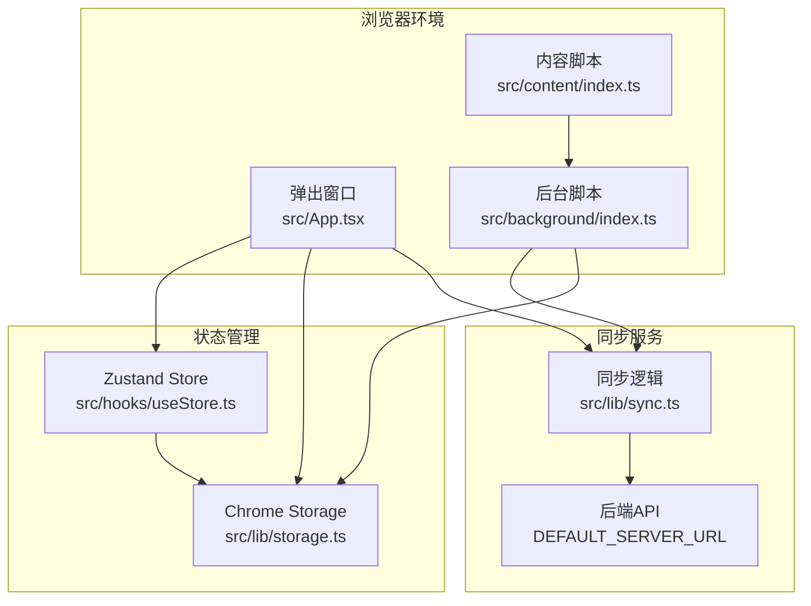
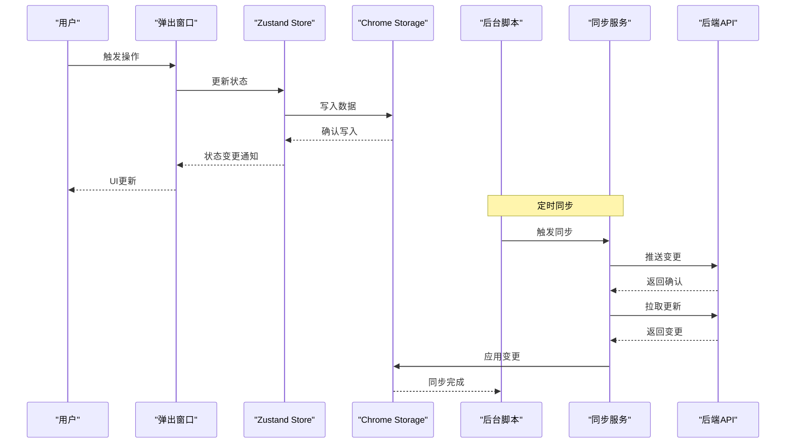
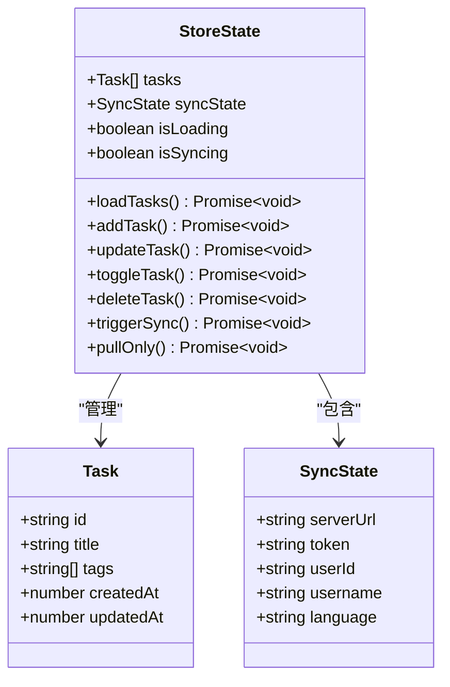
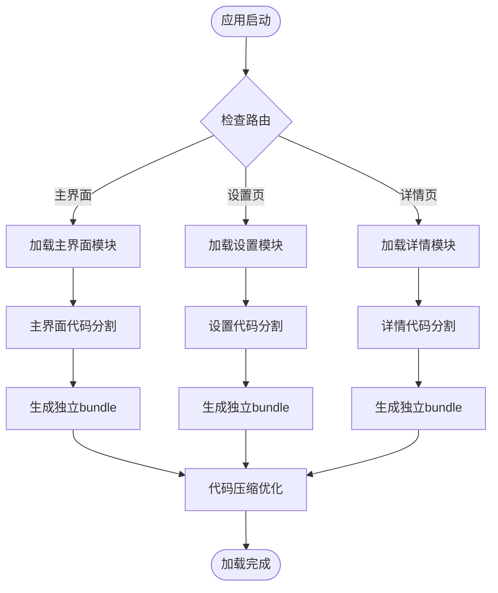
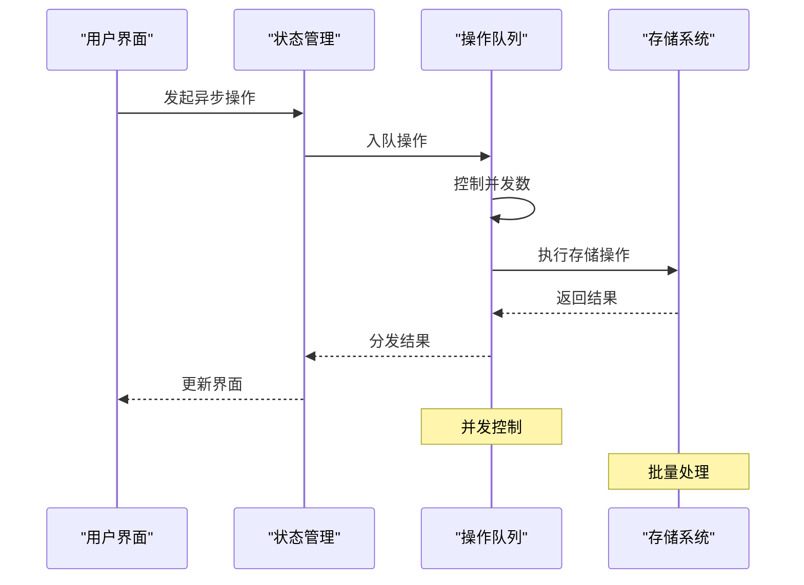
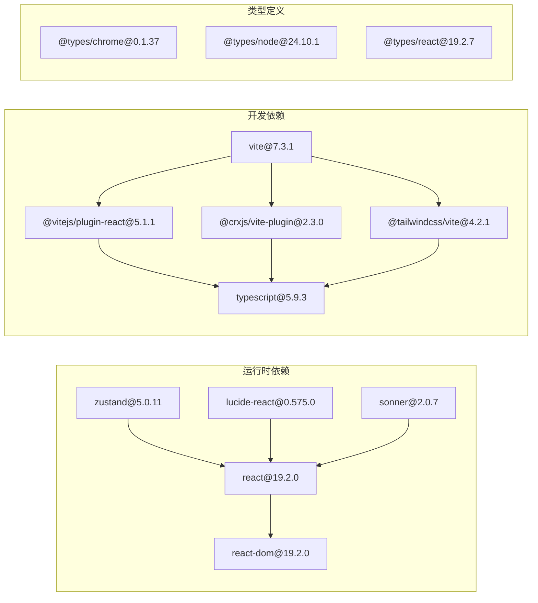

# 性能优化指南

<cite>
**本文档引用的文件**
- [package.json](file://package.json)
- [vite.config.ts](file://vite.config.ts)
- [src/main.tsx](file://src/main.tsx)
- [src/App.tsx](file://src/App.tsx)
- [src/hooks/useStore.ts](file://src/hooks/useStore.ts)
- [src/lib/storage.ts](file://src/lib/storage.ts)
- [src/lib/sync.ts](file://src/lib/sync.ts)
- [src/background/index.ts](file://src/background/index.ts)
- [src/content/index.ts](file://src/content/index.ts)
- [manifest.config.ts](file://manifest.config.ts)
- [src/config.ts](file://src/config.ts)
- [src/lib/i18n.ts](file://src/lib/i18n.ts)
</cite>

## 目录
1. [简介](#简介)
2. [项目结构](#项目结构)
3. [核心组件](#核心组件)
4. [架构概览](#架构概览)
5. [详细组件分析](#详细组件分析)
6. [依赖关系分析](#依赖关系分析)
7. [性能考虑](#性能考虑)
8. [故障排除指南](#故障排除指南)
9. [结论](#结论)
10. [附录](#附录)

## 简介
本指南针对QKnot Chrome扩展的性能优化提供全面的技术指导，涵盖React组件性能优化、Zustand状态管理性能、Chrome扩展资源限制、代码分割与懒加载、内存管理最佳实践、存储操作优化、异步操作性能提升、UI渲染优化、性能监控工具使用、瓶颈识别技术以及Vite构建优化等方面。目标是帮助开发者在保证功能完整性的前提下，最大化应用的响应速度、流畅度和稳定性。

## 项目结构
QKnot是一个基于React 19、TypeScript、Vite和Zustand的状态管理的Chrome扩展。项目采用模块化组织，主要分为以下层次：
- 应用入口层：负责初始化React根节点和全局样式
- 组件层：包含主应用界面、设置页面、任务详情等UI组件
- 状态管理层：使用Zustand进行本地状态管理，结合Chrome Storage实现持久化
- 同步层：处理云端数据同步，包括推送和拉取逻辑
- 背景脚本层：负责定时同步、上下文菜单、消息通信等后台任务
- 内容脚本层：在网页中注入悬浮按钮，支持从选中文本创建任务
- 配置层：包含构建配置、权限声明、默认服务器地址等

**图表来源**
- [src/App.tsx](file://src/App.tsx#L1-L860)
- [src/hooks/useStore.ts](file://src/hooks/useStore.ts#L1-L193)
- [src/lib/storage.ts](file://src/lib/storage.ts#L1-L272)
- [src/lib/sync.ts](file://src/lib/sync.ts#L1-L110)
- [src/background/index.ts](file://src/background/index.ts#L1-L114)
- [src/content/index.ts](file://src/content/index.ts#L1-L239)
- [src/config.ts](file://src/config.ts#L1-L2)

**章节来源**
- [src/main.tsx](file://src/main.tsx#L1-L11)
- [vite.config.ts](file://vite.config.ts#L1-L21)
- [manifest.config.ts](file://manifest.config.ts#L1-L40)

## 核心组件
本节深入分析影响性能的关键组件及其优化策略。

### Zustand状态管理优化
Zustand作为轻量级状态管理库，在QKnot中承担着核心职责。其性能特点包括：
- 原子化状态更新，减少不必要的重渲染
- 支持选择性订阅，仅在相关状态变化时触发组件更新
- 内存占用低，适合扩展场景

关键优化点：
- 使用immer中间件避免手动不可变更新
- 合理拆分状态，避免单一大对象导致的全量重渲染
- 利用selector模式只订阅需要的状态片段

**章节来源**
- [src/hooks/useStore.ts](file://src/hooks/useStore.ts#L1-L193)

### 存储系统优化
Chrome Storage提供了键值对存储能力，但存在以下性能考量：
- 单次写入限制：单条记录最大64KB
- 批量操作：建议合并多次写入为批量操作
- 操作频率：避免高频频繁的存储操作

优化策略：
- 使用事务式操作减少写入次数
- 实现增量更新而非全量替换
- 合理的数据结构设计，避免深层嵌套

**章节来源**
- [src/lib/storage.ts](file://src/lib/storage.ts#L1-L272)

### 同步机制优化
同步流程涉及网络请求和本地存储，需要重点优化：
- 异步操作的并发控制
- 失败重试机制的指数退避
- 数据一致性保证
- 离线优先策略

**章节来源**
- [src/lib/sync.ts](file://src/lib/sync.ts#L1-L110)

## 架构概览
QKnot采用典型的Chrome扩展架构，通过消息传递实现各模块间的解耦。

**图表来源**
- [src/App.tsx](file://src/App.tsx#L62-L72)
- [src/hooks/useStore.ts](file://src/hooks/useStore.ts#L167-L179)
- [src/lib/sync.ts](file://src/lib/sync.ts#L6-L53)
- [src/background/index.ts](file://src/background/index.ts#L10-L15)

## 详细组件分析

### React组件性能优化
基于现有代码分析，提出以下优化建议：

#### 渲染优化策略
1. **状态分离**：将高频更新的状态与低频更新的状态分离，避免无关状态变化触发重渲染
2. **记忆化计算**：对昂贵的计算结果使用useMemo缓存
3. **列表优化**：为列表项提供稳定的key，避免不必要的DOM重排
4. **条件渲染**：合理使用条件渲染减少DOM树深度

#### 事件处理优化
1. **事件委托**：在可能的情况下使用事件委托减少监听器数量
2. **防抖节流**：对高频事件（如滚动、输入）应用防抖或节流
3. **合成事件**：利用React合成事件的优化机制

#### 组件拆分
1. **细粒度组件**：将大型组件拆分为更小的可复用组件
2. **纯函数组件**：优先使用函数组件配合Hooks
3. **避免内联函数**：在循环中避免创建新的函数实例

**章节来源**
- [src/App.tsx](file://src/App.tsx#L1-L860)

### Zustand状态管理性能优化
当前实现已具备良好的基础，建议进一步优化：

#### 状态结构设计

**图表来源**
- [src/hooks/useStore.ts](file://src/hooks/useStore.ts#L8-L26)
- [src/lib/storage.ts](file://src/lib/storage.ts#L4-L34)

#### 优化建议
1. **选择性订阅**：使用selector模式只订阅需要的状态
2. **批量更新**：对于连续的状态更新，使用批量更新减少重渲染
3. **状态归一化**：将重复的数据结构扁平化存储
4. **异步状态管理**：为异步操作提供loading状态管理

**章节来源**
- [src/hooks/useStore.ts](file://src/hooks/useStore.ts#L53-L75)

### Chrome扩展资源限制与优化
Chrome扩展在资源使用上受到严格限制，需要特别关注：

#### 内存管理
1. **及时清理**：定期清理不再使用的数据和监听器
2. **内存泄漏防护**：确保事件监听器在组件卸载时正确移除
3. **大对象处理**：避免在状态中存储过大的数据结构

#### 网络请求优化
1. **连接池复用**：复用HTTP连接减少握手开销
2. **请求合并**：将多个小请求合并为批量请求
3. **缓存策略**：合理使用缓存减少网络往返

#### 文件大小控制
1. **Tree Shaking**：确保未使用的代码被正确移除
2. **按需加载**：将非关键功能延迟加载
3. **压缩优化**：启用代码压缩和资源压缩

**章节来源**
- [manifest.config.ts](file://manifest.config.ts#L31-L32)

### 代码分割与懒加载实现
基于现有项目结构，建议实施以下代码分割策略：

#### 功能模块懒加载

**图表来源**
- [src/App.tsx](file://src/App.tsx#L227-L433)
- [src/App.tsx](file://src/App.tsx#L435-L640)

#### 图标和静态资源优化
1. **SVG图标**：使用SVG替代位图图标，减小文件体积
2. **WebP格式**：将图片转换为WebP格式获得更好的压缩效果
3. **CDN加速**：对于外部资源考虑使用CDN

**章节来源**
- [src/App.tsx](file://src/App.tsx#L1-L860)

### 存储操作优化
Chrome Storage的性能优化是扩展性能的关键：

#### 写入优化策略
1. **批量写入**：将多个小的写入操作合并为一次批量写入
2. **增量更新**：只更新发生变化的部分，而非整个对象
3. **去重处理**：在写入前进行数据去重和验证

#### 读取优化策略
1. **索引优化**：为常用查询字段建立索引
2. **分页读取**：对于大量数据采用分页读取策略
3. **缓存策略**：实现多级缓存减少重复读取

#### 错误处理与回滚
1. **原子性保证**：使用事务确保数据一致性
2. **回滚机制**：实现失败后的数据回滚
3. **重试策略**：实现智能重试机制

**章节来源**
- [src/lib/storage.ts](file://src/lib/storage.ts#L50-L95)

### 异步操作性能提升
异步操作是影响用户体验的关键因素：

#### 并发控制

**图表来源**
- [src/hooks/useStore.ts](file://src/hooks/useStore.ts#L167-L179)
- [src/lib/sync.ts](file://src/lib/sync.ts#L6-L53)

#### 优化策略
1. **操作队列**：实现操作队列控制同时执行的操作数量
2. **优先级调度**：为不同类型的操作设置优先级
3. **超时处理**：为长时间运行的操作设置超时机制
4. **进度反馈**：为耗时操作提供进度指示

**章节来源**
- [src/lib/sync.ts](file://src/lib/sync.ts#L1-L110)

### UI渲染优化方法
用户界面的渲染性能直接影响用户体验：

#### 渲染优化技术
1. **虚拟滚动**：对于长列表使用虚拟滚动减少DOM节点数量
2. **懒加载组件**：将非首屏显示的组件延迟加载
3. **CSS动画优化**：使用transform和opacity属性触发硬件加速
4. **重绘重排最小化**：避免频繁触发布局和绘制

#### 主题和样式优化
1. **Tailwind CSS**：利用原子化CSS减少样式文件大小
2. **动态样式**：根据用户偏好动态调整样式
3. **CSS变量**：使用CSS变量实现主题切换

**章节来源**
- [src/App.tsx](file://src/App.tsx#L642-L860)

## 依赖关系分析
项目的依赖关系直接影响构建性能和运行时表现。

**图表来源**
- [package.json](file://package.json#L12-L40)

**章节来源**
- [package.json](file://package.json#L1-L42)

## 性能考虑
基于代码分析，提出以下性能优化建议：

### 构建优化
1. **Tree Shaking**：确保未使用的代码被正确移除
2. **代码压缩**：启用生产环境的代码压缩
3. **资源内联**：将小资源内联到JavaScript中减少HTTP请求数
4. **Source Map**：在开发环境启用source map便于调试

### 运行时优化
1. **内存监控**：定期监控内存使用情况
2. **CPU使用率**：避免长时间阻塞主线程
3. **网络请求**：优化请求频率和大小
4. **存储访问**：减少存储操作的频率和大小

### 缓存策略
1. **浏览器缓存**：合理设置HTTP缓存头
2. **应用缓存**：实现应用级别的缓存机制
3. **数据缓存**：缓存常用的计算结果
4. **资源缓存**：缓存第三方资源

## 故障排除指南
针对常见性能问题提供诊断和解决方法：

### 性能监控工具使用
1. **Chrome DevTools**：使用Performance面板分析渲染性能
2. **Memory面板**：监控内存使用和垃圾回收
3. **Network面板**：分析网络请求性能
4. **Lighthouse**：进行自动化性能审计

### 瓶颈识别技术
1. **时间线分析**：识别长任务和阻塞操作
2. **内存快照**：发现内存泄漏和异常增长
3. **网络分析**：识别慢请求和重复请求
4. **存储分析**：监控存储操作的性能

### 性能指标分析
1. **First Contentful Paint (FCP)**：首字节渲染时间
2. **Largest Contentful Paint (LCP)**：最大内容渲染时间
3. **First Input Delay (FID)**：首次输入延迟
4. **Cumulative Layout Shift (CLS)**：累积布局偏移

**章节来源**
- [src/background/index.ts](file://src/background/index.ts#L1-L114)

## 结论
QKnot扩展在性能方面具有良好的基础，但仍有许多优化空间。通过实施本文提出的优化策略，包括React组件优化、Zustand状态管理改进、Chrome扩展资源限制应对、代码分割与懒加载、存储操作优化、异步操作性能提升、UI渲染优化以及完善的性能监控体系，可以显著提升应用的响应速度、流畅度和稳定性。

关键的成功因素在于：
- 持续的性能监控和测试
- 合理的架构设计和代码组织
- 有效的资源管理和优化策略
- 完善的错误处理和性能回归预防机制

建议团队建立性能基准测试，定期评估优化效果，并根据用户反馈持续改进。

## 附录

### Vite构建优化配置建议
基于现有配置，建议添加以下优化选项：
1. **预构建依赖**：启用依赖预构建减少冷启动时间
2. **动态导入**：合理使用动态导入实现代码分割
3. **插件优化**：确保插件按顺序加载以获得最佳性能
4. **输出优化**：配置合理的输出目录和文件命名策略

### 最佳实践清单
1. **状态管理**：使用选择性订阅和状态归一化
2. **存储操作**：实现批量写入和增量更新
3. **异步处理**：使用队列控制和超时机制
4. **UI优化**：采用虚拟滚动和懒加载
5. **资源管理**：优化图片和静态资源
6. **网络请求**：实现请求合并和缓存策略
7. **内存管理**：定期清理和监控内存使用
8. **性能监控**：建立完善的监控和告警机制