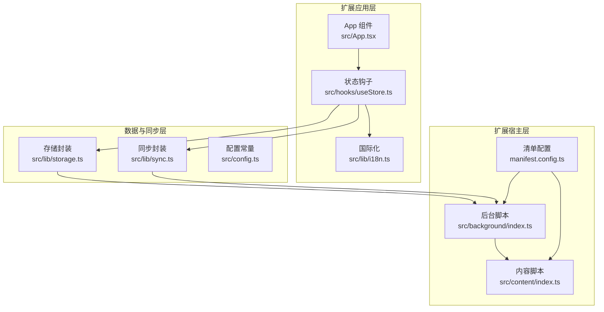
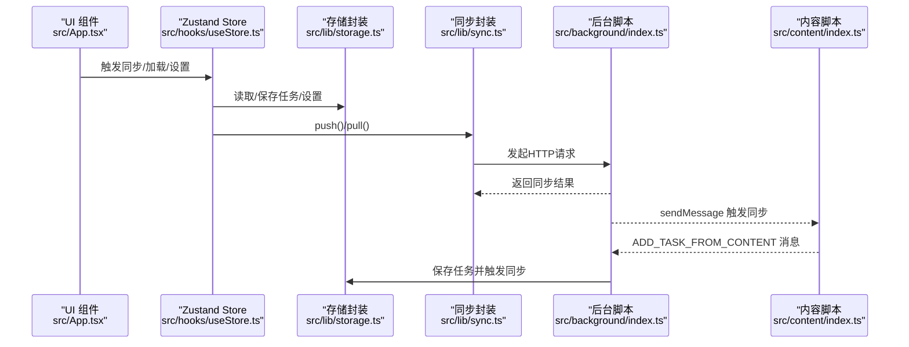
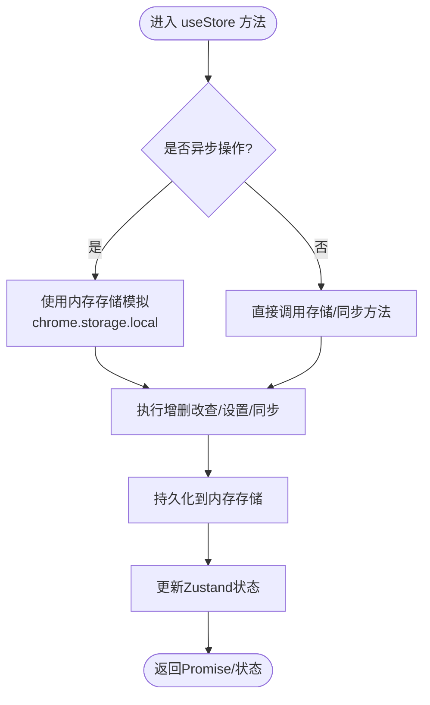
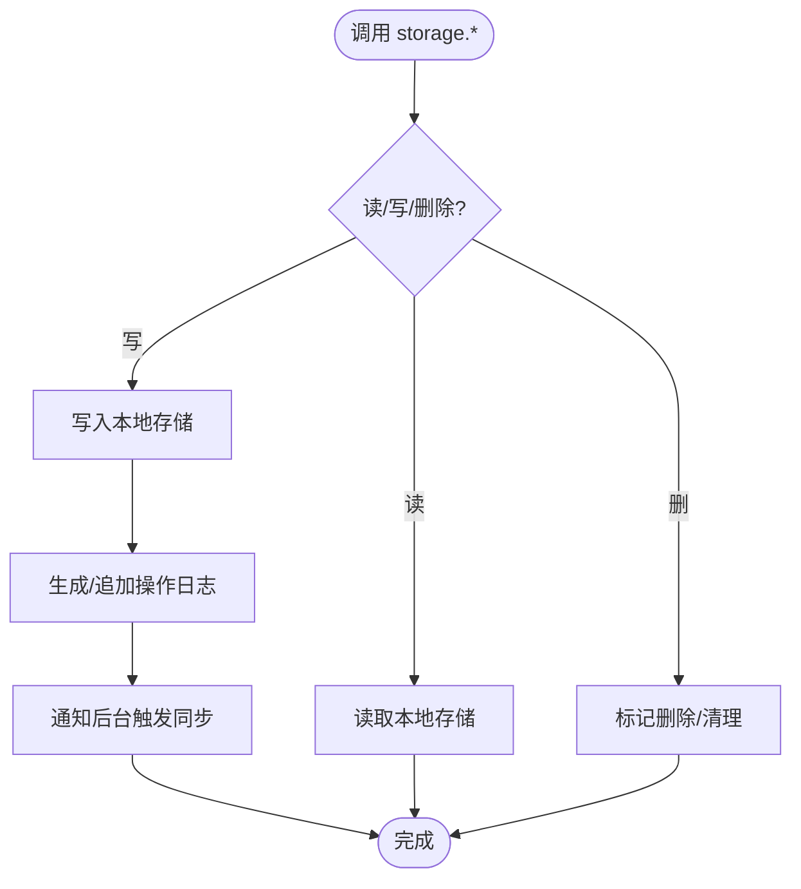
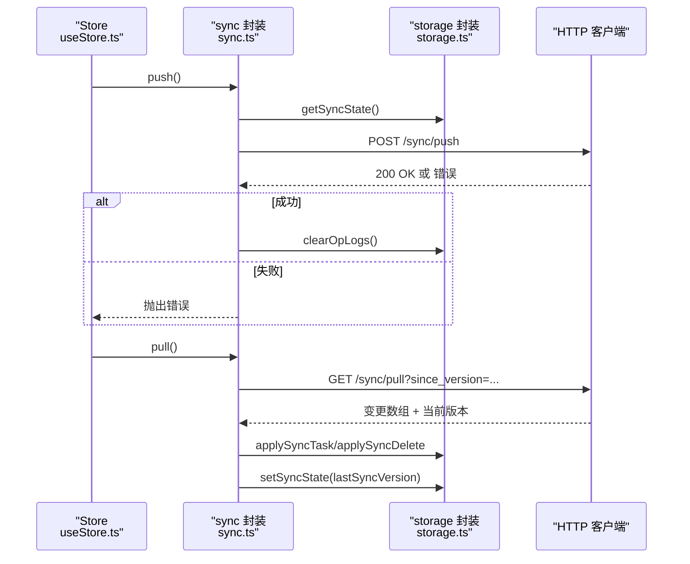
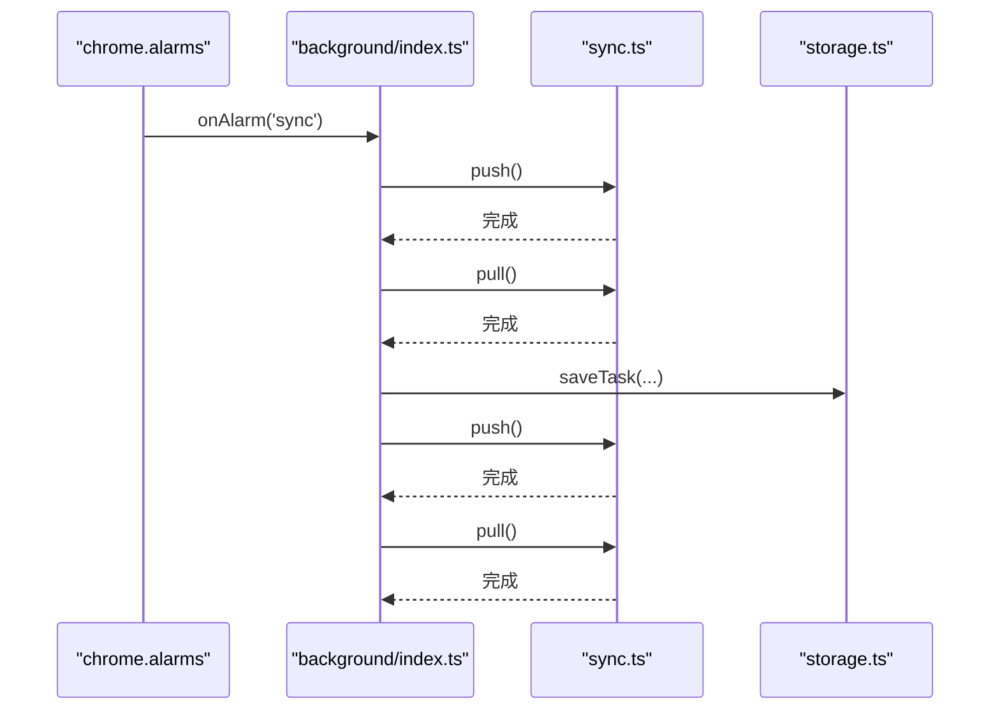
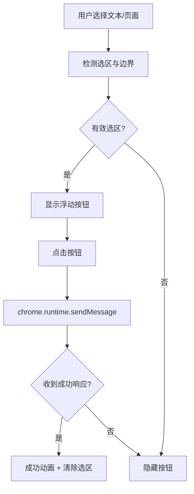
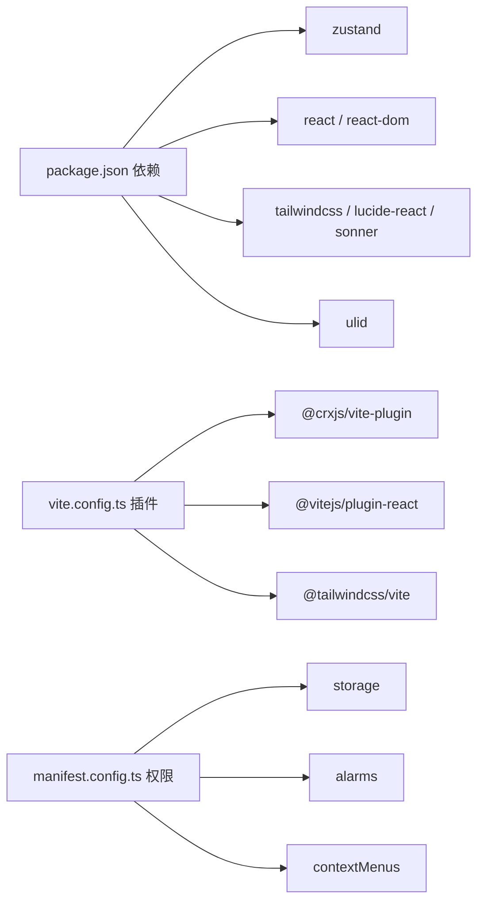

# 测试策略与实践

<cite>
**本文引用的文件**
- [package.json](file://package.json)
- [vite.config.ts](file://vite.config.ts)
- [manifest.config.ts](file://manifest.config.ts)
- [src/hooks/useStore.ts](file://src/hooks/useStore.ts)
- [src/lib/storage.ts](file://src/lib/storage.ts)
- [src/lib/sync.ts](file://src/lib/sync.ts)
- [src/lib/i18n.ts](file://src/lib/i18n.ts)
- [src/App.tsx](file://src/App.tsx)
- [src/config.ts](file://src/config.ts)
- [src/main.tsx](file://src/main.tsx)
- [src/background/index.ts](file://src/background/index.ts)
- [src/content/index.ts](file://src/content/index.ts)
- [eslint.config.js](file://eslint.config.js)
- [tsconfig.app.json](file://tsconfig.app.json)
</cite>

## 目录
1. [引言](#引言)
2. [项目结构](#项目结构)
3. [核心组件](#核心组件)
4. [架构总览](#架构总览)
5. [详细组件分析](#详细组件分析)
6. [依赖关系分析](#依赖关系分析)
7. [性能考量](#性能考量)
8. [故障排查指南](#故障排查指南)
9. [结论](#结论)
10. [附录](#附录)

## 引言
本指南面向QKnot扩展的测试工作，围绕单元测试、组件测试、集成测试与端到端测试制定系统化策略，并覆盖Zustand store、Chrome Storage API、异步操作、国际化、后台服务与内容脚本等关键模块。文档同时给出测试覆盖率目标、测试数据管理、测试环境配置、自动化与CI流程建议以及测试报告生成方案。

## 项目结构
QKnot采用React + TypeScript + Vite构建，结合CRXJS插件打包Chrome扩展，核心目录与职责如下：
- src/hooks/useStore.ts：基于Zustand的状态管理，封装任务增删改查、设置更新、同步触发等逻辑
- src/lib/storage.ts：封装chrome.storage.local的读写、操作日志记录、用户数据清理等
- src/lib/sync.ts：封装push/pull同步逻辑，与后端接口交互
- src/background/index.ts：扩展后台服务（Alarm定时同步、消息监听、上下文菜单）
- src/content/index.ts：内容脚本，注入浮动按钮并发送消息给后台
- src/App.tsx：主应用组件，负责UI渲染、登录/注册、设置切换、多语言显示等
- src/lib/i18n.ts：多语言文案与语言列表
- src/config.ts：默认服务器地址常量
- manifest.config.ts：扩展清单配置（权限、后台脚本、内容脚本等）

图表来源
- [src/App.tsx](file://src/App.tsx#L1-L860)
- [src/hooks/useStore.ts](file://src/hooks/useStore.ts#L1-L193)
- [src/lib/storage.ts](file://src/lib/storage.ts#L1-L272)
- [src/lib/sync.ts](file://src/lib/sync.ts#L1-L110)
- [src/background/index.ts](file://src/background/index.ts#L1-L114)
- [src/content/index.ts](file://src/content/index.ts#L1-L239)
- [manifest.config.ts](file://manifest.config.ts#L1-L40)

章节来源
- [vite.config.ts](file://vite.config.ts#L1-L21)
- [manifest.config.ts](file://manifest.config.ts#L1-L40)

## 核心组件
- Zustand Store（useStore）：提供任务列表、加载状态、同步状态、语言设置、本地化翻译、增删改查、设置更新、清理用户数据、手动/拉取同步等方法
- 存储封装（storage）：封装chrome.storage.local的get/set/remove、任务持久化、操作日志记录、用户数据清理、离线任务计数与合并
- 同步封装（sync）：封装push/pull请求、客户端ID生成、变更应用
- 背景脚本（background）：定时触发同步、监听消息、上下文菜单
- 内容脚本（content）：注入浮动按钮、监听选择、向后台发送消息
- 国际化（i18n）：多语言文案与语言列表
- 配置（config）：默认服务器地址

章节来源
- [src/hooks/useStore.ts](file://src/hooks/useStore.ts#L1-L193)
- [src/lib/storage.ts](file://src/lib/storage.ts#L1-L272)
- [src/lib/sync.ts](file://src/lib/sync.ts#L1-L110)
- [src/background/index.ts](file://src/background/index.ts#L1-L114)
- [src/content/index.ts](file://src/content/index.ts#L1-L239)
- [src/lib/i18n.ts](file://src/lib/i18n.ts#L1-L146)
- [src/config.ts](file://src/config.ts#L1-L2)

## 架构总览
下图展示从UI到后台、再到内容脚本与存储的调用链路，以及异步同步流程。

图表来源
- [src/App.tsx](file://src/App.tsx#L1-L860)
- [src/hooks/useStore.ts](file://src/hooks/useStore.ts#L1-L193)
- [src/lib/storage.ts](file://src/lib/storage.ts#L1-L272)
- [src/lib/sync.ts](file://src/lib/sync.ts#L1-L110)
- [src/background/index.ts](file://src/background/index.ts#L1-L114)
- [src/content/index.ts](file://src/content/index.ts#L1-L239)

## 详细组件分析

### Zustand Store 测试策略
- 测试目标
  - 状态初始化与默认值
  - 任务增删改查的乐观更新与持久化一致性
  - 设置更新（语言、服务器、用户信息）对UI的影响
  - 同步流程（push/pull）的错误处理与状态恢复
  - 用户登出/清理数据后的状态重置
- 测试方法
  - 使用内存存储替代chrome.storage（见“模拟对象使用”）
  - 对异步方法进行Promise断言与超时控制
  - 使用Mock函数验证UI回调（如toast、路由切换）
- 关键测试点
  - loadTasks：过滤删除项、按用户ID过滤、加载状态切换
  - addTask/updateTask/toggleTask/deleteTask：乐观更新、持久化、操作日志
  - triggerSync/pullOnly：并发状态isSyncing、finally恢复
  - setLanguage/t：语言切换与模板参数替换
  - handleLogoutCleanup/clearUserData：清理策略与保留字段

图表来源
- [src/hooks/useStore.ts](file://src/hooks/useStore.ts#L1-L193)
- [src/lib/storage.ts](file://src/lib/storage.ts#L1-L272)

章节来源
- [src/hooks/useStore.ts](file://src/hooks/useStore.ts#L1-L193)

### Chrome Storage API 测试策略
- 测试目标
  - getTasks/saveTask/deleteTask 的正确性与幂等性
  - 操作日志（OpLog）的生成、清理与同步
  - 用户数据清理（clearUserData）与保留字段
  - 登出清理（handleLogoutCleanup）与离线任务处理
- 测试方法
  - 使用内存Map模拟chrome.storage.local，避免真实扩展权限
  - 通过代理或包装函数拦截chrome.runtime.sendMessage以验证触发行为
- 关键测试点
  - 保存任务时自动补全userId与差异计算
  - 删除任务标记deleted并记录空变化
  - 清理opLogs与tasks的组合操作
  - 仅保留serverUrl与language的清理策略

图表来源
- [src/lib/storage.ts](file://src/lib/storage.ts#L1-L272)
- [src/background/index.ts](file://src/background/index.ts#L1-L114)

章节来源
- [src/lib/storage.ts](file://src/lib/storage.ts#L1-L272)

### 同步封装（sync）测试策略
- 测试目标
  - push/pull请求的HTTP行为与错误处理
  - 客户端ID生成与缓存
  - 变更应用（applyChanges）对本地存储的影响
- 测试方法
  - Mock fetch以控制响应与异常
  - 验证OpLog序列化与请求体格式
  - 断言storage.clearOpLogs与storage.setSyncState的调用
- 关键测试点
  - 无token或serverUrl时跳过同步
  - push成功后清理opLogs，失败抛出错误
  - pull成功后应用变更并更新lastSyncVersion

图表来源
- [src/lib/sync.ts](file://src/lib/sync.ts#L1-L110)
- [src/lib/storage.ts](file://src/lib/storage.ts#L1-L272)

章节来源
- [src/lib/sync.ts](file://src/lib/sync.ts#L1-L110)

### 背景脚本（background）测试策略
- 测试目标
  - Alarm定时触发push/pull
  - runtime消息监听（sync_trigger、ADD_TASK_FROM_CONTENT）
  - 上下文菜单创建与点击事件
- 测试方法
  - Mock chrome.alarms、chrome.runtime、chrome.contextMenus
  - 验证sendMessage与storage/sync调用顺序
- 关键测试点
  - 定时器周期与同步顺序
  - 文本/页面任务创建与去重
  - 清理旧菜单并重建

图表来源
- [src/background/index.ts](file://src/background/index.ts#L1-L114)

章节来源
- [src/background/index.ts](file://src/background/index.ts#L1-L114)

### 内容脚本（content）测试策略
- 测试目标
  - 浮动按钮的可见性、定位与动画
  - 选择文本/页面URL的提取与去重
  - 向后台发送消息并接收响应
- 测试方法
  - DOM沙箱环境（JSDOM或浏览器测试框架）
  - Mock chrome.runtime.sendMessage
  - 断言Shadow DOM样式与事件绑定
- 关键测试点
  - 选区边界检测与屏幕边界约束
  - 成功态动画与选区清除
  - 上下文菜单触发路径

图表来源
- [src/content/index.ts](file://src/content/index.ts#L1-L239)

章节来源
- [src/content/index.ts](file://src/content/index.ts#L1-L239)

### 国际化（i18n）测试策略
- 测试目标
  - 语言切换对UI文案的影响
  - 模板参数替换（如日期格式）
  - 语言列表与默认语言
- 测试方法
  - 在Store中注入setLanguage与t方法的断言
  - 验证不同语言下的占位符替换
- 关键测试点
  - 默认语言回退至英文
  - 参数缺失时保持原字符串

章节来源
- [src/lib/i18n.ts](file://src/lib/i18n.ts#L1-L146)
- [src/hooks/useStore.ts](file://src/hooks/useStore.ts#L1-L193)

### 组件测试（UI）策略
- 测试目标
  - App组件在不同视图（列表/详情/设置）下的渲染
  - 登录/注册/登出流程与错误提示
  - 合并离线任务弹窗的交互
  - 任务增删改查与标签管理
- 测试方法
  - 使用React Testing Library或类似库
  - Mock全局fetch与chrome.runtime
  - 使用MemoryRouter模拟路由
- 关键测试点
  - 初始loadTasks与静默同步
  - 登录后pullOnly与后续同步
  - 合并决策对任务与状态的影响

章节来源
- [src/App.tsx](file://src/App.tsx#L1-L860)

## 依赖关系分析
- 构建与开发工具
  - Vite + React + CRXJS插件用于打包扩展
  - TypeScript类型检查与ESLint规则
- 运行时依赖
  - Zustand用于状态管理
  - TailwindCSS用于样式
  - lucide-react、sonner用于UI与通知
- 扩展权限
  - storage、alarms、contextMenus用于本地存储、定时同步与上下文菜单
  - host_permissions允许HTTP/HTTPS访问

图表来源
- [package.json](file://package.json#L1-L42)
- [vite.config.ts](file://vite.config.ts#L1-L21)
- [manifest.config.ts](file://manifest.config.ts#L1-L40)

章节来源
- [package.json](file://package.json#L1-L42)
- [vite.config.ts](file://vite.config.ts#L1-L21)
- [manifest.config.ts](file://manifest.config.ts#L1-L40)

## 性能考量
- 异步操作批处理：在Store中对多次更新进行乐观更新，减少UI抖动
- 同步频率控制：后台Alarm每5分钟触发一次，避免频繁网络请求
- 本地存储优化：仅保存必要字段，删除任务标记deleted而非立即物理删除
- UI渲染优化：列表排序与条件渲染，避免不必要的重绘

## 故障排查指南
- 同步失败
  - 检查token与serverUrl是否存在
  - 查看push/pull的HTTP响应与错误日志
  - 确认opLogs是否被正确清理
- 登录/登出异常
  - 确认clearUserData是否保留serverUrl与language
  - 检查handleLogoutCleanup调用链
- 内容脚本不显示按钮
  - 检查选区有效性与边界约束
  - 确认Shadow DOM样式注入与事件绑定
- 国际化问题
  - 确认语言代码存在且t方法参数正确

章节来源
- [src/lib/sync.ts](file://src/lib/sync.ts#L1-L110)
- [src/lib/storage.ts](file://src/lib/storage.ts#L1-L272)
- [src/content/index.ts](file://src/content/index.ts#L1-L239)
- [src/lib/i18n.ts](file://src/lib/i18n.ts#L1-L146)

## 结论
本测试策略以Zustand Store为核心，围绕Chrome Storage API、同步封装、后台与内容脚本构建了从单元到端到端的完整测试体系。通过内存存储模拟、fetch与chrome API的Mock、以及对异步流程的严格断言，可确保QKnot扩展在复杂场景下的稳定性与可靠性。

## 附录

### 单元测试编写方法与用例设计原则
- 原则
  - 一个测试只验证一个行为
  - 使用最小化依赖（依赖倒置/接口隔离）
  - 明确输入、期望输出与边界条件
- 方法
  - 对每个导出函数编写独立测试文件
  - 使用Mock替代外部副作用（网络、存储、运行时）
  - 对异步函数使用Promise断言与超时控制

### 模拟对象使用
- 存储模拟
  - 以Map模拟chrome.storage.local，提供get/set/remove/clear
  - 包装logOp以捕获操作日志
- 运行时模拟
  - Mock chrome.runtime.sendMessage与onMessage
  - Mock chrome.alarms与chrome.contextMenus
- 网络模拟
  - 使用jest-fetch-mock或msw拦截fetch
  - 分别测试2xx、4xx、5xx与超时场景

### 异步操作测试技巧
- 使用Promise.race或AbortSignal控制超时
- 对并发状态（如isSyncing）进行竞态条件验证
- 使用fake timers控制定时器触发时机

### 组件测试、集成测试与端到端测试实施指南
- 组件测试
  - 使用React Testing Library或类似库
  - Mock全局fetch与chrome.runtime
  - 验证UI交互与状态变更
- 集成测试
  - 覆盖Store与Storage之间的交互
  - 验证同步流程中的数据一致性
- 端到端测试
  - 在真实浏览器环境中运行
  - 验证内容脚本注入、上下文菜单与后台同步

### 测试覆盖率要求
- 语句覆盖率：≥80%
- 分支覆盖率：≥70%
- 函数覆盖率：≥85%
- 行覆盖率：≥80%

### 测试数据管理
- 使用固定种子与预设数据集
- 对于随机ID（如ulid），在测试中使用可控ID生成器
- 清理测试状态，避免跨用例污染

### 测试环境配置
- TypeScript配置
  - 在tsconfig.app.json中启用chrome类型
- ESLint配置
  - 使用eslint.config.js统一规则
- Vite配置
  - 通过vite.config.ts启用CRXJS与TailwindCSS插件

章节来源
- [tsconfig.app.json](file://tsconfig.app.json#L1-L28)
- [eslint.config.js](file://eslint.config.js#L1-L23)
- [vite.config.ts](file://vite.config.ts#L1-L21)

### 自动化测试流程与持续集成
- 流程建议
  - 开发阶段：单测快速反馈（watch模式）
  - 提交前：全量单测+覆盖率检查
  - CI阶段：组件/集成测试 + E2E测试（可选）
- CI配置要点
  - 安装依赖与编译
  - 运行单测与覆盖率收集
  - 上传覆盖率报告（如Codecov）
  - 构建扩展包（可选）

### 测试报告生成
- 使用Jest的JSON报告或HTML报告
- 集成到CI系统（如GitHub Actions）生成可读报告
- 覆盖率阈值失败时阻断合并