# 调试工具与技巧

<cite>
**本文档引用的文件**
- [manifest.config.ts](file://manifest.config.ts)
- [background/index.ts](file://src/background/index.ts)
- [content/index.ts](file://src/content/index.ts)
- [useStore.ts](file://src/hooks/useStore.ts)
- [storage.ts](file://src/lib/storage.ts)
- [sync.ts](file://src/lib/sync.ts)
- [config.ts](file://src/config.ts)
- [main.tsx](file://src/main.tsx)
- [App.tsx](file://src/App.tsx)
- [vite.config.ts](file://vite.config.ts)
- [package.json](file://package.json)
- [index.html](file://index.html)
</cite>

## 目录
1. [简介](#简介)
2. [项目结构概览](#项目结构概览)
3. [核心组件与调试要点](#核心组件与调试要点)
4. [Chrome扩展调试基础](#chrome扩展调试基础)
5. [后台脚本调试](#后台脚本调试)
6. [内容脚本调试](#内容脚本调试)
7. [Zustand状态管理调试](#zustand状态管理调试)
8. [异步操作与网络请求调试](#异步操作与网络请求调试)
9. [性能分析与内存泄漏检测](#性能分析与内存泄漏检测)
10. [断点与条件断点技巧](#断点与条件断点技巧)
11. [日志记录与错误追踪](#日志记录与错误追踪)
12. [生产环境问题排查](#生产环境问题排查)
13. [常见问题诊断](#常见问题诊断)
14. [最佳实践建议](#最佳实践建议)

## 简介

QKnot是一个基于React和TypeScript构建的Chrome扩展，用于任务管理和同步。该扩展采用现代前端技术栈，包括Vite构建工具、Zustand状态管理、React Hook等。本文档提供了针对该扩展的完整调试指南，涵盖Chrome DevTools的扩展调试功能、后台脚本调试方法、内容脚本调试技巧，以及状态管理、异步操作和网络请求的调试策略。

## 项目结构概览

QKnot扩展采用模块化架构设计，主要包含以下核心模块：

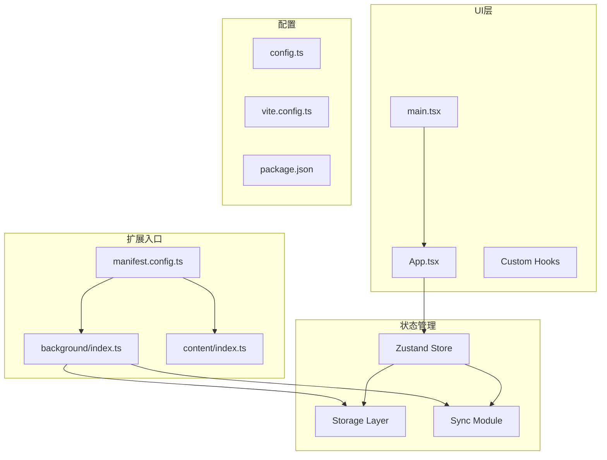

**图表来源**
- [manifest.config.ts](file://manifest.config.ts#L1-L40)
- [background/index.ts](file://src/background/index.ts#L1-L114)
- [content/index.ts](file://src/content/index.ts#L1-L239)
- [useStore.ts](file://src/hooks/useStore.ts#L1-L193)

**章节来源**
- [manifest.config.ts](file://manifest.config.ts#L1-L40)
- [vite.config.ts](file://vite.config.ts#L1-L21)
- [package.json](file://package.json#L1-L42)

## 核心组件与调试要点

### 扩展生命周期调试

QKnot扩展的核心调试关注点包括：

1. **后台服务工作线程**：负责定时同步、消息处理和上下文菜单
2. **内容脚本**：处理用户选择和浮动按钮交互
3. **状态管理**：Zustand store的状态变更和异步操作
4. **存储层**：Chrome本地存储的数据持久化
5. **同步模块**：网络请求和数据同步逻辑

### 关键调试接口

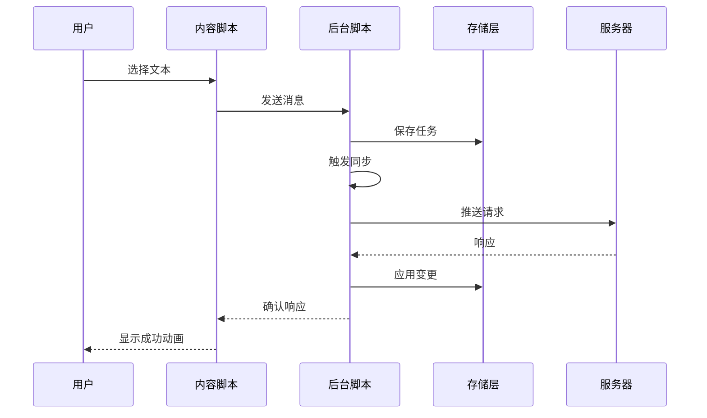

**图表来源**
- [content/index.ts](file://src/content/index.ts#L202-L234)
- [background/index.ts](file://src/background/index.ts#L68-L81)
- [storage.ts](file://src/lib/storage.ts#L109-L127)

**章节来源**
- [background/index.ts](file://src/background/index.ts#L1-L114)
- [content/index.ts](file://src/content/index.ts#L1-L239)
- [storage.ts](file://src/lib/storage.ts#L1-L272)

## Chrome扩展调试基础

### 扩展页面访问

要开始调试QKnot扩展，需要通过以下步骤访问Chrome扩展页面：

1. 打开Chrome浏览器，进入 `chrome://extensions/`
2. 启用"开发者模式"
3. 点击"加载已解压的扩展程序"
4. 选择项目根目录中的 `dist` 文件夹
5. 在扩展页面中点击"检查视图"或"背景页面"

### 开发者工具面板

Chrome DevTools为扩展提供了专门的调试界面：

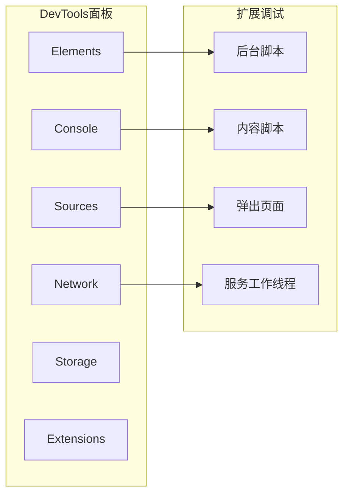

**图表来源**
- [manifest.config.ts](file://manifest.config.ts#L27-L38)

## 后台脚本调试

### 调试入口点

后台脚本是扩展的核心，负责处理定时任务、消息通信和系统事件：

**调试要点**：
- 检查服务工作线程是否正确加载
- 监控定时器触发和异常处理
- 验证消息监听器的响应
- 监控上下文菜单事件

### 关键调试场景

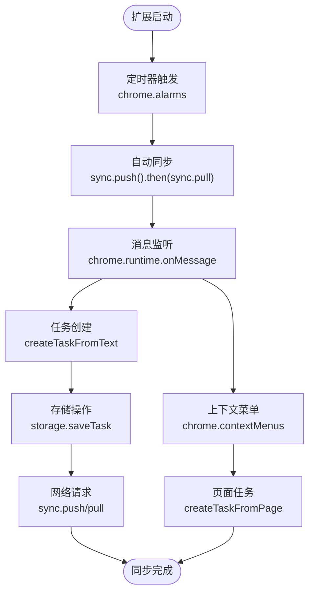

**图表来源**
- [background/index.ts](file://src/background/index.ts#L8-L15)
- [background/index.ts](file://src/background/index.ts#L68-L81)
- [background/index.ts](file://src/background/index.ts#L100-L113)

### 调试技巧

1. **服务工作线程调试**：
   - 使用 `chrome://serviceworker-internals/` 查看服务工作线程状态
   - 监控 `chrome.alarms` 的触发频率和异常
   - 检查 `chrome.runtime.onMessage` 的消息传递

2. **存储层调试**：
   - 使用Chrome DevTools的Storage面板查看localStorage
   - 监控 `chrome.storage.local` 的读写操作
   - 检查OpLog的生成和清理

3. **同步流程调试**：
   - 设置断点在 `sync.push()` 和 `sync.pull()` 方法
   - 监控网络请求的响应时间和错误
   - 验证 `applyChanges()` 的数据应用

**章节来源**
- [background/index.ts](file://src/background/index.ts#L1-L114)
- [storage.ts](file://src/lib/storage.ts#L109-L127)
- [sync.ts](file://src/lib/sync.ts#L6-L53)

## 内容脚本调试

### 浮动按钮组件调试

内容脚本实现了复杂的DOM交互和用户界面：

**调试关注点**：
- 浮动按钮的定位算法
- 用户选择检测机制
- Shadow DOM的样式注入
- 事件监听器的内存泄漏

### 关键调试方法

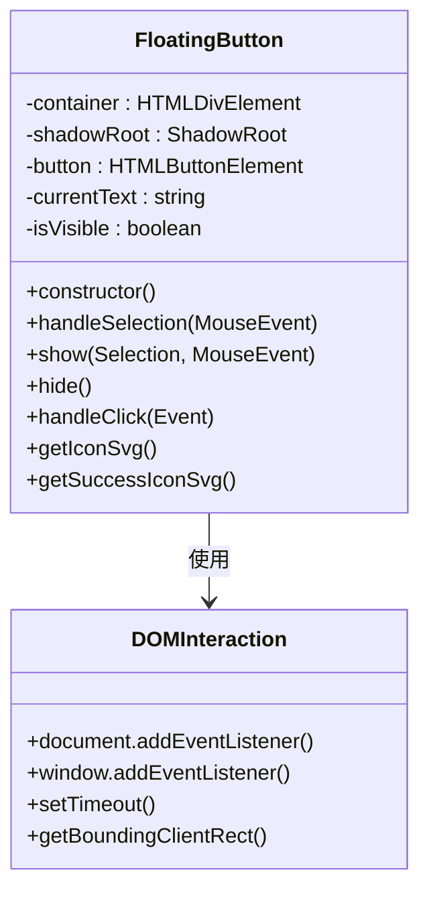

**图表来源**
- [content/index.ts](file://src/content/index.ts#L3-L101)
- [content/index.ts](file://src/content/index.ts#L120-L200)

### 调试场景

1. **选择检测调试**：
   - 设置断点在 `handleSelection()` 方法
   - 监控 `window.getSelection()` 的返回值
   - 检查 `getBoundingClientRect()` 的坐标计算

2. **按钮定位调试**：
   - 验证鼠标事件坐标和滚动偏移
   - 检查边界检测逻辑
   - 监控CSS类名的动态切换

3. **消息通信调试**：
   - 设置断点在 `chrome.runtime.sendMessage()`
   - 监控响应处理和错误捕获
   - 验证异步响应的时机

**章节来源**
- [content/index.ts](file://src/content/index.ts#L1-L239)

## Zustand状态管理调试

### Store结构分析

Zustand状态管理提供了完整的任务管理功能：

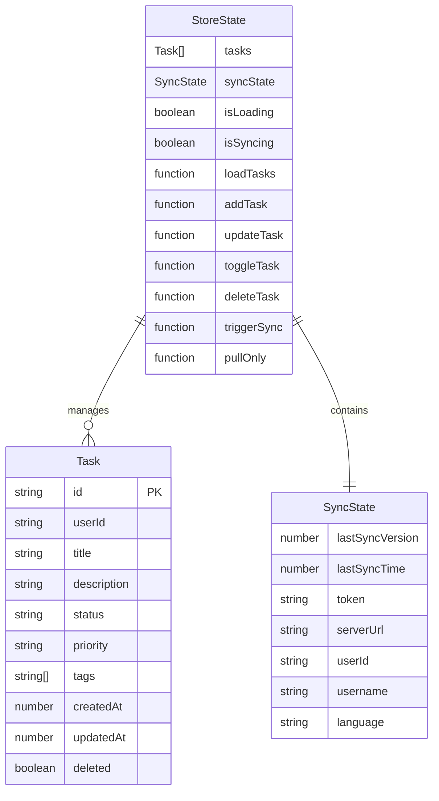

**图表来源**
- [useStore.ts](file://src/hooks/useStore.ts#L8-L26)
- [storage.ts](file://src/lib/storage.ts#L4-L34)

### 状态检查器使用

1. **安装React DevTools**：
   - 在Chrome扩展商店安装React Developer Tools
   - 在扩展页面中启用React DevTools
   - 使用"Components"和"Profiler"面板

2. **Zustand专用调试**：
   - 使用 `useStore.getState()` 检查当前状态
   - 监控状态变更的触发源
   - 验证异步操作的状态更新

### 调试技巧

1. **状态变更跟踪**：
   - 在每个action函数中添加 `console.log('State:', get())`
   - 使用 `useEffect` 监听状态变化
   - 验证乐观更新的正确性

2. **异步操作调试**：
   - 监控 `isSyncing` 状态的变化
   - 检查Promise链的错误处理
   - 验证finally块的执行

3. **性能优化调试**：
   - 使用React Profiler分析渲染性能
   - 监控store的re-render次数
   - 优化selector函数的计算

**章节来源**
- [useStore.ts](file://src/hooks/useStore.ts#L1-L193)
- [App.tsx](file://src/App.tsx#L11-L46)

## 异步操作与网络请求调试

### 同步流程分析

QKnot的同步机制涉及多个异步操作：

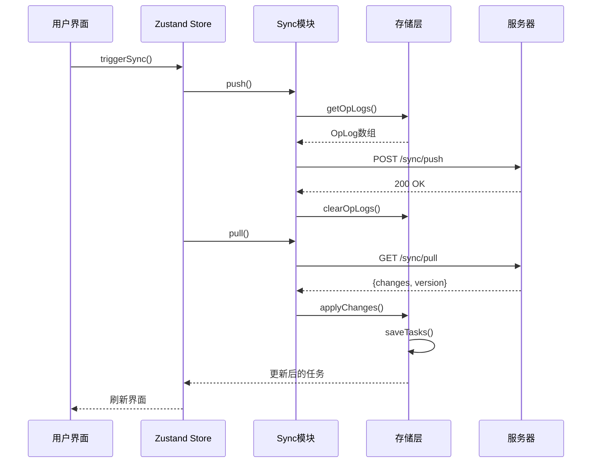

**图表来源**
- [useStore.ts](file://src/hooks/useStore.ts#L167-L179)
- [sync.ts](file://src/lib/sync.ts#L6-L83)

### 网络请求监控

1. **Fetch API调试**：
   - 在DevTools Network面板中监控所有请求
   - 检查请求头中的Authorization令牌
   - 验证响应状态码和JSON格式

2. **错误处理调试**：
   - 监控 `try-catch` 块的异常捕获
   - 检查 `lastError` 的处理
   - 验证Promise拒绝的处理

3. **重试机制调试**：
   - 监控同步失败的重试逻辑
   - 检查退避算法的实现
   - 验证用户通知的显示

**章节来源**
- [sync.ts](file://src/lib/sync.ts#L1-L110)
- [storage.ts](file://src/lib/storage.ts#L109-L127)

## 性能分析与内存泄漏检测

### 性能监控指标

1. **渲染性能**：
   - 使用React Profiler分析组件渲染时间
   - 监控重渲染的触发原因
   - 优化不必要的状态更新

2. **内存使用**：
   - 监控扩展的内存占用
   - 检查事件监听器的清理
   - 验证DOM节点的释放

3. **网络性能**：
   - 分析请求的响应时间
   - 监控并发请求的数量
   - 优化数据传输的大小

### 内存泄漏检测

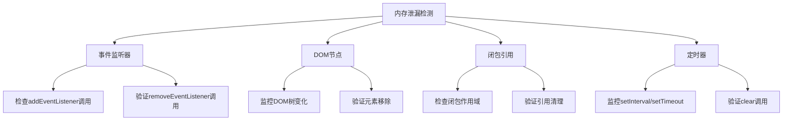

### 性能优化建议

1. **懒加载策略**：
   - 实现按需加载的组件
   - 优化大型列表的渲染
   - 减少不必要的重渲染

2. **缓存机制**：
   - 实现智能的本地缓存
   - 优化存储层的查询性能
   - 监控缓存命中率

3. **资源管理**：
   - 及时清理定时器和监听器
   - 优化图片和样式的加载
   - 减少不必要的网络请求

**章节来源**
- [content/index.ts](file://src/content/index.ts#L96-L101)
- [background/index.ts](file://src/background/index.ts#L98-L113)

## 断点与条件断点技巧

### 断点类型与应用场景

1. **行断点**：
   - 在关键代码行设置断点
   - 监控函数的执行流程
   - 检查变量的中间状态

2. **条件断点**：
   - 在特定条件下触发断点
   - 过滤重复的调试信息
   - 定位特定的数据状态

3. **异常断点**：
   - 监控未处理的异常
   - 捕获异步操作的错误
   - 验证错误恢复机制

### 高级调试技巧

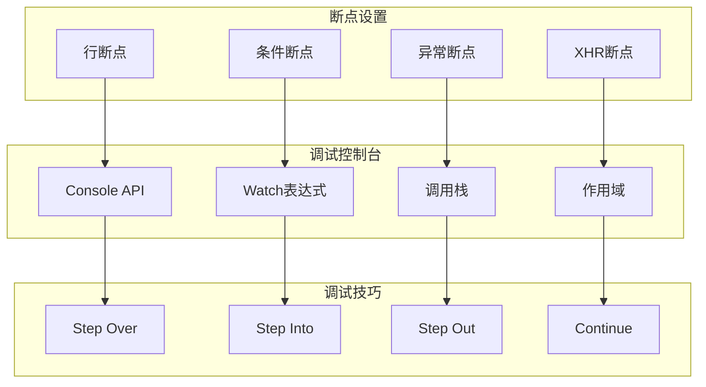

### 实战调试场景

1. **消息通信调试**：
   - 在 `chrome.runtime.onMessage` 处设置断点
   - 监控消息参数的传递
   - 验证异步响应的时机

2. **存储操作调试**：
   - 在 `storage.saveTask()` 处设置断点
   - 检查任务对象的结构
   - 验证OpLog的生成

3. **同步流程调试**：
   - 在 `sync.push()` 和 `sync.pull()` 处设置断点
   - 监控网络请求的响应
   - 验证数据应用的正确性

**章节来源**
- [background/index.ts](file://src/background/index.ts#L68-L81)
- [storage.ts](file://src/lib/storage.ts#L55-L95)
- [sync.ts](file://src/lib/sync.ts#L24-L52)

## 日志记录与错误追踪

### 日志策略

QKnot采用了多层次的日志记录策略：

1. **关键操作日志**：
   - 同步触发和完成
   - 任务创建和删除
   - 用户交互事件

2. **错误追踪**：
   - 网络请求失败
   - 存储操作异常
   - 异步操作错误

3. **性能监控**：
   - 请求响应时间
   - 渲染性能指标
   - 内存使用情况

### 错误处理机制

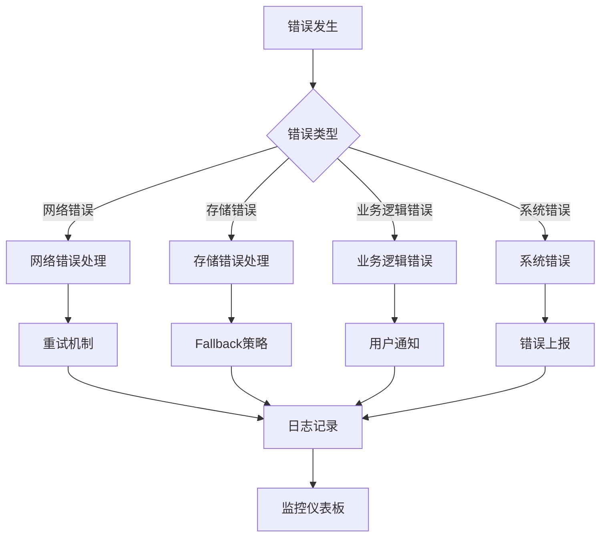

### 调试日志示例

1. **后台脚本日志**：
   ```
   Service Worker Loaded
   Triggering auto sync...
   Triggering manual sync...
   ```

2. **内容脚本日志**：
   ```
   QKnot: Runtime error: ...
   QKnot: Failed to send message: ...
   ```

3. **存储层日志**：
   ```
   OpLog generated: task-create-123
   OpLog cleared: task-delete-456
   ```

**章节来源**
- [background/index.ts](file://src/background/index.ts#L5-L15)
- [content/index.ts](file://src/content/index.ts#L214-L233)
- [storage.ts](file://src/lib/storage.ts#L109-L127)

## 生产环境问题排查

### 常见问题场景

1. **同步失败问题**：
   - 检查网络连接状态
   - 验证认证令牌的有效性
   - 监控服务器响应状态

2. **数据不一致问题**：
   - 验证OpLog的完整性
   - 检查乐观更新的回滚
   - 监控并发操作的冲突

3. **性能问题**：
   - 分析渲染性能瓶颈
   - 监控内存使用情况
   - 优化网络请求策略

### 排查流程

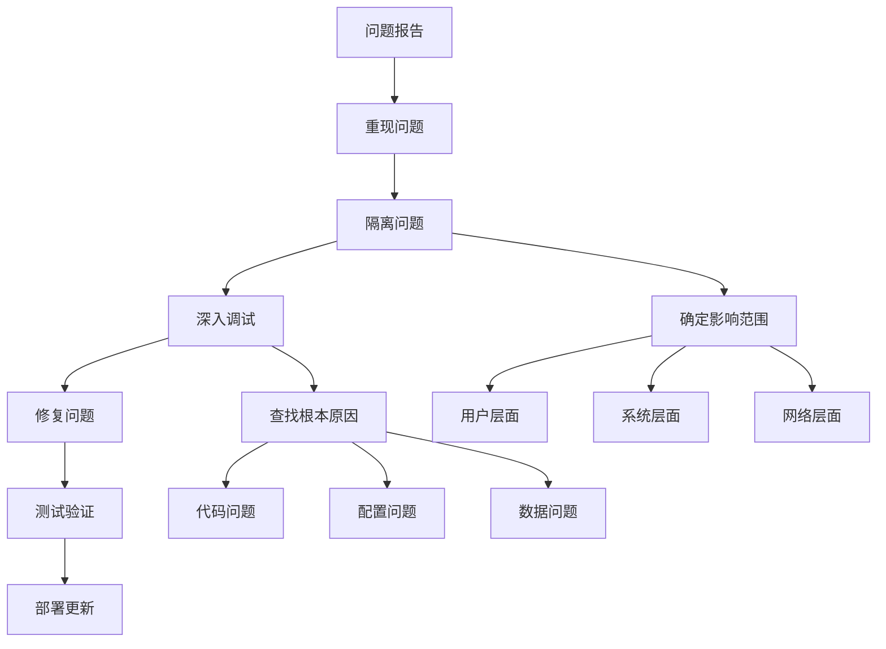

### 监控指标

1. **用户行为指标**：
   - 同步成功率
   - 任务创建频率
   - 用户活跃度

2. **系统健康指标**：
   - 服务可用性
   - 响应时间
   - 错误率

3. **性能指标**：
   - 内存使用量
   - CPU占用率
   - 网络带宽

**章节来源**
- [sync.ts](file://src/lib/sync.ts#L46-L52)
- [storage.ts](file://src/lib/storage.ts#L244-L265)

## 常见问题诊断

### 同步问题诊断

1. **定时同步不触发**：
   - 检查 `chrome.alarms` 的创建
   - 验证权限配置
   - 监控服务工作线程状态

2. **手动同步失败**：
   - 检查认证状态
   - 验证服务器URL配置
   - 监控网络请求

3. **数据不同步**：
   - 检查OpLog的生成
   - 验证版本号递增
   - 监控applyChanges

### UI交互问题诊断

1. **浮动按钮不显示**：
   - 检查用户选择检测
   - 验证DOM元素创建
   - 监控CSS样式应用

2. **消息通信失败**：
   - 检查消息格式
   - 验证响应处理
   - 监控错误捕获

3. **状态更新异常**：
   - 检查action函数
   - 验证状态变更
   - 监控异步操作

### 存储问题诊断

1. **数据丢失**：
   - 检查存储权限
   - 验证数据序列化
   - 监控存储操作

2. **性能下降**：
   - 检查存储查询
   - 验证索引使用
   - 监控存储大小

3. **数据损坏**：
   - 检查数据结构
   - 验证数据完整性
   - 监控数据转换

**章节来源**
- [background/index.ts](file://src/background/index.ts#L8-L15)
- [content/index.ts](file://src/content/index.ts#L120-L133)
- [storage.ts](file://src/lib/storage.ts#L50-L95)

## 最佳实践建议

### 调试工具配置

1. **开发环境配置**：
   - 启用Source Maps
   - 配置断点条件
   - 设置日志级别

2. **生产环境监控**：
   - 实现错误上报
   - 监控关键指标
   - 设置告警规则

3. **性能监控**：
   - 配置性能基准
   - 监控用户体验指标
   - 定期性能评估

### 代码质量保证

1. **错误处理**：
   - 实现全面的错误捕获
   - 提供友好的错误提示
   - 记录详细的错误信息

2. **异步操作**：
   - 使用Promise和async/await
   - 实现超时机制
   - 处理竞态条件

3. **内存管理**：
   - 及时清理资源
   - 避免内存泄漏
   - 优化数据结构

### 团队协作

1. **调试文档**：
   - 维护调试指南
   - 记录常见问题
   - 分享调试技巧

2. **代码审查**：
   - 检查调试代码
   - 验证错误处理
   - 评估性能影响

3. **知识分享**：
   - 组织调试培训
   - 分享最佳实践
   - 建立问题解决流程

通过遵循这些调试工具和技巧，开发者可以更有效地诊断和解决QKnot扩展中的各种问题，提高开发效率和产品质量。