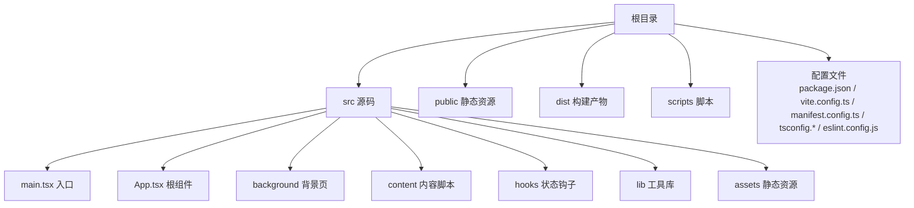
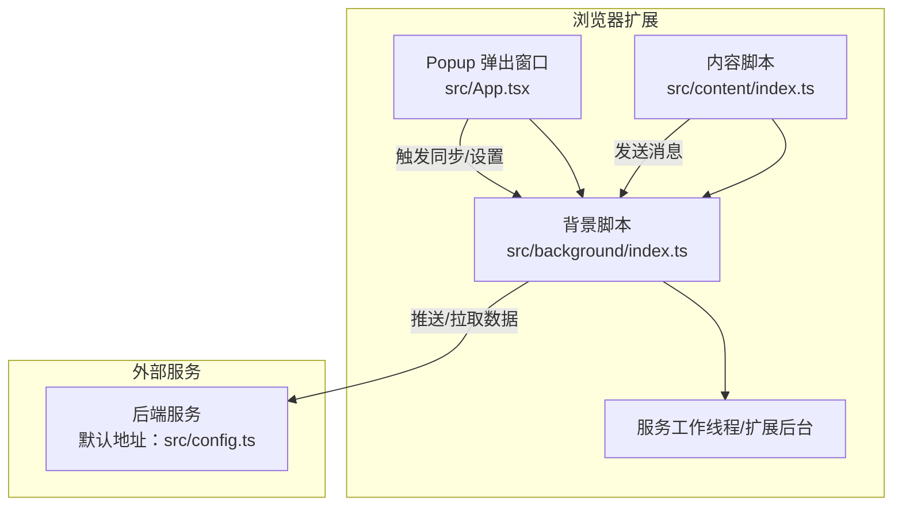
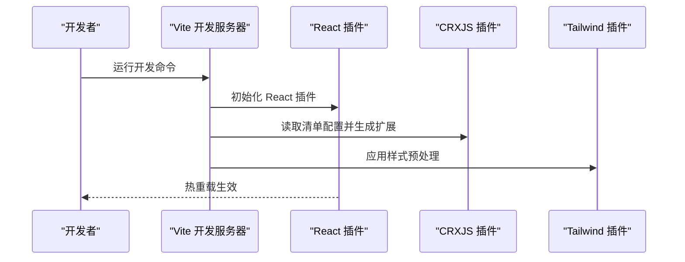
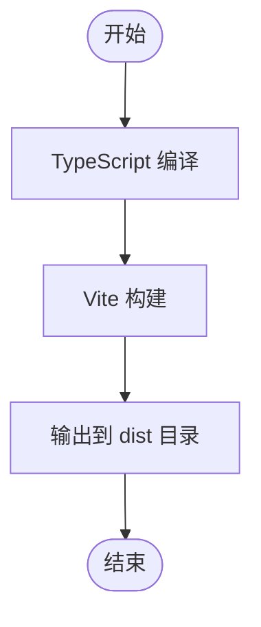
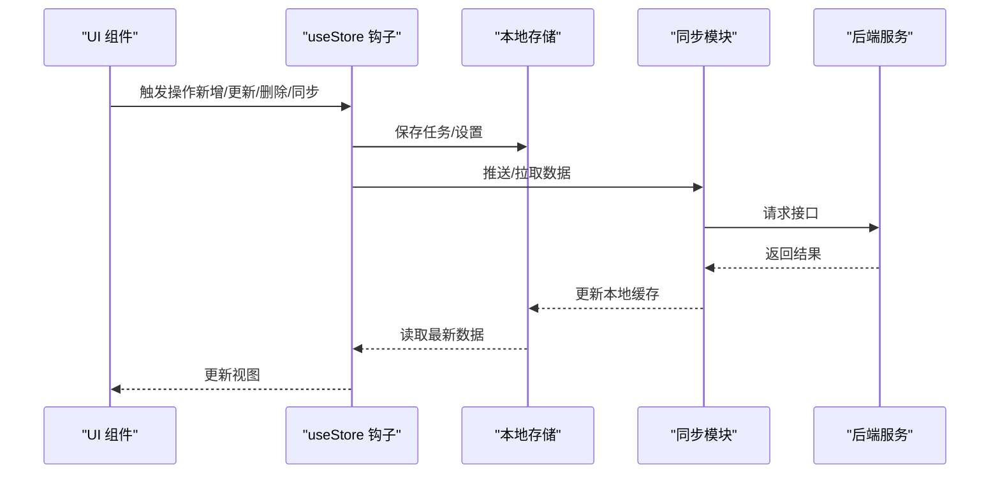
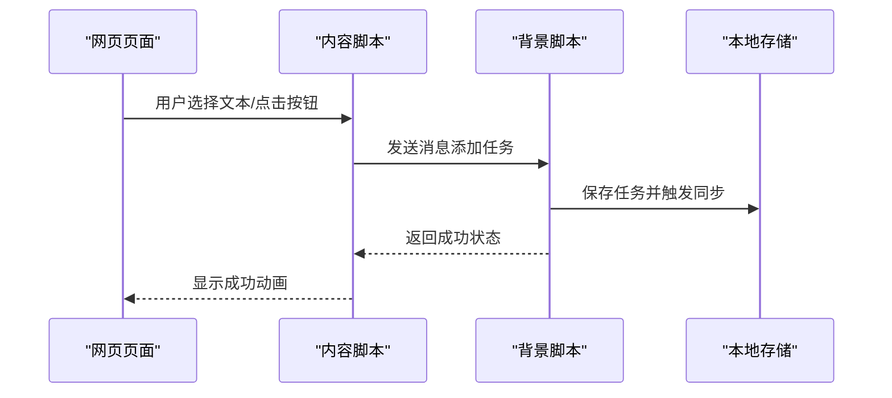
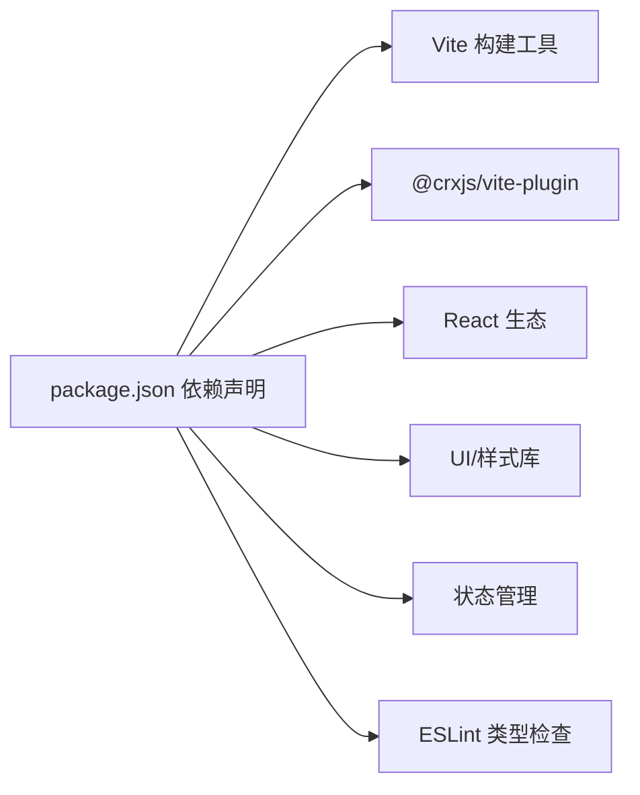

# 快速开始

<cite>
**本文引用的文件**
- [package.json](file://package.json)
- [vite.config.ts](file://vite.config.ts)
- [manifest.config.ts](file://manifest.config.ts)
- [tsconfig.json](file://tsconfig.json)
- [tsconfig.app.json](file://tsconfig.app.json)
- [tsconfig.node.json](file://tsconfig.node.json)
- [eslint.config.js](file://eslint.config.js)
- [src/main.tsx](file://src/main.tsx)
- [src/App.tsx](file://src/App.tsx)
- [src/config.ts](file://src/config.ts)
- [src/background/index.ts](file://src/background/index.ts)
- [src/content/index.ts](file://src/content/index.ts)
- [src/hooks/useStore.ts](file://src/hooks/useStore.ts)
- [README.md](file://README.md)
</cite>

## 目录
1. [简介](#简介)
2. [项目结构](#项目结构)
3. [核心组件](#核心组件)
4. [架构总览](#架构总览)
5. [详细组件分析](#详细组件分析)
6. [依赖关系分析](#依赖关系分析)
7. [性能注意事项](#性能注意事项)
8. [故障排查指南](#故障排查指南)
9. [结论](#结论)
10. [附录](#附录)

## 简介
本指南面向新加入的开发者，帮助你在最短时间内完成环境准备、项目克隆、依赖安装与首次构建，并掌握开发服务器启动、热重载配置、调试方法以及生产环境构建与打包流程。同时提供常见初始化问题的排查与解决方案，确保你能够顺利运行并进行日常开发。

## 项目结构
该项目采用 React + TypeScript + Vite 构建，结合 CRXJS 插件以支持 Chrome 扩展开发。核心目录与职责如下：
- src：应用源码（React 组件、背景脚本、内容脚本、状态管理等）
- public：静态资源（图标等）
- dist：构建产物（包含扩展清单、HTML、资源等）
- scripts：构建辅助脚本
- 配置文件：package.json、vite.config.ts、manifest.config.ts、tsconfig.*、eslint.config.js

图表来源
- [src/main.tsx](file://src/main.tsx#L1-L11)
- [src/App.tsx](file://src/App.tsx#L1-L860)
- [src/background/index.ts](file://src/background/index.ts#L1-L114)
- [src/content/index.ts](file://src/content/index.ts#L1-L239)

章节来源
- [package.json](file://package.json#L1-L42)
- [vite.config.ts](file://vite.config.ts#L1-L21)
- [manifest.config.ts](file://manifest.config.ts#L1-L40)
- [tsconfig.json](file://tsconfig.json#L1-L8)
- [tsconfig.app.json](file://tsconfig.app.json#L1-L29)
- [tsconfig.node.json](file://tsconfig.node.json#L1-L27)
- [eslint.config.js](file://eslint.config.js#L1-L24)

## 核心组件
- 应用入口与根组件：负责渲染 React 根节点与主界面逻辑
- 背景脚本：处理定时同步、上下文菜单、消息监听与任务创建
- 内容脚本：在网页中注入悬浮按钮，实现选中文本或页面链接的快速添加
- 状态管理：基于 Zustand 的轻量状态容器，统一管理任务列表与同步状态
- 构建与清单：Vite 配置集成 CRXJS 插件生成扩展清单与资源

章节来源
- [src/main.tsx](file://src/main.tsx#L1-L11)
- [src/App.tsx](file://src/App.tsx#L1-L860)
- [src/background/index.ts](file://src/background/index.ts#L1-L114)
- [src/content/index.ts](file://src/content/index.ts#L1-L239)
- [src/hooks/useStore.ts](file://src/hooks/useStore.ts#L1-L193)

## 架构总览
下图展示了浏览器扩展的典型架构：Popup（弹出窗口）、内容脚本、背景脚本与服务端之间的交互。

图表来源
- [src/App.tsx](file://src/App.tsx#L1-L860)
- [src/background/index.ts](file://src/background/index.ts#L1-L114)
- [src/content/index.ts](file://src/content/index.ts#L1-L239)
- [src/config.ts](file://src/config.ts#L1-L2)

## 详细组件分析

### 开发服务器与热重载
- 启动命令：使用 Vite 提供的开发服务器，支持热重载与类型检查
- 插件链路：React 插件、CRXJS 插件（生成扩展清单）、TailwindCSS 插件
- 别名配置：@ 指向 src 目录，便于导入

图表来源
- [vite.config.ts](file://vite.config.ts#L1-L21)
- [package.json](file://package.json#L6-L11)

章节来源
- [vite.config.ts](file://vite.config.ts#L1-L21)
- [package.json](file://package.json#L6-L11)

### 生产构建与打包
- 构建顺序：先执行 TypeScript 编译，再由 Vite 打包
- 输出位置：dist 目录，包含扩展清单、HTML、资源与服务工作线程加载器
- 清单生成：通过 CRXJS 插件从 manifest.config.ts 动态生成

图表来源
- [package.json](file://package.json#L8-L8)
- [vite.config.ts](file://vite.config.ts#L1-L21)
- [manifest.config.ts](file://manifest.config.ts#L1-L40)

章节来源
- [package.json](file://package.json#L8-L8)
- [vite.config.ts](file://vite.config.ts#L1-L21)
- [manifest.config.ts](file://manifest.config.ts#L1-L40)

### 状态管理与数据流
- 使用 Zustand 管理任务列表与同步状态
- 支持本地存储与云端同步，提供手动同步与仅拉取功能
- UI 层通过 hooks 访问状态，实现响应式更新

图表来源
- [src/hooks/useStore.ts](file://src/hooks/useStore.ts#L1-L193)
- [src/App.tsx](file://src/App.tsx#L1-L860)
- [src/config.ts](file://src/config.ts#L1-L2)

章节来源
- [src/hooks/useStore.ts](file://src/hooks/useStore.ts#L1-L193)
- [src/App.tsx](file://src/App.tsx#L1-L860)
- [src/config.ts](file://src/config.ts#L1-L2)

### 内容脚本与悬浮按钮
- 在页面中动态注入悬浮按钮，支持选中文本或页面链接
- 点击后向背景脚本发送消息，创建任务并触发同步

图表来源
- [src/content/index.ts](file://src/content/index.ts#L1-L239)
- [src/background/index.ts](file://src/background/index.ts#L1-L114)

章节来源
- [src/content/index.ts](file://src/content/index.ts#L1-L239)
- [src/background/index.ts](file://src/background/index.ts#L1-L114)

## 依赖关系分析
- 构建与开发工具：Vite、@vitejs/plugin-react、@crxjs/vite-plugin、TailwindCSS
- 运行时依赖：React、React DOM、Zustand、Lucide React、Sonner、Tailwind Merge、date-fns、ulid
- 类型与校验：TypeScript、ESLint 及相关插件

图表来源
- [package.json](file://package.json#L12-L40)

章节来源
- [package.json](file://package.json#L12-L40)
- [eslint.config.js](file://eslint.config.js#L1-L24)
- [tsconfig.app.json](file://tsconfig.app.json#L1-L29)
- [tsconfig.node.json](file://tsconfig.node.json#L1-L27)

## 性能注意事项
- 使用 Vite 的按需编译与热重载，减少等待时间
- TypeScript 配置启用严格模式与仅可擦除语法，提升类型安全与构建效率
- ESLint 集成 React Hooks 与刷新规则，降低运行时开销
- CRXJS 插件自动处理清单与资源映射，避免手工维护成本

章节来源
- [vite.config.ts](file://vite.config.ts#L1-L21)
- [tsconfig.app.json](file://tsconfig.app.json#L1-L29)
- [tsconfig.node.json](file://tsconfig.node.json#L1-L27)
- [eslint.config.js](file://eslint.config.js#L1-L24)

## 故障排查指南
- Node.js 版本不匹配
  - 现象：安装依赖时报错或构建失败
  - 处理：确认 Node.js 版本满足项目要求；如使用 nvm，请切换至推荐版本后再安装依赖
- 无法启动开发服务器
  - 现象：运行开发命令后无响应或报错
  - 处理：检查端口占用、网络代理、防火墙；清理 node_modules 并重新安装依赖
- 热重载无效
  - 现象：修改代码后页面未自动刷新
  - 处理：确认浏览器已允许 localhost 通信、关闭可能拦截 WebSocket 的安全软件；重启开发服务器
- 扩展无法加载
  - 现象：加载 unpacked 扩展时报错
  - 处理：确保 dist 目录存在且包含清单文件；在浏览器开发者模式中重新加载；检查 manifest 配置是否正确
- 同步失败
  - 现象：登录或同步提示错误
  - 处理：检查默认服务地址是否可达；确认网络连通性；查看控制台日志定位具体错误
- ESLint 报错
  - 现象：编辑器提示类型或风格问题
  - 处理：根据 ESLint 配置修复；必要时调整规则或忽略特定文件

章节来源
- [README.md](file://README.md#L1-L74)
- [package.json](file://package.json#L6-L11)
- [vite.config.ts](file://vite.config.ts#L1-L21)
- [manifest.config.ts](file://manifest.config.ts#L1-L40)
- [src/config.ts](file://src/config.ts#L1-L2)

## 结论
通过本快速开始指南，你可以完成环境准备、项目克隆、依赖安装与首次构建，并掌握开发服务器启动、热重载配置、调试方法以及生产构建与打包流程。遇到问题时，可依据故障排查指南逐项定位与解决。建议在开发过程中持续关注 TypeScript 严格模式与 ESLint 规则，以保持代码质量与一致性。

## 附录
- 常用命令
  - 安装依赖：npm install
  - 启动开发服务器：npm run dev
  - 预览生产构建：npm run preview
  - 生成生产构建：npm run build
  - 运行 ESLint：npm run lint
- 关键配置文件路径
  - 构建配置：vite.config.ts
  - 扩展清单：manifest.config.ts
  - TypeScript 配置：tsconfig.json、tsconfig.app.json、tsconfig.node.json
  - Lint 配置：eslint.config.js
- 默认服务地址
  - 默认服务地址定义于 src/config.ts，用于登录与同步请求

章节来源
- [package.json](file://package.json#L6-L11)
- [vite.config.ts](file://vite.config.ts#L1-L21)
- [manifest.config.ts](file://manifest.config.ts#L1-L40)
- [tsconfig.json](file://tsconfig.json#L1-L8)
- [tsconfig.app.json](file://tsconfig.app.json#L1-L29)
- [tsconfig.node.json](file://tsconfig.node.json#L1-L27)
- [eslint.config.js](file://eslint.config.js#L1-L24)
- [src/config.ts](file://src/config.ts#L1-L2)