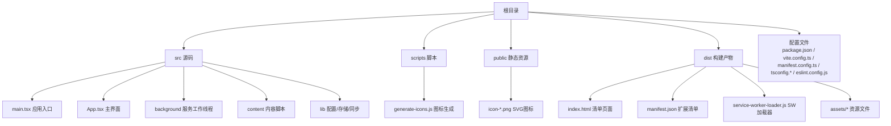
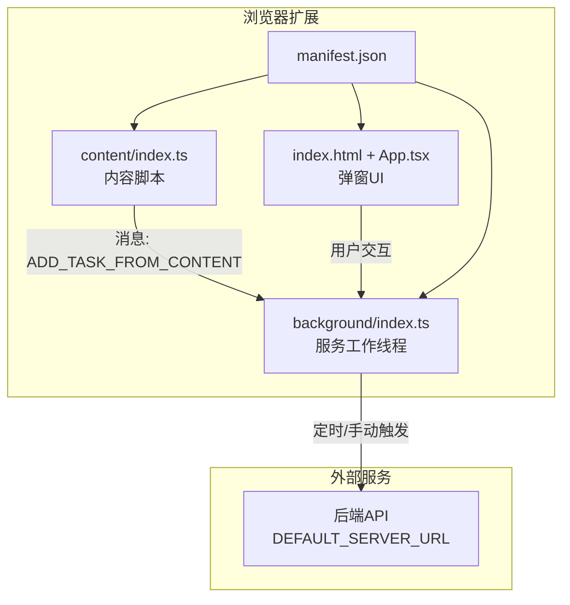
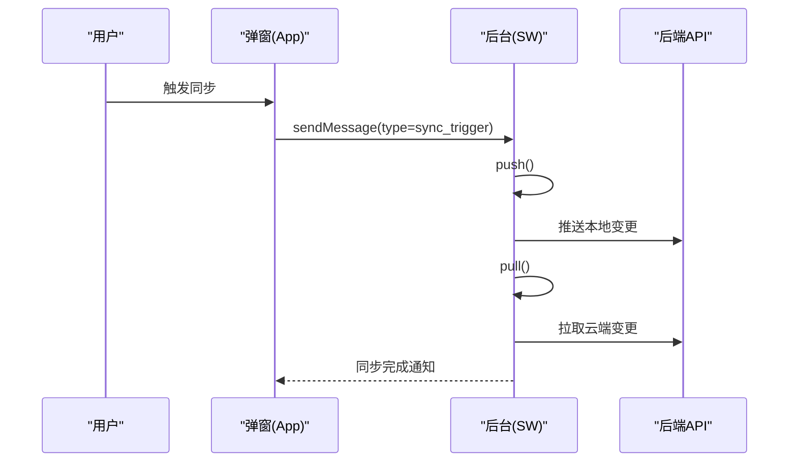
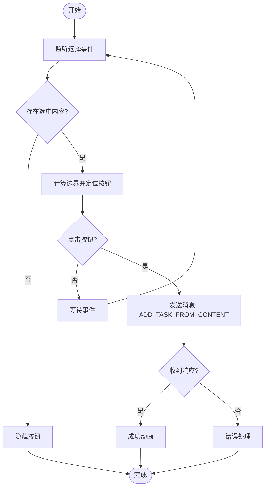
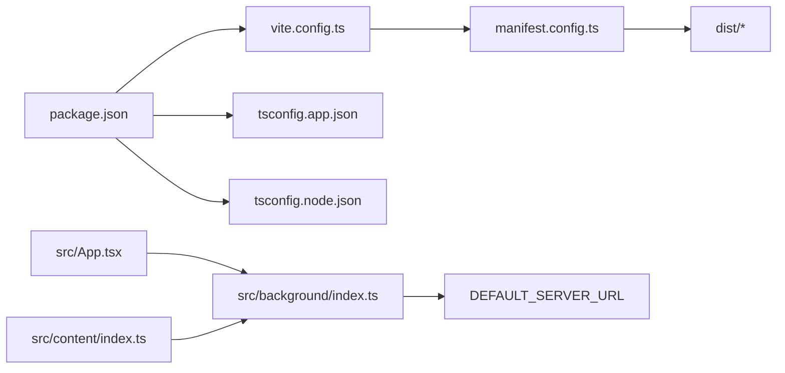

# 构建与部署

<cite>
**本文引用的文件**
- [package.json](file://package.json)
- [vite.config.ts](file://vite.config.ts)
- [manifest.config.ts](file://manifest.config.ts)
- [scripts/generate-icons.js](file://scripts/generate-icons.js)
- [tsconfig.json](file://tsconfig.json)
- [tsconfig.app.json](file://tsconfig.app.json)
- [tsconfig.node.json](file://tsconfig.node.json)
- [eslint.config.js](file://eslint.config.js)
- [src/main.tsx](file://src/main.tsx)
- [src/App.tsx](file://src/App.tsx)
- [src/background/index.ts](file://src/background/index.ts)
- [src/content/index.ts](file://src/content/index.ts)
- [src/config.ts](file://src/config.ts)
- [README.md](file://README.md)
</cite>

## 目录
1. [简介](#简介)
2. [项目结构](#项目结构)
3. [核心组件](#核心组件)
4. [架构总览](#架构总览)
5. [详细组件分析](#详细组件分析)
6. [依赖关系分析](#依赖关系分析)
7. [性能考虑](#性能考虑)
8. [故障排查指南](#故障排查指南)
9. [结论](#结论)
10. [附录](#附录)

## 简介
本文件面向QKnot Chrome扩展的构建与部署，系统性说明Vite构建配置、生产优化与代码分割策略；Chrome扩展打包流程、签名验证与发布准备；自动化构建脚本、图标生成工具与资源优化方法；本地测试与调试、性能分析技巧；以及持续集成、自动化测试与部署流水线建议，并解释版本管理、更新机制与回滚策略。

## 项目结构
仓库采用按功能模块划分的组织方式：前端应用位于src目录，构建与清单由Vite与CRX插件驱动，图标生成通过独立脚本完成，类型与规则配置分别在TypeScript与ESLint中定义。

图表来源
- [vite.config.ts](file://vite.config.ts#L1-L21)
- [manifest.config.ts](file://manifest.config.ts#L1-L40)
- [scripts/generate-icons.js](file://scripts/generate-icons.js#L1-L25)
- [src/main.tsx](file://src/main.tsx#L1-L11)

章节来源
- [vite.config.ts](file://vite.config.ts#L1-L21)
- [manifest.config.ts](file://manifest.config.ts#L1-L40)
- [scripts/generate-icons.js](file://scripts/generate-icons.js#L1-L25)
- [src/main.tsx](file://src/main.tsx#L1-L11)

## 核心组件
- 构建与打包
  - Vite配置启用React、CRX与Tailwind插件，解析别名指向src目录，用于开发与生产构建。
  - CRX插件从manifest配置动态生成清单，支持多环境（如staging）名称差异化。
- 清单与权限
  - Manifest v3，声明后台服务工作线程、内容脚本、权限与主机权限，定义图标与弹出页。
- 类型与规则
  - TypeScript双配置分层（应用/Node），ESLint推荐规则与React刷新插件。
- 自动化脚本
  - 图标生成脚本基于Sharp批量输出16/48/128 PNG，确保清单引用一致。
- 前端入口与应用
  - React入口渲染应用，应用内含任务列表、设置、国际化与同步逻辑。

章节来源
- [package.json](file://package.json#L1-L42)
- [vite.config.ts](file://vite.config.ts#L1-L21)
- [manifest.config.ts](file://manifest.config.ts#L1-L40)
- [tsconfig.json](file://tsconfig.json#L1-L8)
- [tsconfig.app.json](file://tsconfig.app.json#L1-L29)
- [tsconfig.node.json](file://tsconfig.node.json#L1-L27)
- [eslint.config.js](file://eslint.config.js#L1-L24)
- [scripts/generate-icons.js](file://scripts/generate-icons.js#L1-L25)
- [src/main.tsx](file://src/main.tsx#L1-L11)
- [src/App.tsx](file://src/App.tsx#L1-L860)

## 架构总览
下图展示浏览器扩展的典型运行时结构：Popup弹窗（React应用）、后台服务工作线程（定时同步、上下文菜单）、内容脚本（注入浮动按钮、发送消息）与清单配置。

图表来源
- [manifest.config.ts](file://manifest.config.ts#L27-L38)
- [src/background/index.ts](file://src/background/index.ts#L1-L114)
- [src/content/index.ts](file://src/content/index.ts#L1-L239)
- [src/App.tsx](file://src/App.tsx#L1-L860)
- [src/config.ts](file://src/config.ts#L1-L2)

## 详细组件分析

### Vite构建配置与生产优化
- 插件链
  - React插件：启用快速刷新与编译优化。
  - CRX插件：读取manifest配置，生成扩展包与清单。
  - Tailwind插件：集成样式工具链。
- 别名解析
  - @ 指向src，便于统一导入路径。
- 生产优化要点
  - 使用Vite默认的代码分割策略，按需加载模块。
  - 在生产模式下，建议开启压缩与资源内联策略，结合浏览器缓存与清单版本号实现长效缓存。
  - 对第三方库进行外部化或预构建，减少重复打包体积。

章节来源
- [vite.config.ts](file://vite.config.ts#L1-L21)
- [package.json](file://package.json#L6-L11)

### 清单与打包流程
- 清单生成
  - 通过defineManifest动态生成，包含名称、版本、图标、后台、权限与内容脚本等。
  - 版本号从package.json提取并转换为语义化主次补丁格式。
- 打包与签名
  - 使用CRX插件生成.crx包；签名需在开发者仪表板完成，或通过CI工具自动化签名。
- 发布准备
  - 准备发布说明、截图与隐私政策链接；确保权限最小化与主机权限范围明确。

章节来源
- [manifest.config.ts](file://manifest.config.ts#L1-L40)
- [package.json](file://package.json#L4-L4)

### 图标生成与资源优化
- 图标生成
  - 脚本读取SVG，批量生成16/48/128 PNG，输出至public目录，供清单引用。
- 资源优化
  - 压缩PNG与SVG；在生产构建中启用资源内联与哈希命名，结合清单版本号实现缓存失效。
  - 将常用字体与图标转为SVG或Web字体，减少HTTP请求数。

章节来源
- [scripts/generate-icons.js](file://scripts/generate-icons.js#L1-L25)
- [manifest.config.ts](file://manifest.config.ts#L22-L26)

### 本地测试与调试
- 开发与预览
  - 使用Vite开发服务器与热更新；使用vite preview预览生产构建效果。
- 调试技巧
  - 在background与content脚本中使用console输出；利用浏览器扩展页面检查消息通道与权限状态。
  - 在App中通过toast与日志定位同步问题。
- 性能分析
  - 使用浏览器性能面板分析首屏渲染与重绘；对长列表与动画进行节流与虚拟化优化。

章节来源
- [package.json](file://package.json#L6-L11)
- [src/background/index.ts](file://src/background/index.ts#L1-L114)
- [src/content/index.ts](file://src/content/index.ts#L1-L239)
- [src/App.tsx](file://src/App.tsx#L1-L860)

### 同步与后台逻辑
- 定时同步
  - 创建周期性闹钟，定期触发推送与拉取。
- 手动同步
  - 接收来自弹窗的消息，执行同步流程。
- 上下文菜单
  - 注册“添加到QKnote”与“添加页面到QKnote”，处理选中文本与当前页面URL。

图表来源
- [src/background/index.ts](file://src/background/index.ts#L68-L81)
- [src/App.tsx](file://src/App.tsx#L62-L72)
- [src/config.ts](file://src/config.ts#L1-L2)

章节来源
- [src/background/index.ts](file://src/background/index.ts#L1-L114)
- [src/App.tsx](file://src/App.tsx#L1-L860)
- [src/config.ts](file://src/config.ts#L1-L2)

### 内容脚本与浮动按钮
- 功能概述
  - 监听选择事件，计算边界并在可视区域内显示浮动按钮；点击后向后台发送消息创建任务。
- 交互细节
  - 支持鼠标拖拽结束与键盘选择；边界检测避免溢出视口；成功反馈动画后清理选区。

图表来源
- [src/content/index.ts](file://src/content/index.ts#L120-L234)

章节来源
- [src/content/index.ts](file://src/content/index.ts#L1-L239)

### 版本管理、更新机制与回滚
- 版本号
  - 清单版本从package.json提取并规范化为主次补丁格式；同时保留version_name用于展示。
- 更新机制
  - 通过后台定时与手动触发同步，保持本地与云端数据一致；可扩展为增量更新策略。
- 回滚策略
  - 建议在客户端保存最近一次成功同步点；若新版本出现异常，可回退到该点并提示用户。

章节来源
- [manifest.config.ts](file://manifest.config.ts#L4-L13)
- [package.json](file://package.json#L4-L4)
- [src/background/index.ts](file://src/background/index.ts#L8-L15)

## 依赖关系分析
- 构建与类型
  - Vite与CRX插件依赖于package.json中的脚本与依赖；TS配置分别约束应用与Node侧编译行为。
- 应用与扩展
  - 弹窗UI依赖后台同步能力；内容脚本负责与后台通信；清单决定权限与生命周期。

图表来源
- [package.json](file://package.json#L1-L42)
- [vite.config.ts](file://vite.config.ts#L1-L21)
- [manifest.config.ts](file://manifest.config.ts#L1-L40)
- [tsconfig.app.json](file://tsconfig.app.json#L1-L29)
- [tsconfig.node.json](file://tsconfig.node.json#L1-L27)
- [src/App.tsx](file://src/App.tsx#L1-L860)
- [src/background/index.ts](file://src/background/index.ts#L1-L114)
- [src/content/index.ts](file://src/content/index.ts#L1-L239)
- [src/config.ts](file://src/config.ts#L1-L2)

章节来源
- [package.json](file://package.json#L1-L42)
- [vite.config.ts](file://vite.config.ts#L1-L21)
- [manifest.config.ts](file://manifest.config.ts#L1-L40)
- [tsconfig.json](file://tsconfig.json#L1-L8)
- [tsconfig.app.json](file://tsconfig.app.json#L1-L29)
- [tsconfig.node.json](file://tsconfig.node.json#L1-L27)
- [src/App.tsx](file://src/App.tsx#L1-L860)
- [src/background/index.ts](file://src/background/index.ts#L1-L114)
- [src/content/index.ts](file://src/content/index.ts#L1-L239)
- [src/config.ts](file://src/config.ts#L1-L2)

## 性能考虑
- 代码分割
  - 将弹窗UI与后台逻辑拆分为独立模块，按需加载；对第三方库进行预构建与外部化。
- 资源优化
  - 启用压缩与长效缓存；对图标与字体进行内联或CDN托管；减少HTTP请求。
- 运行时优化
  - 控制内容脚本DOM操作频率，使用防抖与边界检测；后台定时同步避免过于频繁。
- 开发体验
  - 使用ESLint与TS严格模式降低错误率；在README中提供了ESLint配置示例与建议。

章节来源
- [README.md](file://README.md#L14-L74)
- [eslint.config.js](file://eslint.config.js#L1-L24)
- [tsconfig.app.json](file://tsconfig.app.json#L1-L29)
- [tsconfig.node.json](file://tsconfig.node.json#L1-L27)

## 故障排查指南
- 构建失败
  - 检查Vite与CRX插件版本兼容性；确认manifest配置正确；查看TypeScript编译错误。
- 清单与权限
  - 确认权限与主机权限范围；检查图标路径是否与public输出一致。
- 同步异常
  - 在后台与弹窗中增加日志；验证DEFAULT_SERVER_URL可达；检查网络与跨域策略。
- 内容脚本无响应
  - 确认内容脚本注入时机与匹配规则；检查消息通道是否被拦截。

章节来源
- [vite.config.ts](file://vite.config.ts#L1-L21)
- [manifest.config.ts](file://manifest.config.ts#L1-L40)
- [src/background/index.ts](file://src/background/index.ts#L1-L114)
- [src/content/index.ts](file://src/content/index.ts#L1-L239)
- [src/App.tsx](file://src/App.tsx#L1-L860)
- [src/config.ts](file://src/config.ts#L1-L2)

## 结论
本文件梳理了QKnot扩展的构建与部署全链路：从Vite配置、清单生成、图标与资源优化，到本地调试与性能分析，并给出版本管理与回滚建议。建议在CI中集成构建、测试与签名流程，确保发布质量与一致性。

## 附录
- 持续集成与自动化
  - 建议在CI中执行：安装依赖、类型检查、ESLint、构建、预览验证与签名打包。
- 自动化测试
  - 可结合单元与端到端测试框架，覆盖后台消息、内容脚本交互与弹窗UI关键流程。
- 发布与回滚
  - 发布前校验清单与权限；记录版本号与变更摘要；提供回滚到上一稳定版本的指引。