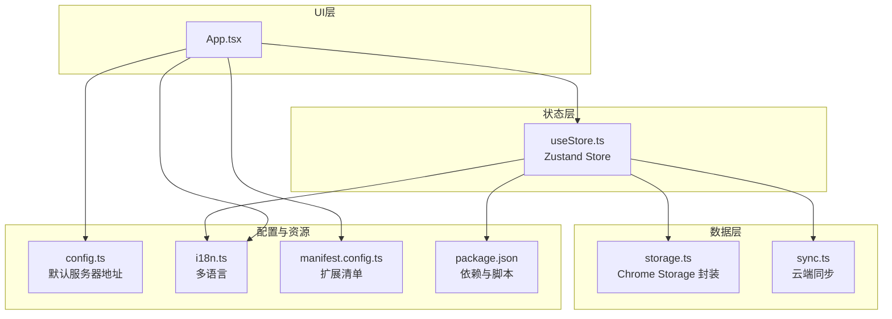
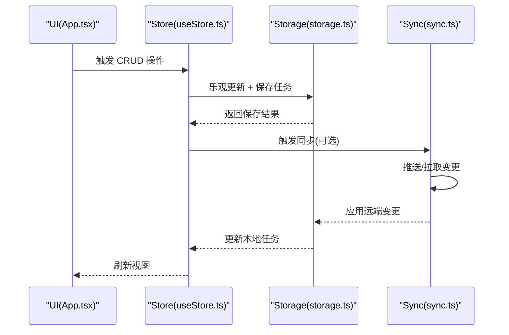
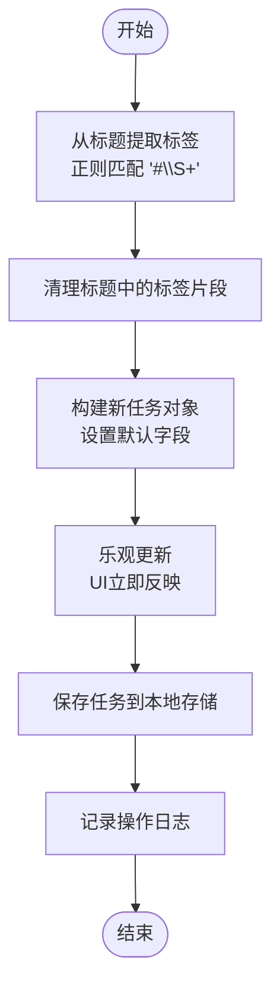
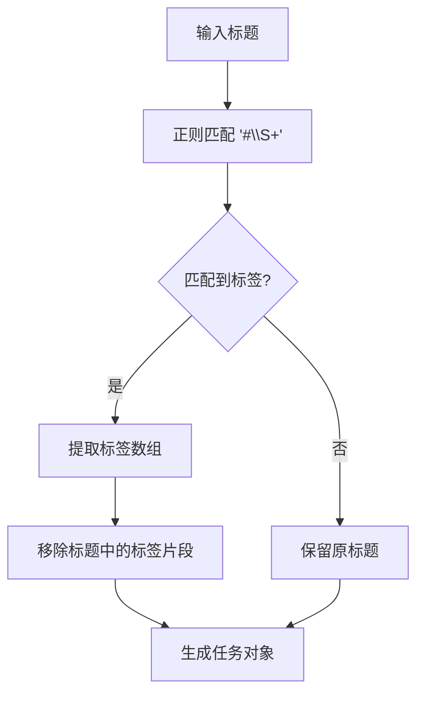
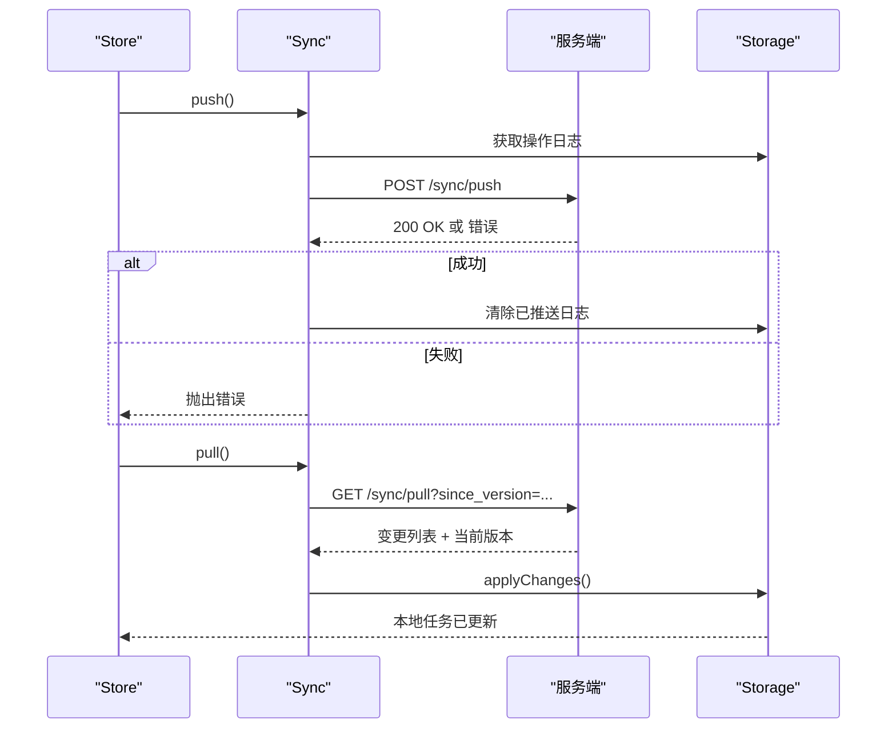
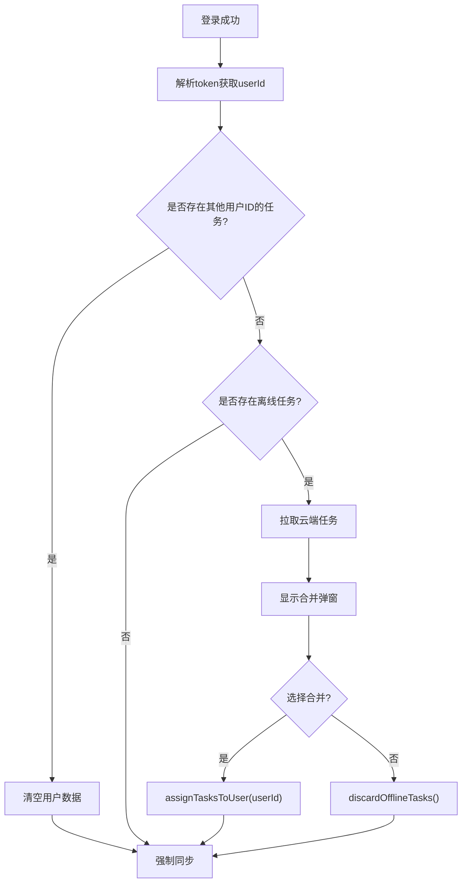
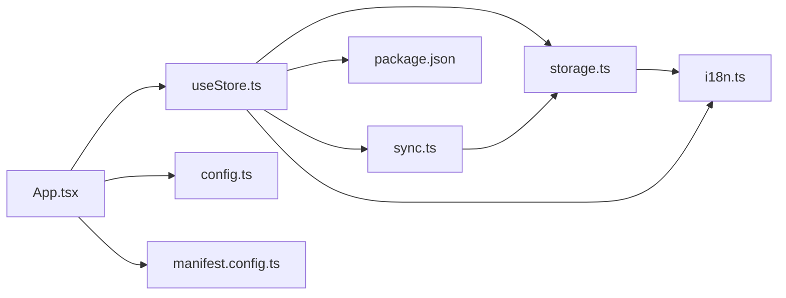

# 任务管理系统

<cite>
**本文引用的文件**
- [useStore.ts](file://src/hooks/useStore.ts)
- [storage.ts](file://src/lib/storage.ts)
- [sync.ts](file://src/lib/sync.ts)
- [App.tsx](file://src/App.tsx)
- [i18n.ts](file://src/lib/i18n.ts)
- [config.ts](file://src/config.ts)
- [main.tsx](file://src/main.tsx)
- [manifest.config.ts](file://manifest.config.ts)
- [package.json](file://package.json)
</cite>

## 目录
1. [简介](#简介)
2. [项目结构](#项目结构)
3. [核心组件](#核心组件)
4. [架构总览](#架构总览)
5. [详细组件分析](#详细组件分析)
6. [依赖关系分析](#依赖关系分析)
7. [性能考量](#性能考量)
8. [故障排查指南](#故障排查指南)
9. [结论](#结论)
10. [附录](#附录)

## 简介
本项目是一个基于浏览器扩展的任务管理系统，采用React + TypeScript + Zustand + Chrome Extension Storage构建，支持离线优先与云端同步。系统通过乐观更新优化用户交互体验，提供标签系统、多语言国际化、以及完善的CRUD操作流程。本文档将深入解析任务数据模型、CRUD实现机制、标签提取与管理、乐观更新与异步错误处理策略，并给出完整的API说明与最佳实践示例。

## 项目结构
项目采用按功能模块划分的组织方式：
- hooks：状态管理（Zustand）
- lib：存储与同步、国际化
- App.tsx：主界面与交互逻辑
- 配置：默认服务器地址、清单文件、包信息

图表来源
- [useStore.ts](file://src/hooks/useStore.ts#L1-L193)
- [storage.ts](file://src/lib/storage.ts#L1-L272)
- [sync.ts](file://src/lib/sync.ts#L1-L110)
- [App.tsx](file://src/App.tsx#L1-L860)
- [config.ts](file://src/config.ts#L1-L2)
- [i18n.ts](file://src/lib/i18n.ts#L1-L146)
- [manifest.config.ts](file://manifest.config.ts#L1-L40)
- [package.json](file://package.json#L1-L42)

章节来源
- [useStore.ts](file://src/hooks/useStore.ts#L1-L193)
- [storage.ts](file://src/lib/storage.ts#L1-L272)
- [sync.ts](file://src/lib/sync.ts#L1-L110)
- [App.tsx](file://src/App.tsx#L1-L860)
- [config.ts](file://src/config.ts#L1-L2)
- [i18n.ts](file://src/lib/i18n.ts#L1-L146)
- [manifest.config.ts](file://manifest.config.ts#L1-L40)
- [package.json](file://package.json#L1-L42)

## 核心组件
- 任务数据模型（Task）：包含标识、标题、描述、状态、优先级、标签、时间戳、删除标记及可选的用户归属。
- 存储层（storage.ts）：封装Chrome Storage，提供任务增删改查、操作日志记录、同步状态管理、离线任务处理等。
- 同步层（sync.ts）：负责向服务端推送/拉取变更，应用远端变更并维护客户端版本号。
- 状态层（useStore.ts）：Zustand Store，提供CRUD方法、乐观更新、加载与同步状态、语言切换等。
- UI层（App.tsx）：主界面、登录/注册、设置、任务列表与详情页、标签管理、合并确认弹窗等。
- 国际化（i18n.ts）：英文、简体中文、繁体中文三语支持。
- 配置（config.ts、manifest.config.ts、package.json）：默认服务器地址、扩展权限与清单、依赖与脚本。

章节来源
- [storage.ts](file://src/lib/storage.ts#L4-L15)
- [storage.ts](file://src/lib/storage.ts#L196-L204)
- [sync.ts](file://src/lib/sync.ts#L5-L110)
- [useStore.ts](file://src/hooks/useStore.ts#L8-L26)
- [App.tsx](file://src/App.tsx#L1-L860)
- [i18n.ts](file://src/lib/i18n.ts#L1-L146)
- [config.ts](file://src/config.ts#L1-L2)
- [manifest.config.ts](file://manifest.config.ts#L1-L40)
- [package.json](file://package.json#L1-L42)

## 架构总览
系统采用“UI层-状态层-数据层”的分层设计，UI通过Store触发动作，Store调用Storage进行本地持久化与操作日志记录，同时通过Sync与服务端交互。登录后自动拉取云端数据并过滤显示，支持离线任务与用户任务的合并策略。

图表来源
- [App.tsx](file://src/App.tsx#L11-L21)
- [useStore.ts](file://src/hooks/useStore.ts#L53-L75)
- [useStore.ts](file://src/hooks/useStore.ts#L77-L100)
- [useStore.ts](file://src/hooks/useStore.ts#L102-L122)
- [useStore.ts](file://src/hooks/useStore.ts#L124-L140)
- [useStore.ts](file://src/hooks/useStore.ts#L142-L146)
- [useStore.ts](file://src/hooks/useStore.ts#L167-L191)
- [storage.ts](file://src/lib/storage.ts#L55-L95)
- [storage.ts](file://src/lib/storage.ts#L97-L106)
- [sync.ts](file://src/lib/sync.ts#L6-L53)
- [sync.ts](file://src/lib/sync.ts#L55-L83)
- [sync.ts](file://src/lib/sync.ts#L85-L99)

## 详细组件分析

### 任务数据模型与业务规则
- 字段定义
  - id：唯一标识，使用ULID生成
  - userId：可选，用于区分任务归属，登录后自动赋值
  - title：必填，任务标题
  - description：可选，支持URL链接展示
  - status：枚举值，'todo' | 'done' | 'archived'
  - priority：枚举值，'none' | 'low' | 'medium' | 'high'
  - tags：字符串数组，支持多标签
  - createdAt/updatedAt：时间戳，用于排序与显示
  - deleted：软删除标记
- 业务规则
  - 登录后仅显示属于当前用户的任务，隐藏离线任务
  - 新增任务时从标题中提取标签并清理标题中的标签片段
  - 更新任务时标签需显式传入，避免自动从标题抽取
  - 删除任务采用软删除（deleted=true），便于云端同步
  - 同步状态包含token、serverUrl、userId、username、language等

章节来源
- [storage.ts](file://src/lib/storage.ts#L4-L15)
- [storage.ts](file://src/lib/storage.ts#L196-L204)
- [useStore.ts](file://src/hooks/useStore.ts#L77-L100)
- [useStore.ts](file://src/hooks/useStore.ts#L102-L122)
- [useStore.ts](file://src/hooks/useStore.ts#L142-L146)

### CRUD操作实现机制
- addTask
  - 正则提取标题中的标签（以#开头的非空白片段）
  - 清理标题中的标签片段，去除多余空格
  - 生成新任务对象，设置默认状态与优先级
  - 执行乐观更新：立即在UI上插入新任务
  - 异步保存至本地存储并记录操作日志
- updateTask
  - 查找目标任务，构造更新后的任务对象
  - 乐观更新：立即替换UI中的任务
  - 异步保存至本地存储，记录操作日志
- toggleTask
  - 切换任务状态（todo <-> done）
  - 乐观更新 + 异步保存
- deleteTask
  - 乐观更新：立即从UI移除任务
  - 异步执行软删除（设置deleted=true）

图表来源
- [useStore.ts](file://src/hooks/useStore.ts#L77-L100)
- [storage.ts](file://src/lib/storage.ts#L55-L95)
- [storage.ts](file://src/lib/storage.ts#L109-L127)

章节来源
- [useStore.ts](file://src/hooks/useStore.ts#L77-L100)
- [useStore.ts](file://src/hooks/useStore.ts#L102-L122)
- [useStore.ts](file://src/hooks/useStore.ts#L124-L140)
- [useStore.ts](file://src/hooks/useStore.ts#L142-L146)
- [storage.ts](file://src/lib/storage.ts#L55-L95)
- [storage.ts](file://src/lib/storage.ts#L97-L106)
- [storage.ts](file://src/lib/storage.ts#L109-L127)

### 标签系统工作原理
- 提取机制
  - 使用正则表达式匹配标题中的标签片段（以#开头的非空白序列）
  - 将匹配结果转换为标签数组并从标题中移除对应片段
- 管理逻辑
  - 任务详情页支持添加、编辑、删除标签
  - 编辑标签时进行重复性校验（排除自身）
  - 标签长度限制与显示截断
  - 标签变更通过updateTask显式提交，避免自动从标题抽取

图表来源
- [useStore.ts](file://src/hooks/useStore.ts#L77-L84)
- [App.tsx](file://src/App.tsx#L444-L478)
- [App.tsx](file://src/App.tsx#L800-L808)

章节来源
- [useStore.ts](file://src/hooks/useStore.ts#L77-L84)
- [App.tsx](file://src/App.tsx#L444-L478)
- [App.tsx](file://src/App.tsx#L800-L808)

### 乐观更新机制与用户体验
- 乐观更新策略
  - 在发起异步请求之前，先在本地状态中反映最新变化
  - 用户无需等待网络响应即可看到即时反馈
  - 若异步操作失败，可通过回滚或重试策略恢复一致性
- 实现位置
  - addTask：立即插入新任务
  - updateTask：立即替换任务
  - toggleTask：立即切换状态
  - deleteTask：立即移除任务
- 错误处理
  - UI层通过toast提示同步状态
  - 同步失败时保持本地状态不变，等待后续重试

章节来源
- [useStore.ts](file://src/hooks/useStore.ts#L96-L98)
- [useStore.ts](file://src/hooks/useStore.ts#L117-L119)
- [useStore.ts](file://src/hooks/useStore.ts#L135-L137)
- [useStore.ts](file://src/hooks/useStore.ts#L144-L145)
- [App.tsx](file://src/App.tsx#L67-L72)
- [App.tsx](file://src/App.tsx#L167-L179)

### 异步操作与错误处理策略
- 同步流程
  - push：收集操作日志并发送至服务端，成功后清除已推送日志
  - pull：根据lastSyncVersion拉取变更，应用后更新版本号
  - applyChanges：遍历变更并调用storage.applySyncTask或applySyncDelete
- 错误处理
  - 同步异常捕获并抛出，由调用方决定UI提示
  - 自动同步在应用启动时静默执行，失败不阻塞主流程
  - 登录/注册API失败时设置错误消息并保持表单可用

图表来源
- [sync.ts](file://src/lib/sync.ts#L6-L53)
- [sync.ts](file://src/lib/sync.ts#L55-L83)
- [sync.ts](file://src/lib/sync.ts#L85-L99)
- [storage.ts](file://src/lib/storage.ts#L141-L185)
- [storage.ts](file://src/lib/storage.ts#L187-L194)

章节来源
- [sync.ts](file://src/lib/sync.ts#L6-L53)
- [sync.ts](file://src/lib/sync.ts#L55-L83)
- [sync.ts](file://src/lib/sync.ts#L85-L99)
- [storage.ts](file://src/lib/storage.ts#L141-L185)
- [storage.ts](file://src/lib/storage.ts#L187-L194)

### 登录、合并与数据安全
- 登录流程
  - 调用服务端登录接口，解析token中的用户ID
  - 检测是否存在其他用户ID的任务（必须清空）
  - 若存在离线任务，延迟合并提示，先拉取云端任务
- 合并策略
  - 合并：将离线任务归属到当前用户
  - 丢弃：移除所有离线任务并清空操作日志
- 数据清理
  - 注销清理：清空用户相关数据，保留serverUrl与language
  - 登出清理：完全清除用户数据，严格遵循“注销即清空”原则

图表来源
- [App.tsx](file://src/App.tsx#L113-L200)
- [App.tsx](file://src/App.tsx#L210-L225)
- [storage.ts](file://src/lib/storage.ts#L212-L228)
- [storage.ts](file://src/lib/storage.ts#L230-L242)
- [storage.ts](file://src/lib/storage.ts#L244-L248)
- [storage.ts](file://src/lib/storage.ts#L250-L265)

章节来源
- [App.tsx](file://src/App.tsx#L113-L200)
- [App.tsx](file://src/App.tsx#L210-L225)
- [storage.ts](file://src/lib/storage.ts#L212-L228)
- [storage.ts](file://src/lib/storage.ts#L230-L242)
- [storage.ts](file://src/lib/storage.ts#L244-L248)
- [storage.ts](file://src/lib/storage.ts#L250-L265)

### API接口说明
- 存储层接口（storage.ts）
  - getTasks(): Promise<Task[]>
  - saveTask(task: Task): Promise<void>
  - deleteTask(id: string): Promise<void>
  - getOpLogs(): Promise<OpLog[]>
  - clearOpLogs(ids: string[]): Promise<void>
  - applySyncTask(id: string, changes: Partial<Task>, userId?: string): Promise<void>
  - applySyncDelete(id: string): Promise<void>
  - getSyncState(): Promise<SyncState>
  - setSyncState(state: Partial<SyncState>): Promise<void>
  - getOfflineTasksCount(): Promise<number>
  - assignTasksToUser(userId: string): Promise<void>
  - discardOfflineTasks(): Promise<void>
  - handleLogoutCleanup(): Promise<void>
  - clearUserData(): Promise<void>
  - clearAll(): Promise<void>
- 同步层接口（sync.ts）
  - push(): Promise<void>
  - pull(): Promise<void>
  - applyChanges(changes: any[]): Promise<void>
  - getClientId(): Promise<string>
- 状态层接口（useStore.ts）
  - loadTasks(): Promise<void>
  - addTask(title: string, description?: string): Promise<void>
  - updateTask(id: string, updates: Partial<Task>): Promise<void>
  - toggleTask(id: string): Promise<void>
  - deleteTask(id: string): Promise<void>
  - updateSettings(settings: Partial<SyncState>): Promise<void>
  - handleLogoutCleanup(): Promise<void>
  - clearUserData(): Promise<void>
  - triggerSync(): Promise<void>
  - pullOnly(): Promise<void>
  - setLanguage(lang: Language): Promise<void>
  - t(key: string, params?: Record<string, any>): string

章节来源
- [storage.ts](file://src/lib/storage.ts#L48-L272)
- [sync.ts](file://src/lib/sync.ts#L5-L110)
- [useStore.ts](file://src/hooks/useStore.ts#L8-L26)

### 最佳实践与常见使用场景
- 添加任务
  - 在输入框中直接输入标题，支持在标题中包含多个标签（以#开头）
  - 输入完成后按回车或点击+按钮触发addTask
- 编辑任务
  - 点击任务进入详情页，可修改标题、描述、标签
  - 标签支持添加、编辑、删除；编辑时会进行重复性校验
- 切换状态
  - 点击复选框切换任务状态（todo <-> done）
- 删除任务
  - 在详情页或列表项右侧删除按钮删除任务（软删除）
- 同步与合并
  - 登录后自动拉取云端任务并过滤显示
  - 若存在离线任务，弹出合并确认窗口，选择合并或丢弃
- 多语言
  - 设置页面支持切换语言，切换后立即生效

章节来源
- [useStore.ts](file://src/hooks/useStore.ts#L53-L75)
- [useStore.ts](file://src/hooks/useStore.ts#L77-L100)
- [useStore.ts](file://src/hooks/useStore.ts#L102-L122)
- [useStore.ts](file://src/hooks/useStore.ts#L124-L140)
- [useStore.ts](file://src/hooks/useStore.ts#L142-L146)
- [App.tsx](file://src/App.tsx#L55-L60)
- [App.tsx](file://src/App.tsx#L435-L640)
- [App.tsx](file://src/App.tsx#L642-L860)
- [i18n.ts](file://src/lib/i18n.ts#L1-L146)

## 依赖关系分析
- 组件耦合
  - App.tsx依赖useStore.ts提供的方法与状态
  - useStore.ts依赖storage.ts与sync.ts进行数据持久化与同步
  - storage.ts依赖chrome.storage.local与i18n.ts
  - sync.ts依赖storage.ts与fetch API
- 外部依赖
  - React、ReactDOM、Lucide Icons、Sonner Toast、Tailwind CSS、Zustand、ULID
  - Chrome Extension Permissions：storage、alarms、contextMenus
- 潜在循环依赖
  - 未发现直接循环依赖；各模块职责清晰，通过接口解耦

图表来源
- [App.tsx](file://src/App.tsx#L1-L10)
- [useStore.ts](file://src/hooks/useStore.ts#L1-L7)
- [storage.ts](file://src/lib/storage.ts#L1-L3)
- [sync.ts](file://src/lib/sync.ts#L1-L3)
- [i18n.ts](file://src/lib/i18n.ts#L1-L1)
- [config.ts](file://src/config.ts#L1-L2)
- [manifest.config.ts](file://manifest.config.ts#L1-L40)
- [package.json](file://package.json#L1-L42)

章节来源
- [App.tsx](file://src/App.tsx#L1-L10)
- [useStore.ts](file://src/hooks/useStore.ts#L1-L7)
- [storage.ts](file://src/lib/storage.ts#L1-L3)
- [sync.ts](file://src/lib/sync.ts#L1-L3)
- [i18n.ts](file://src/lib/i18n.ts#L1-L1)
- [config.ts](file://src/config.ts#L1-L2)
- [manifest.config.ts](file://manifest.config.ts#L1-L40)
- [package.json](file://package.json#L1-L42)

## 性能考量
- 乐观更新减少用户等待时间，提高交互流畅度
- 本地存储使用Chrome Storage，适合小规模数据；大规模数据建议分页或索引优化
- 同步采用增量日志（OpLog）记录，减少传输体积
- UI渲染优化：列表按状态排序、懒加载与条件渲染
- 建议
  - 对超大任务集进行虚拟滚动
  - 对频繁更新的字段（如状态）使用局部状态优化
  - 对标签数量较多的任务进行分页或搜索

## 故障排查指南
- 同步失败
  - 检查token与serverUrl是否正确
  - 查看控制台错误信息，确认网络连通性
  - 重试同步或手动触发pullOnly
- 登录/注册失败
  - 确认用户名与密码格式
  - 检查服务端返回的错误信息
- 合并冲突
  - 若存在其他用户ID的任务，系统会自动清空
  - 若存在离线任务，弹出合并确认窗口
- 数据清理
  - 注销清理不会影响serverUrl与language
  - 登出清理会完全清除用户数据

章节来源
- [sync.ts](file://src/lib/sync.ts#L49-L52)
- [sync.ts](file://src/lib/sync.ts#L79-L82)
- [App.tsx](file://src/App.tsx#L113-L200)
- [App.tsx](file://src/App.tsx#L210-L225)
- [storage.ts](file://src/lib/storage.ts#L244-L248)
- [storage.ts](file://src/lib/storage.ts#L250-L265)

## 结论
本系统通过清晰的分层设计与乐观更新策略，提供了流畅的用户体验与可靠的云端同步能力。任务数据模型简洁明确，标签系统灵活易用，登录与合并流程保障了数据安全与一致性。未来可在大数据量场景下引入虚拟滚动与索引优化，并进一步完善错误恢复与重试机制。

## 附录
- 默认服务器地址：见config.ts
- 扩展清单与权限：见manifest.config.ts
- 依赖与脚本：见package.json
- 多语言配置：见i18n.ts

章节来源
- [config.ts](file://src/config.ts#L1-L2)
- [manifest.config.ts](file://manifest.config.ts#L1-L40)
- [package.json](file://package.json#L1-L42)
- [i18n.ts](file://src/lib/i18n.ts#L1-L146)