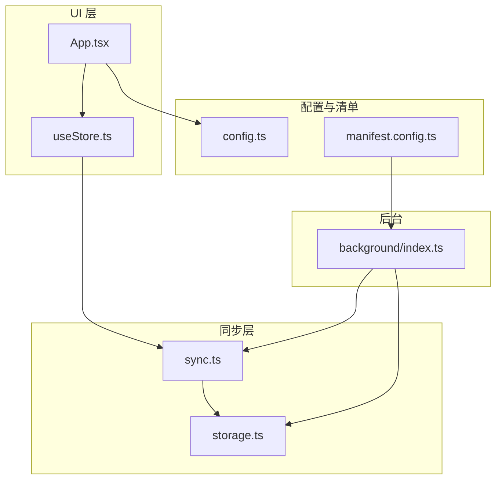
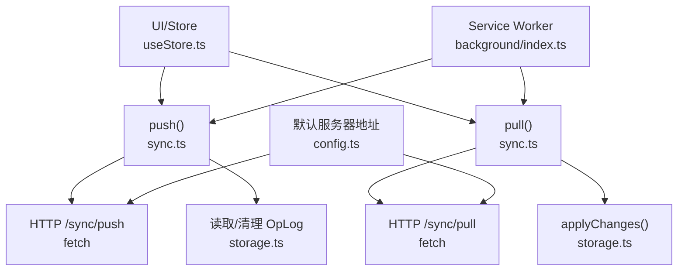
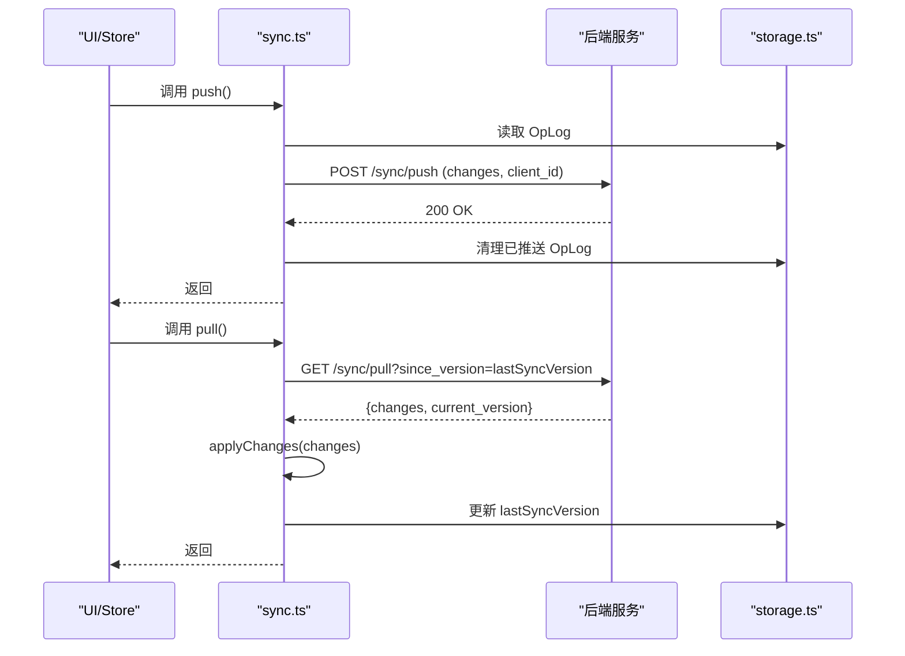
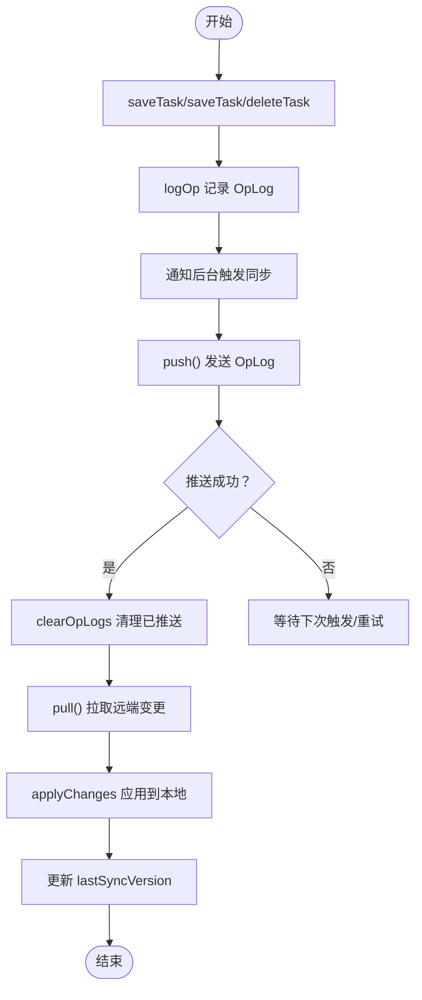
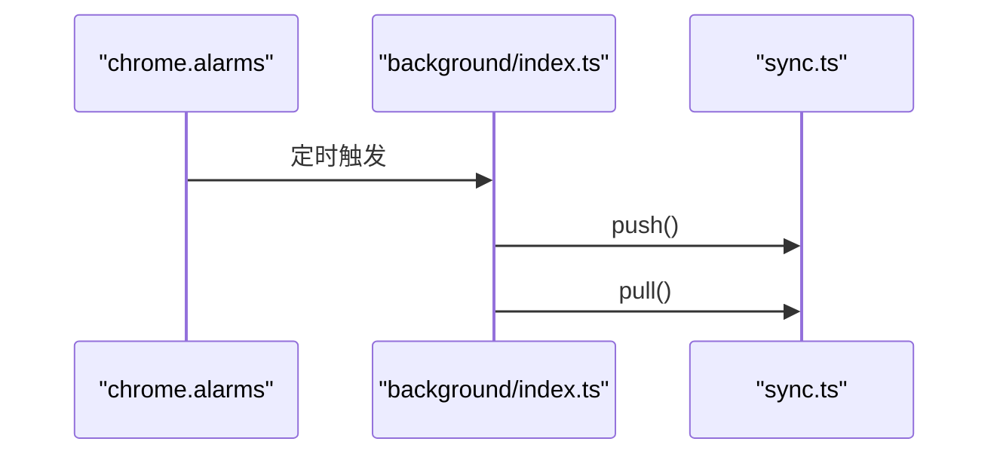
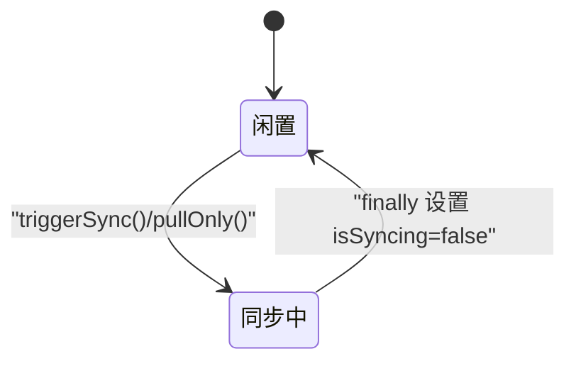
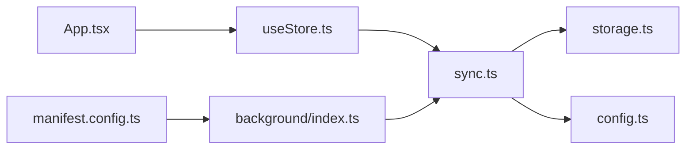

# 同步引擎

<cite>
**本文引用的文件**
- [src/lib/sync.ts](file://src/lib/sync.ts)
- [src/lib/storage.ts](file://src/lib/storage.ts)
- [src/background/index.ts](file://src/background/index.ts)
- [src/hooks/useStore.ts](file://src/hooks/useStore.ts)
- [src/App.tsx](file://src/App.tsx)
- [src/config.ts](file://src/config.ts)
- [manifest.config.ts](file://manifest.config.ts)
- [package.json](file://package.json)
</cite>

## 目录
1. [简介](#简介)
2. [项目结构](#项目结构)
3. [核心组件](#核心组件)
4. [架构总览](#架构总览)
5. [详细组件分析](#详细组件分析)
6. [依赖关系分析](#依赖关系分析)
7. [性能考量](#性能考量)
8. [故障排查指南](#故障排查指南)
9. [结论](#结论)
10. [附录：API 接口与使用示例](#附录api-接口与使用示例)

## 简介
本文件为 QKnot 扩展“同步引擎”的综合技术文档，聚焦云端同步机制的设计与实现，覆盖 push 和 pull 的工作原理、操作日志（OpLog）系统、冲突解决策略、错误处理与重试机制、同步状态管理，以及完整的 API 接口与使用示例。文档同时提供时序图与数据流图，帮助开发者快速理解与扩展该同步体系。

## 项目结构
QKnot 扩展采用前端单页应用与 Chrome Extension 架构结合的方式组织代码，核心同步逻辑位于 lib 层，状态与 UI 交互在 hooks 与 App 中协调，后台服务通过 Service Worker 定时触发同步。

图表来源
- [src/App.tsx](file://src/App.tsx#L1-L110)
- [src/hooks/useStore.ts](file://src/hooks/useStore.ts#L1-L60)
- [src/lib/sync.ts](file://src/lib/sync.ts#L1-L30)
- [src/lib/storage.ts](file://src/lib/storage.ts#L1-L40)
- [src/background/index.ts](file://src/background/index.ts#L1-L20)
- [src/config.ts](file://src/config.ts#L1-L2)
- [manifest.config.ts](file://manifest.config.ts#L1-L20)

章节来源
- [src/App.tsx](file://src/App.tsx#L1-L120)
- [src/hooks/useStore.ts](file://src/hooks/useStore.ts#L1-L40)
- [src/lib/sync.ts](file://src/lib/sync.ts#L1-L20)
- [src/lib/storage.ts](file://src/lib/storage.ts#L1-L30)
- [src/background/index.ts](file://src/background/index.ts#L1-L15)
- [src/config.ts](file://src/config.ts#L1-L2)
- [manifest.config.ts](file://manifest.config.ts#L1-L20)

## 核心组件
- 同步控制器（sync.ts）
  - 提供 push/pull 方法，负责与后端 /sync/push 与 /sync/pull 通信，发送/接收 OpLog 变更。
  - 维护客户端标识（client_id），用于区分不同设备或会话。
- 存储与 OpLog（storage.ts）
  - 定义 Task、OpLog、SyncState 数据模型。
  - 负责本地存储、OpLog 记录、拉取后应用变更、离线任务合并与清理。
- 状态与 UI（useStore.ts）
  - 管理 isSyncing、isLoading 等状态，封装手动同步、仅拉取等动作。
- 后台定时器（background/index.ts）
  - 使用 chrome.alarms 每 5 分钟触发一次自动同步（先 push 再 pull）。
- 应用入口与登录流程（App.tsx）
  - 登录成功后根据离线任务情况决定是否弹出合并确认框，并执行 pull-only 或完整同步。
- 配置与清单（config.ts、manifest.config.ts）
  - 默认服务器地址与扩展清单权限声明。

章节来源
- [src/lib/sync.ts](file://src/lib/sync.ts#L5-L110)
- [src/lib/storage.ts](file://src/lib/storage.ts#L4-L35)
- [src/hooks/useStore.ts](file://src/hooks/useStore.ts#L8-L33)
- [src/background/index.ts](file://src/background/index.ts#L7-L15)
- [src/App.tsx](file://src/App.tsx#L113-L225)
- [src/config.ts](file://src/config.ts#L1-L2)
- [manifest.config.ts](file://manifest.config.ts#L27-L32)

## 架构总览
下图展示从 UI 到后台、再到存储与后端的整体同步路径与职责划分。

图表来源
- [src/hooks/useStore.ts](file://src/hooks/useStore.ts#L167-L191)
- [src/lib/sync.ts](file://src/lib/sync.ts#L6-L83)
- [src/lib/storage.ts](file://src/lib/storage.ts#L109-L138)
- [src/background/index.ts](file://src/background/index.ts#L8-L14)
- [src/config.ts](file://src/config.ts#L1-L2)

## 详细组件分析

### 同步控制器（push/pull 实现）
- push 流程
  - 读取 SyncState（含 token、serverUrl），若不完整则直接返回。
  - 读取本地 OpLog 集合；为空则直接返回。
  - 发送 HTTP POST /sync/push，携带 client_id 与 changes（映射 entity/entity_id/op_type/changes/client_ts）。
  - 成功后清理已推送的 OpLog。
  - 失败抛出错误，由调用方捕获。
- pull 流程
  - 读取 SyncState，构造 since_version 查询参数。
  - 发送 HTTP GET /sync/pull，解析返回的 changes 与 current_version。
  - 若存在变更，则调用 applyChanges 应用到本地；最后更新 lastSyncVersion。
- applyChanges
  - 遍历变更列表，按 entity/opType 分发到 storage.applySyncTask/applySyncDelete。
- getClientId
  - 使用 chrome.storage.local 保存/读取 client_id，不存在则生成 ULID。

图表来源
- [src/lib/sync.ts](file://src/lib/sync.ts#L6-L83)
- [src/lib/storage.ts](file://src/lib/storage.ts#L109-L138)

章节来源
- [src/lib/sync.ts](file://src/lib/sync.ts#L6-L109)

### 存储与 OpLog（数据模型与变更记录）
- 数据模型
  - Task：包含 id、userId、title/description/status/priority/tags/createdAt/updatedAt/deleted。
  - OpLog：记录实体类型、实体 id、操作类型（create/update/delete）、变更内容、客户端时间戳。
  - SyncState：记录 lastSyncVersion、lastSyncTime、token、serverUrl、userId、username、language。
- OpLog 记录与清理
  - saveTask/saveTask/deleteTask 在变更时调用 logOp 记录 OpLog，并通过 runtime sendMessage 触发后台同步。
  - clearOpLogs 用于清理已成功推送的 OpLog。
- 拉取后应用
  - applySyncTask/applySyncDelete 将远端变更写入本地存储，必要时补全 userId。
- 离线任务合并与清理
  - assignTasksToUser：将未归属用户的离线任务分配给当前用户。
  - discardOfflineTasks：仅保留已归属用户的任务并清空 OpLog。
  - getOfflineTasksCount：统计未归属任务数量，用于 UI 决策。

图表来源
- [src/lib/storage.ts](file://src/lib/storage.ts#L55-L106)
- [src/lib/storage.ts](file://src/lib/storage.ts#L109-L138)
- [src/lib/storage.ts](file://src/lib/storage.ts#L141-L194)
- [src/lib/sync.ts](file://src/lib/sync.ts#L21-L48)

章节来源
- [src/lib/storage.ts](file://src/lib/storage.ts#L4-L35)
- [src/lib/storage.ts](file://src/lib/storage.ts#L55-L106)
- [src/lib/storage.ts](file://src/lib/storage.ts#L109-L138)
- [src/lib/storage.ts](file://src/lib/storage.ts#L141-L194)
- [src/lib/storage.ts](file://src/lib/storage.ts#L212-L242)

### 后台定时同步与消息触发
- chrome.alarms 每 5 分钟触发一次，顺序执行 push 与 pull。
- content script/context menu 等事件通过 chrome.runtime.sendMessage 触发同步（如添加任务后立即触发 push/pull）。

图表来源
- [src/background/index.ts](file://src/background/index.ts#L8-L14)

章节来源
- [src/background/index.ts](file://src/background/index.ts#L1-L114)

### UI 状态与同步控制（isSyncing/loading）
- isSyncing：在手动同步开始时设为 true，结束后恢复为 false，用于禁用按钮与显示旋转动画。
- isLoading：初始加载时设为 true，loadTasks 完成后恢复为 false。
- UI 通过 toast.promise 包裹 triggerSync/pullOnly，提供“同步中/完成/失败”提示。

图表来源
- [src/hooks/useStore.ts](file://src/hooks/useStore.ts#L167-L191)
- [src/App.tsx](file://src/App.tsx#L62-L72)

章节来源
- [src/hooks/useStore.ts](file://src/hooks/useStore.ts#L12-L33)
- [src/hooks/useStore.ts](file://src/hooks/useStore.ts#L167-L191)
- [src/App.tsx](file://src/App.tsx#L826-L854)

### 冲突解决策略
- 时间戳与版本控制
  - pull 请求携带 since_version，后端返回 current_version，本地据此更新 lastSyncVersion。
  - push 请求携带 client_ts，便于后端侧进行时序判定。
- 版本与实体维度
  - OpLog 记录 entity 与 entity_id，确保按实体粒度进行合并。
- 用户归属与离线任务合并
  - 登录后检查是否存在其他用户归属的任务（需清理），否则弹窗提示合并离线任务。
  - 合并：assignTasksToUser 将离线任务归属到当前用户。
  - 放弃：discardOfflineTasks 仅保留已归属任务并清空 OpLog。
- 文本字段与并发写入
  - 当前更新采用“全量字段”传输，便于后端执行最后写入获胜（LWW）策略；建议后续优化为差分字段以降低带宽。

章节来源
- [src/lib/sync.ts](file://src/lib/sync.ts#L60-L77)
- [src/lib/sync.ts](file://src/lib/sync.ts#L31-L40)
- [src/lib/storage.ts](file://src/lib/storage.ts#L141-L194)
- [src/App.tsx](file://src/App.tsx#L140-L190)
- [src/App.tsx](file://src/App.tsx#L210-L225)

### 错误处理与重试机制
- 网络异常与服务器错误
  - push/pull 对 HTTP 响应进行校验，失败时抛出错误，调用方负责捕获与提示。
  - UI 使用 toast.promise 提示“同步失败”，避免吞掉错误。
- 重试策略
  - 当前未实现自动重试；可考虑在 push/pull 外层增加指数退避重试，或在 UI 层提供“重试”按钮。
- 幂等性
  - OpLog 已推送即清理，避免重复推送导致的重复写入问题。

章节来源
- [src/lib/sync.ts](file://src/lib/sync.ts#L49-L52)
- [src/lib/sync.ts](file://src/lib/sync.ts#L67-L69)
- [src/App.tsx](file://src/App.tsx#L67-L71)

## 依赖关系分析
- 模块耦合
  - useStore 依赖 sync 与 storage，负责状态与 UI 行为。
  - sync 依赖 storage 与 config，负责网络请求与 OpLog 管理。
  - background 依赖 sync，负责定时触发。
- 外部依赖
  - chrome.* API（storage、alarms、runtime、contextMenus）。
  - ulid 生成 client_id。
- 权限与清单
  - permissions: ["storage", "alarms", "contextMenus"]
  - host_permissions: ["http://*/*", "https://*/*"]

图表来源
- [src/hooks/useStore.ts](file://src/hooks/useStore.ts#L1-L10)
- [src/lib/sync.ts](file://src/lib/sync.ts#L1-L5)
- [src/lib/storage.ts](file://src/lib/storage.ts#L1-L5)
- [src/config.ts](file://src/config.ts#L1-L2)
- [src/background/index.ts](file://src/background/index.ts#L1-L5)
- [manifest.config.ts](file://manifest.config.ts#L31-L32)

章节来源
- [package.json](file://package.json#L12-L24)
- [manifest.config.ts](file://manifest.config.ts#L31-L32)

## 性能考量
- 带宽优化
  - 当前更新传输全量字段，建议改为差分字段，减少 payload。
- OpLog 批量处理
  - push 一次性发送所有 OpLog，建议按实体/版本分批，避免单次过大。
- 本地排序与过滤
  - UI 层对任务按状态与时间排序，建议在存储层维护索引以提升查询效率。
- 后台触发频率
  - 5 分钟间隔较为频繁，可根据业务场景调整或引入在线检测。

## 故障排查指南
- 无法登录/无 token
  - 检查 App.tsx 登录流程与 storage.setSyncState 是否正确写入 token、userId、username。
- 同步按钮不可用
  - 确认 isSyncing 与 token 状态，UI 已禁用按钮并显示旋转动画。
- 无离线任务但弹出合并框
  - 检查 storage.getOfflineTasksCount 与 UI 合并逻辑，确认 pendingMergeUserId 设置。
- 推送失败
  - 查看 sync.push 抛出的错误信息，确认 serverUrl 与 token 是否有效。
- 拉取后未更新
  - 确认 applyChanges 是否被调用，以及 storage.setSyncState 是否更新了 lastSyncVersion。

章节来源
- [src/App.tsx](file://src/App.tsx#L113-L225)
- [src/hooks/useStore.ts](file://src/hooks/useStore.ts#L167-L191)
- [src/lib/sync.ts](file://src/lib/sync.ts#L49-L52)
- [src/lib/storage.ts](file://src/lib/storage.ts#L212-L242)

## 结论
QKnot 同步引擎以 OpLog 为核心，结合 push/pull 与后台定时触发，实现了基础的云端同步能力。通过 SyncState 与 UI 状态协同，支持手动同步、自动同步与离线任务合并。未来可在差分字段、重试策略、版本合并策略等方面进一步增强一致性与性能。

## 附录：API 接口与使用示例

### 同步 API
- push
  - 方法：POST /sync/push
  - 请求头：Authorization: Bearer {token}, Content-Type: application/json
  - 请求体字段：
    - client_id: 字符串
    - changes: 数组，元素包含 entity、entity_id、op_type、changes、client_ts
  - 成功：200 OK，清理已推送的 OpLog
  - 失败：非 200，抛出错误
- pull
  - 方法：GET /sync/pull?since_version={lastSyncVersion}
  - 请求头：Authorization: Bearer {token}
  - 响应体字段：
    - changes: OpLog 数组
    - current_version: 当前服务器版本号
  - 成功：应用变更并更新 lastSyncVersion
  - 失败：抛出错误

章节来源
- [src/lib/sync.ts](file://src/lib/sync.ts#L24-L52)
- [src/lib/sync.ts](file://src/lib/sync.ts#L59-L79)

### 使用示例
- 手动同步
  - UI 调用 useStore.triggerSync，内部顺序执行 push 与 pull，并刷新任务列表。
- 自动同步
  - background/index.ts 每 5 分钟触发一次 push/pull。
- 仅拉取
  - UI 调用 useStore.pullOnly，仅执行 pull 并刷新任务列表。
- 登录后合并离线任务
  - App.tsx 在登录成功后判断离线任务数量，弹窗提示合并或放弃，随后执行相应 storage 操作与同步。

章节来源
- [src/hooks/useStore.ts](file://src/hooks/useStore.ts#L167-L191)
- [src/background/index.ts](file://src/background/index.ts#L8-L14)
- [src/App.tsx](file://src/App.tsx#L140-L190)
- [src/App.tsx](file://src/App.tsx#L210-L225)