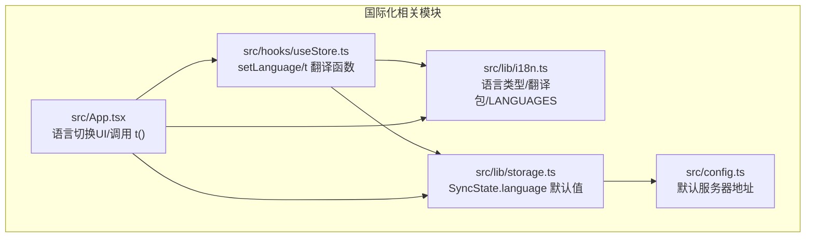
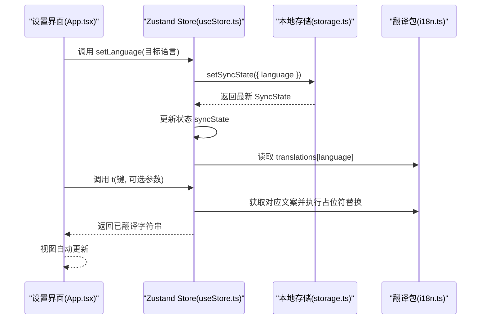
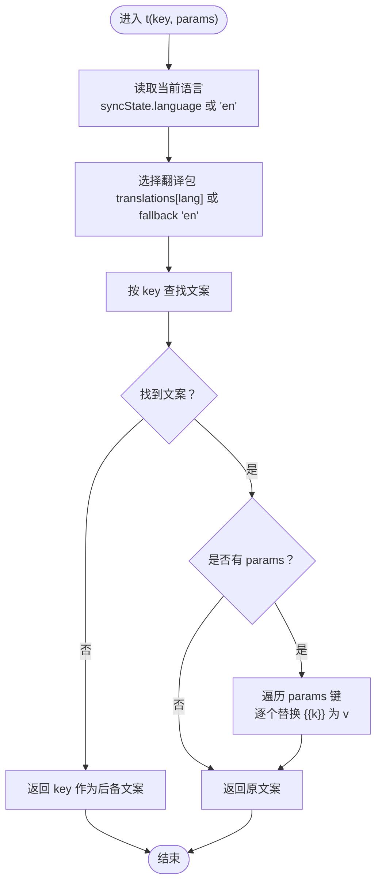
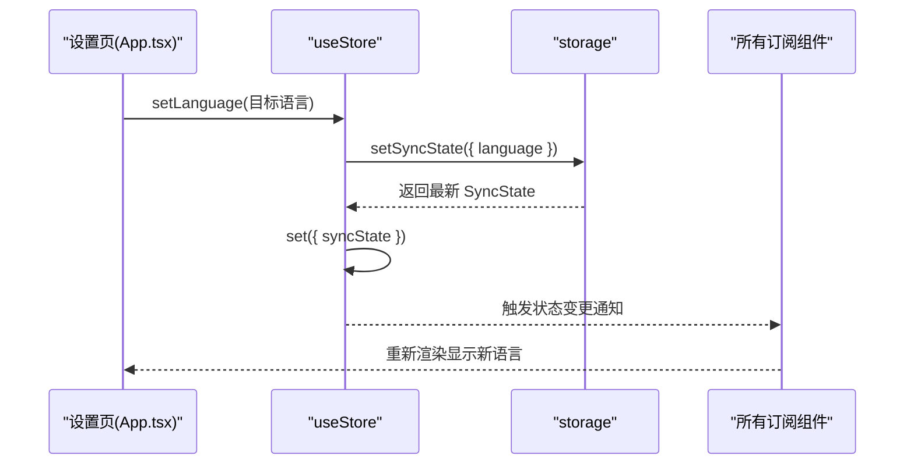
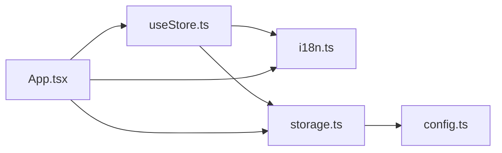

# 国际化系统

<cite>
**本文引用的文件**
- [src/lib/i18n.ts](file://src/lib/i18n.ts)
- [src/hooks/useStore.ts](file://src/hooks/useStore.ts)
- [src/App.tsx](file://src/App.tsx)
- [src/lib/storage.ts](file://src/lib/storage.ts)
- [src/config.ts](file://src/config.ts)
- [src/main.tsx](file://src/main.tsx)
- [manifest.config.ts](file://manifest.config.ts)
- [package.json](file://package.json)
</cite>

## 目录
1. [简介](#简介)
2. [项目结构](#项目结构)
3. [核心组件](#核心组件)
4. [架构总览](#架构总览)
5. [详细组件分析](#详细组件分析)
6. [依赖关系分析](#依赖关系分析)
7. [性能考量](#性能考量)
8. [故障排查指南](#故障排查指南)
9. [结论](#结论)
10. [附录](#附录)

## 简介
本文件为 QKnot 扩展的国际化系统技术文档，围绕多语言支持架构、语言包管理与动态加载机制、翻译键值对组织与命名规范、setLanguage 方法的实现与语言切换响应式更新、t 函数的使用（含参数插值与占位符替换）、语言检测与默认语言策略、最佳实践与 API 使用示例进行全面阐述，并给出支持语言列表与未来扩展建议。

## 项目结构
国际化相关代码主要分布在以下模块：
- 语言定义与翻译键值：src/lib/i18n.ts
- 全局状态与翻译函数：src/hooks/useStore.ts
- UI 组件中的语言切换与文本渲染：src/App.tsx
- 同步状态与默认语言持久化：src/lib/storage.ts
- 默认服务器地址配置：src/config.ts
- 应用入口与打包清单：src/main.tsx、manifest.config.ts、package.json

图表来源
- [src/lib/i18n.ts](file://src/lib/i18n.ts#L1-L146)
- [src/hooks/useStore.ts](file://src/hooks/useStore.ts#L1-L193)
- [src/App.tsx](file://src/App.tsx#L1-L860)
- [src/lib/storage.ts](file://src/lib/storage.ts#L1-L272)
- [src/config.ts](file://src/config.ts#L1-L2)

章节来源
- [src/lib/i18n.ts](file://src/lib/i18n.ts#L1-L146)
- [src/hooks/useStore.ts](file://src/hooks/useStore.ts#L1-L193)
- [src/App.tsx](file://src/App.tsx#L1-L860)
- [src/lib/storage.ts](file://src/lib/storage.ts#L1-L272)
- [src/config.ts](file://src/config.ts#L1-L2)

## 核心组件
- 语言类型与翻译包：定义受支持语言集合与各语言的键值对字典，提供 LANGUAGES 列表用于 UI 展示。
- 翻译函数 t(key, params?)：根据当前语言从翻译包中取值，并进行占位符替换。
- 语言切换 setLanguage(lang)：写入 SyncState.language 并更新全局状态，触发 UI 响应式刷新。
- 同步状态与默认语言：SyncState 中包含 language 字段，默认值来自 DEFAULT_SYNC_STATE，确保首次使用时有确定的默认语言。

章节来源
- [src/lib/i18n.ts](file://src/lib/i18n.ts#L1-L146)
- [src/hooks/useStore.ts](file://src/hooks/useStore.ts#L24-L51)
- [src/lib/storage.ts](file://src/lib/storage.ts#L26-L46)

## 架构总览
国际化系统采用“状态驱动 + 本地存储”的设计：
- 状态层：Zustand store 暴露 t 与 setLanguage，并持有 syncState（包含 language）。
- 数据层：chrome.storage.local 存储 SyncState，保证语言设置持久化。
- 渲染层：React 组件通过 useStore 订阅状态变化，实现语言切换的即时响应。
- 翻译层：i18n.ts 提供翻译键值与语言列表，t 函数负责取值与参数插值。

图表来源
- [src/App.tsx](file://src/App.tsx#L360-L398)
- [src/hooks/useStore.ts](file://src/hooks/useStore.ts#L34-L51)
- [src/lib/storage.ts](file://src/lib/storage.ts#L196-L204)
- [src/lib/i18n.ts](file://src/lib/i18n.ts#L3-L139)

## 详细组件分析

### 翻译键值与命名规范
- 键命名采用层级点号分隔，如 app.name、settings.language、status.syncing 等，便于按功能域组织与查找。
- 占位符采用双花括号 {{param}}，支持任意键名，常见如 {{count}}、{{username}}、{{date}}。
- HTML 内容可直接嵌入翻译键值（例如合并提示中的富文本片段），由渲染层安全注入。

章节来源
- [src/lib/i18n.ts](file://src/lib/i18n.ts#L3-L139)

### t 函数实现与参数插值
- 语言选择：优先取自 store.syncState.language；若不存在则回退到 'en'。
- 文案取值：从 translations[lang][key] 获取；若无对应键，返回 key 本身，避免运行时崩溃。
- 参数插值：遍历 params 的键，逐个替换 {{key}} 为 params[key]；支持多参数同时替换。

图表来源
- [src/hooks/useStore.ts](file://src/hooks/useStore.ts#L40-L51)
- [src/lib/i18n.ts](file://src/lib/i18n.ts#L3-L139)

章节来源
- [src/hooks/useStore.ts](file://src/hooks/useStore.ts#L40-L51)

### setLanguage 方法与响应式更新
- setLanguage 接收 Language 类型参数，写入 storage.setSyncState({ language })。
- 读取最新 SyncState 并更新 store.syncState，使订阅该状态的组件自动重渲染。
- UI 中语言切换通过单选框触发 setLanguage，立即生效。

图表来源
- [src/App.tsx](file://src/App.tsx#L360-L398)
- [src/hooks/useStore.ts](file://src/hooks/useStore.ts#L34-L38)

章节来源
- [src/hooks/useStore.ts](file://src/hooks/useStore.ts#L34-L38)
- [src/App.tsx](file://src/App.tsx#L360-L398)

### 语言检测与默认语言策略
- 默认语言：SyncState.language 默认值来自 DEFAULT_SYNC_STATE，初始为 'en'。
- 首次使用：未设置语言时，t 函数回退到 'en'，确保稳定体验。
- 用户选择：用户在设置页选择语言后，立即写入 storage 并持久化，后续启动保持该语言。

章节来源
- [src/lib/storage.ts](file://src/lib/storage.ts#L38-L46)
- [src/hooks/useStore.ts](file://src/hooks/useStore.ts#L40-L43)

### 支持语言列表与扩展
- 当前支持：英文 en、简体中文 zh-CN、繁体中文 zh-TW。
- UI 展示：LANGUAGES 提供 code 与 label，用于设置页的单选按钮列表。
- 扩展建议：新增语言时需在 translations 中添加键值对，并在 LANGUAGES 中登记；同时考虑浏览器语言检测与用户偏好的结合策略。

章节来源
- [src/lib/i18n.ts](file://src/lib/i18n.ts#L141-L145)

### 在组件中集成国际化
- 引入 useStore 并解构 t 与 setLanguage。
- 设置页语言切换：使用 LANGUAGES 渲染选项，绑定 onChange 调用 setLanguage。
- 文本渲染：在 JSX 中使用 t('键', { params })，例如状态文案、占位符替换等。

章节来源
- [src/App.tsx](file://src/App.tsx#L12-L12)
- [src/App.tsx](file://src/App.tsx#L227-L433)
- [src/App.tsx](file://src/App.tsx#L360-L398)

## 依赖关系分析
- App.tsx 依赖 useStore 提供的 t 与 setLanguage，并依赖 i18n.ts 的 LANGUAGES 进行 UI 展示。
- useStore.ts 依赖 i18n.ts 的 translations 与 Language 类型，依赖 storage.ts 的 SyncState 以决定语言。
- storage.ts 依赖 config.ts 的默认服务器地址，同时提供 DEFAULT_SYNC_STATE 以初始化语言。

图表来源
- [src/App.tsx](file://src/App.tsx#L1-L860)
- [src/hooks/useStore.ts](file://src/hooks/useStore.ts#L1-L193)
- [src/lib/i18n.ts](file://src/lib/i18n.ts#L1-L146)
- [src/lib/storage.ts](file://src/lib/storage.ts#L1-L272)
- [src/config.ts](file://src/config.ts#L1-L2)

章节来源
- [src/App.tsx](file://src/App.tsx#L1-L860)
- [src/hooks/useStore.ts](file://src/hooks/useStore.ts#L1-L193)
- [src/lib/i18n.ts](file://src/lib/i18n.ts#L1-L146)
- [src/lib/storage.ts](file://src/lib/storage.ts#L1-L272)
- [src/config.ts](file://src/config.ts#L1-L2)

## 性能考量
- 翻译查找为常量时间 O(1)，参数替换为 O(n)（n 为 params 键数），整体开销极低。
- 语言切换仅更新 syncState，不涉及网络请求，响应迅速。
- 建议：避免在高频渲染路径中重复构造大对象传入 params；必要时缓存格式化后的日期/数字。

## 故障排查指南
- t 返回原始 key：检查 translations 中是否存在该键；确认语言是否正确写入 storage。
- 语言切换无效：确认 setLanguage 已调用并写入 storage；检查 store.syncState 是否更新。
- HTML 注入风险：翻译中包含 HTML 时，确保渲染层以安全方式插入；避免用户输入直接拼接。
- 默认语言异常：确认 DEFAULT_SYNC_STATE.language 未被意外覆盖；检查 storage 初始化流程。

章节来源
- [src/hooks/useStore.ts](file://src/hooks/useStore.ts#L40-L51)
- [src/lib/storage.ts](file://src/lib/storage.ts#L196-L204)

## 结论
QKnot 的国际化系统以简洁的状态驱动模型为核心，通过 i18n.ts 的键值包与 useStore.ts 的 t/setLanguage 实现了稳定的多语言支持。语言切换响应迅速，文案渲染灵活，适合扩展至更多语言与更复杂的本地化需求。

## 附录

### API 接口文档
- setLanguage(lang: Language): Promise<void>
  - 功能：设置当前语言并持久化
  - 参数：lang - 'en' | 'zh-CN' | 'zh-TW'
  - 行为：写入 storage.setSyncState({ language }); 更新 store.syncState
  - 触发：UI 自动响应式刷新
  - 参考路径
    - [src/hooks/useStore.ts](file://src/hooks/useStore.ts#L34-L38)
    - [src/lib/storage.ts](file://src/lib/storage.ts#L201-L204)

- t(key: string, params?: Record<string, any>): string
  - 功能：根据当前语言返回翻译文案并进行参数插值
  - 参数：key - 翻译键；params - 插值参数对象
  - 行为：取 translations[lang][key]，若不存在返回 key；按 {{k}} 替换为 params[k]
  - 参考路径
    - [src/hooks/useStore.ts](file://src/hooks/useStore.ts#L40-L51)
    - [src/lib/i18n.ts](file://src/lib/i18n.ts#L3-L139)

- 支持语言列表 LANGUAGES
  - 结构：数组，元素包含 code 与 label
  - 参考路径
    - [src/lib/i18n.ts](file://src/lib/i18n.ts#L141-L145)

- 默认语言与初始化
  - 默认语言：'en'
  - 初始化来源：DEFAULT_SYNC_STATE.language
  - 参考路径
    - [src/lib/storage.ts](file://src/lib/storage.ts#L38-L46)

### 使用示例（路径指引）
- 在设置页渲染语言选项并处理切换
  - 参考路径
    - [src/App.tsx](file://src/App.tsx#L360-L398)
- 在任意组件中使用 t 进行文本渲染
  - 参考路径
    - [src/App.tsx](file://src/App.tsx#L238-L238)
    - [src/App.tsx](file://src/App.tsx#L844-L844)
- 在详情页中进行参数化文案渲染
  - 参考路径
    - [src/App.tsx](file://src/App.tsx#L633-L635)

### 最佳实践
- 文本提取
  - 将所有用户可见文本集中于 translations，避免硬编码字符串。
  - 使用层级命名空间（如 settings.*、task.*）组织键名。
- 翻译维护
  - 新增语言时同步完善 translations 与 LANGUAGES。
  - 对 HTML 片段使用语义明确的键，渲染层以安全方式注入。
- 本地化测试
  - 在设置页手动切换语言，验证 UI 文案更新。
  - 使用 t('键', { count: N }) 测试参数插值。
  - 验证回退行为：当键缺失时返回键名而非空串。

### 未来扩展计划
- 语言检测：基于浏览器语言偏好与用户历史选择，自动推荐语言。
- 动态加载：按需加载语言包，减少初始体积。
- 复数与性别：引入 ICU 风格语法或专用库以支持复数规则与性别变体。
- 翻译工作流：集成翻译平台或工具链，自动化提取/导入/导出翻译资源。