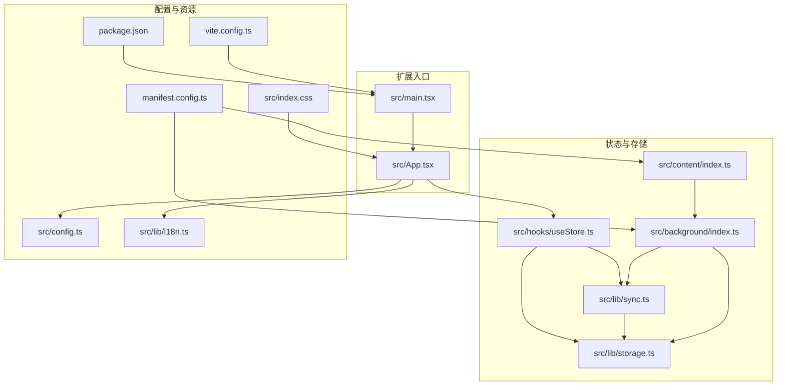
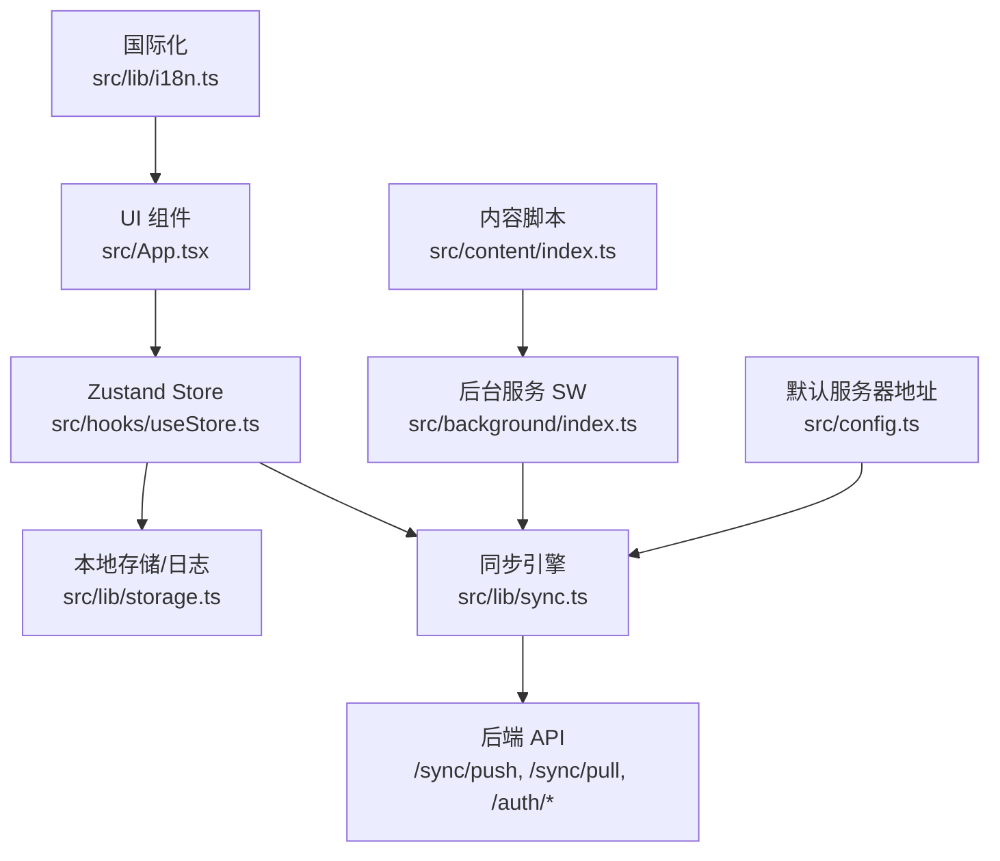
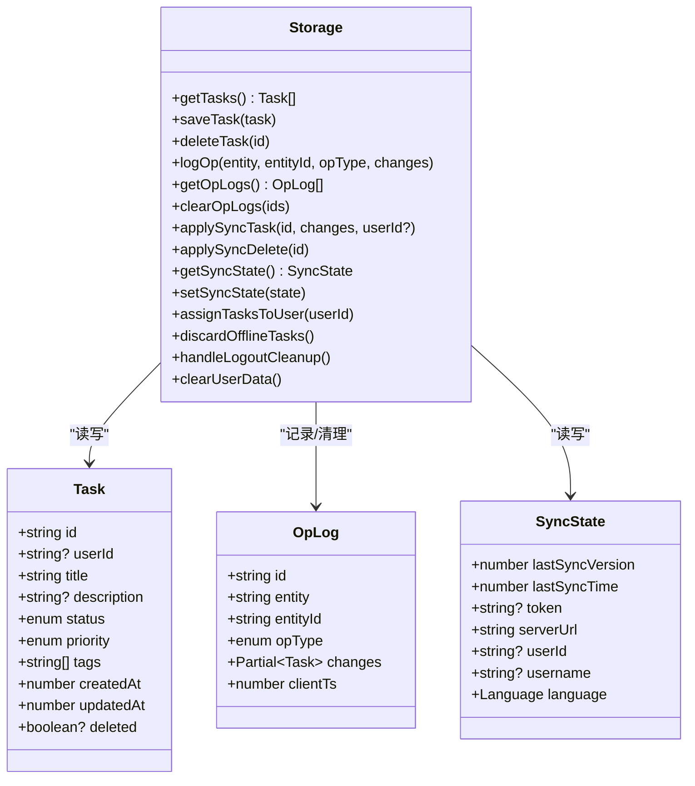
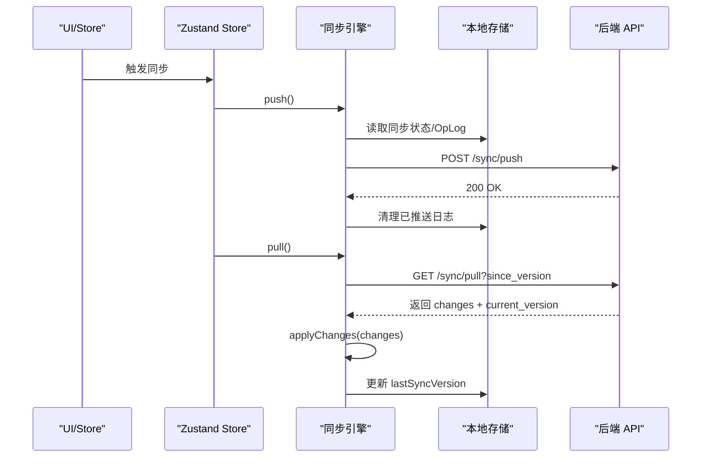
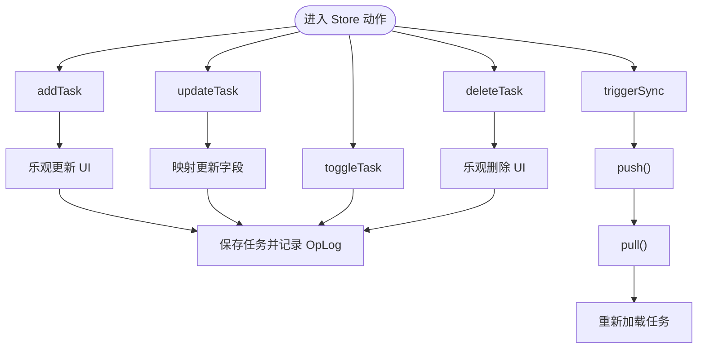
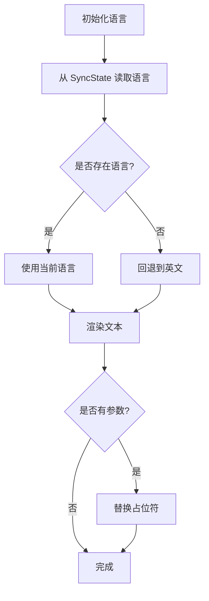
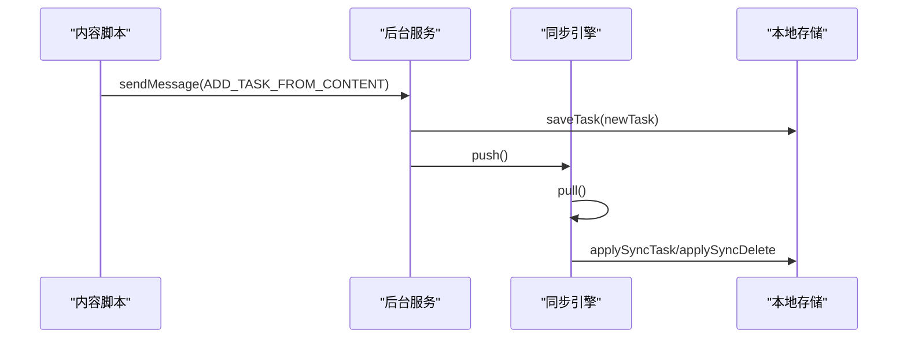
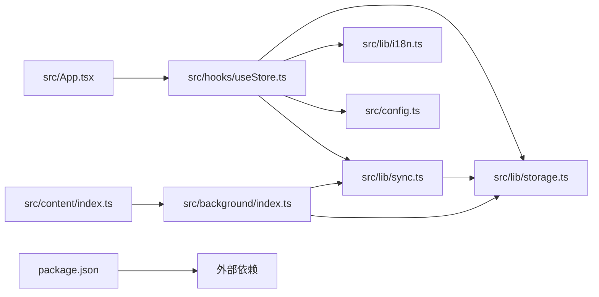

# 核心功能模块

<cite>
**本文引用的文件列表**
- [src/lib/sync.ts](file://src/lib/sync.ts)
- [src/lib/storage.ts](file://src/lib/storage.ts)
- [src/hooks/useStore.ts](file://src/hooks/useStore.ts)
- [src/lib/i18n.ts](file://src/lib/i18n.ts)
- [src/config.ts](file://src/config.ts)
- [src/background/index.ts](file://src/background/index.ts)
- [src/content/index.ts](file://src/content/index.ts)
- [src/App.tsx](file://src/App.tsx)
- [src/main.tsx](file://src/main.tsx)
- [manifest.config.ts](file://manifest.config.ts)
- [package.json](file://package.json)
- [vite.config.ts](file://vite.config.ts)
- [src/index.css](file://src/index.css)
</cite>

## 目录
1. [简介](#简介)
2. [项目结构](#项目结构)
3. [核心组件](#核心组件)
4. [架构总览](#架构总览)
5. [详细组件分析](#详细组件分析)
6. [依赖关系分析](#依赖关系分析)
7. [性能考量](#性能考量)
8. [故障排查指南](#故障排查指南)
9. [结论](#结论)
10. [附录](#附录)

## 简介
本文件面向QKnot浏览器扩展的核心功能模块，系统性梳理任务管理、同步引擎、状态管理与国际化系统的设计理念与实现架构。内容覆盖：
- 任务数据模型、CRUD与状态管理
- 同步引擎工作原理（云端同步、冲突处理、错误处理）
- Zustand 全局状态控制
- 国际化多语言支持与文本管理
- 模块间依赖与数据流
- API 接口说明、使用示例与集成指南

## 项目结构
项目采用模块化组织，核心逻辑集中在 src/lib 与 src/hooks 下，UI 展示在 src/App.tsx 中，构建与清单由 Vite 与 CRX 插件负责。

图表来源
- [src/main.tsx](file://src/main.tsx#L1-L11)
- [src/App.tsx](file://src/App.tsx#L1-L10)
- [src/hooks/useStore.ts](file://src/hooks/useStore.ts#L1-L26)
- [src/lib/storage.ts](file://src/lib/storage.ts#L1-L46)
- [src/lib/sync.ts](file://src/lib/sync.ts#L1-L10)
- [src/background/index.ts](file://src/background/index.ts#L1-L15)
- [src/content/index.ts](file://src/content/index.ts#L1-L20)
- [src/config.ts](file://src/config.ts#L1-L2)
- [src/lib/i18n.ts](file://src/lib/i18n.ts#L1-L10)
- [manifest.config.ts](file://manifest.config.ts#L1-L39)
- [package.json](file://package.json#L1-L42)
- [vite.config.ts](file://vite.config.ts#L1-L21)
- [src/index.css](file://src/index.css#L1-L1)

章节来源
- [src/main.tsx](file://src/main.tsx#L1-L11)
- [src/App.tsx](file://src/App.tsx#L1-L10)
- [manifest.config.ts](file://manifest.config.ts#L1-L39)

## 核心组件
- 任务数据模型与存储：定义 Task、OpLog、SyncState 结构，封装本地持久化与同步日志记录。
- 同步引擎：封装 push/pull 流程，生成/应用变更，客户端标识与错误处理。
- 全局状态：基于 Zustand 的 useStore，统一管理任务、同步状态、加载与同步状态。
- 国际化：多语言键值映射与动态文本渲染，支持占位符替换。
- 背景服务与内容脚本：自动同步、手动触发、右键菜单与悬浮按钮。

章节来源
- [src/lib/storage.ts](file://src/lib/storage.ts#L4-L34)
- [src/lib/sync.ts](file://src/lib/sync.ts#L5-L109)
- [src/hooks/useStore.ts](file://src/hooks/useStore.ts#L8-L26)
- [src/lib/i18n.ts](file://src/lib/i18n.ts#L1-L146)
- [src/background/index.ts](file://src/background/index.ts#L1-L15)
- [src/content/index.ts](file://src/content/index.ts#L1-L20)

## 架构总览
整体采用“UI 层（React）+ 状态层（Zustand）+ 存储层（Chrome Storage + 同步日志）+ 同步层（REST API）+ 背景服务（定时/消息）”的分层设计。UI 通过 useStore 触发 CRUD 与同步；存储层负责本地持久化与 OpLog 记录；同步层负责云端推送/拉取；背景服务负责周期性同步与消息触发。

图表来源
- [src/App.tsx](file://src/App.tsx#L1-L12)
- [src/hooks/useStore.ts](file://src/hooks/useStore.ts#L28-L192)
- [src/lib/storage.ts](file://src/lib/storage.ts#L49-L271)
- [src/lib/sync.ts](file://src/lib/sync.ts#L5-L109)
- [src/background/index.ts](file://src/background/index.ts#L1-L15)
- [src/content/index.ts](file://src/content/index.ts#L1-L20)
- [src/config.ts](file://src/config.ts#L1-L2)
- [src/lib/i18n.ts](file://src/lib/i18n.ts#L1-L10)

## 详细组件分析

### 任务数据模型与 CRUD
- 数据模型
  - Task：包含唯一 id、用户归属（可选）、标题、描述、状态（todo/done/archived）、优先级（none/low/medium/high）、标签数组、创建/更新时间戳、删除标记。
  - OpLog：记录变更日志，包含实体类型、实体 id、操作类型（create/update/delete）、变更字段、客户端时间戳。
  - SyncState：同步状态，包含最后同步版本号、最后同步时间、认证令牌、服务器地址、用户信息、语言等。
- CRUD 实现要点
  - 新增：生成 ULID，清理标题中的标签，乐观更新 UI，保存至本地并记录 OpLog。
  - 更新：仅更新显式传入字段，保留未传字段不变，更新时间戳，记录 OpLog。
  - 切换状态：切换 done/todo，更新时间戳，记录 OpLog。
  - 删除：标记删除并更新时间戳，记录 OpLog。
- 用户归属与可见性
  - 登录后若任务无 userId，则自动赋值为当前用户；UI 过滤掉非当前用户的任务以避免跨用户显示。

图表来源
- [src/lib/storage.ts](file://src/lib/storage.ts#L4-L34)
- [src/lib/storage.ts](file://src/lib/storage.ts#L49-L271)

章节来源
- [src/lib/storage.ts](file://src/lib/storage.ts#L4-L34)
- [src/lib/storage.ts](file://src/lib/storage.ts#L55-L106)
- [src/lib/storage.ts](file://src/lib/storage.ts#L141-L194)
- [src/lib/storage.ts](file://src/lib/storage.ts#L196-L204)
- [src/hooks/useStore.ts](file://src/hooks/useStore.ts#L77-L146)

### 同步引擎（push/pull/apply）
- push
  - 读取同步状态（令牌与服务器地址），若缺失则直接返回。
  - 获取 OpLog 集合并过滤空集，构造变更数组（驼峰转蛇形字段名）。
  - 发送 POST 请求至 /sync/push，携带 Bearer 令牌；成功后清除已推送日志。
- pull
  - 使用 lastSyncVersion 查询 /sync/pull，解析返回的 changes 与 current_version。
  - 若存在变更，调用 applyChanges 应用；更新本地 lastSyncVersion。
- applyChanges
  - 针对 task 实体的 create/update/delete 分支，调用 storage.applySyncTask 或 applySyncDelete。
- 客户端标识
  - 使用 chrome.storage.local 保存 client_id，不存在时生成 ULID 并缓存。

图表来源
- [src/hooks/useStore.ts](file://src/hooks/useStore.ts#L167-L179)
- [src/lib/sync.ts](file://src/lib/sync.ts#L6-L53)
- [src/lib/sync.ts](file://src/lib/sync.ts#L55-L83)
- [src/lib/sync.ts](file://src/lib/sync.ts#L85-L99)

章节来源
- [src/lib/sync.ts](file://src/lib/sync.ts#L5-L109)
- [src/lib/storage.ts](file://src/lib/storage.ts#L109-L138)
- [src/lib/storage.ts](file://src/lib/storage.ts#L141-L194)

### 状态管理（Zustand）
- Store 接口
  - 状态：tasks、syncState、isLoading、isSyncing。
  - 动作：loadTasks、addTask、updateTask、toggleTask、deleteTask、updateSettings、handleLogoutCleanup、clearUserData、triggerSync、pullOnly、setLanguage、t（翻译函数）。
- 行为特性
  - 乐观更新：新增/删除任务立即反映在 UI，随后异步持久化。
  - 语言切换：通过 storage.setSyncState 写入语言并刷新状态。
  - 同步流程：triggerSync 先 push 再 pull，并重新加载可见任务；pullOnly 仅拉取。
  - 任务过滤：当存在 userId 时，仅展示属于该用户的任务，隐藏离线任务。

图表来源
- [src/hooks/useStore.ts](file://src/hooks/useStore.ts#L77-L146)
- [src/hooks/useStore.ts](file://src/hooks/useStore.ts#L167-L191)

章节来源
- [src/hooks/useStore.ts](file://src/hooks/useStore.ts#L8-L26)
- [src/hooks/useStore.ts](file://src/hooks/useStore.ts#L28-L192)

### 国际化系统（多语言支持）
- 语言枚举与键值
  - 支持 en、zh-CN、zh-TW 三语，键值涵盖应用名称、状态文案、登录/注册、设置、关于、任务相关等。
- 文本渲染
  - t(key, params?)：根据当前语言或回退到英文，支持占位符替换。
- 设置界面
  - 语言选择项与当前语言联动，写入 storage 后刷新 UI。

图表来源
- [src/hooks/useStore.ts](file://src/hooks/useStore.ts#L34-L51)
- [src/lib/i18n.ts](file://src/lib/i18n.ts#L1-L146)
- [src/App.tsx](file://src/App.tsx#L360-L398)

章节来源
- [src/lib/i18n.ts](file://src/lib/i18n.ts#L1-L146)
- [src/hooks/useStore.ts](file://src/hooks/useStore.ts#L34-L51)
- [src/App.tsx](file://src/App.tsx#L360-L398)

### 背景服务与内容脚本
- 自动同步
  - 创建周期性 alarm（每 5 分钟），触发 push/pull。
- 手动触发
  - 监听 runtime 消息 type='sync_trigger'，执行 push/pull。
- 内容脚本
  - 提供悬浮按钮，监听选择/键盘事件，向背景发送 ADD_TASK_FROM_CONTENT 消息，创建任务并触发同步。
- 右键菜单
  - 注册“添加到 QKnot”和“添加页面到 QKnot”，分别从选中文本或页面标题/URL 创建任务。

图表来源
- [src/content/index.ts](file://src/content/index.ts#L202-L234)
- [src/background/index.ts](file://src/background/index.ts#L68-L81)
- [src/background/index.ts](file://src/background/index.ts#L100-L113)

章节来源
- [src/background/index.ts](file://src/background/index.ts#L7-L15)
- [src/background/index.ts](file://src/background/index.ts#L68-L81)
- [src/background/index.ts](file://src/background/index.ts#L84-L113)
- [src/content/index.ts](file://src/content/index.ts#L120-L234)

## 依赖关系分析
- 外部依赖
  - ulid：生成任务与日志 ID。
  - zustand：全局状态管理。
  - lucide-react、sonner、clsx、tailwind-merge：UI 与通知。
  - @crxjs/vite-plugin、@tailwindcss/vite：构建与打包。
- 内部依赖
  - App.tsx 依赖 useStore、i18n、config。
  - useStore 依赖 storage、sync、i18n。
  - sync 依赖 storage、ulid。
  - storage 依赖 config、ulid。
  - background 依赖 sync、storage、ulid。
  - content 与 background 通过 runtime 通信。

图表来源
- [src/App.tsx](file://src/App.tsx#L1-L12)
- [src/hooks/useStore.ts](file://src/hooks/useStore.ts#L1-L7)
- [src/lib/sync.ts](file://src/lib/sync.ts#L1-L3)
- [src/lib/storage.ts](file://src/lib/storage.ts#L1-L2)
- [src/background/index.ts](file://src/background/index.ts#L1-L3)
- [src/content/index.ts](file://src/content/index.ts#L1-L20)
- [package.json](file://package.json#L12-L24)

章节来源
- [package.json](file://package.json#L12-L24)
- [src/App.tsx](file://src/App.tsx#L1-L12)
- [src/hooks/useStore.ts](file://src/hooks/useStore.ts#L1-L7)
- [src/lib/sync.ts](file://src/lib/sync.ts#L1-L3)
- [src/lib/storage.ts](file://src/lib/storage.ts#L1-L2)
- [src/background/index.ts](file://src/background/index.ts#L1-L3)
- [src/content/index.ts](file://src/content/index.ts#L1-L20)

## 性能考量
- 乐观更新：减少 UI 等待时间，但需确保后续持久化与同步成功。
- OpLog 精简：更新时仅发送必要字段，降低网络开销。
- 定时同步：5 分钟周期平衡实时性与资源消耗。
- UI 渲染：按状态排序与懒加载，避免大列表重排。
- 本地存储：批量读写与去重（如标签），减少冗余。

## 故障排查指南
- 同步失败
  - 检查令牌与服务器地址是否有效；确认网络可达。
  - 查看 push/pull 错误日志与异常抛出位置。
- 任务未显示
  - 登录后仅显示当前用户任务；确认 userId 是否正确写入。
  - 确认 UI 过滤逻辑（隐藏 deleted 与非当前用户任务）。
- 语言不生效
  - 确认 setLanguage 已写入 storage 并刷新状态。
  - 检查 t(key, params) 参数是否正确传递。
- 内容脚本无法添加任务
  - 检查 runtime 消息通道与 background 权限。
  - 确认右键菜单与悬浮按钮是否注入成功。

章节来源
- [src/lib/sync.ts](file://src/lib/sync.ts#L49-L52)
- [src/lib/sync.ts](file://src/lib/sync.ts#L79-L82)
- [src/hooks/useStore.ts](file://src/hooks/useStore.ts#L68-L72)
- [src/App.tsx](file://src/App.tsx#L360-L398)
- [src/background/index.ts](file://src/background/index.ts#L68-L81)
- [src/content/index.ts](file://src/content/index.ts#L202-L234)

## 结论
QKnot 核心模块围绕“本地优先 + 云端同步”的设计理念，通过清晰的数据模型、完善的 CRUD 与 OpLog 记录、Zustand 全局状态与国际化系统，实现了稳定可靠的扩展体验。同步引擎提供了 push/pull 的基础能力，配合背景服务与内容脚本，形成完整的自动化与交互闭环。建议后续完善 OpLog 与冲突解决策略，增强错误恢复与可观测性。

## 附录

### API 接口说明
- 同步推送
  - 方法与路径：POST /sync/push
  - 请求头：Content-Type: application/json, Authorization: Bearer {token}
  - 请求体字段：client_id（字符串）、changes（数组，元素含 entity、entity_id、op_type、changes、client_ts）
  - 成功响应：200 OK；失败响应：抛错并记录日志
- 同步拉取
  - 方法与路径：GET /sync/pull?since_version={version}
  - 请求头：Authorization: Bearer {token}
  - 响应体字段：changes（数组，元素结构同推送）、current_version（数字）
  - 成功响应：200 OK；失败响应：抛错并记录日志
- 登录
  - 方法与路径：POST /auth/login
  - 请求体：{ username, password }
  - 成功响应：返回 token；失败响应：错误提示
- 注册
  - 方法与路径：POST /auth/register
  - 请求体：{ username, password }
  - 成功响应：返回成功提示；失败响应：用户名占用提示

章节来源
- [src/lib/sync.ts](file://src/lib/sync.ts#L24-L52)
- [src/lib/sync.ts](file://src/lib/sync.ts#L59-L82)
- [src/App.tsx](file://src/App.tsx#L119-L130)
- [src/App.tsx](file://src/App.tsx#L89-L99)

### 使用示例与集成指南
- 初始化与运行
  - 在 main.tsx 中挂载 App。
  - 在 App.tsx 中使用 useStore 管理任务与同步状态。
- 添加任务
  - 通过 UI 输入框或内容脚本悬浮按钮触发 addTask。
  - 内容脚本通过 runtime.sendMessage 触发 background 创建任务并同步。
- 手动同步
  - 调用 triggerSync 或 pullOnly；UI 显示 toast 提示。
- 登录/注销
  - 登录成功后写入 token、userId、username；注销时清理用户数据。
- 语言切换
  - 通过设置页选择语言，调用 setLanguage 并刷新 UI。

章节来源
- [src/main.tsx](file://src/main.tsx#L1-L11)
- [src/App.tsx](file://src/App.tsx#L35-L46)
- [src/App.tsx](file://src/App.tsx#L62-L72)
- [src/App.tsx](file://src/App.tsx#L113-L200)
- [src/App.tsx](file://src/App.tsx#L202-L225)
- [src/content/index.ts](file://src/content/index.ts#L202-L234)
- [src/background/index.ts](file://src/background/index.ts#L68-L81)