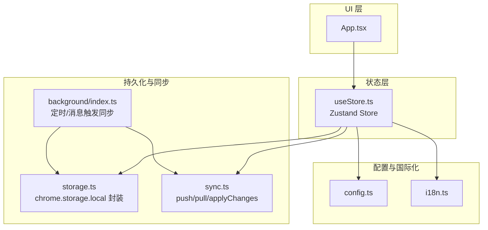
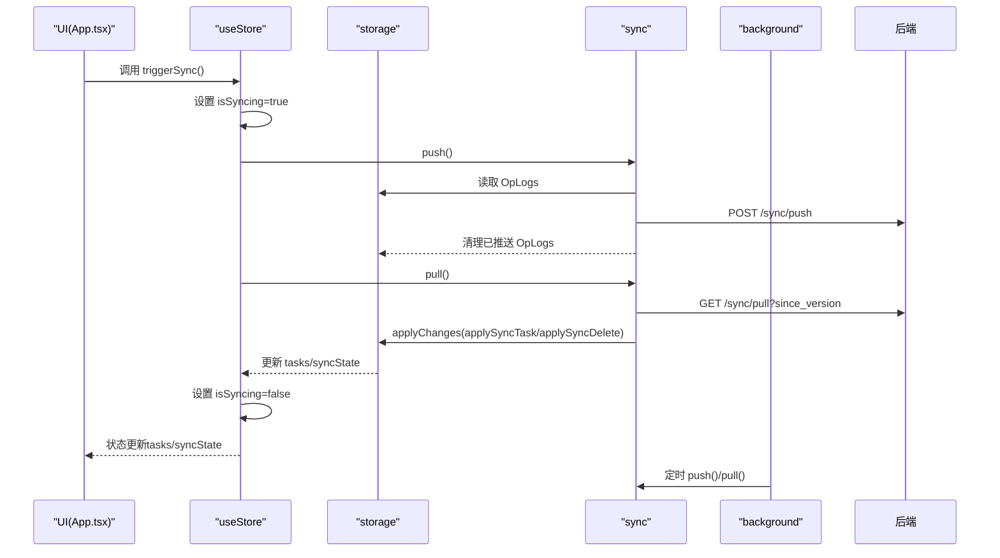
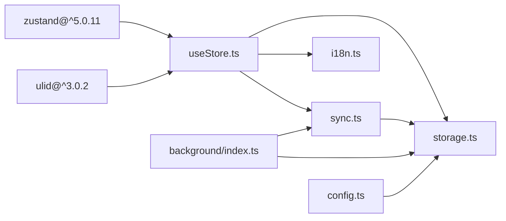

# 状态管理

<cite>
**本文引用的文件**
- [useStore.ts](file://src/hooks/useStore.ts)
- [storage.ts](file://src/lib/storage.ts)
- [sync.ts](file://src/lib/sync.ts)
- [i18n.ts](file://src/lib/i18n.ts)
- [config.ts](file://src/config.ts)
- [background/index.ts](file://src/background/index.ts)
- [App.tsx](file://src/App.tsx)
- [package.json](file://src/package.json)
</cite>

## 目录
1. [简介](#简介)
2. [项目结构](#项目结构)
3. [核心组件](#核心组件)
4. [架构总览](#架构总览)
5. [详细组件分析](#详细组件分析)
6. [依赖关系分析](#依赖关系分析)
7. [性能考量](#性能考量)
8. [故障排查指南](#故障排查指南)
9. [结论](#结论)
10. [附录](#附录)

## 简介
本文件系统性地解析基于 Zustand 的状态管理模块，围绕 useStore 的设计与实现展开，涵盖：
- StoreState 接口与状态结构
- Zustand create 函数的使用与状态订阅机制
- 核心 action 的实现逻辑（如 loadTasks、updateSettings、triggerSync 等）
- selector 使用模式与性能优化策略
- 状态持久化与数据序列化机制
- 最佳实践与常见使用示例

## 项目结构
该扩展采用“Hook + 库”分层组织：
- hooks/useStore.ts：Zustand Store 定义与 actions 实现
- lib/storage.ts：本地存储封装（chrome.storage.local）与同步状态管理
- lib/sync.ts：云端同步推送/拉取与变更应用
- lib/i18n.ts：国际化文本与语言枚举
- background/index.ts：后台服务（定时同步、消息触发）
- App.tsx：UI 组件消费 useStore 并调用 actions
- config.ts：默认服务器地址常量
- package.json：依赖声明（含 zustand）

图表来源
- [useStore.ts](file://src/hooks/useStore.ts#L1-L193)
- [storage.ts](file://src/lib/storage.ts#L1-L272)
- [sync.ts](file://src/lib/sync.ts#L1-L110)
- [background/index.ts](file://src/background/index.ts#L1-L114)
- [config.ts](file://src/config.ts#L1-L2)
- [i18n.ts](file://src/lib/i18n.ts#L1-L146)
- [App.tsx](file://src/App.tsx#L1-L860)

章节来源
- [useStore.ts](file://src/hooks/useStore.ts#L1-L193)
- [storage.ts](file://src/lib/storage.ts#L1-L272)
- [sync.ts](file://src/lib/sync.ts#L1-L110)
- [background/index.ts](file://src/background/index.ts#L1-L114)
- [config.ts](file://src/config.ts#L1-L2)
- [i18n.ts](file://src/lib/i18n.ts#L1-L146)
- [App.tsx](file://src/App.tsx#L1-L860)

## 核心组件
- StoreState 接口：定义状态字段与所有 action 方法签名，统一了状态结构与行为契约
- useStore：通过 create<StoreState>() 创建 Store，内部包含状态初始化与所有异步/同步 action
- storage：封装本地存储读写、同步状态、操作日志（OpLog）、用户数据清理等
- sync：封装 push/pull/applyChanges，负责与后端交互与本地变更应用
- i18n：提供多语言文本与语言枚举，配合 store 内 t(selector) 实现动态翻译
- background：定时触发同步、消息触发同步、从页面/选区创建任务

章节来源
- [useStore.ts](file://src/hooks/useStore.ts#L8-L26)
- [storage.ts](file://src/lib/storage.ts#L4-L34)
- [sync.ts](file://src/lib/sync.ts#L5-L109)
- [i18n.ts](file://src/lib/i18n.ts#L1-L146)
- [background/index.ts](file://src/background/index.ts#L1-L114)

## 架构总览
Zustand Store 作为状态中心，协调 UI、本地存储与云端同步：
- UI 通过 useStore 消费状态与调用 actions
- actions 中对 storage 进行读写，同时维护 UI 状态（如 isLoading、isSyncing）
- background 通过 alarm 与 runtime message 触发同步
- 同步流程由 sync.push/pull/applyChanges 驱动，最终回写 storage 并刷新 store

图表来源
- [useStore.ts](file://src/hooks/useStore.ts#L167-L191)
- [sync.ts](file://src/lib/sync.ts#L6-L83)
- [storage.ts](file://src/lib/storage.ts#L109-L194)
- [background/index.ts](file://src/background/index.ts#L8-L15)

## 详细组件分析

### StoreState 接口与状态结构
- 状态字段
  - tasks：任务列表（过滤 deleted 与按用户归属显示）
  - syncState：同步状态（lastSyncVersion、lastSyncTime、token、serverUrl、userId、username、language）
  - isLoading：初始加载状态
  - isSyncing：手动/自动同步进行中标识
- 行为方法（actions）
  - loadTasks：从 storage 读取 tasks/syncState，按登录态过滤可见任务
  - addTask/updateTask/toggleTask/deleteTask：乐观更新 + 异步持久化
  - updateSettings/handleLogoutCleanup/clearUserData：同步状态与用户数据清理
  - triggerSync/pullOnly：手动同步与仅拉取
  - setLanguage/t：语言切换与翻译函数

章节来源
- [useStore.ts](file://src/hooks/useStore.ts#L8-L26)
- [storage.ts](file://src/lib/storage.ts#L26-L34)

### Zustand create 与状态订阅机制
- create<StoreState>：以强类型 StoreState 定义 Store，确保 action 与状态结构一致
- 订阅机制：React 组件通过 useStore 订阅状态变化；当 set 调用导致状态变更时，订阅者自动重渲染
- 乐观更新：在 await 存储写入之前，先 set 以提升交互响应速度
- 状态选择器：UI 可通过 selector 仅订阅所需字段，减少不必要的重渲染

章节来源
- [useStore.ts](file://src/hooks/useStore.ts#L28-L192)
- [App.tsx](file://src/App.tsx#L12-L46)

### 核心 action 实现逻辑

#### loadTasks
- 步骤
  - 设置 isLoading=true
  - 从 storage 读取 tasks 与 syncState
  - 过滤 deleted 任务
  - 若存在 userId，则仅显示属于该用户的任务（隐藏离线任务）
  - 设置 isLoading=false
- 性能点
  - 仅在必要时重新计算可见任务
  - 通过 selector 可避免无关字段更新导致的重渲染

章节来源
- [useStore.ts](file://src/hooks/useStore.ts#L53-L75)
- [storage.ts](file://src/lib/storage.ts#L50-L53)

#### addTask
- 步骤
  - 从标题提取标签并清洗标题
  - 生成新任务对象（id、createdAt/updatedAt 等）
  - 乐观更新：先 set(tasks.unshift(newTask))
  - 异步保存至 storage（saveTask）
- 特性
  - 自动标签提取与去重
  - 用户归属：若当前有 userId，写入时自动补全 userId

章节来源
- [useStore.ts](file://src/hooks/useStore.ts#L77-L100)
- [storage.ts](file://src/lib/storage.ts#L55-L95)

#### updateTask
- 步骤
  - 查找目标任务并构造更新对象（保留 updatedAt）
  - 乐观更新：映射 tasks 替换目标项
  - 异步保存至 storage
- 注意
  - 标签更新需显式传入 updates.tags

章节来源
- [useStore.ts](file://src/hooks/useStore.ts#L102-L122)
- [storage.ts](file://src/lib/storage.ts#L69-L91)

#### toggleTask
- 步骤
  - 切换 status 并更新 updatedAt
  - 乐观更新 + 异步保存

章节来源
- [useStore.ts](file://src/hooks/useStore.ts#L124-L140)
- [storage.ts](file://src/lib/storage.ts#L97-L106)

#### deleteTask
- 步骤
  - 乐观删除：过滤掉目标任务
  - 异步标记删除或写入 storage

章节来源
- [useStore.ts](file://src/hooks/useStore.ts#L142-L146)
- [storage.ts](file://src/lib/storage.ts#L97-L106)

#### updateSettings
- 步骤
  - 保存部分 syncState 至 storage
  - 读取完整 syncState 并 set 回 store

章节来源
- [useStore.ts](file://src/hooks/useStore.ts#L148-L152)
- [storage.ts](file://src/lib/storage.ts#L201-L204)

#### handleLogoutCleanup / clearUserData
- 步骤
  - 清理用户数据（保留 serverUrl 与 language）
  - 重置 syncState 为默认值
- 作用
  - 严格遵循“退出即清空”的安全策略

章节来源
- [useStore.ts](file://src/hooks/useStore.ts#L154-L165)
- [storage.ts](file://src/lib/storage.ts#L244-L265)

#### triggerSync / pullOnly
- 步骤
  - 设置 isSyncing=true
  - push：发送 OpLogs 至后端并清理已推送日志
  - pull：拉取变更并应用，更新 lastSyncVersion
  - 重新加载 tasks 并恢复 isSyncing=false
- 差异
  - triggerSync：先 push 再 pull
  - pullOnly：仅拉取

章节来源
- [useStore.ts](file://src/hooks/useStore.ts#L167-L191)
- [sync.ts](file://src/lib/sync.ts#L6-L83)
- [storage.ts](file://src/lib/storage.ts#L109-L138)

### 状态选择器(selector)使用模式与性能优化
- 使用模式
  - 在组件中仅订阅需要的状态字段，例如只取 tasks 或 syncState
  - 对于复杂计算，可将 selector 放在组件外部以避免闭包重建
- 性能优化
  - 乐观更新减少 UI 等待时间
  - 仅在必要时 set，避免频繁重渲染
  - 通过 storage 的增量更新（如 OpLogs）降低网络负载

章节来源
- [useStore.ts](file://src/hooks/useStore.ts#L28-L192)
- [App.tsx](file://src/App.tsx#L12-L46)

### 状态持久化与数据序列化机制
- 持久化介质
  - chrome.storage.local：存储 tasks、opLogs、syncState、client_id 等
- 数据结构
  - Task：包含 id、userId、title/description/status/priority/tags/时间戳等
  - OpLog：记录实体、操作类型、变更内容与客户端时间戳
  - SyncState：同步元信息（版本号、时间、token、服务器地址、用户信息、语言）
- 序列化
  - 使用 JSON.stringify/parse 进行网络传输与本地存储
  - 通过 storage.getTasks/storage.setSyncState 等方法统一封装读写

章节来源
- [storage.ts](file://src/lib/storage.ts#L4-L34)
- [storage.ts](file://src/lib/storage.ts#L50-L95)
- [storage.ts](file://src/lib/storage.ts#L109-L138)
- [sync.ts](file://src/lib/sync.ts#L25-L41)

### 国际化与翻译
- 语言枚举与文本包
  - Language：'en' | 'zh-CN' | 'zh-TW'
  - translations：多语言键值映射
- 翻译函数 t
  - 从 syncState 获取当前语言
  - 支持模板参数替换（如 {{count}}）
  - 未命中时回退到 key 本身

章节来源
- [i18n.ts](file://src/lib/i18n.ts#L1-L146)
- [useStore.ts](file://src/hooks/useStore.ts#L34-L51)

### 后台同步与消息触发
- 定时同步
  - chrome.alarms 每 5 分钟触发 push()/pull()
- 手动触发
  - runtime.onMessage 监听 'sync_trigger' 消息，执行 push()/pull()
- 页面/选区集成
  - 背景脚本支持从页面/选区创建任务并触发同步

章节来源
- [background/index.ts](file://src/background/index.ts#L8-L15)
- [background/index.ts](file://src/background/index.ts#L68-L81)
- [background/index.ts](file://src/background/index.ts#L18-L65)

## 依赖关系分析

图表来源
- [package.json](file://src/package.json#L24-L24)
- [useStore.ts](file://src/hooks/useStore.ts#L1-L7)
- [storage.ts](file://src/lib/storage.ts#L1-L36)
- [sync.ts](file://src/lib/sync.ts#L1-L3)
- [background/index.ts](file://src/background/index.ts#L1-L3)
- [config.ts](file://src/config.ts#L1-L2)

章节来源
- [package.json](file://src/package.json#L12-L25)

## 性能考量
- 乐观更新：在 await 之前 set，显著改善交互延迟
- 选择器订阅：仅订阅必要字段，避免全局重渲染
- OpLogs 增量同步：仅推送变更，减少带宽与 CPU 开销
- 定时同步：后台周期性触发，避免 UI 阻塞
- UI 级节流：在同步进行中禁用按钮，防止重复触发

章节来源
- [useStore.ts](file://src/hooks/useStore.ts#L96-L98)
- [App.tsx](file://src/App.tsx#L830-L842)
- [background/index.ts](file://src/background/index.ts#L8-L15)

## 故障排查指南
- 同步失败
  - 检查 token 与 serverUrl 是否有效
  - 查看 push/pull 返回状态与错误日志
- 任务未显示
  - 登录后仅显示属于当前用户的任务
  - 确认 storage.getTasks 返回值与过滤逻辑
- 语言不生效
  - setLanguage 会更新 storage.syncState 并 set 回 store
  - 确保 t(key) 能正确读取 syncState.language
- 退出登录数据残留
  - 使用 handleLogoutCleanup/clearUserData
  - 确认 storage.clearUserData 仅保留 serverUrl 与 language

章节来源
- [useStore.ts](file://src/hooks/useStore.ts#L148-L165)
- [storage.ts](file://src/lib/storage.ts#L196-L204)
- [storage.ts](file://src/lib/storage.ts#L244-L265)

## 结论
该 Zustand 状态管理模块以清晰的 StoreState 接口与强类型 actions 实现了任务管理与同步的完整闭环。通过乐观更新、增量 OpLogs、后台定时同步与 UI 选择器订阅，兼顾了用户体验与性能表现。建议在后续迭代中进一步完善 OpLogs 的生成与校验、增强错误处理与重试机制，并考虑引入更细粒度的选择器与缓存策略。

## 附录

### StoreState 接口与类型定义概览
- StoreState 字段
  - tasks: Task[]
  - syncState: SyncState | null
  - isLoading: boolean
  - isSyncing: boolean
- StoreState 方法
  - loadTasks: () => Promise<void>
  - addTask: (title: string, description?: string) => Promise<void>
  - updateTask: (id: string, updates: Partial<Task>) => Promise<void>
  - toggleTask: (id: string) => Promise<void>
  - deleteTask: (id: string) => Promise<void>
  - updateSettings: (settings: Partial<SyncState>) => Promise<void>
  - handleLogoutCleanup: () => Promise<void>
  - clearUserData: () => Promise<void>
  - triggerSync: () => Promise<void>
  - pullOnly: () => Promise<void>
  - setLanguage: (lang: Language) => Promise<void>
  - t: (key: string, params?: Record<string, any>) => string

章节来源
- [useStore.ts](file://src/hooks/useStore.ts#L8-L26)
- [storage.ts](file://src/lib/storage.ts#L4-L34)
- [i18n.ts](file://src/lib/i18n.ts#L1-L1)

### 最佳实践指南
- 状态组织
  - 将 UI 状态（isLoading/isSyncing）与业务状态（tasks/syncState）分离
  - 通过 selector 仅订阅所需字段
- Action 设计
  - 优先使用乐观更新，随后异步持久化
  - 明确区分显式更新（如 tags）与隐式处理（如 updatedAt）
- 异步处理
  - 在同步开始时设置 isSyncing，在 finally 中恢复
  - 对网络请求进行错误捕获与用户提示
- 数据一致性
  - 使用 OpLogs 记录变更，确保 push/pull 的幂等与可追踪
  - 登录/退出时清理用户数据，遵循“退出即清空”

章节来源
- [useStore.ts](file://src/hooks/useStore.ts#L53-L75)
- [useStore.ts](file://src/hooks/useStore.ts#L96-L100)
- [useStore.ts](file://src/hooks/useStore.ts#L167-L191)
- [storage.ts](file://src/lib/storage.ts#L109-L138)

### 实际使用示例（路径指引）
- 初始化加载与自动同步
  - 路径：[App.tsx](file://src/App.tsx#L35-L46)
  - 关键调用：loadTasks()、triggerSync()（条件触发）
- 添加任务
  - 路径：[App.tsx](file://src/App.tsx#L55-L60)
  - 关键调用：addTask()
- 编辑任务与标签
  - 路径：[App.tsx](file://src/App.tsx#L444-L478)
  - 关键调用：updateTask()
- 同步控制
  - 路径：[App.tsx](file://src/App.tsx#L62-L72)
  - 关键调用：triggerSync()、pullOnly()
- 语言切换
  - 路径：[App.tsx](file://src/App.tsx#L364-L396)
  - 关键调用：setLanguage()

章节来源
- [App.tsx](file://src/App.tsx#L35-L46)
- [App.tsx](file://src/App.tsx#L55-L60)
- [App.tsx](file://src/App.tsx#L444-L478)
- [App.tsx](file://src/App.tsx#L62-L72)
- [App.tsx](file://src/App.tsx#L364-L396)