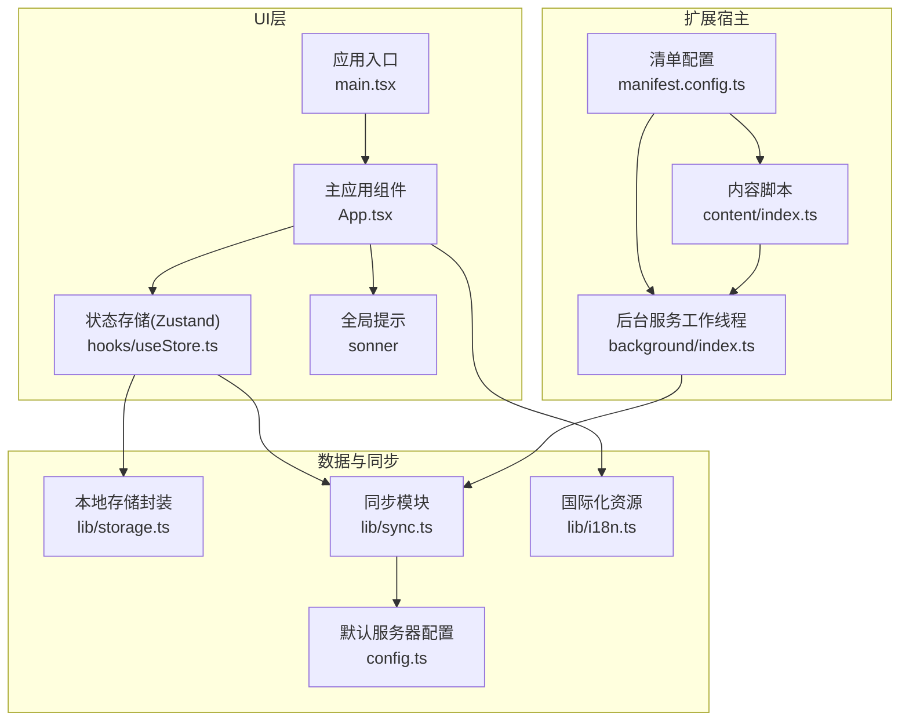
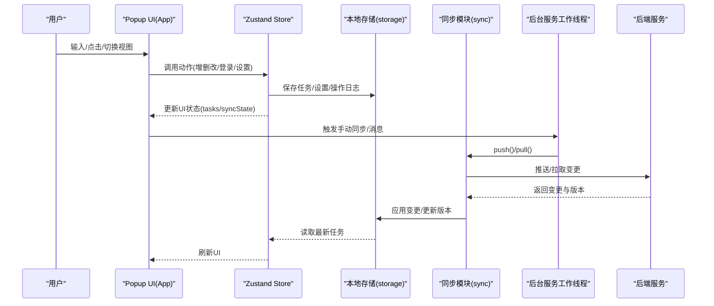
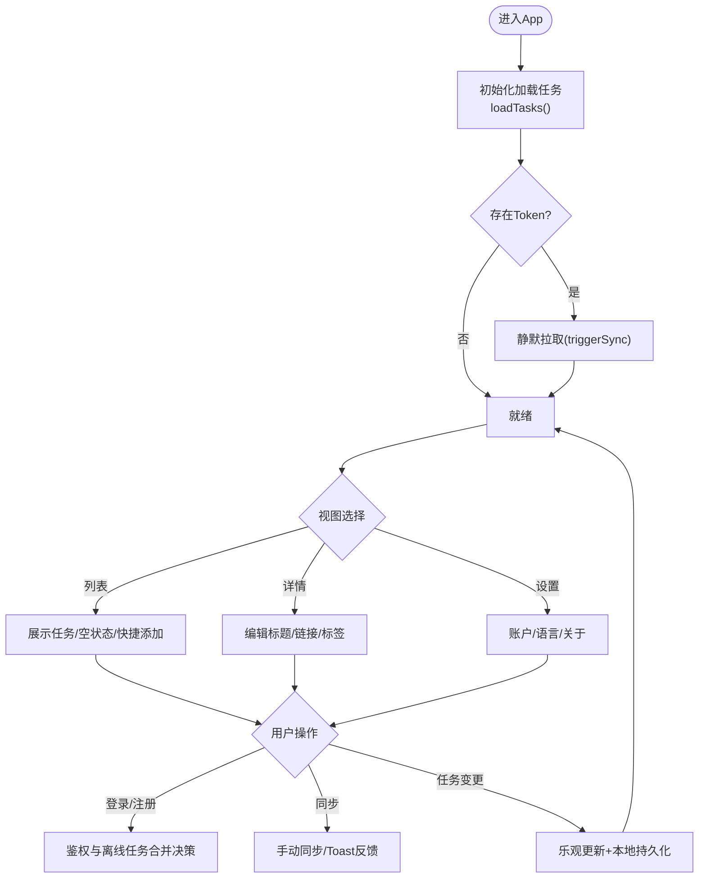
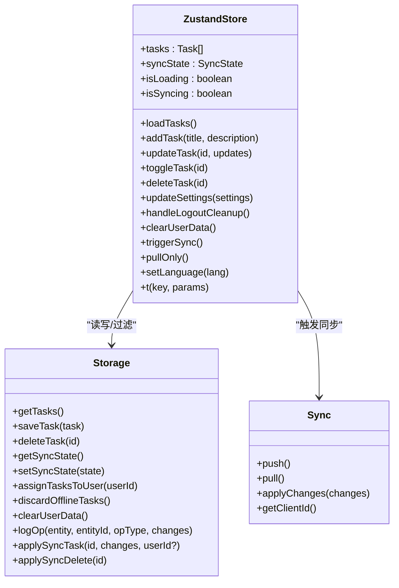
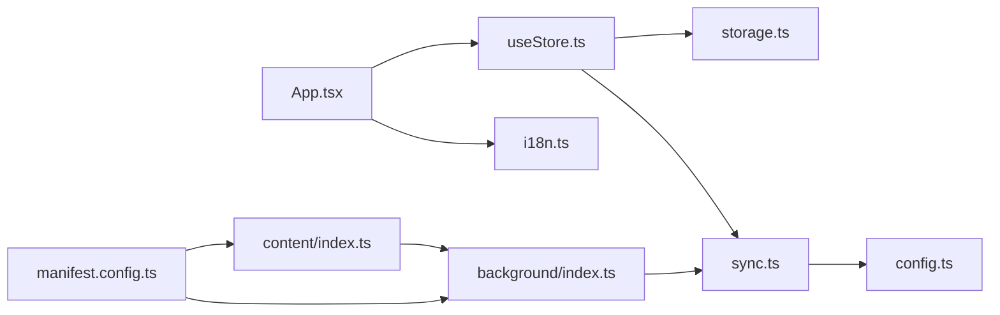

# 用户界面组件

<cite>
**本文引用的文件**
- [src/App.tsx](file://src/App.tsx)
- [src/main.tsx](file://src/main.tsx)
- [src/hooks/useStore.ts](file://src/hooks/useStore.ts)
- [src/lib/i18n.ts](file://src/lib/i18n.ts)
- [src/lib/storage.ts](file://src/lib/storage.ts)
- [src/lib/sync.ts](file://src/lib/sync.ts)
- [src/config.ts](file://src/config.ts)
- [src/index.css](file://src/index.css)
- [src/background/index.ts](file://src/background/index.ts)
- [src/content/index.ts](file://src/content/index.ts)
- [manifest.config.ts](file://manifest.config.ts)
- [package.json](file://package.json)
</cite>

## 目录
1. [简介](#简介)
2. [项目结构](#项目结构)
3. [核心组件](#核心组件)
4. [架构总览](#架构总览)
5. [组件详细分析](#组件详细分析)
6. [依赖关系分析](#依赖关系分析)
7. [性能考虑](#性能考虑)
8. [故障排除指南](#故障排除指南)
9. [结论](#结论)
10. [附录](#附录)

## 简介
本文件面向QKnot扩展的用户界面组件，系统化梳理主应用组件的架构设计与组件层次结构，深入解析状态管理集成、事件处理机制与用户交互模式；同时阐述响应式设计实现、主题与样式系统、可访问性支持、国际化适配以及跨浏览器兼容性策略，并提供组件使用示例、自定义配置选项与扩展开发指南，最后总结UI性能优化策略与用户体验最佳实践。

## 项目结构
QKnot扩展采用React + TypeScript + Vite构建，主入口在popup页面渲染应用组件，内容脚本提供悬浮按钮以从网页快速创建任务，后台服务工作线程负责定时同步与上下文菜单集成。UI组件通过Zustand状态库集中管理，数据持久化基于Chrome Extension Storage，同步逻辑通过独立的同步模块与后端API交互。

图表来源
- [manifest.config.ts](file://manifest.config.ts#L1-L40)
- [src/main.tsx](file://src/main.tsx#L1-L11)
- [src/App.tsx](file://src/App.tsx#L1-L860)
- [src/hooks/useStore.ts](file://src/hooks/useStore.ts#L1-L193)
- [src/lib/storage.ts](file://src/lib/storage.ts#L1-L272)
- [src/lib/sync.ts](file://src/lib/sync.ts#L1-L110)
- [src/config.ts](file://src/config.ts#L1-L2)
- [src/lib/i18n.ts](file://src/lib/i18n.ts#L1-L146)
- [src/background/index.ts](file://src/background/index.ts#L1-L114)
- [src/content/index.ts](file://src/content/index.ts#L1-L239)

章节来源
- [manifest.config.ts](file://manifest.config.ts#L1-L40)
- [src/main.tsx](file://src/main.tsx#L1-L11)
- [src/App.tsx](file://src/App.tsx#L1-L860)

## 核心组件
- 主应用组件(App)：负责视图切换（列表/详情/设置）、任务增删改、标签管理、登录/注册/登出、全局同步触发、离线任务合并确认弹窗等。
- 状态存储(useStore)：基于Zustand的全局状态，统一管理任务列表、同步状态、加载与同步状态标志，并提供本地化翻译函数。
- 本地存储(storage)：封装Chrome Extension Storage，提供任务CRUD、操作日志记录、离线任务统计、用户数据清理、任务归属分配与丢弃等。
- 同步模块(sync)：负责推送/拉取变更，应用远端变更到本地，维护客户端ID与版本号。
- 国际化(i18n)：提供英文与简/繁中文的键值映射与语言选择。
- 内容脚本(content)：在网页中注入悬浮按钮，支持从选区或页面URL创建任务并通知后台。
- 后台服务工作线程(background)：定时触发同步、监听消息进行手动同步、注册上下文菜单并处理任务创建。

章节来源
- [src/App.tsx](file://src/App.tsx#L1-L860)
- [src/hooks/useStore.ts](file://src/hooks/useStore.ts#L1-L193)
- [src/lib/storage.ts](file://src/lib/storage.ts#L1-L272)
- [src/lib/sync.ts](file://src/lib/sync.ts#L1-L110)
- [src/lib/i18n.ts](file://src/lib/i18n.ts#L1-L146)
- [src/content/index.ts](file://src/content/index.ts#L1-L239)
- [src/background/index.ts](file://src/background/index.ts#L1-L114)

## 架构总览
UI层通过Zustand集中管理状态，App组件作为单一职责的容器，协调本地存储与同步模块，实现“乐观更新”与“本地过滤”。国际化通过store中的翻译函数按当前语言返回文本。内容脚本与后台线程解耦UI，通过消息通道触发同步与任务创建，确保扩展在多页面场景下的可用性。

图表来源
- [src/App.tsx](file://src/App.tsx#L1-L860)
- [src/hooks/useStore.ts](file://src/hooks/useStore.ts#L1-L193)
- [src/lib/storage.ts](file://src/lib/storage.ts#L1-L272)
- [src/lib/sync.ts](file://src/lib/sync.ts#L1-L110)
- [src/background/index.ts](file://src/background/index.ts#L1-L114)

## 组件详细分析

### 主应用组件(App)分析
- 视图与路由：通过内部状态控制视图（列表/详情/设置），详情页支持任务标题编辑、描述链接显示与标签增删改。
- 任务管理：支持快速添加、切换完成状态、删除；标签通过输入框增删，支持回车/ESC快捷键；空状态友好提示。
- 登录/注册/登出：内置表单，自动检测离线任务并引导合并；登录后根据用户ID过滤任务列表，避免非当前用户任务显示。
- 全局同步：提供手动同步触发与Toast反馈；后台定时同步与消息触发同步。
- 国际化：通过store的翻译函数渲染多语言文案。
- 可访问性：按钮具备title与aria-label；键盘导航与焦点管理良好；禁用态与高亮态清晰。

图表来源
- [src/App.tsx](file://src/App.tsx#L1-L860)
- [src/hooks/useStore.ts](file://src/hooks/useStore.ts#L1-L193)
- [src/lib/storage.ts](file://src/lib/storage.ts#L1-L272)

章节来源
- [src/App.tsx](file://src/App.tsx#L1-L860)

### 状态存储(useStore)分析
- 数据模型：任务、同步状态、加载与同步标志。
- 动作接口：加载任务、添加任务（含标签提取）、更新任务、切换状态、删除任务、更新设置、清理用户数据、触发同步、仅拉取、设置语言、翻译函数。
- 乐观更新：在写入前先更新内存状态，提升交互流畅度。
- 本地过滤：登录后仅显示当前用户任务，隐藏离线任务，保证数据隔离。
- 翻译函数：按当前语言返回文案，支持参数插值。

图表来源
- [src/hooks/useStore.ts](file://src/hooks/useStore.ts#L1-L193)
- [src/lib/storage.ts](file://src/lib/storage.ts#L1-L272)
- [src/lib/sync.ts](file://src/lib/sync.ts#L1-L110)

章节来源
- [src/hooks/useStore.ts](file://src/hooks/useStore.ts#L1-L193)

### 本地存储(storage)分析
- 任务模型：包含ID、用户ID、标题、描述、状态、优先级、标签、时间戳与软删除标记。
- 操作日志：记录实体类型、操作类型、变更字段与客户端时间戳，用于增量同步。
- 用户数据清理：登出时清空用户相关数据，保留服务器地址与语言。
- 离线任务处理：统计无用户ID的任务数量，支持将离线任务归属到当前用户或丢弃。

章节来源
- [src/lib/storage.ts](file://src/lib/storage.ts#L1-L272)

### 同步模块(sync)分析
- 推送：收集操作日志，携带客户端ID与令牌发送至后端，成功后清理已推送日志。
- 拉取：按lastSyncVersion请求变更，应用变更并更新版本号。
- 客户端ID：首次生成并持久化，用于区分设备。

章节来源
- [src/lib/sync.ts](file://src/lib/sync.ts#L1-L110)

### 国际化(i18n)分析
- 支持语言：英语、简体中文、繁体中文。
- 键值映射：覆盖应用名称、状态文案、登录/注册、设置菜单、关于信息、任务与标签文案。
- 语言选择：通过设置页的单选框切换语言并持久化。

章节来源
- [src/lib/i18n.ts](file://src/lib/i18n.ts#L1-L146)

### 内容脚本(content)分析
- 悬浮按钮：在选中文本或页面时显示，位置计算考虑边界与滚动，支持键盘与鼠标两种触发方式。
- 成功动画：创建成功后短暂显示绿色勾选图标并自动隐藏。
- 消息通信：向后台发送任务创建消息，等待响应后执行UI反馈。

章节来源
- [src/content/index.ts](file://src/content/index.ts#L1-L239)

### 后台服务工作线程(background)分析
- 定时同步：每5分钟触发一次推送与拉取。
- 手动同步：接收来自UI或内容脚本的消息后立即同步。
- 上下文菜单：注册“添加到QKnot”与“添加页面到QKnot”，分别处理选区文本与页面URL。

章节来源
- [src/background/index.ts](file://src/background/index.ts#L1-L114)

## 依赖关系分析
- UI依赖：React、TailwindCSS、Lucide React图标、Sonner提示、clsx条件类名、ulid唯一ID、date-fns日期工具、zustand状态管理。
- 清单权限：storage、alarms、contextMenus；主机权限覆盖HTTP/HTTPS。
- 构建工具：Vite + CRXJS插件，支持MV3清单与图标资源。

图表来源
- [src/App.tsx](file://src/App.tsx#L1-L860)
- [src/hooks/useStore.ts](file://src/hooks/useStore.ts#L1-L193)
- [src/lib/i18n.ts](file://src/lib/i18n.ts#L1-L146)
- [src/lib/storage.ts](file://src/lib/storage.ts#L1-L272)
- [src/lib/sync.ts](file://src/lib/sync.ts#L1-L110)
- [src/config.ts](file://src/config.ts#L1-L2)
- [src/content/index.ts](file://src/content/index.ts#L1-L239)
- [src/background/index.ts](file://src/background/index.ts#L1-L114)
- [manifest.config.ts](file://manifest.config.ts#L1-L40)

章节来源
- [package.json](file://package.json#L1-L42)
- [manifest.config.ts](file://manifest.config.ts#L1-L40)

## 性能考虑
- 乐观更新：在写入前更新UI，减少感知延迟，配合本地过滤降低渲染开销。
- 本地过滤：登录后仅渲染当前用户任务，避免不必要的DOM节点与重排。
- 懒加载与条件渲染：设置页与详情页按需渲染，减少初始负载。
- 图标与样式：使用矢量图标与原子化样式，避免重复样式计算。
- 同步策略：后台定时同步与消息触发结合，避免频繁网络请求；仅在需要时拉取云端数据。
- 无障碍与可访问性：按钮具备title与aria-label，键盘导航与焦点管理良好，减少不必要的视觉闪烁。

## 故障排除指南
- 登录失败：检查用户名/密码与服务器地址；查看错误提示与网络连通性。
- 同步异常：确认Token与服务器地址有效；查看后台日志与网络请求状态；必要时手动触发同步。
- 离线任务未合并：登录后会提示合并，若未出现，检查是否有其他用户的任务导致强制清理；或手动触发拉取后再试。
- 设置页语言不生效：确认已保存设置并刷新UI；检查存储中的语言键值。
- 内容脚本按钮不可见：确认选区有效且未被遮挡；检查页面滚动与边界限制逻辑。

章节来源
- [src/App.tsx](file://src/App.tsx#L1-L860)
- [src/lib/storage.ts](file://src/lib/storage.ts#L1-L272)
- [src/lib/sync.ts](file://src/lib/sync.ts#L1-L110)

## 结论
QKnot扩展的UI组件以App为核心容器，通过Zustand集中管理状态，结合本地存储与同步模块实现离线优先与云端同步的平衡。组件在交互上强调即时反馈与可访问性，在国际化与样式系统上保持简洁一致。通过后台服务工作线程与内容脚本，扩展在多页面场景下具备良好的可用性与一致性。

## 附录

### 使用示例
- 快速添加任务：在列表页输入框中输入标题，按回车或点击加号按钮添加；标题中的#标签会被自动提取为任务标签。
- 编辑任务：点击任务进入详情页，可编辑标题、链接与标签；离开详情页时自动保存。
- 登录/注册：在设置页切换到账户标签，输入凭据后登录；首次登录会检测离线任务并提示合并。
- 切换语言：在设置页的语言标签中选择目标语言，界面将立即切换为对应语言。
- 手动同步：在设置页点击同步按钮或在后台定时触发后，UI会显示同步进度与结果。

章节来源
- [src/App.tsx](file://src/App.tsx#L1-L860)
- [src/lib/i18n.ts](file://src/lib/i18n.ts#L1-L146)

### 自定义配置选项
- 默认服务器地址：可在配置文件中修改，默认指向内网地址。
- 主题与样式：通过TailwindCSS原子类进行样式定制，建议在公共样式文件中统一变量与断点。
- 国际化：在国际化资源中新增键值映射，支持新语言；在语言列表中注册新语言项。

章节来源
- [src/config.ts](file://src/config.ts#L1-L2)
- [src/index.css](file://src/index.css#L1-L1)
- [src/lib/i18n.ts](file://src/lib/i18n.ts#L1-L146)

### 扩展开发指南
- 新增UI视图：在App组件中新增视图状态与渲染逻辑，注意与现有路由与状态保持一致。
- 新增动作：在Zustand Store中添加新的动作函数，确保同时更新本地状态与持久化存储。
- 新增同步逻辑：在同步模块中扩展推送/拉取流程，确保操作日志正确记录与清理。
- 内容脚本增强：在内容脚本中扩展识别规则或交互行为，注意与后台消息协议保持一致。
- 可访问性改进：为所有交互元素提供title与aria-label，确保键盘可达与屏幕阅读器友好。

章节来源
- [src/App.tsx](file://src/App.tsx#L1-L860)
- [src/hooks/useStore.ts](file://src/hooks/useStore.ts#L1-L193)
- [src/lib/sync.ts](file://src/lib/sync.ts#L1-L110)
- [src/content/index.ts](file://src/content/index.ts#L1-L239)