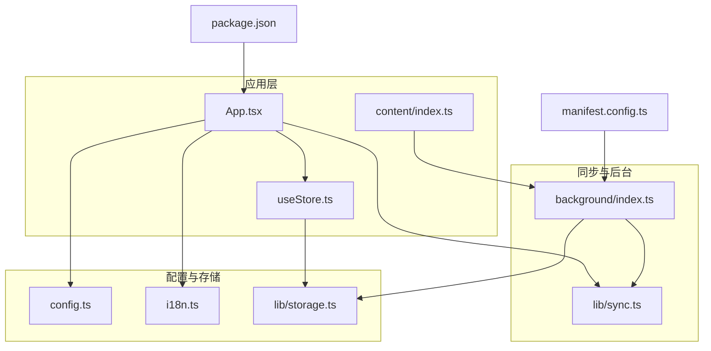
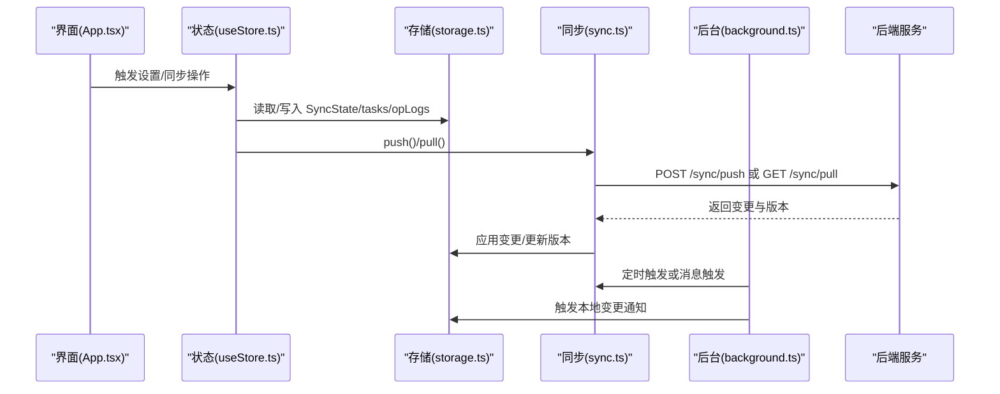
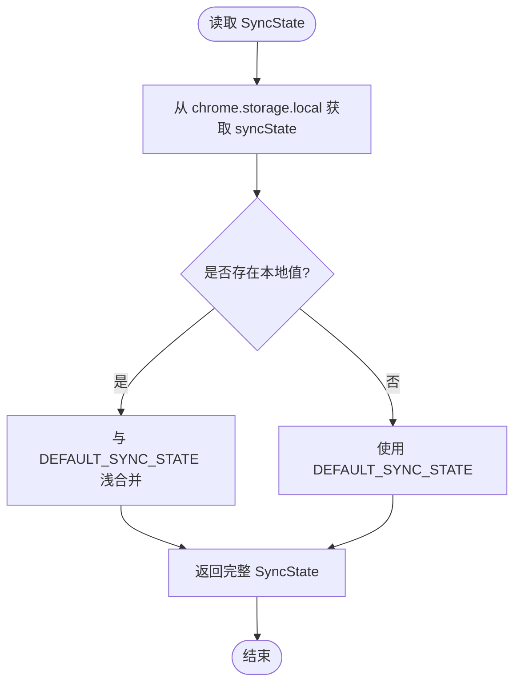
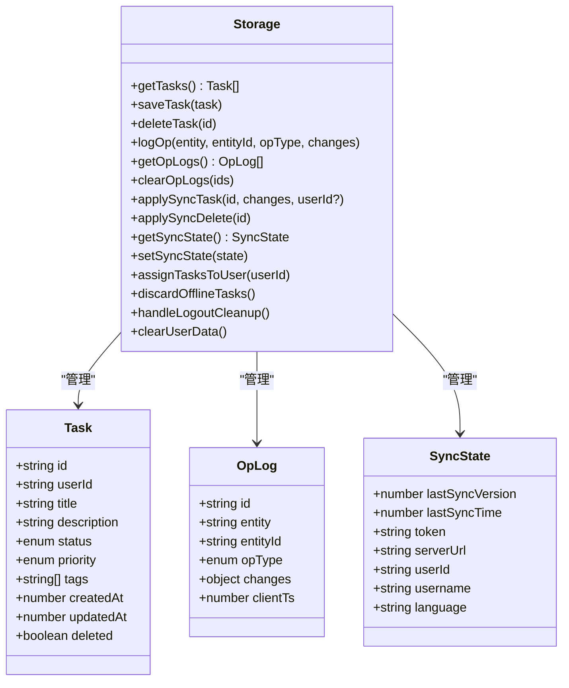
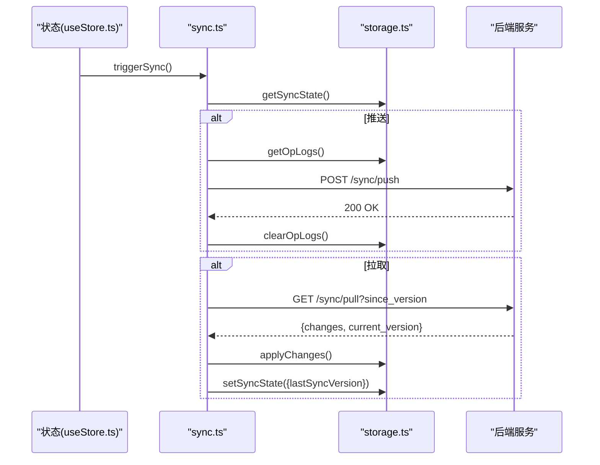
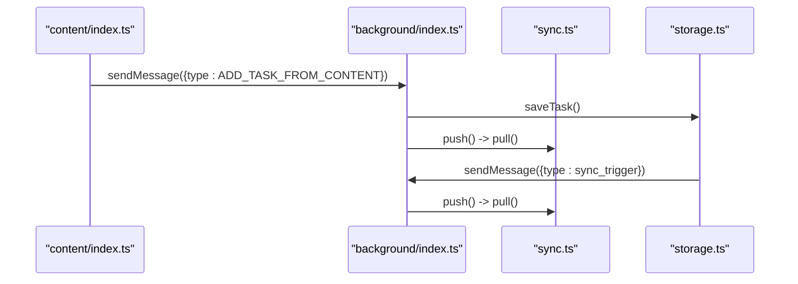
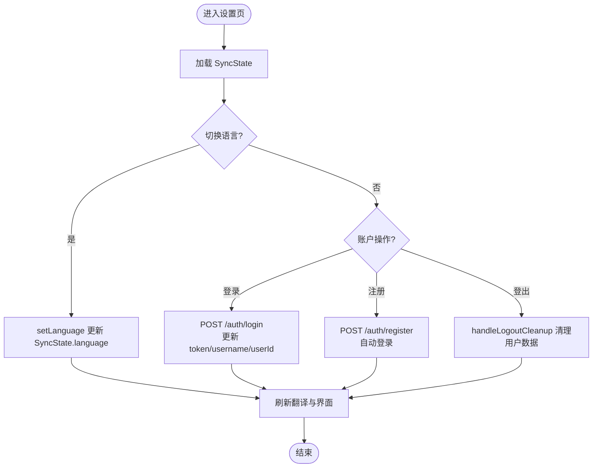
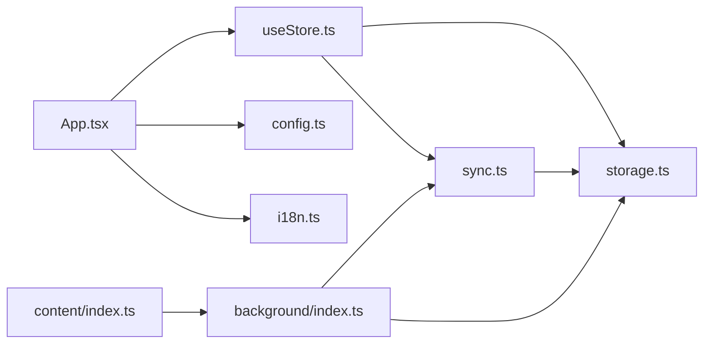

# 配置与设置

<cite>
**本文引用的文件**
- [src/config.ts](file://src/config.ts)
- [src/lib/storage.ts](file://src/lib/storage.ts)
- [src/lib/sync.ts](file://src/lib/sync.ts)
- [src/background/index.ts](file://src/background/index.ts)
- [src/hooks/useStore.ts](file://src/hooks/useStore.ts)
- [src/App.tsx](file://src/App.tsx)
- [src/content/index.ts](file://src/content/index.ts)
- [src/lib/i18n.ts](file://src/lib/i18n.ts)
- [manifest.config.ts](file://manifest.config.ts)
- [package.json](file://package.json)
</cite>

## 目录
1. [简介](#简介)
2. [项目结构](#项目结构)
3. [核心组件](#核心组件)
4. [架构总览](#架构总览)
5. [详细组件分析](#详细组件分析)
6. [依赖关系分析](#依赖关系分析)
7. [性能考量](#性能考量)
8. [故障排查指南](#故障排查指南)
9. [结论](#结论)
10. [附录](#附录)

## 简介
本文件系统性梳理 QKnot 扩展的配置与设置体系，覆盖默认服务器配置、用户偏好（语言）、认证与同步状态、本地持久化与同步机制、以及安全与隐私最佳实践。文档基于仓库现有实现进行分析，重点说明数据结构、默认值处理、配置项的读取与写入流程、以及与后台服务交互的协议约定。

## 项目结构
QKnot 扩展采用模块化组织方式，配置与设置相关的关键文件如下：
- 默认服务器地址定义：src/config.ts
- 同步状态与本地存储封装：src/lib/storage.ts
- 同步推送/拉取逻辑：src/lib/sync.ts
- 后台自动同步与消息处理：src/background/index.ts
- 应用层状态与设置入口：src/hooks/useStore.ts、src/App.tsx
- 内容脚本（上下文菜单与消息）：src/content/index.ts
- 国际化与语言设置：src/lib/i18n.ts
- 清单与权限声明：manifest.config.ts
- 依赖与版本信息：package.json

图表来源
- [src/App.tsx](file://src/App.tsx#L1-L120)
- [src/hooks/useStore.ts](file://src/hooks/useStore.ts#L1-L60)
- [src/lib/storage.ts](file://src/lib/storage.ts#L196-L204)
- [src/lib/sync.ts](file://src/lib/sync.ts#L1-L40)
- [src/background/index.ts](file://src/background/index.ts#L1-L20)
- [src/content/index.ts](file://src/content/index.ts#L200-L239)
- [src/config.ts](file://src/config.ts#L1-L2)
- [src/lib/i18n.ts](file://src/lib/i18n.ts#L1-L20)
- [manifest.config.ts](file://manifest.config.ts#L31-L32)
- [package.json](file://package.json#L1-L20)

章节来源
- [src/config.ts](file://src/config.ts#L1-L2)
- [src/lib/storage.ts](file://src/lib/storage.ts#L1-L60)
- [src/lib/sync.ts](file://src/lib/sync.ts#L1-L40)
- [src/background/index.ts](file://src/background/index.ts#L1-L20)
- [src/hooks/useStore.ts](file://src/hooks/useStore.ts#L1-L40)
- [src/App.tsx](file://src/App.tsx#L1-L60)
- [src/content/index.ts](file://src/content/index.ts#L200-L239)
- [src/lib/i18n.ts](file://src/lib/i18n.ts#L1-L20)
- [manifest.config.ts](file://manifest.config.ts#L31-L32)
- [package.json](file://package.json#L1-L20)

## 核心组件
- 默认服务器配置
  - 定义：通过常量导出默认服务器地址，供应用初始化与表单默认值使用。
  - 使用点：应用初始化、设置页表单默认值、登录/注册请求目标地址。
- 同步状态与本地存储
  - 数据模型：SyncState 包含 lastSyncVersion、lastSyncTime、token、serverUrl、userId、username、language。
  - 默认值：以 DEFAULT_SYNC_STATE 提供默认值，读取时与本地存储合并。
  - 持久化：使用 chrome.storage.local 存储 tasks、opLogs、syncState。
- 同步机制
  - 推送：收集 OpLog 并发送至 /sync/push；成功后清理已推送日志。
  - 拉取：按 lastSyncVersion 请求 /sync/pull；应用变更并更新版本号。
- 后台自动同步
  - 定时触发：周期性触发同步；支持手动触发。
- 设置与国际化
  - 语言设置：通过 setLanguage 更新 syncState.language 并刷新翻译。
  - 账户设置：登录/注册、登出清理、用户数据隔离。

章节来源
- [src/config.ts](file://src/config.ts#L1-L2)
- [src/lib/storage.ts](file://src/lib/storage.ts#L26-L46)
- [src/lib/storage.ts](file://src/lib/storage.ts#L196-L204)
- [src/lib/sync.ts](file://src/lib/sync.ts#L6-L53)
- [src/lib/sync.ts](file://src/lib/sync.ts#L55-L83)
- [src/background/index.ts](file://src/background/index.ts#L7-L15)
- [src/hooks/useStore.ts](file://src/hooks/useStore.ts#L34-L51)
- [src/App.tsx](file://src/App.tsx#L22-L53)

## 架构总览
下图展示配置与设置在系统中的交互关系：应用层负责呈现与用户输入，状态通过 Zustand 管理，存储层负责本地持久化，同步层负责云端交互，后台负责定时与消息驱动。

图表来源
- [src/App.tsx](file://src/App.tsx#L62-L72)
- [src/hooks/useStore.ts](file://src/hooks/useStore.ts#L167-L191)
- [src/lib/sync.ts](file://src/lib/sync.ts#L6-L83)
- [src/lib/storage.ts](file://src/lib/storage.ts#L108-L138)
- [src/background/index.ts](file://src/background/index.ts#L7-L15)

## 详细组件分析

### 默认服务器配置
- 定义位置：src/config.ts
- 作用：为应用提供默认服务器地址，用于设置页表单默认值与登录/注册请求的目标地址。
- 使用方式：应用初始化时读取；设置页表单受控绑定；登录/注册请求拼接 URL。

章节来源
- [src/config.ts](file://src/config.ts#L1-L2)
- [src/App.tsx](file://src/App.tsx#L22-L53)
- [src/App.tsx](file://src/App.tsx#L88-L123)

### 同步状态与默认值处理
- 数据结构：SyncState
  - 字段：lastSyncVersion、lastSyncTime、token、serverUrl、userId、username、language。
- 默认值：DEFAULT_SYNC_STATE 提供初始默认值。
- 读取与合并：getSyncState 从本地存储读取，与默认值进行浅合并，确保字段完整性。
- 写入：setSyncState 对比当前状态进行部分更新，避免覆盖未变更字段。

图表来源
- [src/lib/storage.ts](file://src/lib/storage.ts#L196-L204)
- [src/lib/storage.ts](file://src/lib/storage.ts#L38-L46)

章节来源
- [src/lib/storage.ts](file://src/lib/storage.ts#L26-L46)
- [src/lib/storage.ts](file://src/lib/storage.ts#L196-L204)

### 本地存储与数据模型
- 任务模型 Task
  - 关键字段：id、userId、title、description、status、priority、tags、createdAt、updatedAt、deleted。
  - 状态约束：status 取值限定为 todo/done/archived；priority 取值限定为 none/low/medium/high。
- 操作日志 OpLog
  - 记录实体变更：entity、entityId、opType(create/update/delete)、changes、clientTs。
- 存储接口 storage
  - 任务 CRUD：saveTask、deleteTask、getTasks。
  - 日志管理：logOp、getOpLogs、clearOpLogs。
  - 同步应用：applySyncTask、applySyncDelete。
  - 用户数据：assignTasksToUser、discardOfflineTasks、handleLogoutCleanup、clearUserData。
  - 同步状态：getSyncState、setSyncState。

图表来源
- [src/lib/storage.ts](file://src/lib/storage.ts#L4-L15)
- [src/lib/storage.ts](file://src/lib/storage.ts#L17-L24)
- [src/lib/storage.ts](file://src/lib/storage.ts#L26-L34)
- [src/lib/storage.ts](file://src/lib/storage.ts#L48-L272)

章节来源
- [src/lib/storage.ts](file://src/lib/storage.ts#L4-L15)
- [src/lib/storage.ts](file://src/lib/storage.ts#L17-L24)
- [src/lib/storage.ts](file://src/lib/storage.ts#L26-L34)
- [src/lib/storage.ts](file://src/lib/storage.ts#L48-L272)

### 同步流程（推送/拉取）
- 推送流程
  - 条件：存在 token 与 serverUrl。
  - 数据：从本地 opLogs 读取，构造变更数组。
  - 请求：POST /sync/push，携带 client_id 与变更列表。
  - 结果：成功则清理已推送日志。
- 拉取流程
  - 条件：存在 token 与 serverUrl。
  - 请求：GET /sync/pull?since_version=lastSyncVersion。
  - 应用：遍历变更，调用 storage.applySyncTask 或 applySyncDelete。
  - 版本：更新 lastSyncVersion。

图表来源
- [src/hooks/useStore.ts](file://src/hooks/useStore.ts#L167-L191)
- [src/lib/sync.ts](file://src/lib/sync.ts#L6-L53)
- [src/lib/sync.ts](file://src/lib/sync.ts#L55-L83)
- [src/lib/storage.ts](file://src/lib/storage.ts#L85-L99)
- [src/lib/storage.ts](file://src/lib/storage.ts#L141-L194)

章节来源
- [src/lib/sync.ts](file://src/lib/sync.ts#L6-L53)
- [src/lib/sync.ts](file://src/lib/sync.ts#L55-L83)
- [src/lib/storage.ts](file://src/lib/storage.ts#L85-L99)
- [src/lib/storage.ts](file://src/lib/storage.ts#L141-L194)

### 后台自动同步与消息触发
- 定时同步：创建周期性 alarm，触发 sync.push() 与 sync.pull()。
- 手动触发：storage.logOp 在记录操作日志后，通过 runtime.sendMessage 触发后台同步。
- 上下文菜单：注册右键菜单项，点击后通过 runtime.sendMessage 发送消息给后台创建任务。

图表来源
- [src/content/index.ts](file://src/content/index.ts#L200-L239)
- [src/background/index.ts](file://src/background/index.ts#L67-L81)
- [src/lib/storage.ts](file://src/lib/storage.ts#L108-L127)
- [src/lib/sync.ts](file://src/lib/sync.ts#L6-L53)

章节来源
- [src/background/index.ts](file://src/background/index.ts#L7-L15)
- [src/background/index.ts](file://src/background/index.ts#L67-L81)
- [src/content/index.ts](file://src/content/index.ts#L200-L239)
- [src/lib/storage.ts](file://src/lib/storage.ts#L108-L127)

### 设置与国际化
- 语言设置
  - 语言枚举：en/zh-CN/zh-TW。
  - 切换流程：setLanguage 更新 syncState.language，刷新翻译函数。
- 账户设置
  - 登录/注册：构造请求体，解析 token 中的用户标识，更新 SyncState。
  - 登出清理：handleLogoutCleanup 清空用户数据，保留 serverUrl 与 language。
  - 用户数据隔离：clearUserData 仅保留关键配置，重置其他状态。
- 设置页交互
  - 表单受控：serverUrl、username、password 绑定到组件状态。
  - 选项卡：账户、语言、关于三类设置。

图表来源
- [src/hooks/useStore.ts](file://src/hooks/useStore.ts#L34-L51)
- [src/lib/i18n.ts](file://src/lib/i18n.ts#L1-L20)
- [src/App.tsx](file://src/App.tsx#L84-L111)
- [src/App.tsx](file://src/App.tsx#L113-L200)
- [src/lib/storage.ts](file://src/lib/storage.ts#L244-L265)

章节来源
- [src/lib/i18n.ts](file://src/lib/i18n.ts#L1-L20)
- [src/hooks/useStore.ts](file://src/hooks/useStore.ts#L34-L51)
- [src/App.tsx](file://src/App.tsx#L84-L111)
- [src/App.tsx](file://src/App.tsx#L113-L200)
- [src/lib/storage.ts](file://src/lib/storage.ts#L244-L265)

### 配置项数据结构、验证规则与默认值
- SyncState 字段与默认值
  - lastSyncVersion: 数字，默认 0。
  - lastSyncTime: 数字，默认 0。
  - token: 字符串或 null，默认 null。
  - serverUrl: 字符串，默认来自 DEFAULT_SERVER_URL。
  - userId/username: 字符串或 null，默认 null。
  - language: 字符串，枚举 en/zh-CN/zh-TW，默认 en。
- Task 字段与约束
  - status: 限定枚举值。
  - priority: 限定枚举值。
  - tags: 字符串数组。
  - createdAt/updatedAt: 数字时间戳。
- 默认值处理
  - 读取时与 DEFAULT_SYNC_STATE 合并，确保字段完整性。
  - 写入时使用部分更新，避免覆盖未变更字段。

章节来源
- [src/lib/storage.ts](file://src/lib/storage.ts#L26-L46)
- [src/lib/storage.ts](file://src/lib/storage.ts#L196-L204)
- [src/config.ts](file://src/config.ts#L1-L2)

### 用户设置的持久化、同步与清理
- 持久化
  - 任务：tasks。
  - 操作日志：opLogs。
  - 同步状态：syncState。
- 同步
  - 推送：基于 opLogs 的增量变更。
  - 拉取：按版本号增量拉取，应用变更并更新版本。
- 清理
  - 登出清理：handleLogoutCleanup 清空用户数据，保留 serverUrl 与 language。
  - 用户数据清理：clearUserData 清空所有数据并重置默认状态。
  - 离线任务处理：assignTasksToUser 将离线任务归属到当前用户；discardOfflineTasks 丢弃离线任务。

章节来源
- [src/lib/storage.ts](file://src/lib/storage.ts#L48-L272)
- [src/lib/sync.ts](file://src/lib/sync.ts#L6-L83)
- [src/lib/storage.ts](file://src/lib/storage.ts#L212-L242)

### 配置迁移策略、版本兼容性与向后兼容
- 迁移策略
  - 版本号：使用 lastSyncVersion 作为增量同步依据。
  - 兼容性：后端期望 OpLog 结构，客户端需生成并上传；若历史数据缺失，可考虑“全量拉取”策略（需后端支持）。
- 向后兼容
  - 新增字段：读取时与默认值合并，确保旧存储无该字段时仍可用。
  - 架构演进：保持 OpLog 结构稳定，便于未来扩展。

章节来源
- [src/lib/sync.ts](file://src/lib/sync.ts#L60-L77)
- [src/lib/storage.ts](file://src/lib/storage.ts#L196-L204)

### 配置文件格式、参数含义与使用示例
- 清单与权限
  - permissions：storage、alarms、contextMenus。
  - host_permissions：允许 http/https 访问任意主机。
- 版本与构建
  - manifest_version: 3。
  - 动态版本：从 package.json 解析语义化版本并转换为主次补丁格式。
- 使用示例
  - 登录：POST /auth/login，响应包含 token；解析 token 中用户 id，更新 SyncState。
  - 注册：POST /auth/register，成功后自动登录。
  - 同步：POST /sync/push（携带 opLogs），GET /sync/pull（携带 since_version）。

章节来源
- [manifest.config.ts](file://manifest.config.ts#L31-L32)
- [manifest.config.ts](file://manifest.config.ts#L9-L13)
- [src/App.tsx](file://src/App.tsx#L88-L123)
- [src/App.tsx](file://src/App.tsx#L113-L200)
- [src/lib/sync.ts](file://src/lib/sync.ts#L24-L41)
- [src/lib/sync.ts](file://src/lib/sync.ts#L59-L77)

### 安全配置、权限管理与隐私设置最佳实践
- 权限最小化
  - 仅使用必要权限：storage、alarms、contextMenus。
  - host_permissions 放宽为 http/https，建议在生产环境限制到具体域名。
- 凭证与令牌
  - 登录成功后清空明文密码，避免本地存储敏感信息。
  - token 解析仅用于用户标识，不暴露于 UI。
- 数据隔离与清理
  - 登出与清理：handleLogoutCleanup 与 clearUserData 确保用户切换时无数据残留。
  - 离线任务归属：assignTasksToUser 明确归属，discardOfflineTasks 防止误合并。
- 隐私保护
  - 仅在必要时上传 opLogs，避免传输无关数据。
  - 后台与内容脚本间通信使用明确的消息类型，避免泄露上下文信息。

章节来源
- [manifest.config.ts](file://manifest.config.ts#L31-L32)
- [src/App.tsx](file://src/App.tsx#L131-L138)
- [src/App.tsx](file://src/App.tsx#L161-L168)
- [src/lib/storage.ts](file://src/lib/storage.ts#L244-L265)
- [src/content/index.ts](file://src/content/index.ts#L200-L239)

## 依赖关系分析
- 模块耦合
  - App.tsx 依赖 useStore.ts、config.ts、i18n.ts。
  - useStore.ts 依赖 storage.ts、sync.ts、i18n.ts。
  - storage.ts 依赖 config.ts 与浏览器存储 API。
  - sync.ts 依赖 storage.ts 与 fetch。
  - background.ts 依赖 sync.ts、storage.ts、runtime API。
- 外部依赖
  - ulid：生成唯一标识。
  - zustand：状态管理。
  - react、react-dom：UI 框架。
  - tailwind 系列：样式工具。

图表来源
- [src/App.tsx](file://src/App.tsx#L1-L12)
- [src/hooks/useStore.ts](file://src/hooks/useStore.ts#L1-L6)
- [src/lib/storage.ts](file://src/lib/storage.ts#L1-L6)
- [src/lib/sync.ts](file://src/lib/sync.ts#L1-L6)
- [src/background/index.ts](file://src/background/index.ts#L1-L6)
- [src/content/index.ts](file://src/content/index.ts#L1-L10)

章节来源
- [package.json](file://package.json#L12-L25)
- [src/App.tsx](file://src/App.tsx#L1-L12)
- [src/hooks/useStore.ts](file://src/hooks/useStore.ts#L1-L6)
- [src/lib/storage.ts](file://src/lib/storage.ts#L1-L6)
- [src/lib/sync.ts](file://src/lib/sync.ts#L1-L6)
- [src/background/index.ts](file://src/background/index.ts#L1-L6)
- [src/content/index.ts](file://src/content/index.ts#L1-L10)

## 性能考量
- 同步频率
  - 后台定时同步周期为 5 分钟，平衡实时性与资源消耗。
- 操作日志
  - 通过 opLogs 实现增量同步，减少带宽与计算开销。
- 本地渲染
  - 使用乐观更新优化 UI 响应速度；同步完成后重新加载以对齐服务端状态。
- 存储访问
  - 批量读取/写入，避免频繁 I/O；清理 opLogs 降低存储膨胀。

章节来源
- [src/background/index.ts](file://src/background/index.ts#L7-L15)
- [src/lib/sync.ts](file://src/lib/sync.ts#L21-L22)
- [src/hooks/useStore.ts](file://src/hooks/useStore.ts#L96-L100)
- [src/lib/storage.ts](file://src/lib/storage.ts#L134-L138)

## 故障排查指南
- 登录/注册失败
  - 检查 serverUrl 是否正确，网络可达性；查看响应错误信息。
- 同步失败
  - 检查 token 与 serverUrl 是否存在；查看 push/pull 返回状态；确认 opLogs 是否为空。
- 数据未显示
  - 登录后执行 pullOnly 或 triggerSync；确认 SyncState.userId 是否存在导致过滤掉离线任务。
- 清理无效
  - 使用 handleLogoutCleanup 或 clearUserData；确认是否仅保留 serverUrl 与 language。

章节来源
- [src/App.tsx](file://src/App.tsx#L88-L123)
- [src/lib/sync.ts](file://src/lib/sync.ts#L24-L52)
- [src/hooks/useStore.ts](file://src/hooks/useStore.ts#L167-L191)
- [src/lib/storage.ts](file://src/lib/storage.ts#L244-L265)

## 结论
QKnot 的配置与设置系统围绕 SyncState 展开，结合本地存储与云端同步，实现了默认服务器配置、用户偏好（语言）、认证状态与任务数据的统一管理。通过 opLogs 的增量同步与后台定时触发，系统在保证用户体验的同时兼顾了性能与安全性。建议后续完善 OpLog 生成与版本演进策略，增强向后兼容能力，并在生产环境收紧 host_permissions 与权限范围。

## 附录
- 关键路径索引
  - 默认服务器地址：[src/config.ts](file://src/config.ts#L1-L2)
  - 同步状态默认值：[src/lib/storage.ts](file://src/lib/storage.ts#L38-L46)
  - 同步状态读取/写入：[src/lib/storage.ts](file://src/lib/storage.ts#L196-L204)
  - 推送/拉取实现：[src/lib/sync.ts](file://src/lib/sync.ts#L6-L83)
  - 后台定时与消息：[src/background/index.ts](file://src/background/index.ts#L7-L15)
  - 设置页与登录流程：[src/App.tsx](file://src/App.tsx#L84-L200)
  - 语言设置与翻译：[src/hooks/useStore.ts](file://src/hooks/useStore.ts#L34-L51)、[src/lib/i18n.ts](file://src/lib/i18n.ts#L1-L20)
  - 清单与权限：[manifest.config.ts](file://manifest.config.ts#L31-L32)
  - 依赖与版本：[package.json](file://package.json#L12-L25)