# 项目概述

<cite>
**本文档引用的文件**
- [README.md](file://README.md)
- [package.json](file://package.json)
- [manifest.config.ts](file://manifest.config.ts)
- [vite.config.ts](file://vite.config.ts)
- [src/main.tsx](file://src/main.tsx)
- [src/App.tsx](file://src/App.tsx)
- [src/hooks/useStore.ts](file://src/hooks/useStore.ts)
- [src/lib/storage.ts](file://src/lib/storage.ts)
- [src/lib/sync.ts](file://src/lib/sync.ts)
- [src/lib/i18n.ts](file://src/lib/i18n.ts)
- [src/config.ts](file://src/config.ts)
- [src/background/index.ts](file://src/background/index.ts)
- [src/content/index.ts](file://src/content/index.ts)
</cite>

## 目录
1. [简介](#简介)
2. [项目结构](#项目结构)
3. [核心组件](#核心组件)
4. [架构总览](#架构总览)
5. [详细组件分析](#详细组件分析)
6. [依赖关系分析](#依赖关系分析)
7. [性能考虑](#性能考虑)
8. [故障排除指南](#故障排除指南)
9. [结论](#结论)

## 简介

QKnot 是一个基于 Chrome Extension Manifest V3 的轻量级任务管理器，采用 React 19 + TypeScript + Vite 技术栈构建。该项目的核心定位是"离线优先、云端同步"的任务管理工具，为用户提供简洁高效的任务创建、编辑与同步体验。

### 核心目标
- 提供轻量级的任务管理解决方案
- 支持离线工作模式，确保数据可用性
- 实现云端同步机制，保障多设备一致性
- 提供直观易用的用户界面和流畅的操作体验

### 主要功能特性
- **任务管理**：创建、编辑、删除、标记完成任务
- **标签系统**：支持任务标签管理，便于分类组织
- **离线同步**：本地存储 + 云端同步的混合模式
- **多语言支持**：内置英文、简体中文、繁体中文
- **上下文菜单**：右键选择文本或页面快速创建任务
- **自动同步**：定时触发和手动触发的同步机制

### 技术架构优势
- **现代前端技术栈**：React 19 + TypeScript + Vite 提供高性能开发体验
- **Chrome 扩展原生集成**：充分利用 Chrome API 实现深度功能
- **状态管理优化**：使用 Zustand 实现轻量级状态管理
- **类型安全保证**：TypeScript 提供完整的类型安全保障
- **构建工具链**：Vite 提供极速开发和构建体验

## 项目结构

QKnot 项目采用模块化组织方式，按照功能域进行文件分离：

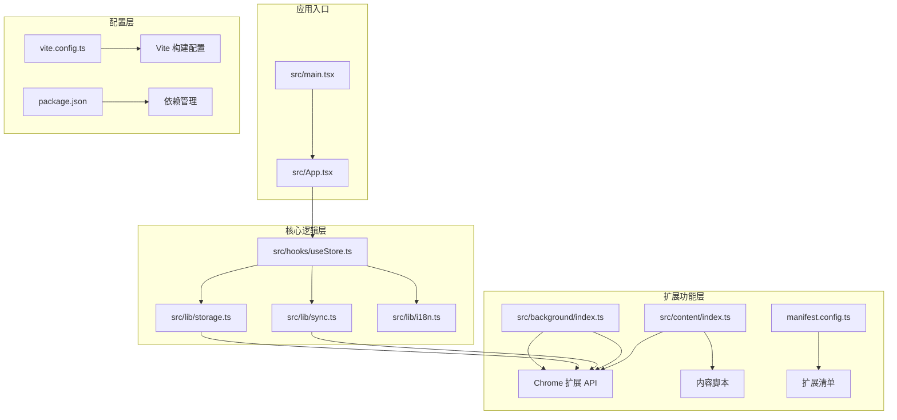

**图表来源**
- [src/main.tsx](file://src/main.tsx#L1-L11)
- [src/App.tsx](file://src/App.tsx#L1-L20)
- [src/hooks/useStore.ts](file://src/hooks/useStore.ts#L1-L26)
- [src/lib/storage.ts](file://src/lib/storage.ts#L1-L20)
- [src/lib/sync.ts](file://src/lib/sync.ts#L1-L10)
- [src/background/index.ts](file://src/background/index.ts#L1-L10)
- [src/content/index.ts](file://src/content/index.ts#L1-L20)
- [manifest.config.ts](file://manifest.config.ts#L1-L20)
- [vite.config.ts](file://vite.config.ts#L1-L21)

**章节来源**
- [package.json](file://package.json#L1-L42)
- [manifest.config.ts](file://manifest.config.ts#L1-L40)
- [vite.config.ts](file://vite.config.ts#L1-L21)

## 核心组件

### 应用状态管理
项目使用 Zustand 实现轻量级状态管理，提供统一的任务和同步状态管理：

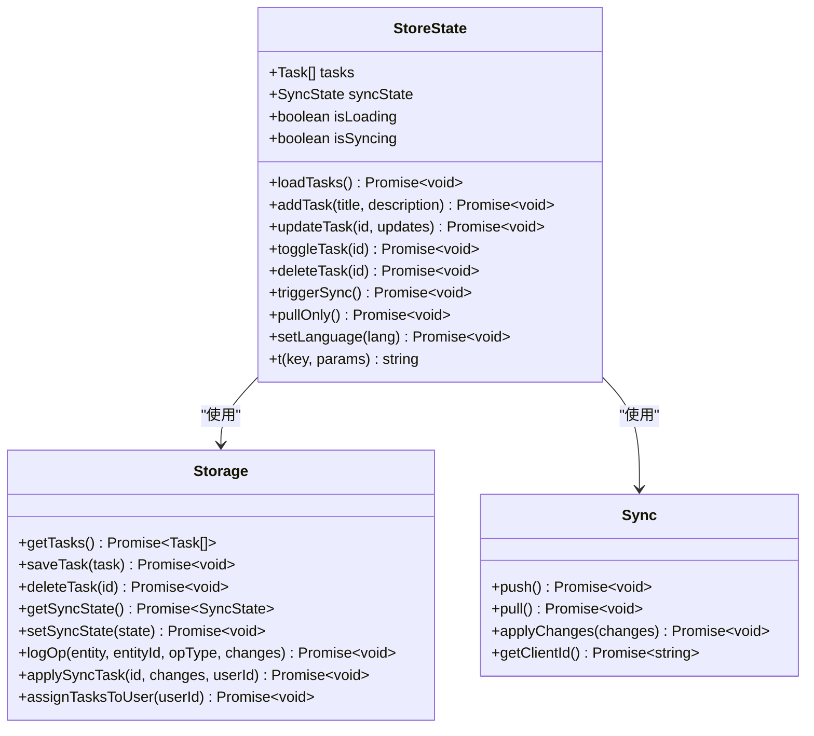

**图表来源**
- [src/hooks/useStore.ts](file://src/hooks/useStore.ts#L8-L26)
- [src/lib/storage.ts](file://src/lib/storage.ts#L48-L272)
- [src/lib/sync.ts](file://src/lib/sync.ts#L5-L110)

### 数据模型设计
项目定义了清晰的数据模型来支持任务管理和同步功能：

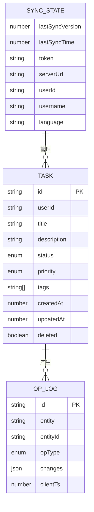

**图表来源**
- [src/lib/storage.ts](file://src/lib/storage.ts#L4-L34)

**章节来源**
- [src/hooks/useStore.ts](file://src/hooks/useStore.ts#L1-L193)
- [src/lib/storage.ts](file://src/lib/storage.ts#L1-L272)

## 架构总览

QKnot 采用分层架构设计，将业务逻辑、数据持久化和用户界面清晰分离：

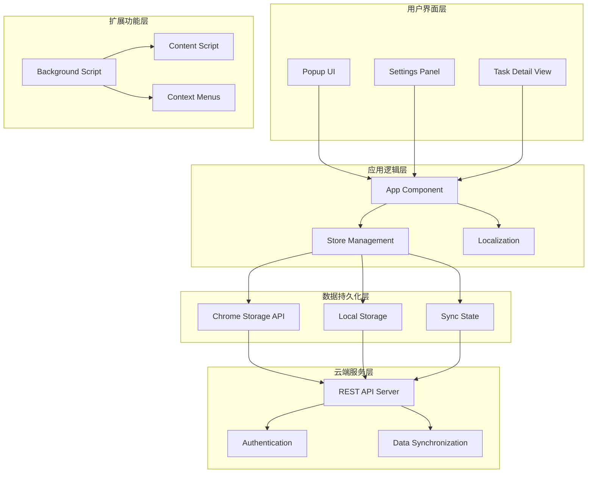

**图表来源**
- [src/App.tsx](file://src/App.tsx#L11-L800)
- [src/background/index.ts](file://src/background/index.ts#L1-L114)
- [src/content/index.ts](file://src/content/index.ts#L1-L239)
- [src/lib/storage.ts](file://src/lib/storage.ts#L48-L272)

### 工作流程示例

#### 同步流程
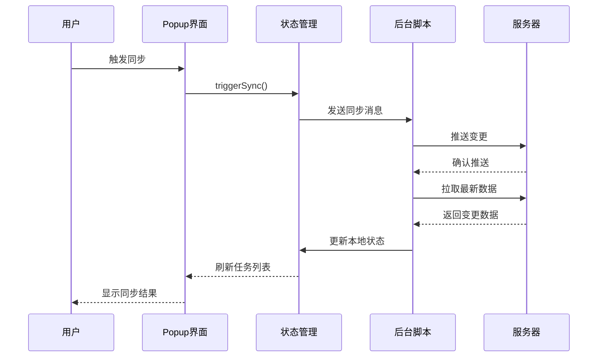

**图表来源**
- [src/App.tsx](file://src/App.tsx#L62-L72)
- [src/hooks/useStore.ts](file://src/hooks/useStore.ts#L167-L179)
- [src/background/index.ts](file://src/background/index.ts#L68-L81)

**章节来源**
- [src/App.tsx](file://src/App.tsx#L1-L860)
- [src/background/index.ts](file://src/background/index.ts#L1-L114)

## 详细组件分析

### 用户界面组件

#### 主应用组件
主应用组件负责管理整个任务管理器的用户界面，包括任务列表、设置面板和详细视图：

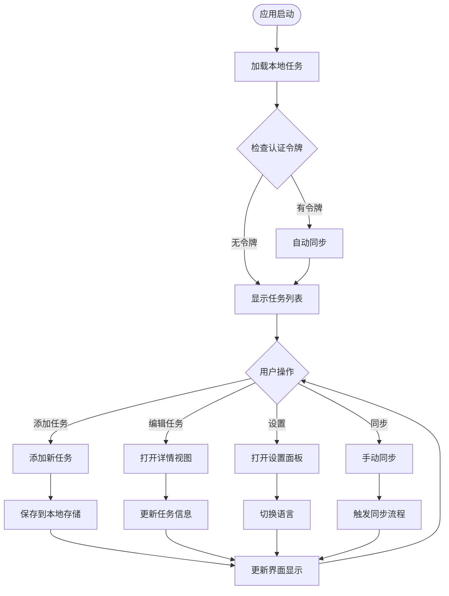

**图表来源**
- [src/App.tsx](file://src/App.tsx#L35-L46)
- [src/App.tsx](file://src/App.tsx#L55-L60)
- [src/App.tsx](file://src/App.tsx#L227-L433)

#### 设置面板组件
设置面板提供用户配置选项，包括账户管理、语言设置和关于信息：

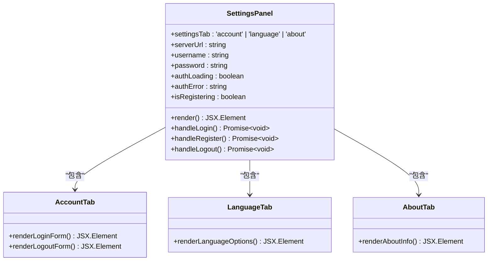

**图表来源**
- [src/App.tsx](file://src/App.tsx#L227-L433)
- [src/App.tsx](file://src/App.tsx#L289-L427)

**章节来源**
- [src/App.tsx](file://src/App.tsx#L1-L860)

### 数据存储与同步

#### 存储管理
存储管理系统负责本地数据持久化和同步状态管理：

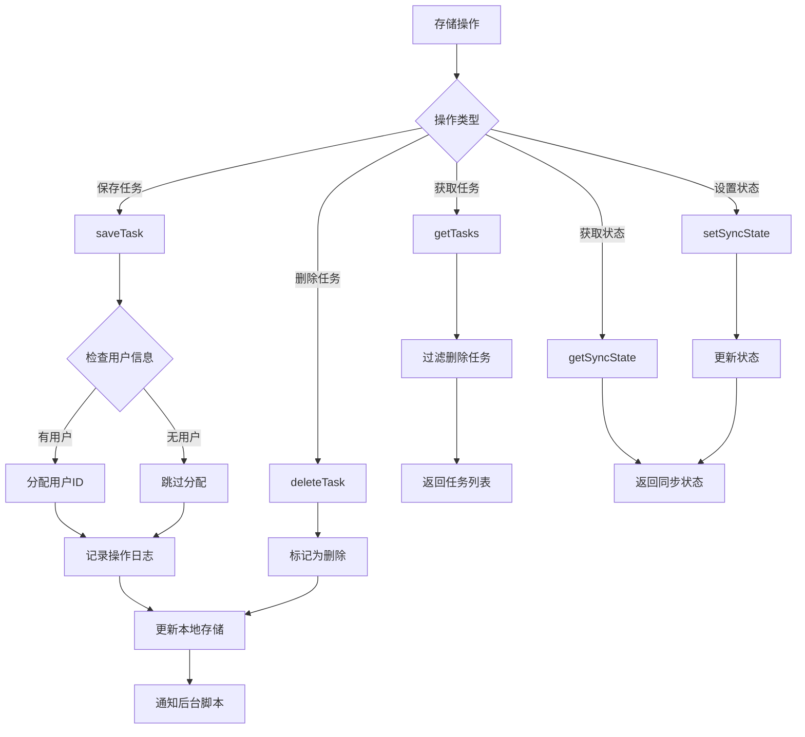

**图表来源**
- [src/lib/storage.ts](file://src/lib/storage.ts#L55-L95)
- [src/lib/storage.ts](file://src/lib/storage.ts#L97-L106)
- [src/lib/storage.ts](file://src/lib/storage.ts#L196-L204)

#### 同步机制
同步机制实现客户端与服务器之间的数据一致性：

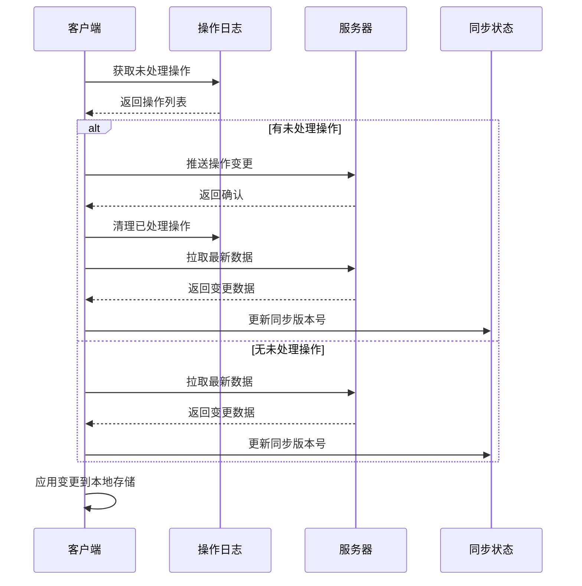

**图表来源**
- [src/lib/sync.ts](file://src/lib/sync.ts#L6-L53)
- [src/lib/sync.ts](file://src/lib/sync.ts#L55-L83)
- [src/lib/sync.ts](file://src/lib/sync.ts#L85-L99)

**章节来源**
- [src/lib/storage.ts](file://src/lib/storage.ts#L1-L272)
- [src/lib/sync.ts](file://src/lib/sync.ts#L1-L110)

### 扩展功能

#### 后台脚本
后台脚本提供定时同步和消息处理功能：

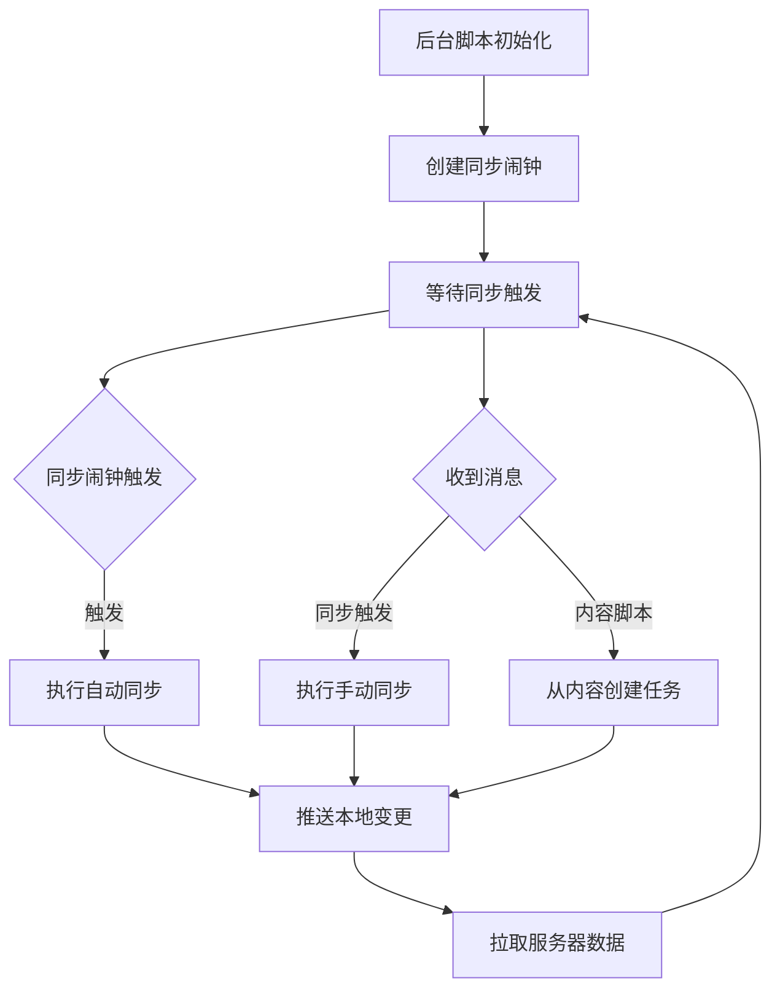

**图表来源**
- [src/background/index.ts](file://src/background/index.ts#L7-L15)
- [src/background/index.ts](file://src/background/index.ts#L68-L81)
- [src/background/index.ts](file://src/background/index.ts#L100-L113)

#### 内容脚本
内容脚本实现页面集成和快捷操作功能：

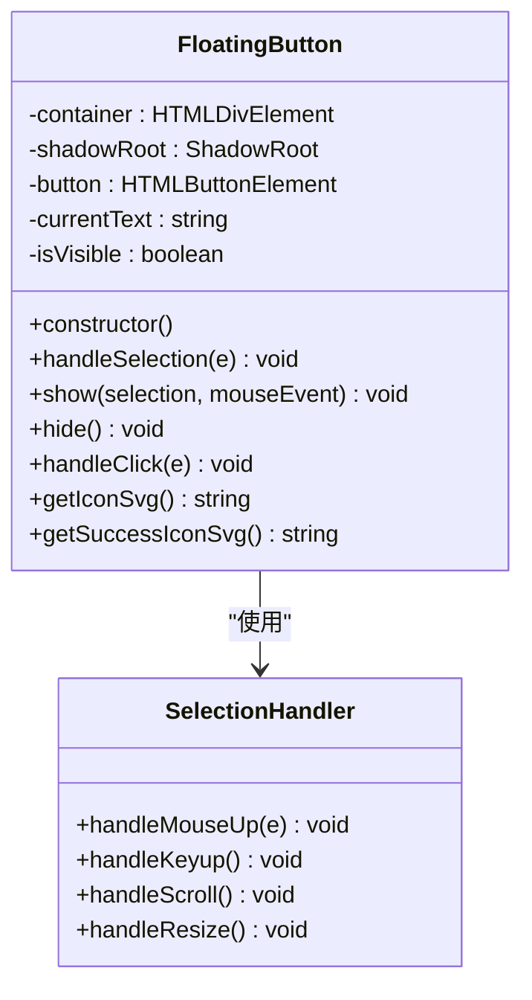

**图表来源**
- [src/content/index.ts](file://src/content/index.ts#L3-L101)
- [src/content/index.ts](file://src/content/index.ts#L120-L133)
- [src/content/index.ts](file://src/content/index.ts#L202-L235)

**章节来源**
- [src/background/index.ts](file://src/background/index.ts#L1-L114)
- [src/content/index.ts](file://src/content/index.ts#L1-L239)

## 依赖关系分析

项目采用现代化的依赖管理策略，结合多种技术栈的优势：

```mermaid
graph TB
subgraph "运行时依赖"
A[react ^19.2.0]
B[react-dom ^19.2.0]
C[zustand ^5.0.11]
D[lucide-react ^0.575.0]
E[sonner ^2.0.7]
F[ulid ^3.0.2]
G[date-fns ^4.1.0]
H[clsx ^2.1.1]
I[tailwind-merge ^3.5.0]
end
subgraph "开发依赖"
J[@vitejs/plugin-react ^5.1.1]
K[@crxjs/vite-plugin ^2.3.0]
L[tailwindcss ^4.2.1]
M[typescript ~5.9.3]
N[eslint ^9.39.1]
O[@types/chrome ^0.1.37]
end
subgraph "扩展功能"
P[Chrome Extension API]
Q[Manifest V3]
R[Service Worker]
S[Content Scripts]
end
A --> P
B --> P
C --> P
J --> Q
K --> Q
R --> P
S --> P
```

**图表来源**
- [package.json](file://package.json#L12-L25)
- [package.json](file://package.json#L26-L40)

### 版本信息
- **项目版本**: 1.0.0
- **React 版本**: 19.2.0
- **TypeScript 版本**: 5.9.3
- **Vite 版本**: 7.3.1
- **Chrome Extension**: Manifest V3

### 社区贡献
项目目前处于个人开发阶段，GitHub 仓库地址为 https://github.com/JettChen12。项目采用 MIT 许可证，欢迎社区贡献和反馈。

**章节来源**
- [package.json](file://package.json#L1-L42)
- [README.md](file://README.md#L1-L74)

## 性能考虑

### 构建优化
- 使用 Vite 提供极速的开发服务器和构建速度
- React 19 的并发特性提升渲染性能
- TailwindCSS 减少样式打包体积
- Chrome Extension 的模块化加载机制

### 运行时优化
- Zustand 轻量级状态管理减少内存开销
- Chrome Storage API 的异步操作避免阻塞主线程
- 懒加载策略仅在需要时加载功能模块
- 本地缓存机制减少网络请求频率

### 同步策略
- 增量同步机制只传输必要的变更
- 操作日志系统确保数据一致性
- 自动重试机制处理网络异常
- 队列化处理避免并发冲突

## 故障排除指南

### 常见问题诊断

#### 同步问题
1. **症状**: 无法连接到服务器
   - 检查服务器 URL 配置
   - 验证网络连接状态
   - 确认防火墙设置

2. **症状**: 同步频繁失败
   - 查看浏览器控制台错误日志
   - 检查认证令牌有效性
   - 验证服务器状态

#### 用户界面问题
1. **症状**: 任务列表不显示
   - 检查本地存储权限
   - 验证任务数据格式
   - 清除浏览器缓存

2. **症状**: 设置面板无法打开
   - 检查扩展权限配置
   - 验证 Manifest V3 配置
   - 重新安装扩展

### 开发调试
- 使用浏览器开发者工具监控网络请求
- 检查 Chrome 扩展后台页面日志
- 监控存储 API 的调用情况
- 使用 React DevTools 分析组件性能

**章节来源**
- [src/lib/storage.ts](file://src/lib/storage.ts#L268-L272)
- [src/background/index.ts](file://src/background/index.ts#L1-L10)

## 结论

QKnot Chrome 扩展项目展现了现代 Web 扩展开发的最佳实践，通过精心设计的架构和合理的技术选型，实现了功能完备、性能优异的任务管理工具。

### 项目优势
- **技术先进性**: 采用 React 19 + TypeScript + Vite 的现代化技术栈
- **架构合理性**: 清晰的分层设计和职责分离
- **用户体验**: 简洁直观的界面设计和流畅的操作体验
- **扩展性**: 模块化的代码结构便于功能扩展和维护

### 发展前景
项目为后续功能扩展奠定了良好的基础，包括：
- 增强的标签系统和搜索功能
- 多设备同步优化
- 更丰富的任务组织方式
- 集成更多第三方服务

QKnot 作为一个轻量级但功能完整的任务管理器，为 Chrome 用户提供了便捷高效的日常任务管理解决方案，体现了现代 Web 技术在扩展开发领域的强大能力。