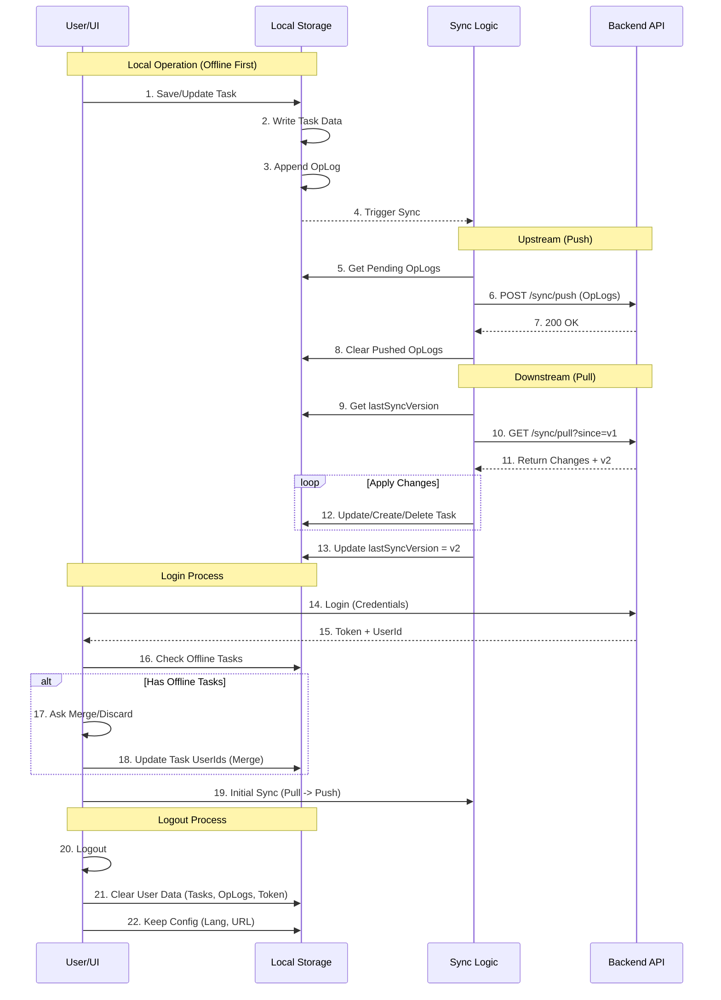

# QKnot 开发与 AI 交互文档 (QKnot Development & AI Documentation)

## 文档说明 (Document Overview)
本文档专为 **QKnot Extension 项目的开发者** 以及 **辅助开发的 AI 助手 (LLMs)** 编写。其核心目的是作为项目的单一真实来源 (Single Source of Truth)，详细记录项目的架构设计、核心业务逻辑、数据模型以及功能实现规范。

## 目标受众 (Target Audience)
1.  **人类开发者**：快速上手项目，理解现有代码结构与设计决策，避免重复造轮子或破坏既有架构。
2.  **AI 助手**：在协助编写代码、重构逻辑或解答问题时，必须优先参考本文档中的定义与规范，以确保生成的代码与项目上下文高度一致，且逻辑准确无误。

## 主要用途 (Primary Purpose)
本项目计划后续开发独立的客户端版本。本文档将作为核心业务逻辑的参考蓝本，确保扩展端 (Extension) 与未来的客户端 (Client) 在功能行为、数据结构及用户体验上保持严格的一致性。

## 维护原则 (Maintenance Principles)
*   **同步更新**：任何核心功能的变更、数据结构的调整或新的业务逻辑引入，都必须同步更新至本文档。
*   **清晰准确**：描述应尽量清晰、无歧义，便于机器理解和人类阅读。
*   **结构化**：后续内容将按照功能模块进行分类记录。

---

## 核心模块：数据同步机制 (Data Synchronization)

### 1. 概述 (Overview)
QKnot 采用 **离线优先 (Offline-First)** 的同步策略。客户端（Extension/Client）维护完整的本地数据库（Chrome Storage Local），所有的读取和写入操作首先在本地完成，然后通过异步的后台进程与服务器进行同步。同步协议基于 **操作日志 (Operation Logs / OpLogs)**。

### 2. 数据模型 (Data Models)

#### 2.1 任务 (Task)
本地存储的核心实体。
```typescript
interface Task {
  id: string;          // ULID
  userId?: string;     // 数据所属用户ID (空代表离线/访客数据)
  title: string;       // 任务内容
  description?: string;// 备注/URL
  status: 'todo' | 'done' | 'archived';
  priority: 'none' | 'low' | 'medium' | 'high';
  tags: string[];      // 标签数组
  createdAt: number;   // 时间戳
  updatedAt: number;   // 时间戳
  deleted?: boolean;   // 软删除标记
}
```

#### 2.2 操作日志 (OpLog)
用于记录本地变更的队列，是增量同步的基础。
```typescript
interface OpLog {
  id: string;          // UUID
  entity: 'task';      // 实体类型
  entityId: string;    // 关联的任务ID
  opType: 'create' | 'update' | 'delete';
  changes: Partial<Task>; // 变更的数据内容
  clientTs: number;    // 客户端操作时间戳
}
```

#### 2.3 同步状态 (SyncState)
维护同步的游标和认证信息。
```typescript
interface SyncState {
  lastSyncVersion: number; // 服务器端最后同步的版本号 (Cursor)
  token: string | null;    // JWT Token
  serverUrl: string;       // API 地址
  userId: string | null;   // 当前登录用户ID
}
```

### 3. 同步流程 (Sync Flow)

同步过程分为 **上行 (Push)** 和 **下行 (Pull)** 两个独立阶段。

#### 3.1 数据上行 (Upstream / Push)
当用户在本地进行增删改操作时：
1.  **本地写入**：直接更新 `tasks` 存储。
2.  **日志记录**：生成一条对应的 `OpLog` 并存入 `opLogs` 队列。
3.  **触发同步**：通过 `chrome.runtime.sendMessage` 或 `chrome.alarms` 触发同步进程。
4.  **推送请求**：
    *   检查 `opLogs` 队列是否为空。
    *   将所有待处理的 OpLogs 发送到 `POST /sync/push`。
    *   请求体包含 `client_id` 和 `changes` (OpLog 列表)。
5.  **清理日志**：如果服务器响应成功 (200 OK)，则从本地删除已推送的 OpLogs。

#### 3.2 数据下行 (Downstream / Pull)
1.  **拉取请求**：发送 `GET /sync/pull?since_version={lastSyncVersion}`。
2.  **获取变更**：服务器返回自 `since_version` 以来的所有变更日志 (`changes`) 和最新的 `current_version`。
3.  **应用变更 (Merge)**：
    *   遍历服务器返回的变更列表。
    *   **Create/Update**：
        *   如果本地不存在：创建新任务。
        *   如果本地存在：覆盖更新 (Last Write Wins 策略，以服务器为准)。
        *   *关键逻辑*：确保 `userId` 正确同步，防止数据归属权错误。
    *   **Delete**：将本地任务标记为 `deleted: true`。
4.  **更新游标**：将本地 `lastSyncVersion` 更新为服务器返回的 `current_version`。

#### 3.3 离线数据合并 (Offline Data Merging)
当用户从访客模式登录时：
1.  **检测**：检查本地是否存在 `userId` 为空的 Task。
2.  **决策**：用户选择 "Merge" (合并) 或 "Discard" (丢弃)。
3.  **合并逻辑**：
    *   遍历所有离线 Task，将其 `userId` 设置为当前登录用户的 ID。
    *   这些修改会生成新的 `update` OpLogs。
    *   随后的 Push 操作会将这些“旧”数据作为该用户的新数据推送到服务器。

#### 3.4 登录与登出 (Login & Logout)

**登录 (Login)**
1.  **认证**：用户输入凭证，获取 JWT Token。
2.  **数据检查**：
    *   检查本地是否存在离线任务 (userId 为空)。
    *   检查本地是否存在**非当前用户**的数据 (userId 不匹配)。
3.  **冲突处理**：
    *   如果有“非当前用户”数据：强制清理 (`clearUserData`)，防止数据泄漏。
    *   如果有离线数据：暂停同步，显示合并对话框 (见 3.3)。
4.  **初始化同步**：
    *   保存 Token 和 userId。
    *   如果没有离线数据，立即执行一次完整的 Push & Pull。
    *   如果选择合并，先执行 Pull (获取云端数据)，然后执行合并逻辑，最后 Push。

**登出 (Logout)**
1.  **清理数据**：为了安全和隐私，**登出即清除**。
    *   删除所有本地 `tasks`。
    *   删除所有 `opLogs`。
    *   删除 `syncState` 中的 Token 和 userId。
2.  **保留配置**：保留 `serverUrl` 和 `language` 等非敏感配置。
3.  **重置状态**：应用回到初始离线状态 (Guest Mode)。

### 4. 流程图 (Flowchart)



---

## 核心模块：标签系统 (Tag System)

### 1. 概述 (Overview)
标签 (Tags) 是 QKnot 中用于任务分类和过滤的核心元数据。QKnot 的标签系统设计灵活，支持从文本自动提取（创建时）和手动管理（编辑时）两种模式。

### 2. 数据结构 (Data Structure)
标签以字符串数组的形式直接存储在 `Task` 对象中。
```typescript
interface Task {
  // ... 其他字段
  tags: string[]; // 标签数组，例如 ["work", "urgent", "project-a"]
}
```
*   **存储规范**：
    *   纯文本字符串，不包含 `#` 前缀。
    *   无空格（通常），但技术上允许。
    *   在数组中去重。

### 3. 功能逻辑 (Feature Logic)

#### 3.1 任务创建 (Task Creation)
在创建新任务时，系统支持从输入文本中智能提取标签。

*   **触发场景**：
    *   快速添加框 (Quick Add Input)。
    *   右键菜单：选中文本添加 (Context Menu: Selection)。
    *   右键菜单：添加当前页面 (Context Menu: Page)。
*   **提取规则**：
    *   使用正则 `/#\S+/g` 识别以 `#` 开头的连续非空字符。
    *   提取后，**自动从标题中移除**这些标签文本，保持标题整洁。
    *   提取的标签（去除了 `#` 前缀）存入 `task.tags` 数组。
*   **示例**：
    *   输入：`Buy milk #grocery #urgent`
    *   结果：Title=`Buy milk`, Tags=`['grocery', 'urgent']`

#### 3.2 任务编辑 (Task Editing)
任务编辑页面的逻辑与创建时不同，采用**显式管理**模式。

*   **标题编辑**：
    *   编辑标题时 **不再** 进行标签提取。
    *   标题就是纯粹的任务描述。
*   **标签管理 (Tag Management)**：
    *   提供独立的 Chips（胶囊）视图进行管理。
    *   **查看**：以 `#tag` 形式展示，超过 12 字符截断显示（UI层）。
    *   **添加**：
        *   点击 `+ Add Tag` 按钮。
        *   输入标签文本（限制 12 字符）。
        *   自动去重，立即保存。
    *   **删除**：
        *   Hover 标签出现删除按钮 (X)。
        *   点击立即删除。
    *   **修改**：
        *   点击现有标签进入编辑模式。
        *   修改内容或清空（清空即删除）。
        *   支持 `Enter` 保存，`Esc` 取消。

#### 3.3 标签显示 (Tag Display)
*   **列表页 (List View)**：
    *   在任务标题下方显示。
    *   样式：蓝色背景小胶囊。
    *   格式：`#` + 标签名。
    *   **截断**：超过 12 个字符时显示省略号 (e.g., `#development...`)。
*   **详情页 (Detail View)**：
    *   显示完整的标签管理交互组件。

### 4. 交互设计 (Interaction Design)

*   **创建时 (Implicit)**：用户只需在输入框中顺手打上 `#标签`，系统自动处理，符合自然语言输入习惯。
*   **编辑时 (Explicit)**：用户明确区分“改标题”和“改标签”两个操作，避免了“修改标题时标签意外消失”或“标签文本混入标题”的问题，提供了更稳定可控的编辑体验。
